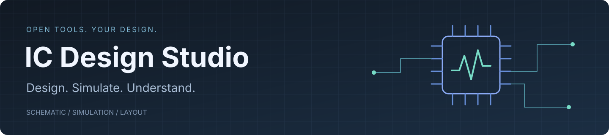
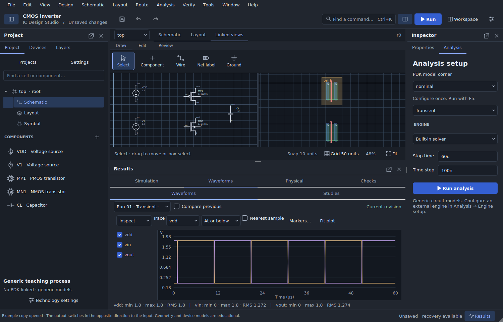
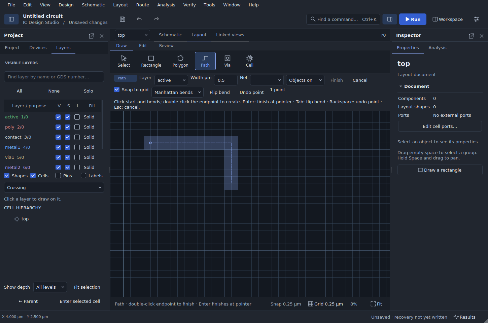
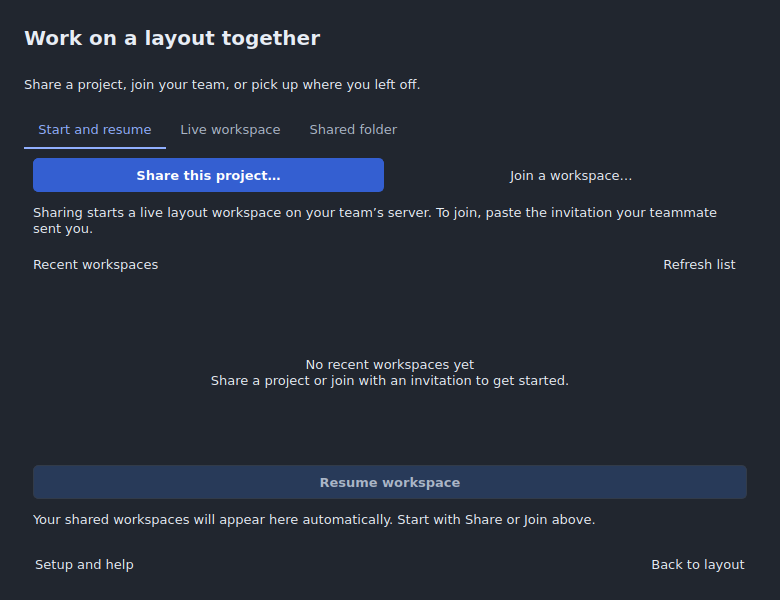
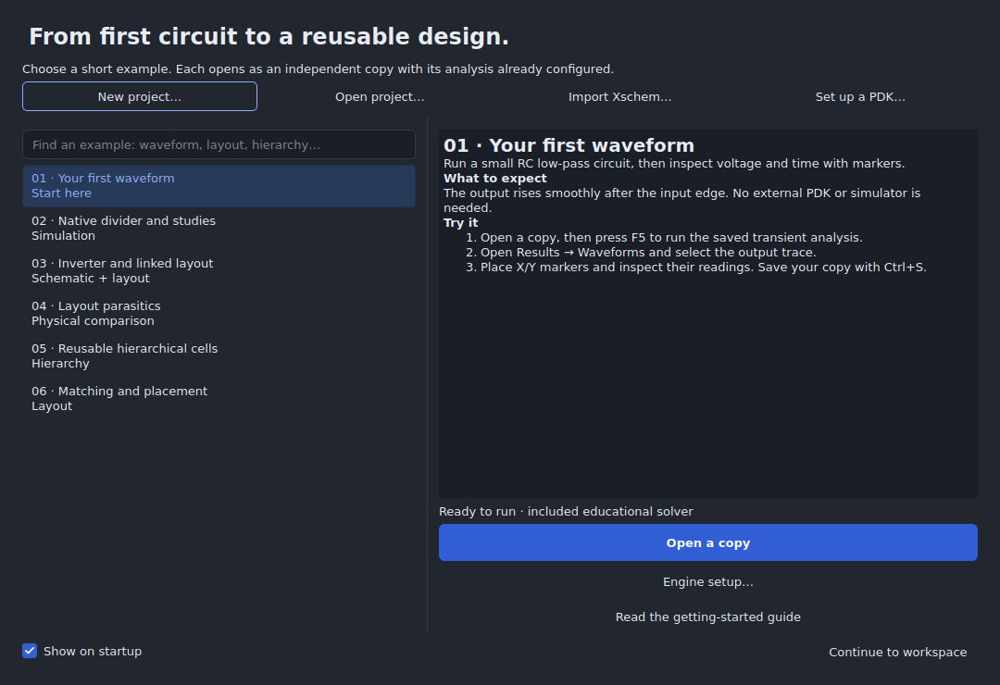

<p align="center">
  
</p>

<p align="center">
  <strong>An open desktop workspace for circuit design, simulation and layout.</strong><br>
  Start with a small circuit. Grow into reusable cells, native projects and open PDK workflows.
</p>

<p align="center">
  
  
  <a href="LICENSE"></a>
  
</p>

<p align="center">
  <a href="docs/GETTING_STARTED.md"><strong>Get started</strong></a> ·
  <a href="examples/README.md">Examples</a> ·
  <a href="docs/PDK_GUIDE.md">Open PDKs</a> ·
  <a href="docs/ROADMAP.md">Roadmap</a> ·
  <a href="docs/DRAWING_0.22.md">Grid and path drawing</a> ·
  <a href="CONTRIBUTING.md">Contribute</a>
</p>



## One workspace, from schematic to results

**Development snapshot: 0.22.0.dev14.** Adds precise editing, sparse document changes, queued recovery, analog reference layouts, multi-test verification plans and checkpoint-based team review. See [engineering workflows](docs/PROFESSIONAL_WORKFLOWS.md). This release candidate adds reproducible desktop archives, parameterized hierarchy qualification and a pinned SKY130 physical gate. Windows packages include Python, Qt, NGSpice 42, GF180MCU and SKY130 simulation PDK subsets. Clean GitHub exports download and verify the Windows runtime on first launch. See the [release notes](docs/RELEASE_0.22.md) and [current release status](docs/RELEASE_STATUS.md).

Choose **07 · GF180 bandgap startup** in the gallery and press **F5** for a quick run of the supplied circuit. **08 · GF180 full characterization** preserves the exact original schematic and all 144 analyses. **09 · SKY130 transistor inverter** is a second real-PDK example. To build your own native project, choose **File → New project**: the [Project Hub](docs/PROJECT_HUB.md) shows installed revisions and the included GF180MCU/SKY130 packages immediately.

The [six-case GF180 compatibility test](docs/BANDGAP_COMPATIBILITY.md) provides a shorter startup/DC/AC check and compares native migration and Xschem round trips against an independent simulation.

See [simulation setup and validation](SIMULATION_SETUP.md). The dev10 Windows installer and Linux desktop passed hosted execution checks on September 10, 2026. Each new release candidate must pass its own archive and platform gates; see [the exact baseline evidence](docs/RELEASE_STATUS.md). The previous [grid and drawing improvements](docs/DRAWING_0.22.md) remain included.



| Layout task | Current controls |
|---|---|
| Set the grid | **View → Grid Settings**: snap on/off, visible or fixed spacing, lines/dots, contrast and major lines |
| Draw a rectangle | Drag opposite corners or click both; the draft retains its grid while you pan or zoom |
| Draw a path | Set layer and width, click start/bends, then double-click the endpoint or press **Enter** at the pointer |
| Adjust the draft | **Tab** flips the Manhattan bend; **Backspace** removes the last click; **Escape** cancels |
| Navigate and attach | Middle-button or Space-drag pans; **Objects on/off** controls snapping to visible geometry |

The 0.22 development series also adds [alignment/distribution, connected edits, routing and hierarchy tools](docs/PRIORITIES_0.22.md), with the [development notes](docs/UPDATE_0.22.md) documenting their limits.

[External-tool interoperability](docs/INTEROPERABILITY.md) adds shared PDK contracts, reviewed layout merges, managed Magic workspaces, native simulation/LVS formats and KLayout LVS cross-probing. New circuit menus choose the circuit first and the PDK/model in a secondary selector, so additional registered technologies do not add menu entries.

IC Design Studio brings schematic capture, a simulation run table, waveform inspection and layout editing into one local application. Use it to learn circuit design, develop small analog blocks, migrate supported Xschem projects, and build reproducible experiments around open-source engines. No account or cloud service is required for local work.

| Capture and organize | Simulate and understand | Build and verify |
|---|---|---|
| Visible grids, snapping and manual wires | Queued runs with individual status and logs | Linked schematic and layout views |
| Reusable cells, symbols and hierarchy | ngspice OP, transient, DC, AC and noise | GDSII / OASIS import and export |
| Native migration and reviewed Xschem exchange | X/Y markers, thresholds and waveform calculations | Parametric devices and placement constraints |
| Dockable windows and searchable commands | Specifications, PVT cases and parameter studies | KLayout report navigation and external rule jobs |
| Undo, recovery and revision-linked results | Sensitivity and bounded parameter search | Declared interconnect RC comparisons |

**Layout → 3D layout viewer…** opens an interactive layer stack with orbit, pan,
zoom, editable display heights, layer visibility, exploded views and PNG export.
See the [3D viewer guide](docs/LAYOUT_3D.md) for physical-stack metadata and large-layout limits.

**Tools → Collaboration** opens one dashboard for sharing, joining, resuming,
invitations, named reservations, visual conflict review and shared-folder tools.
Live sessions include automatic layout updates, participant cursors and personal
undo. Run the included self-hosted server first; the repository does not include
a deployed public service. See the [collaboration guide](docs/LIVE_COLLABORATION.md).



**0.21 makes the first steps easier:** a searchable example gallery, six guided projects, background discovery of multiple PDK variants, batch registration, and a direct path from a registered PDK to a new project.

This is an **engineering preview**. It has working end-to-end workflows and a growing regression suite; it is not a manufacturing signoff environment. Supported exchange subsets, model requirements and executed validation are documented in the [release notes](docs/RELEASE_0.22.md).

## Start in three steps

1. **Get the current source and open the app.** Use **Code → Download ZIP**, extract it, and on Windows run `launch-windows.bat` with 64-bit Python 3.12 installed. On Linux/macOS, follow the source commands below. See [download and platform guidance](docs/DOWNLOADS.md).
2. **Choose “Your first waveform.”** The startup gallery opens it as a fresh copy. This example uses the included educational solver and needs no PDK installation.
3. **Press F5.** Inspect the output under **Results → Waveforms**, place markers, then save your own project with **Ctrl+S**.

Reopen the gallery any time with **File → Start here / example gallery**. Use **Ctrl+K** to find commands and **Window** to arrange the workspace.

<details>
<summary><strong>Run from source</strong> — Python 3.12</summary>

On Windows, install 64-bit Python 3.12 with the Python launcher, extract the archive, and double-click `launch-windows.bat` in the source directory. It prefers Python 3.12 and falls back to another installed Python 3 version; the bootstrap checks for 64-bit Python 3.12 or newer. Python 3.12 is the reference test version.

Dependencies are installed into `%LOCALAPPDATA%\ICStudio\venvs\<project-key>`. This keeps deeply nested Qt resource files out of the long handoff extraction path. Each source directory and interpreter has its own environment. The launcher starts the app only after installation, `pip check`, native imports, NGSpice file checks, a real divider simulation and bundled-PDK verification succeed. Failed setup is retried with package replacement on the next launch. A completed setup is reused; the previous project-local `.venv` is left untouched.

If an older launcher reported a missing Qt file with pip's Windows long-path hint, opening successfully on a second attempt did not verify installation: it only proved `.venv\Scripts\python.exe` existed. Use this updated launcher to create a verified environment. For manual Windows setup, use a short location such as `C:\ICStudio` for the source and create a fresh virtual environment there; do not copy the incomplete `.venv` into it.

On Linux/macOS, from the source directory:

```sh
python3.12 -m venv .venv
source .venv/bin/activate
python -m pip install -r requirements.txt
python scripts/check_simulation_assets.py
python main.py
```

Install NGSpice through your Linux distribution (for Ubuntu: `sudo apt install ngspice`) or Homebrew on macOS (`brew install ngspice`). The Windows console executable cannot run on those platforms. Bundled model files are shared across platforms.

The Git repository contains no native simulator executable. The Windows source launcher downloads and verifies its pinned runtime. For a manual setup, install native ngspice and select it in **Tools → Engine diagnostics and paths**, or set `ICSTUDIO_NGSPICE`. The first-waveform example uses the included educational solver.

Open a saved design directly with `python main.py --project examples/native-divider.icproj`. Opening examples from the gallery is preferable for everyday exploration because it creates independent copies.

Hosted regression and installer checks have executed on Linux and Windows Server 2022. Windows 10/11 consumer-machine acceptance and macOS qualification remain separate. Historical dev9/offscreen records are preserved as records of their original scope.

</details>

## Learn with included projects

Every project below is installed with the app and available from its example gallery. These are small exercises, not long-running benchmark circuits.

| Example | What you learn | Requirements |
|---|---|---|
| [RC low-pass](examples/rc.icproj) | Run a transient; inspect a waveform with markers | Included solver |
| [Native divider](examples/native-divider.icproj) | Verify a 0.5 V operating point; explore parameter studies | ngspice; no external PDK |
| [Inverter and layout](examples/inverter_layout.icproj) | Move between schematic, teaching geometry and results | Included solver |
| [Native RC comparison](examples/native-rc.icproj) | Compare a baseline with declared layout parasitics | ngspice; illustrative coefficients |
| [Reusable divider](examples/reusable-divider.icproj) | Navigate a hierarchical circuit and its ports | Included solver |
| [Common-centroid resistors](examples/common-centroid-resistors.icproj) | Review matching constraints and device placement | No simulator needed |

Follow the [example walkthroughs](examples/README.md), or try the [small hierarchical Xschem exchange example](examples/xschem-amplifier/amplifier.sch).



## Open PDKs with an explicit setup path

Open **File → Project Hub → PDKs** to see exact revisions, installation folders, model counts and status. Several revisions can coexist. Choose **New project** in the hub to select a revision and starting circuit; an included package can install and create the project in one step. **Projects** lists saved designs with their linked revisions. The first-level menus stay technology neutral.

Choose **Tools → Set up an open PDK**. The assistant can discover enabled installations under `PDK_ROOT`, Ciel and common local PDK folders. **Add folder** also accepts a parent containing several variants or the extracted companion adapter collection. Check the desired entries, choose **Check and register**, then **New project with this PDK**.

| PDK family | Stock adapter | Additional setup |
|---|---|---|
| **SkyWater SKY130** | Installed `sky130A` / `sky130B` models, symbols and layer maps | ngspice for process models; matching decks and external tools for physical verification |
| **GlobalFoundries GF180MCU** | Installed `gf180mcuA/B/C/D` variants and consistent model corner groups | ngspice; physical verification needs the corresponding decks |
| **IHP SG13G2** | Installed `ihp-sg13g2` models, symbols and layer maps | Compatible ngspice plus compiled OSDI model libraries |
| **Other open PDKs** | Custom technology and checksummed package interface | An explicit model, terminal, layer and verification adapter is required |

Use [Ciel](https://github.com/fossi-foundation/ciel) for prebuilt PDK management, [open_pdks](https://github.com/fossi-foundation/open-pdks) for supported source builds, or the [IHP installation guide](https://ihp-open-pdk-docs.readthedocs.io/en/latest/install/installation.html). A raw foundry source checkout and an installed tool-ready PDK are different inputs.

The optional release adapter collection contains pinned **SKY130A, GF180MCUC and IHP SG13G2 subsets**, including license notices and provenance. It is not a complete PDK distribution. Registration checks assets; it does not establish model or physical qualification. Unsupported dynamic symbols remain visible with an explanation.

Read the [PDK guide](docs/PDK_GUIDE.md) for installation, IHP OSDI setup, revision management and troubleshooting.

## Work with open-source tools

| Tool | Integration |
|---|---|
| **Xschem** | Hierarchical import, source-preserving review, supported native migration, and reviewed exchange back to Xschem |
| **ngspice** | Native graphical analyses and supported saved control programs, short or multi-case jobs, logs and retained waveforms |
| **KLayout** | Geometry library, GDSII/OASIS exchange, `.lyrdb` findings and external self-contained rule scripts |
| **Magic / Netgen** | Configurable external extraction and netlist comparison for supported process workflows |
| **OpenVAF** | Compile IHP Verilog-A models for a compatible OSDI runtime |

The application does not execute arbitrary Xschem Tcl as part of migration. Review unsupported constructs and compare the imported circuit with a small reference run. Details: [native migration](docs/UPDATE_0.19.md), [native analyses and exchange](docs/UPDATE_0.20.md), and the in-app **Help → Compatibility matrix**.

## The path forward

Our direction is an independent, approachable design environment with strong open-tool compatibility. The next milestones prioritize trustworthy workflows before expanding the analysis catalogue.

| Priority | Milestone | What success looks like |
|---|---|---|
| **1 · Reliable releases** | Fresh-machine Windows and Linux validation, signed Windows distribution, accessibility and high-DPI checks | A new user can install, simulate, save and reopen without setup surprises |
| **2 · Stronger native design** | Broader parameterized hierarchy, bus editing, richer symbols, migration fidelity and connection-preserving edits | Substantial designs remain understandable and editable after migration |
| **3 · PDK confidence** | Managed version downloads, more device adapters, representative corner tests and matching verification decks | Each supported process revision has a reproducible evidence-backed workflow |
| **4 · Deeper verification** | More parametric geometry, hierarchical extraction, calibrated RC and connected DRC/LVS review | Electrical and physical changes can be compared with traceable results |
| **5 · Simulation depth and scale** | Richer optimization, statistical reporting, performance work and advanced periodic/RF analyses | Larger experiments remain responsive and every result retains its inputs |

These are **planned milestones, not delivered features or committed dates**. See the [detailed roadmap and acceptance criteria](docs/ROADMAP.md) to help shape the work.

## Contribute

Useful contributions include small failing circuits, reproducible PDK adapter tests, accessibility feedback, documentation fixes and focused pull requests. Start with [CONTRIBUTING.md](CONTRIBUTING.md). Bug and feature request templates are included.

```sh
python -m unittest discover -s tests -v
```

The [desktop CI workflow](.github/workflows/build-desktop.yml) defines native Qt and real ngspice acceptance checks and builds desktop artifacts. It runs on every pull request, pushes to main/experimental, version tags, or manual dispatch. The [maintainer release guide](docs/RELEASING.md) covers versioning, checksums and publication. The [release status](docs/RELEASE_STATUS.md) distinguishes the hosted baseline from local historical records. See [qualification instructions](docs/QUALIFICATION_0.22.md) for the native, physical and draft-release gates.

## License

Application source: **GPL-3.0-or-later**. Bundled tools, libraries, symbols and model files retain their licenses and notices. See [LICENSE](LICENSE), [THIRD_PARTY_NOTICES.md](THIRD_PARTY_NOTICES.md) and [licenses/](licenses/).
