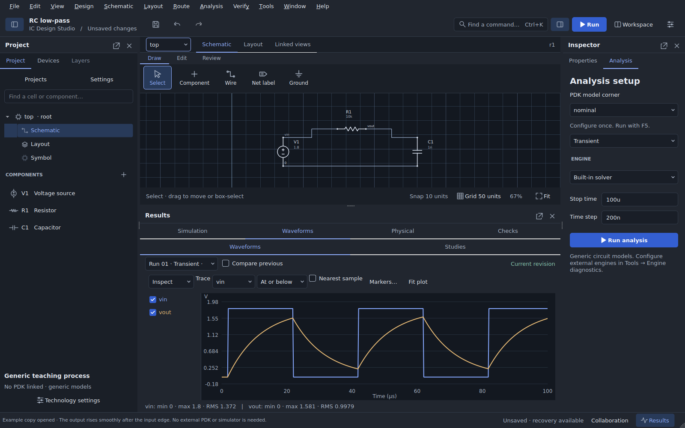
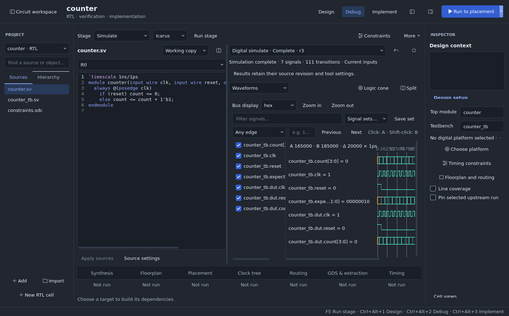
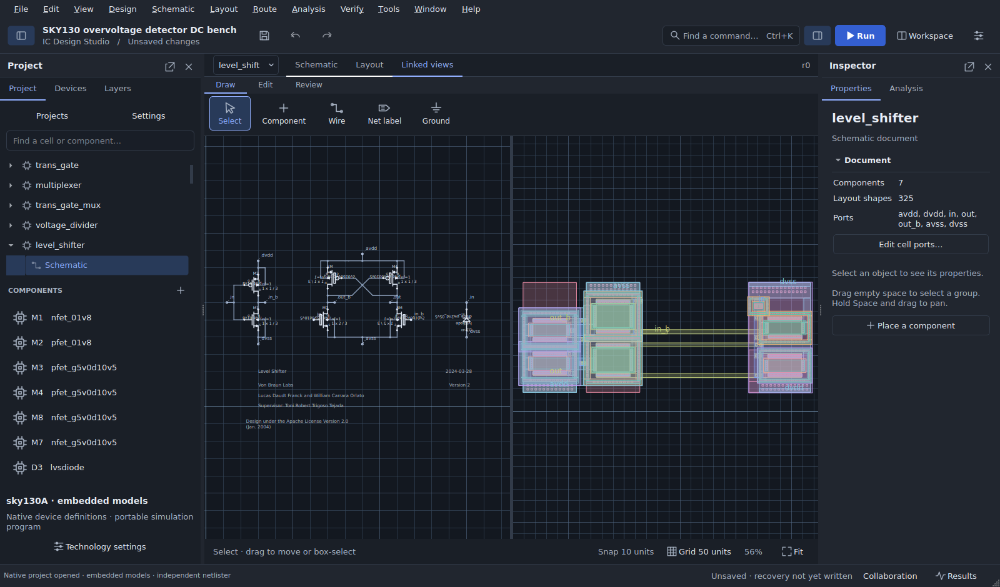
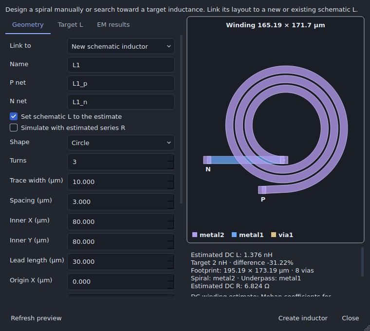
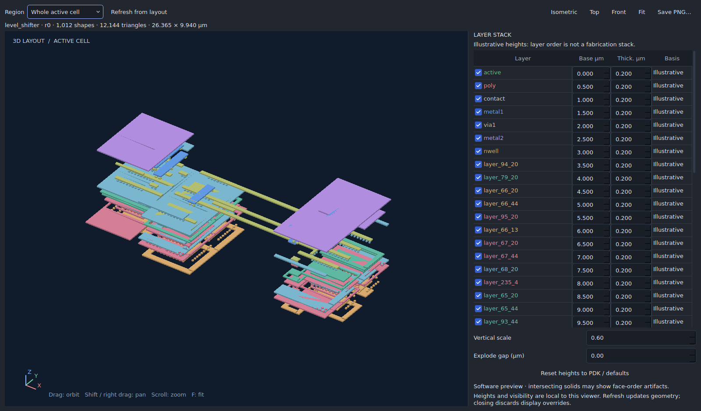
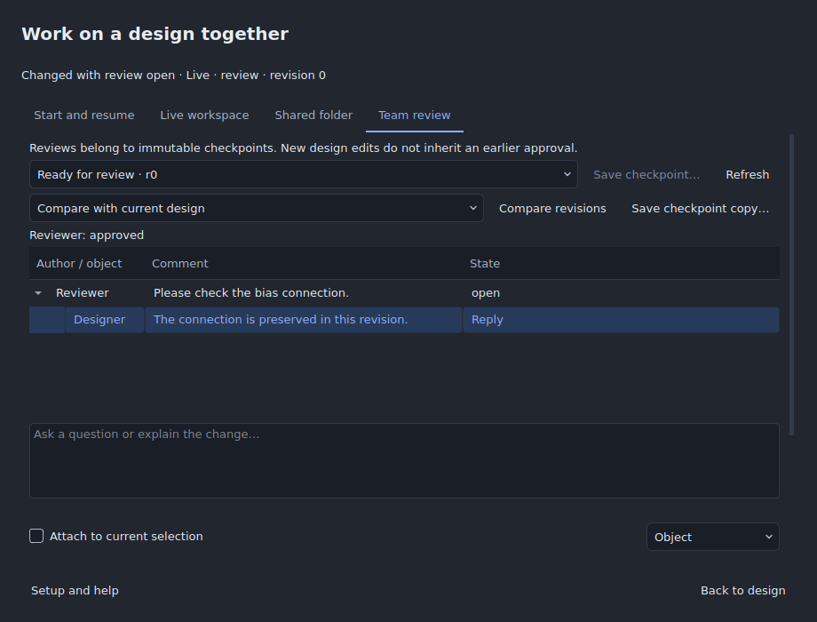
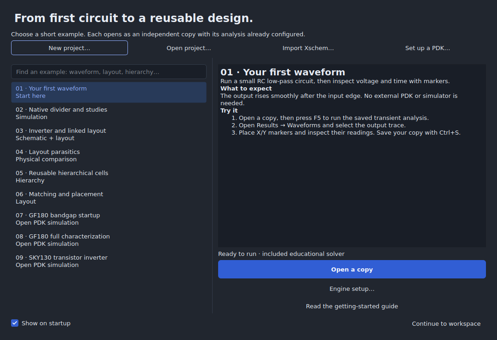
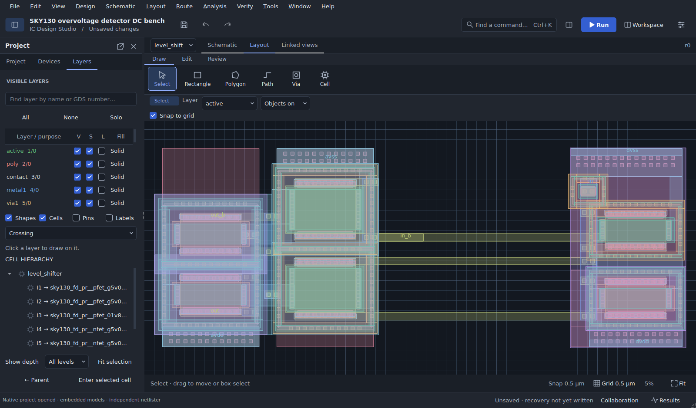

<p align="center">
  
</p>

<p align="center">
  <strong>An open desktop workspace for circuit design.</strong><br>
  Draw schematics, simulate circuits and RTL, implement digital blocks, and review designs together.<br>
  Keep your cells, sources, models, testbenches, layouts, and results in one project.
</p>

<p align="center">
  <a href="docs/RELEASE_STATUS.md"></a>
  <a href="docs/RELEASE_STATUS.md"></a>
  <a href="https://github.com/jonahsaunders/IC-Design-Studio/actions/workflows/build-desktop.yml"></a>
  <a href="LICENSE"></a>
</p>

<p align="center">
  <a href="#start-in-three-steps"><strong>Get started</strong></a> &nbsp;·&nbsp;
  <a href="docs/DOWNLOADS.md">Downloads</a> &nbsp;·&nbsp;
  <a href="#explore-the-workspace">Feature tour</a> &nbsp;·&nbsp;
  <a href="#design-digital-blocks-from-rtl-to-gds">Digital design</a> &nbsp;·&nbsp;
  <a href="#create-and-characterize-spiral-inductors">Inductor creator</a> &nbsp;·&nbsp;
  <a href="#feature-reference">All features</a> &nbsp;·&nbsp;
  <a href="docs/INDEX.md">Documentation</a> &nbsp;·&nbsp;
  <a href="CONTRIBUTING.md">Contribute</a>
</p>

<p align="center">
  <a href="docs/GETTING_STARTED.md">
    <picture>
      <source media="(prefers-color-scheme: light)" srcset="docs/images/readme/simulation-light.png">
      
    </picture>
  </a>
  <br>
  <sub>A real simulation in the native desktop. The README preview follows your light or dark theme.</sub>
</p>

## Explore the workspace

The [analog design workspace](docs/ANALOG_WORKSPACE.md) brings design variables,
test plans, saved-run debugging, device generation, layout updates, and physical
verification together. Open it from **Analysis → Analog design workspace**.

Start with a small circuit, or bring an existing open design. Local design work needs no account or hosted service. The native `.icproj` format keeps editable documents and revision-linked evidence together.

<table>
<tr>
<td width="33%" valign="top">
<h3>Draw the circuit</h3>
<p>Capture devices and wires, create custom symbols, and build reusable cell hierarchies.</p>
<a href="docs/UPDATE_0.12.md">Schematic and symbol tools →</a>
</td>
<td width="33%" valign="top">
<h3>Explore its behavior</h3>
<p>Run ngspice analyses, inspect waveforms, and compare measurements across testbenches and corners.</p>
<a href="docs/PROFESSIONAL_WORKFLOWS.md">Simulation and studies →</a>
</td>
<td width="33%" valign="top">
<h3>Shape the layout</h3>
<p>Edit physical geometry, route connections, place arrays, and inspect a layer stack in 3D.</p>
<a href="docs/PRIORITIES_0.22.md">Layout workflows →</a>
</td>
</tr>
<tr>
<td valign="top">
<h3>Connect both views</h3>
<p>Cross-probe linked objects and review device, parameter, and geometry changes before applying them.</p>
<a href="docs/WORKFLOW_REVIEW_0.22.md">Linked design review →</a>
</td>
<td valign="top">
<h3>Use open processes</h3>
<p>Start with included SKY130 and GF180 simulation models, or register a compatible PDK revision.</p>
<a href="docs/PDK_GUIDE.md">PDK setup →</a>
</td>
<td valign="top">
<h3>Work together</h3>
<p>Share editing sessions, discuss checkpoints, compare revisions, and attach simulation evidence.</p>
<a href="docs/LIVE_COLLABORATION.md">Collaboration →</a>
</td>
</tr>
</table>

### Design digital blocks from RTL to GDS

Digital design now occupies the main window, with a source and hierarchy navigator, central documents, and a contextual inspector. Switch between **Design**, **Debug**, and **Implement** to edit RTL, inspect waveforms, or follow timing paths into the physical layout. Adjustable panes, remembered layouts, light/dark themes, and keyboard controls keep the workspace usable on smaller screens.

[](docs/DIGITAL_WORKSPACE.md)

<sub>Actual app capture of the counter example, with RTL editing and waveform inspection in the same workspace. [Workspace controls and shortcuts](docs/DIGITAL_WORKSPACE.md).</sub>

| Work on a block | What the workspace provides |
|---|---|
| **Design** | Independent RTL cells, source search, compiler hierarchy, optional language-server diagnostics/completion/definitions, and reviewable schematic-symbol interfaces |
| **Debug** | Icarus/Verilator simulation and regression, paged waveforms with two cursors and edge/value search, retained failures, captured source snapshots, and working-copy diffs |
| **Implement** | Clock/I/O/electrical constraints, mapped synthesis, formal equivalence, resumable targets through placement/routing/GDS, linked timing and physical inspection, and macro export |

**Try it:** open **Digital → New digital counter example**, **New UART regression example**, or **New APB FIFO peripheral**. In the digital workspace, use **Tools → Set up and verify** to prepare the included runtime, then run a simulation. Choose **Verify block** for lint, simulation/regression, synthesis, equivalence and timing, or **Run to placement / routing / GDS** to build the required implementation stages automatically. Failed, unproven, or incomplete checks stop the target; compatible results can be reused and interrupted plans resumed.

Desktop packages include the digital engines and a locked SKY130 HD platform. **Included tools** is the default: first launch guides setup, and clicking Run before setup finishes continues your request when the tools are ready. Linux uses a private native runtime; Windows uses an app-owned WSL 2 distribution. Enabling Windows Linux support may require administrator approval and a restart. Source checkouts need a built runtime or an explicit **Custom tools** selection. [Runtime setup and first implementation](docs/DIGITAL_FLOW.md#included-tools-and-first-setup) · [Detailed digital feature inventory](#digital-design-verification-and-implementation).

### One cell. Both views.

Switch between **Schematic**, **Layout**, and **Linked views** while staying in the same cell. Import an existing schematic, attach its physical hierarchy, and inspect the design at the level that matters.

[](docs/OPEN_PROJECTS.md)

<sub>The level shifter from the Apache-2.0 overvoltage design by the Von Braun Labs contributors. Cell-view attachment and device-level LVS correspondence are separate. [Source, attribution, and reproduction](docs/OPEN_PROJECTS.md).</sub>

### Create and characterize spiral inductors

Open **Tools → Inductor creator…** to build a **square, rectangular, hexagonal, octagonal, or circular** two-terminal spiral. Link its layout to a new or existing schematic inductor, set dimensions manually, or search toward a target inductance within your footprint and design-rule constraints.

[](docs/INDUCTOR_CREATOR.md)

<sub>Actual creator capture using synthetic resistance coefficients. The preview shows the winding, underpass, terminals, dimensions, and estimates before creation.</sub>

| Capability | What you can do |
|---|---|
| **Shape and layout** | Set turns, width, spacing, inner openings, leads, metal/via stack, via arrays, origin, rotation and mirroring; rectangles have independent X/Y openings |
| **Target-L search** | Enter target inductance, tolerance, maximum footprint and width/spacing ranges; compare candidates by inductance error and area, then validate the selected candidate against the existing layout |
| **Preview and editing** | Inspect geometry and placement checks in the background; review suggested fixes; create or regenerate the linked schematic/layout device as one undoable edit; retain recipes through save/reopen |
| **Circuit estimates** | Inspect winding inductance and DC resistance when conductor/via coefficients are available; optionally set schematic L to the estimate or use estimated series resistance in simulation/export copies |
| **Physical PDK profiles** | Map layout layers to physical materials; enter thickness, conductivity and dielectric/substrate properties; save and reuse profiles tied to the process revision; choose an isolated inductor or surrounding-layout context |
| **Included openEMS simulation** | Choose a frequency band and run the packaged Windows/Linux solver; inspect progress and logs, cancel runs, and compare two meshes with **Verified result** or use a single-mesh **Quick preview** |
| **Results and exchange** | Inspect L(f), R(f), Q(f) and a sampled self-resonance bracket; save characterization with the project; export geometry and physical stackup bundles, or import matching impedance JSON and supported Touchstone S-parameters; identify results made stale by design changes |

**Run an EM simulation:** create and save the inductor, open **EM results → Run openEMS…**, complete **Set up physical layers…** if needed, choose **From / To (GHz)**, and click **Run simulation**. Desktop packages include the solver and its dedicated Python runtime; physical process data come from your PDK profile. Results include the excitation fixture and are not de-embedded. Analytical L/R estimates and EM characterization have different model scopes.

[Creator controls, target search and model scope](docs/INDUCTOR_CREATOR.md) · [openEMS setup, convergence and results](docs/OPENEMS.md) · [Physical PDK profiles](docs/INDUCTOR_CREATOR.md#pdk-profiles).

### Inspect the layers in 3D

Orbit, pan, zoom, hide layers, adjust display heights, or separate the stack with an exploded view. Export a PNG when you want to share what you see.

[](docs/LAYOUT_3D.md)

<sub>Actual app capture of the same imported cell. This read-only extrusion uses illustrative display heights; it is a geometry inspection view, not a fabrication cross-section. [3D viewer guide](docs/LAYOUT_3D.md).</sub>

### Review a design together

Share a schematic or layout session, save a named checkpoint, and discuss the exact revision. Reviewers can reply, resolve discussions, and record decisions; completed runs can travel with their saved inputs.

[](docs/WORKFLOW_REVIEW_0.22.md)

<sub>A local demonstration with two desktop clients. [Live editing](docs/LIVE_COLLABORATION.md) · [Review roles and discussions](docs/WORKFLOW_REVIEW_0.22.md).</sub>

See the [component browser, bulk layout placement and floating-panel update](docs/USABILITY_FEEDBACK.md) for the latest development-source interaction improvements.

### A comfortable place to design

Use the searchable example gallery to get moving, then arrange the workspace around your circuit. Dark and light themes, dockable panels, named workspaces, and command search keep frequently used tools close.

<table>
<tr>
<td width="50%" valign="top">
<a href="docs/GETTING_STARTED.md"></a>
<p><strong>Learn with a working circuit.</strong><br>Each gallery example opens as an independent copy with its analysis and next steps ready.</p>
</td>
<td width="50%" valign="top">
<a href="docs/PRIORITIES_0.22.md"></a>
<p><strong>Give the layout room.</strong><br>Search and filter layers, control hierarchy depth, and hide panels when you need more canvas.</p>
</td>
</tr>
</table>

## Start in three steps

1. **Open the app.** Use the [download guide](docs/DOWNLOADS.md), or run from source below.
2. **Choose “Your first waveform.”** Open a copy from the example gallery. This RC circuit uses the included educational solver, so no external simulator or PDK is needed.
3. **Press F5.** Inspect the waveform, change a value, run again, and save your project with **Ctrl+S**.

| Your next step | Where to go |
|---|---|
| Try another circuit | [Nine guided examples](examples/README.md) |
| Design a digital block | **Digital → New digital counter example**, **New UART regression example**, or **New APB FIFO peripheral** · [Digital flow guide](docs/DIGITAL_FLOW.md) |
| Create a spiral inductor | **Tools → Inductor creator…** · [Creation, target-L search and EM simulation](#create-and-characterize-spiral-inductors) |
| Use real transistor models | [Open PDK setup](docs/PDK_GUIDE.md) |
| Bring an existing design | [Xschem, Magic, and KLayout exchange](docs/INTEROPERABILITY.md) |
| Find a command | **Ctrl+K** |
| Switch the active view | **Alt+1** schematic · **Alt+2** layout · **Alt+3** linked |
| Switch digital workspace mode | **Ctrl+Alt+1** Design · **Ctrl+Alt+2** Debug · **Ctrl+Alt+3** Implement · **Circuit workspace** returns to schematic/layout |
| Restore panels | **Window → Reset workspace** |

<details>
<summary><strong>Run from source</strong> · Python 3.12</summary>

For digital design with automatic tool setup, use the [complete desktop package](docs/DOWNLOADS.md). Git clones and GitHub source ZIPs do not include the generated digital runtime. Developers can build it or select **Custom tools**; installing the Python requirements alone does not install the digital engines.

**Windows:** install 64-bit Python 3.12, extract the source to a short path such as `C:\ICStudio`, and double-click `launch-windows.bat`. The launcher creates an isolated environment under `%LOCALAPPDATA%\ICStudio`, downloads and verifies the pinned ngspice runtime, and checks dependencies and a real simulation before opening the app.

**Linux / macOS:**

```sh
git clone --branch experimental https://github.com/jonahsaunders/IC-Design-Studio.git
cd IC-Design-Studio
python3.12 -m venv .venv
source .venv/bin/activate
python -m pip install -r requirements.txt
python scripts/check_simulation_assets.py
python main.py
```

For ngspice analyses, install the native engine and select it in **Tools → Engine diagnostics and paths**, or set `ICSTUDIO_NGSPICE`. On Ubuntu, use `sudo apt install ngspice`; on macOS, use `brew install ngspice`. Magic and Netgen are additional tools for physical verification.

Windows packages include Python, Qt, ngspice, and the bundled simulation subsets. See [downloads](docs/DOWNLOADS.md) for published assets and [release status](docs/RELEASE_STATUS.md) for platform acceptance. macOS is a source workflow awaiting qualification.

</details>

## Feature reference

Expand a category for the detailed inventory. Features requiring an external engine, a technology mapping, or a supported import subset are identified in their guides.

<details>
<summary><strong>Schematic capture, symbols, and hierarchy</strong></summary>

| Capability | Included tools |
|---|---|
| Circuit drawing | Device placement; repeated placement; manual wires; labels and ground; annotations; rotation, mirroring, duplication, and bulk parameter editing |
| Electrical editing | Connection-preserving stretch; explicit move; wire cut/rejoin; junction control; full-net inspection; terminal inspection; scalar bus connections |
| Custom symbols | Generated or hand-edited artwork; lines, polygons, and text; pin identity, direction, and ordering; symbol properties |
| Reusable circuits | Named cells and ports; hierarchy navigation; make a cell from a selection; cell and instance parameters; schematic, symbol, and layout views |
| Editing controls | Selection filters; coordinate editing; capture profiles and keyboard commands; preview/cancel; undo/redo; Check and Save |

[Capture guide](docs/UPDATE_0.12.md) · [User guide](docs/USER_GUIDE.md)

</details>

<details>
<summary><strong>Simulation and waveform analysis</strong></summary>

| Capability | Included tools |
|---|---|
| Analyses | Built-in educational solver; native ngspice operating point, transient, DC sweep, AC response, and noise; graphical source/output/temperature configuration |
| Existing simulation programs | Supported imported SPICE control programs; analysis tables and measurements; saved programs and original source retention; optional first-point DC voltage guesses |
| Run management | Queued and cancellable runs; progress and logs; immutable saved inputs; failed-run inspection; rerun from saved input; revision-aware history |
| Waveform inspection | Voltage and current traces; pan/zoom and fit; X/Y markers; exact-coordinate and threshold inspection; previous-run comparison |
| Calculations and export | Saved multi-panel plots; complex AC arithmetic, phase and dB; FFT for uniform time samples; derivatives and integrals; RMS, peaks, crossings, settling, frequency, and delay measurements; schematic readouts; CSV export |

[Simulation setup](SIMULATION_SETUP.md) · [Native analyses](docs/UPDATE_0.20.md) · [Waveform tools](docs/UPDATE_0.16.md)

</details>

<a id="digital-design-verification-and-implementation"></a>
<details>
<summary><strong>Digital design, verification, and implementation</strong></summary>

| Capability | Included tools |
|---|---|
| Main-window workspace | Design/Debug/Implement modes; searchable source and compiler-hierarchy navigator; contextual inspector; remembered pane sizes and visibility; light/dark themes; keyboard mode switching; Current/Stale/Failed/Running stage states |
| RTL cells and source editing | Independent per-cell sources and undo; explicit file roles, compilation order, includes and defines; source search and go-to-line; captured run snapshots and working-copy diffs; optional stdio SystemVerilog language-server diagnostics, completion and definitions |
| Simulation and regression | Icarus and Verilator; saved testbench cases and definitions; retained assertions, failures and waveforms; optional Verilator line coverage; RTL cases in shared verification plans |
| Digital waveform inspection | Four-state values and aliases; binary, hex, unsigned and signed display; two cursors and delta readout; filtering and saved signal sets; edge/value search; source-declaration navigation; streaming SQLite indexes and on-demand pages for large VCDs |
| Synthesis and equivalence | Verilator lint; Yosys elaboration, hierarchy and mapped standard-cell synthesis; optional slang frontend; EQY/SBY/Bitwuzla equivalence against captured RTL, including inferred memories; distinct PASS/FAIL/UNKNOWN/ERROR outcomes and retained counterexamples |
| Target execution | **Verify block** and **Run to placement/routing/GDS**; dependency planning; compatible-result reuse; explicit upstream selection; queued cancellation; persistent stop/resume across restarts; captured inputs, tool identities, logs and artifact checksums |
| Timing and synthesis constraints | Clock and I/O tables; uncertainty and transition; driving cells and loads; electrical limits; synthesis frontend and delay budget; selected Liberty corners; generated or manually maintained SDC with explicit ownership |
| Timing inspection | OpenSTA setup/hold paths, total negative slack, electrical violations and per-library-corner reports; power estimates; extracted SPEF timing; simultaneous timing/physical selection; compatible-run metric comparisons |
| Physical implementation | ORFS floorplan, placement, clock tree, routing and GDS/extraction stages; die/core bounds, density and threads; routing-layer bounds, pin-edge groups, fixed macros and halos; captured I/O, macro-placement and PDN Tcl |
| Connected inspection | Compiler hierarchy and bounded logic cones; source/netlist/physical cross-probing; OpenDB instance identity, transformed geometry, orientation and terminal connectivity; indexed instance selection, batched signal routes, net/layer filters, search and placement-density bins |
| Native cell integration | Compiler-derived schematic symbols with bus metadata and scalar terminals; review and undo for interface changes across instances, physical ports and testbenches; revision-aware RTL/symbol/schematic/layout and attached netlist/extracted views |
| Implemented macro exchange | Attach generated physical hierarchy to a native cell; export GDS, abstract LEF, netlist, SDC, SPEF and terminal/provenance metadata |
| Runtime and examples | Included, verified digital toolchain and SKY130 HD platform; Linux native and Windows private WSL 2 execution; optional custom toolchains; counter, UART and hierarchical APB FIFO examples with regression and deliberate-fault coverage; digital CLI workflows |

**Scope:** language-server support needs a separately installed server, and the optional slang frontend needs its matching Yosys plugin. Native symbols support up to 128 scalar terminals. Large-VCD support is bounded to 2 GiB and 20 million changes; FST and real/string dumps are unsupported. Power and density are estimates, and library-corner timing sweeps do not establish physical signoff. Coupled analog/digital transient simulation, per-instance analog/digital view substitution, foundry-qualified signoff, and characterized macro Liberty generation remain outside this flow.

[Workspace controls and limits](docs/DIGITAL_WORKSPACE.md) · [Engines, setup, constraints and CLI](docs/DIGITAL_FLOW.md)

</details>

<details>
<summary><strong>Testbenches, characterization, and design studies</strong></summary>

| Capability | Included tools |
|---|---|
| Reusable tests | Saved circuit testbenches; configured analyses and stimuli; repeatable measurements; specification limits and pass/fail results |
| Variation | Parameter sweeps; process/voltage/temperature matrices; seeded Monte Carlo parameter variation; technology-declared statistical bindings; individual case review, editing, and enable/disable controls |
| Exploration | Finite-difference sensitivity; bounded sampled parameter search; review and undo when applying a candidate |
| Verification plans | Multiple tests and operating conditions; parallel job execution; saved-input resume/retry; baseline deltas; requirement matrices, margins, and distributions; CSV reports |
| Physical comparison | Schematic versus post-layout measurements; extracted-SPICE testbenches; retained DRC/LVS stages and failure evidence |

Monte Carlo varies declared parameters; it does not imply foundry statistical mismatch qualification. Parameter search evaluates bounded samples.

[Test plans](docs/PROFESSIONAL_WORKFLOWS.md) · [Studies and search](docs/UPDATE_0.20.md)

</details>

<details>
<summary><strong>Layout drawing, routing, and placement</strong></summary>

| Capability | Included tools |
|---|---|
| Drawing | Rectangles; polygons with holes; paths; reference-point move/copy; edge stretch; vertex editing; rotation; precise transforms |
| Geometry operations | Union, subtraction, intersection, and XOR; sizing; chopping; area erase; alignment and distribution |
| Canvas controls | Configurable grid spacing, origin, appearance, and snapping; object snapping; Manhattan/45°/free paths; rulers; layer search, visibility, selection, locks, and fills |
| Hierarchy | Physical cells and regular arrays; reusable masters; edit in context; hierarchy depth; flattening; concrete parameter variants |
| Connections | Manual vias and previewed Autovia arrays in selected conductor overlaps; coordinate and linked-terminal routing; saved route constraints; route preview; terminal and cell-port assignment; connected path editing |
| Analog placement | Common-centroid, matching, symmetry, and spacing constraints; declared-rule resistor/capacitor/MOS/contact/guard-ring generators; supported PDK device recipes and analog reference layouts |
| Inductor creator | Five spiral shapes; target-L search; background preview; linked schematic L; optional DC series RL; PDK profiles; included openEMS runtime; simple simulation controls and saved EM results |

**Autovia:** select overlapping metal shapes, choose **Autovia**, review the preview, then choose **Place vias**. Manual placement and Autovia use the project's configured layers, including imported SKY130 layouts. [Via placement guide](docs/LAYOUT_VIAS.md).

**Inductors:** choose **Tools → Inductor creator…** to create or regenerate a linked spiral, search toward a target L, run the included openEMS solver, or exchange EM characterization. [Feature tour](#create-and-characterize-spiral-inductors) · [Inductor creator guide](docs/INDUCTOR_CREATOR.md) · [openEMS simulation](docs/OPENEMS.md).

[Drawing](docs/DRAWING_0.22.md) · [Layout tools](docs/PRIORITIES_0.22.md) · [Layout editor reference](docs/UPDATE_0.11.md) · [Parametric geometry](docs/UPDATE_0.16.md)

</details>

<details>
<summary><strong>Linked design and 3D inspection</strong></summary>

| Capability | Included tools |
|---|---|
| Schematic/layout connection | Linked device footprints; cross-probing; whole-net highlighting; terminal connectivity; device mapping audits |
| Design changes | Missing/changed device review; resolved parameter variants; geometry proposals; route impact; before/after comparison; one-step application and undo |
| Workflow inspection | Active circuit or saved-testbench status; device links; missing connections; matching findings; stale-result identification; next-action navigation |
| 3D geometry | Extruded active cell or cropped viewport; nested instances and arrays; paths and holes; orbit/pan/zoom; isometric/top/front presets |
| 3D presentation | Layer visibility; editable display elevation/thickness; vertical scale; exploded views; refresh after edits; PNG export |

[Linked workflow](docs/WORKFLOW_REVIEW_0.22.md) · [3D viewer and display-height scope](docs/LAYOUT_3D.md)

</details>

<details>
<summary><strong>Verification and parasitic comparison</strong></summary>

| Capability | Included tools |
|---|---|
| Native checks | Configurable electrical rule checks; declared geometry rules; grid, width, spacing, and enclosure findings; live checks; revision-specific waivers |
| Connectivity | Physical net inspection; opens/shorts and terminal mapping; cross-probing; navigable findings |
| External engines | Configured external rule jobs; pinned Magic DRC/extraction and Netgen LVS flows; KLayout extraction and LVS report navigation |
| Parasitics | Ground-capacitance estimation; declared distributed interconnect RC and same-layer coupling; coupon calibration; baseline and specification comparison |
| Evidence | Saved decks, tool/model revisions, checksums, logs, reports, measurements, and deliberate-fault regression fixtures |

Native rules and RC estimates use declared technology data. Foundry qualification is limited to the exact processes and fixtures in the evidence; see the [qualification guide](docs/QUALIFICATION_0.22.md).

[Physical workflows](docs/PROFESSIONAL_WORKFLOWS.md) · [RC estimation scope](docs/UPDATE_0.16.md) · [External verification](docs/INTEROPERABILITY.md)

</details>

<details>
<summary><strong>PDKs, libraries, and external file exchange</strong></summary>

| Capability | Included tools |
|---|---|
| Technology management | Bundled SKY130/GF180 simulation subsets; installed PDK discovery; package registration; device catalogs; corners; immutable revisions and dependency checksums |
| Project bindings | Explicit device/terminal/layer/model mappings; PDK folder relinking; reviewed revision migration; compatibility and qualification status |
| Xschem | Dependency and hierarchy review; migration to editable native cells; supported array expansion; custom-library resolution; export and reviewed reimport; archived source material |
| External Xschem execution | Installed-engine netlisting for vector buses and Tcl-driven formats, with captured configuration and provenance |
| Physical exchange | GDSII/OASIS import/export; hierarchy, transforms, arrays, and text; reviewed external changes; original-file recovery; Magic workspace import/export; layout-to-schematic attachment |
| Other handoffs | Supported SPICE circuit/component import and deck export; saved testbench export; structural Verilog export; project folders; reproducible handoff bundles |

[PDK guide](docs/PDK_GUIDE.md) · [Exchange guide](docs/INTEROPERABILITY.md) · [Import a real project](docs/OPEN_PROJECTS.md)

</details>

<details>
<summary><strong>Live collaboration and team review</strong></summary>

| Capability | Included tools |
|---|---|
| Sharing | Local shared-folder workspaces; local or encrypted network hosting; invitations; owner/editor/reviewer/viewer roles |
| Joint editing | Shared schematic/layout changes and hierarchy; presence; object reservations; concurrent-edit conflict review; personal undo |
| Checkpoints | Named immutable revisions; visual schematic/layout comparison; object, terminal, net, and finding attachments |
| Discussion | Threaded comments and replies; resolve/reopen; checkpoint-specific approvals and decisions; read-only review roles |
| Shared evidence | Attach completed simulation or physical runs; inspect saved inputs; rerun locally with matching tools and PDKs |
| Recovery | Durable retry of submitted review actions across restart; retained conflict edits; server persistence and backups |

General offline design-edit queuing remains planned. [Collaboration limits and hosting](docs/LIVE_COLLABORATION.md) · [Team review](docs/WORKFLOW_REVIEW_0.22.md) · [Review recovery](docs/REVIEW_RECOVERY.md)

</details>

<details>
<summary><strong>Projects, workspace, recovery, and developer tools</strong></summary>

| Capability | Included tools |
|---|---|
| Project organization | Project Hub; create/open/rename/duplicate; independent example copies; project/cell/view browser; search; portable native JSON documents |
| Workspace | Dark/light themes; dockable and floating panels; saved window arrangements; focused canvas; command palette; keyboard profiles; searchable help |
| Persistence | Undo/redo; session recovery snapshots; previous valid recovery state; pending/failed-write status and retry; protection against overwriting externally changed files |
| Setup | Engine diagnostics and paths; simulation runtime configuration; PDK checks; Windows source launcher; desktop packaging workflows |
| Automation and extension | Source CLI workflows; reproducible qualification and benchmark scripts; documented trusted local plugin example in source mode |

[Project Hub](docs/PROJECT_HUB.md) · [Recovery and editing](docs/STABILITY_0.22.md) · [Architecture](docs/ARCHITECTURE.md) · [CLI and plugin scope](docs/USER_GUIDE.md)

</details>

## Work with real open designs

| Project | Explore | Evidence |
|---|---|---|
| **SKY130 overvoltage detector** | Hierarchical schematic, attached Magic layout, and a portable native DC testbench with embedded models | Strict full-circuit LVS with the pinned extraction correction; all 16 HSA trip codes and three deliberate fault controls. [Reproduce it](docs/OPEN_PROJECTS.md) |
| **GF180 bandgap reference** | A quick startup run, a six-case compatibility circuit, or the original 144-analysis characterization | Schematic/simulation compatibility across captured, native, and exported paths. [Project guide](docs/BANDGAP_COMPATIBILITY.md) |
| **SKY130 transistor inverter** | Transistor-level Xschem import and switching behavior with included models | Simulation example plus separate pinned physical fixtures. [Examples](examples/README.md) · [Physical reference](docs/SKY130_REFERENCE.md) |
| **Native analog references** | Current mirror, differential pair, and amplifier designs; saved operating-point/AC tests and corner comparisons | Bounded SKY130 simulation and physical flows with deliberate defects. [Engineering guide](docs/PROFESSIONAL_WORKFLOWS.md) |

**Opening the overvoltage bench:** follow the reproduction guide to obtain `overvoltage-bench.icproj`. It opens on `detector_dc_bench` for **F5** simulation. For the embedded layout, select **`sky130_vbl_ip__overvoltage` → Linked views**, or choose **`level_shifter`** for a detailed view. The separate `overvoltage.icproj` opens the bare DUT.

## Open PDKs, explicit revisions

Choose the circuit and technology in **File → Project Hub**. Register included packages offline, discover existing installations, or select a PDK folder. Projects retain the chosen revision and dependency checksums.

| Process | Available path | For additional workflows |
|---|---|---|
| **SkyWater SKY130** | `sky130A/B` adapters; included `sky130A` simulation subset | Matching physical decks and engines for layout verification |
| **GlobalFoundries GF180MCU** | `gf180mcuA/B/C/D` adapters; included simulation subset | Corresponding physical rule decks |
| **IHP SG13G2** | Installed `ihp-sg13g2` adapter | Compatible ngspice and compiled OSDI models |
| **Custom technology** | Checksummed package interface | Explicit terminal, layer, model, and verification bindings |

Bundled analog simulation subsets contain models and symbols; analog physical verification needs matching PDK assets and decks. The managed digital runtime separately includes the full, locked SKY130 HD platform used by its implementation flow. [Set up a PDK](docs/PDK_GUIDE.md) · [Digital platform locks](docs/DIGITAL_FLOW.md#technology-locks-and-supported-versions) · [Simulation runtime](SIMULATION_SETUP.md) · [Third-party sources](THIRD_PARTY_NOTICES.md)

## Project status

The experimental branch includes the [main-window digital workspace](docs/DIGITAL_WORKSPACE.md) and [integrated RTL-to-GDS flow](docs/DIGITAL_FLOW.md), including resumable targets, structured constraints, indexed waveforms, and linked source/timing/physical inspection. See the [digital feature tour](#design-digital-blocks-from-rtl-to-gds) for an entry point.

**0.22.0.dev23 is an engineering preview.** The [inductor design update](docs/UPDATE_0.22_DEV23.md) adds five shapes, target-L synthesis, background validation, optional DC series RL and EM characterization exchange with reusable PDK material/layer profiles. It includes the earlier [workflow and recovery improvements](docs/UPDATE_0.22_DEV21.md). [Release status](docs/RELEASE_STATUS.md) records validation and package status.

The [roadmap](docs/ROADMAP.md) tracks consumer Windows/Linux acceptance, physical LAN/VPN testing, broader PVT/transient and real-project coverage, larger editing/recovery workloads, and offline collaboration. A passing fixture qualifies that recorded case; it does not establish arbitrary-design or fabrication signoff. Source-to-GDS warnings for the detector remain documented.

## Contribute and verify

Bring a small failing circuit, a reproducible PDK fixture, a usability improvement, or a focused fix. [CONTRIBUTING.md](CONTRIBUTING.md) explains the code map and review process.

```sh
python -m unittest discover -s tests -v
python scripts/check_release.py
```

[Desktop builds](.github/workflows/build-desktop.yml) · [Digital flow and implementation qualification](.github/workflows/digital.yml) · [External interoperability](.github/workflows/interoperability.yml) · [Physical qualification](.github/workflows/physical-qualification.yml) · [Screenshot sources](docs/images/readme/README.md)

<p align="center">
  <br>
  <strong>Open tools. Your design.</strong><br>
  <sub>Built with Python, Qt, KLayout, and the open circuit-design ecosystem.</sub><br>
  <sub><a href="LICENSE">GPL-3.0-or-later</a> · <a href="THIRD_PARTY_NOTICES.md">Third-party licenses and source</a> · <a href="docs/INDEX.md">Read the docs</a></sub>
</p>
