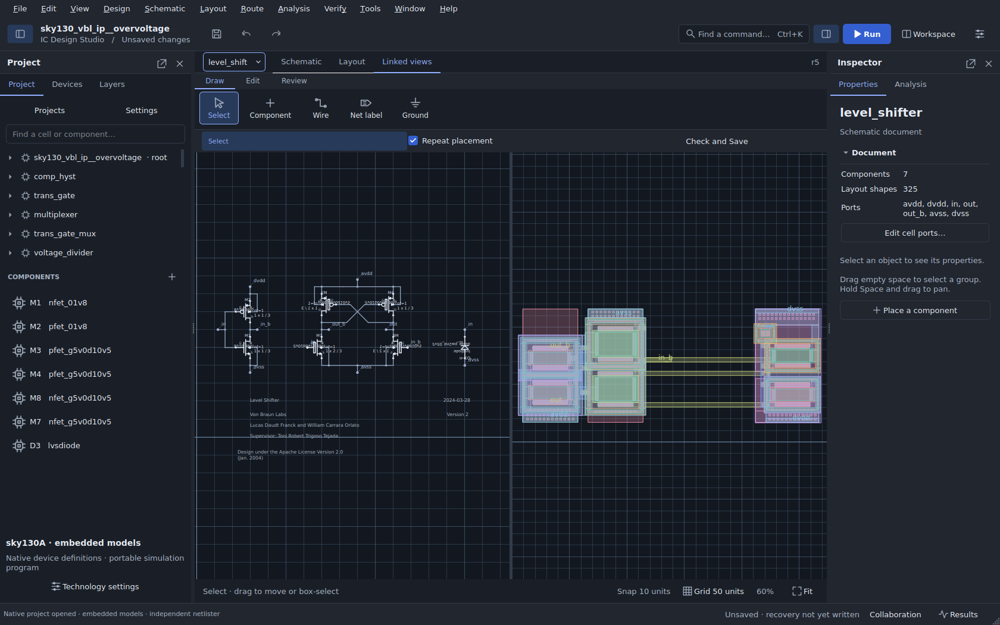

<p align="center">
  
</p>
<p align="center">
  <strong>Schematic capture, circuit simulation, layout and team review in one native desktop.</strong><br>
  Build with open PDKs. Keep your project, models and verification evidence together.
</p>
<p align="center">
  
  
  <a href=".github/workflows/build-desktop.yml"></a>
  <a href="LICENSE"></a>
</p>
<p align="center">
  <a href="docs/GETTING_STARTED.md"><strong>Get started</strong></a> ·
  <a href="docs/DOWNLOADS.md">Downloads</a> ·
  <a href="examples/README.md">Examples</a> ·
  <a href="docs/OPEN_PROJECTS.md">Real project imports</a> ·
  <a href="docs/INDEX.md">Documentation</a> ·
  <a href="CONTRIBUTING.md">Contribute</a>
</p>


## From circuit intent to physical evidence

IC Design Studio is an open desktop environment for learning circuit design, developing analog blocks and working with existing open-source designs. Local work needs no account or hosted service. Projects retain editable native documents, reusable hierarchy, model dependencies and revision-linked results.

**New in dev20:** the real SKY130 overvoltage detector passes strict full-circuit LVS with a verified upstream extraction correction. DC startup hints resolve its HSA convergence timeout, and a generated native testbench opens with both DUT views and embedded models. Hierarchical import, layout attachment and durable review recovery from dev19 remain included. [Read the update and its evidence](docs/OPEN_PROJECTS.md).

This is an **engineering preview**. Detector LVS and nominal DC checks pass within the pinned workflow; source-to-GDS conversion warnings and broader PVT/transient qualification remain documented. The [release status](docs/RELEASE_STATUS.md) distinguishes automated tests, platform acceptance and release publication.

## Explore the workspace

| Area | Features | Guide |
|---|---|---|
| **Schematic** | Devices, custom symbols, reusable cells, scalar buses, manual wires, labels and annotations; connection-preserving moves, terminal inspection and undo | [Native design](docs/PROFESSIONAL_WORKFLOWS.md) |
| **Simulation** | ngspice operating point, transient, DC, AC and noise; optional DC startup guesses, imported control programs, queued runs, cancellation, logs and saved inputs | [Simulation setup](SIMULATION_SETUP.md) |
| **Results** | Waveforms, voltage/current traces, markers, thresholds, calculations, measurements and revision-aware result history | [Getting started](docs/GETTING_STARTED.md) |
| **Experiments** | Reusable testbenches, specifications, PVT matrices, parameter studies, sensitivity and bounded parameter search | [Engineering workflows](docs/PROFESSIONAL_WORKFLOWS.md) |
| **Layout editing** | GDSII/OASIS hierarchy, rectangles, polygons, holes and paths; configurable grids, snapping, alignment, distribution, arrays, vias and routing tools | [Layout tools](docs/PRIORITIES_0.22.md) · [Drawing](docs/DRAWING_0.22.md) |
| **Linked design** | Schematic/layout views, device footprints, concrete parameter variants, change impact, geometry comparisons and reviewed updates | [Workflow and review](docs/WORKFLOW_REVIEW_0.22.md) |
| **3D inspection** | Layer visibility, editable display heights, orbit, pan, zoom, exploded views and PNG export | [3D layout](docs/LAYOUT_3D.md) |
| **PDKs** | Bundled GF180MCU and SKY130 simulation subsets; revisioned package registration, device catalogs, corners and dependency checksums; IHP adapter support | [PDK guide](docs/PDK_GUIDE.md) |
| **Verification** | Native geometry/connectivity checks, external rule jobs, pinned Magic/Netgen flows, KLayout LVS report navigation and extracted comparisons | [Qualification](docs/QUALIFICATION_0.22.md) |
| **Exchange** | Reviewed Xschem migration and export, SPICE import/export, Magic workspaces, GDS/OASIS review, original-file retention and explicit layout attachment | [Interoperability](docs/INTEROPERABILITY.md) |
| **Collaboration** | Local and encrypted network hosting, invitations, roles, shared schematic/layout edits, presence, reservations, conflict review and personal undo | [Live collaboration](docs/LIVE_COLLABORATION.md) |
| **Team review** | Immutable checkpoints, visual revision comparison, threaded comments, resolve/reopen, approvals, shared run evidence and durable retry of submitted actions | [Team workflows](docs/WORKFLOW_REVIEW_0.22.md) |
| **Project management** | Project Hub, searchable example gallery, command search, dockable windows, recovery snapshots and independent project copies | [Project Hub](docs/PROJECT_HUB.md) |


## Start in three steps

1. **Open the app.** Follow the [download guide](docs/DOWNLOADS.md), or run from source below.
2. **Choose “Your first waveform”** in the example gallery. It uses the included educational solver.
3. **Press F5**, inspect the waveform and save a copy with **Ctrl+S**.

Use **File → Start here / example gallery** to return to the gallery, **Ctrl+K** to find commands, and **Alt+1 / Alt+2 / Alt+3** to switch between schematic, layout and linked views.

<details>
<summary><strong>Run from source</strong> — Python 3.12</summary>

On Windows, extract the repository and double-click `launch-windows.bat` with 64-bit Python 3.12 installed. It creates an isolated environment under `%LOCALAPPDATA%\ICStudio`, downloads and verifies the pinned Windows runtime, and checks dependencies and a real simulation before launch. Keep the source folder at a short path such as `C:\ICStudio`.

On Linux/macOS:

```sh
python3.12 -m venv .venv
source .venv/bin/activate
python -m pip install -r requirements.txt
python scripts/check_simulation_assets.py
python main.py
```

For real PDK simulations, install native ngspice and select it in **Tools → Engine diagnostics and paths**, or set `ICSTUDIO_NGSPICE`. Ubuntu: `sudo apt install ngspice`; macOS: `brew install ngspice`. Magic and Netgen are additional tools for physical verification. The first-waveform example needs neither a PDK nor ngspice.

Windows packages include Python, Qt, ngspice and the bundled simulation subsets. Hosted Windows/Linux checks and consumer-machine acceptance are distinct; macOS remains a source workflow awaiting qualification. See [release status](docs/RELEASE_STATUS.md).

</details>

## Work with real open designs

| Project | What to try | Qualification boundary |
|---|---|---|
| [GF180 bandgap](docs/BANDGAP_COMPATIBILITY.md) | Startup, the six-case compatibility circuit, or the original 144-analysis characterization | Schematic and simulation compatibility; no matched physical layout claim |
| [SKY130 transistor inverter](examples/README.md) | Import a transistor-level Xschem circuit and inspect switching | Bundled simulation models; separate pinned physical fixtures test DRC/LVS |
| [SKY130 programmable overvoltage detector](docs/OPEN_PROJECTS.md) | Import seven schematic cells, expand resistor/MOS arrays, attach the Magic layout and compare all 16 trip codes | Strict full-circuit LVS, three fault controls, HSA sweeps and a runnable native testbench; see the documented scope |
| [Native analog references](docs/PROFESSIONAL_WORKFLOWS.md) | Current mirror, differential pair and amplifier testbenches, corners and physical faults | Bounded pinned SKY130 fixtures, not arbitrary circuit signoff |

For the overvoltage project, **File → Import and migrate Xschem project** creates the native schematic. **File → Import Magic layout** converts its physical tree with the selected technology; **File → Attach layout to schematic** reviews matching cell names before applying one undoable change. The [reproduction guide](docs/OPEN_PROJECTS.md) pins the source, explains the legacy diode bridge and retains the actual LVS findings.



## Open PDKs, explicit revisions

**File → Project Hub → PDKs** lists packages, revisions, model counts and status. **Tools → Set up an open PDK** discovers enabled installations or registers folders you select. Project menus choose the circuit first and technology second.

| Family | Available path | Additional requirements |
|---|---|---|
| **SkyWater SKY130** | `sky130A/B` adapters; bundled `sky130A` simulation subset | Matching physical decks and engines for layout verification |
| **GlobalFoundries GF180MCU** | `gf180mcuA/B/C/D` adapters; bundled simulation subset | Corresponding rule decks for physical verification |
| **IHP SG13G2** | Installed `ihp-sg13g2` adapter | Compatible ngspice and compiled OSDI models |
| **Custom processes** | Checksummed technology/model package interface | Explicit terminal, layer, model and verification bindings |

Bundled simulation subsets are not full PDK installations. Use [Ciel](https://github.com/fossi-foundation/ciel) or your existing PDK installation for additional assets. See the [PDK guide](docs/PDK_GUIDE.md) and **Help → Compatibility matrix** for supported subsets.

## What comes next

The [roadmap](docs/ROADMAP.md) tracks concrete acceptance criteria: consumer Windows/Linux release checks, physical LAN/VPN testing, broader real-project physical and PVT coverage, larger editing/recovery workloads, and broader offline collaboration. Submitted review actions now survive restart; a general offline design-edit queue remains planned.

## Contribute and verify

Small failing circuits, reproducible PDK fixtures, accessibility feedback and focused fixes are especially useful. Start with [CONTRIBUTING.md](CONTRIBUTING.md).

```sh
python -m unittest discover -s tests -v
python scripts/check_release.py
```

[Desktop CI](.github/workflows/build-desktop.yml), [external interoperability](.github/workflows/interoperability.yml) and [physical qualification](.github/workflows/physical-qualification.yml) retain their evidence. The physical workflow includes known-good circuits and deliberate failures so a broken setup cannot masquerade as successful verification. See [release qualification](docs/QUALIFICATION_0.22.md) before preparing a distribution.

Application source: **GPL-3.0-or-later**. Third-party designs, tools, libraries, symbols and models retain their licenses. See [LICENSE](LICENSE), [THIRD_PARTY_NOTICES.md](THIRD_PARTY_NOTICES.md) and [licenses/](licenses/).
