<p align="center">
  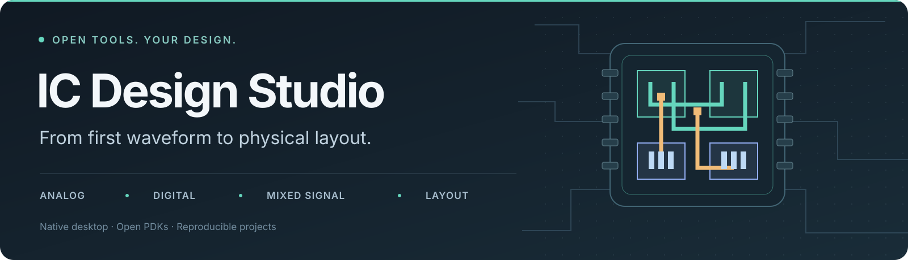
</p>

<p align="center">
  <strong>An open desktop workspace for circuit design.</strong><br>
  Draw schematics. Optimize analog circuits. Simulate RTL and mixed-signal systems. Build layouts.<br>
  Keep your cells, sources, models, testbenches, layouts, and results in one project.
</p>

<p align="center">
  <a href="docs/RELEASE_STATUS.md"></a>
  <a href="docs/RELEASE_STATUS.md"></a>
  <a href="https://github.com/jonahsaunders/IC-Design-Studio/actions/workflows/build-desktop.yml?query=branch%3Aexperimental"></a>
  <a href="LICENSE"></a>
</p>

<p align="center">
  <a href="#start-in-three-steps"><strong>Get started</strong></a> &nbsp;·&nbsp;
  <a href="#example-library">Examples</a> &nbsp;·&nbsp;
  <a href="#explore-the-workspace">Feature tour</a> &nbsp;·&nbsp;
  <a href="#feature-reference">All features</a> &nbsp;·&nbsp;
  <a href="docs/INDEX.md">Documentation</a> &nbsp;·&nbsp;
  <a href="CONTRIBUTING.md">Contribute</a>
</p>

<p align="center">
  <a href="docs/GETTING_STARTED.md">
    <picture>
      <source media="(prefers-color-scheme: light)" srcset="docs/images/readme/simulation-light.png">
      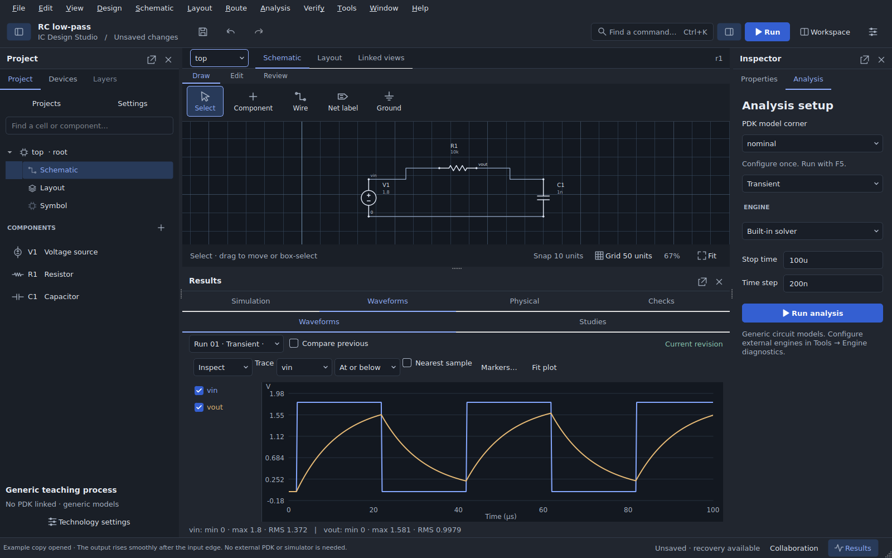
    </picture>
  </a>
  <br>
  <sub>A real simulation in the native desktop. The README preview follows your light or dark theme.</sub>
</p>

> **Experimental branch · 0.22.0.dev25.** This README describes the current development source. Desktop packages can lag behind it; use the [download guide](docs/DOWNLOADS.md) and [release status](docs/RELEASE_STATUS.md) to match a package to its source and validation evidence.

## Start in three steps

1. **Launch Studio.** Choose a complete Windows/Linux desktop package from the [download guide](docs/DOWNLOADS.md), or use the source instructions below.
2. **Open a working circuit.** Choose **File → Start here / example gallery → Your first waveform → Open a copy**. The RC example needs no external simulator or PDK.
3. **Make your first change.** Press **F5**, inspect **Results → Waveforms**, change a component value, and run again. Save your project with **Ctrl+S**.

Want a guided course? Open **File → Student Hub** for [28 lessons and a sensor-acquisition capstone](#learn-by-building-real-circuits).

<details>
<summary><strong>Run from source</strong> · Python 3.12 · Windows, Linux and experimental macOS</summary>

**Windows:** install 64-bit Python 3.12 and Git, then run:

```powershell
git clone --branch experimental --single-branch https://github.com/jonahsaunders/IC-Design-Studio.git
cd IC-Design-Studio
.\launch-windows.bat
```

You can also extract the source to a short path such as `C:\ICStudio` and double-click `launch-windows.bat`. The launcher creates an isolated environment under `%LOCALAPPDATA%\ICStudio`, downloads and verifies the pinned ngspice runtime, and checks dependencies and a real simulation before opening the app.

**Linux / macOS:**

```sh
git clone --branch experimental --single-branch https://github.com/jonahsaunders/IC-Design-Studio.git
cd IC-Design-Studio
python3.12 -m venv .venv
source .venv/bin/activate
python -m pip install -r requirements.txt
python scripts/check_simulation_assets.py
python main.py
```

For SPICE analyses, install ngspice (`sudo apt install ngspice` on Ubuntu, `brew install ngspice` on macOS), then select it in **Tools → Engine diagnostics and paths** or set `ICSTUDIO_NGSPICE`. macOS is a source workflow awaiting qualification.

Python requirements do not install the digital engines, VGA assets or openEMS runtime. Use a complete desktop package for included tools, or follow the [digital source setup](docs/DIGITAL_FLOW.md), [VGA build](docs/VGA_PLAYGROUND.md#source-setup-and-desktop-packaging) and [openEMS guide](docs/OPENEMS.md). [Simulation setup](SIMULATION_SETUP.md) covers analog engine configuration.

</details>

<details>
<summary><strong>Which tools do I need?</strong> · Match your setup to your workflow</summary>

| Workflow | Required tools and assets |
|---|---|
| First waveform, teaching circuits, Foundations and Analog lessons | Included teaching solver and generic devices; no downloaded PDK |
| Native SPICE and process-model analog design | ngspice; included SKY130/GF180 simulation subsets or compatible external models |
| Digital simulation through RTL-to-GDS | Included digital runtime and locked SKY130 HD platform in complete desktop packages; a built runtime or explicit **Custom tools** selection in source mode |
| Student Hub Digital lessons | Local `iverilog` and `vvp`, selected in **More → Engine setup** |
| SAR ADC, Mixed Signal lessons and capstone | Local `ngspice`, `iverilog` and `vvp`; behavioral models, no downloaded PDK |
| Process layout verification | Matching physical PDK assets/decks and the configured Magic, Netgen or KLayout engines |
| Inductor EM simulation | openEMS runtime plus declared physical materials and layer data in a PDK profile |

The packaged digital runtime uses native Linux tools or an app-owned **WSL 2** distribution on Windows. First-time Windows setup may need administrator approval and a restart. Linux packages target **x86_64, glibc 2.39+**. The Student Hub and SAR bridge use local executable paths, independently of that managed digital runtime.

[Desktop setup](docs/DOWNLOADS.md) · [PDK setup](docs/PDK_GUIDE.md) · [Engine details](docs/DIGITAL_FLOW.md#included-tools-and-first-setup)

</details>

## Explore the workspace

One native `.icproj` project keeps cells, symbols, RTL, models, testbenches, layouts and saved results together. Local design work needs no account or hosted service.

<table>
<tr>
<td width="33%" valign="top">
<h3>Analog design</h3>
<p>Capture circuits, run SPICE, inspect waveforms, size devices and search against saved requirements.</p>
<a href="#design-and-optimize-analog-circuits">Explore analog →</a>
</td>
<td width="33%" valign="top">
<h3>Digital design</h3>
<p>Edit RTL, debug regressions, check equivalence and timing, and implement blocks through GDS.</p>
<a href="#design-digital-blocks-from-rtl-to-gds">Explore digital →</a>
</td>
<td width="33%" valign="top">
<h3>Mixed signal</h3>
<p>Connect a real SPICE simulation to a Verilog controller and inspect every SAR conversion decision.</p>
<a href="#connect-analog-and-rtl-in-a-sar-adc">Build an ADC →</a>
</td>
</tr>
<tr>
<td valign="top">
<h3>Layout and verification</h3>
<p>Draw and route geometry, place matched devices, cross-probe views, and inspect the stack in 3D.</p>
<a href="#one-cell-both-views">Explore layout →</a>
</td>
<td valign="top">
<h3>Inductors and EM</h3>
<p>Create spiral inductors, search toward a target L, and characterize frequency response with openEMS.</p>
<a href="#create-and-characterize-spiral-inductors">Create an inductor →</a>
</td>
<td valign="top">
<h3>Learn and collaborate</h3>
<p>Follow measured lessons, build a capstone, or share editing sessions and revision-specific reviews.</p>
<a href="#learn-by-building-real-circuits">Start learning →</a> · <a href="#review-a-design-together">Review together →</a>
</td>
</tr>
</table>

## Example library

Open **File → Start here / example gallery** to browse **13 guided examples**. Each opens as an independent copy, with expected results and next steps. Start small, then follow a design into hierarchy, optimization or physical layout.

| Start with | What to try | What you should see |
|---|---|---|
| [RC low-pass](examples/rc.icproj) | Run **F5**, inspect `vout`, add waveform markers | Smooth charging after the input edge; included solver |
| [Native divider](examples/native-divider.icproj) | Run the operating point; study `R1.native.value` under **Analysis → Variation cases** | **0.5 V** from two 1 kΩ resistors; **0.25 V** when the upper resistor becomes 3 kΩ; ngspice |
| [Inverter and linked layout](examples/inverter_layout.icproj) | Select devices across both views, simulate, inspect generic DRC | Inverted output and linked educational geometry; included solver |
| [SKY130 transistor inverter](examples/sky130-simulation/inverter.sch) | Run the saved 1.8 V, 12 ns transient | Opposite input/output switching with bundled process models; ngspice |
| [Banba reference: schematic → optimization → layout](examples/gf180-banba/README.md) | Follow gallery entries **10–12** | Editable GF180 hierarchy, saved searches and a routed layout; [measured trade-offs](#build-a-gf180mcu-banba-bandgap) |
| [Four-bit SAR ADC](examples/sar-adc/sar-adc.icproj) | Run the coupled experiment at 0.93 V | **Code 8** after four comparisons; local ngspice and Icarus |

<details>
<summary><strong>Browse all 13 gallery projects</strong></summary>

| # | Gallery project | Focus | Engine |
|---|---|---|---|
| 01 | [Your first waveform](examples/rc.icproj) | RC transient and markers | Built-in |
| 02 | [Native divider and studies](examples/native-divider.icproj) | Operating point and parameter studies | ngspice |
| 03 | [Inverter and linked layout](examples/inverter_layout.icproj) | Schematic/layout selection and teaching DRC | Built-in |
| 04 | [Layout parasitics](examples/native-rc.icproj) | Baseline versus declared interconnect RC | ngspice |
| 05 | [Reusable hierarchical cells](examples/reusable-divider.icproj) | Parent/child ports and simulation | Built-in |
| 06 | [Matching and placement](examples/common-centroid-resistors.icproj) | Common-centroid resistor constraints | None |
| 07 | [GF180 bandgap startup](examples/gf180-bandgap/5vfullv2-startup.sch) | One 3 ms startup at 5 V / 25 °C | ngspice |
| 08 | [GF180 full characterization](examples/gf180-bandgap/5vfullv2-original.sch) | Original 144-analysis program; allow a longer run | ngspice |
| 09 | [SKY130 transistor inverter](examples/sky130-simulation/inverter.sch) | Real 1.8 V transistor models | ngspice |
| 10 | [Build a Banba bandgap](examples/gf180-banba/banba.icproj) | Native reference, startup and resistor search | ngspice |
| 11 | [Improve the Banba bandgap](examples/gf180-banba/pass2/banba.icproj) | Bias, startup and output-filter optimization | ngspice |
| 12 | [Lay out the Banba bandgap](examples/gf180-banba/layout/banba-layout.icproj) | Matched devices, segmented resistors and MIM capacitors | ngspice; physical engines for process checks |
| 13 | [Build a mixed-signal SAR ADC](examples/sar-adc/sar-adc.icproj) | Analog/RTL conversion and deliberate-fault debugging | Local ngspice + Icarus |

The included process simulation examples resolve their bundled models automatically. Teaching layouts and illustrative RC coefficients do not establish process qualification. The Banba layout's [archived qualification](docs/REFERENCE_QUALIFICATION.md) records each passing, failing and blocked check separately.

</details>

**More starting points:** the **Digital** menu creates a counter, UART regression or APB FIFO peripheral; the [VGA Playground](#preview-rtl-in-the-vga-playground) adds eight interactive RTL presets. The [Student Hub](#learn-by-building-real-circuits) supplies its own lesson projects. For import exercises, try the [hierarchical Xschem amplifier](examples/xschem-amplifier/amplifier.sch), [manual wiring](examples/manual-wiring.icproj), or a [real open design](#work-with-real-open-designs).

## Feature tour

### Learn by building real circuits

The **Student Hub** turns the native editors into a course: **28 lessons, 112 steps, four learning paths and one advanced project**. Predict an outcome, edit the circuit or RTL, check measured or structural evidence, then record your reasoning. Saved projects, progress and reflections let you pick up where you left off.

[](docs/STUDENT_HUB.md)

| Path | What you build and investigate |
|---|---|
| **Foundations** | RC transients, nets and ground, component edits, hierarchy, loading and reproducible layouts |
| **Analog** | Loaded dividers, RC bandwidth, current mirrors, differential pairs, amplifiers and matching |
| **Digital** | Truth tables, counters, handshakes, PWM, fixed-point averaging and a serial transmitter |
| **Mixed Signal** | Bridge thresholds, sample/hold, quantization, timing repair, DAC weights and repeated conversions |

**Try it:** choose **File → Student Hub → Continue learning** or select a lesson and choose **Start lesson**. The guide stays beside the real editor. Use **Run lesson**, inspect **Results**, then **Check this step**. **Practice lesson** makes locked lessons available for exploration without bypassing progression credit.

**Capstone:** repair an RC input filter, four-bit SAR and four-sample averager, then verify the threshold alarm across four system cases. The nominal repaired system produces averaged codes **4 and 11**, with alarm outputs **0 then 1**. [Lesson guide in action](docs/images/student-lesson.png) · [Capstone overview](docs/images/student-capstone.png).

Foundations and Analog use generic teaching models. Digital uses local Icarus; Mixed Signal and the capstone also use local ngspice. Reflections are recorded for review, not automatically graded for correctness. [Full course, prerequisites and engine setup](docs/STUDENT_HUB.md).

### Design and optimize analog circuits

Open **Analysis → Analog design workspace** to take an analog circuit from design goals through sizing, simulation, layout updates, and verification. **Setup**, **Results matrix**, **Optimize**, **Layout and constraints**, and **Verification runs** keep the workflow connected to your editable circuit and its saved evidence.

[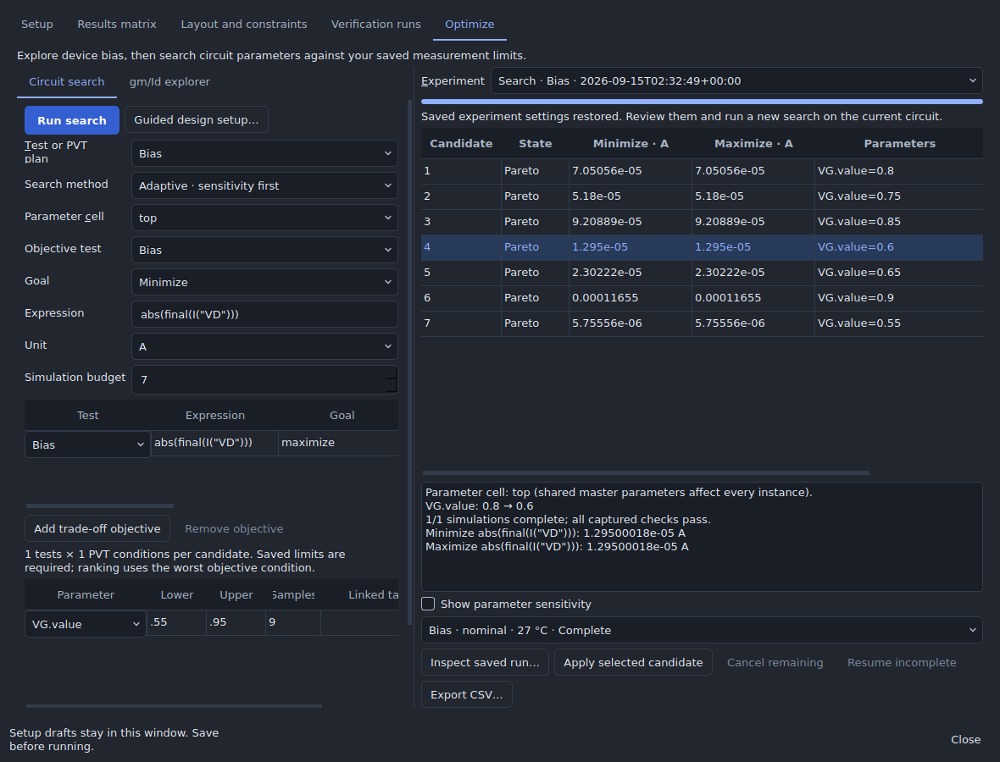](docs/ANALOG_OPTIMIZER.md)

<sub>Adaptive search and candidate review in the analog workspace. Each candidate retains its simulation inputs, measurements, and failures for inspection.</sub>

| Work on a circuit | What the workspace provides |
|---|---|
| **Set goals and tests** | Guided amplifier, differential-pair, and current-mirror fixtures; editable testbenches; design variables and measurement limits; process/voltage/temperature (PVT) plans |
| **Search and size** | Bounded adaptive, constrained Bayesian, experimental Gaussian-process, or grid search; matching/ratio links; up to three objectives with Pareto trade-offs; gm/Id and bias limits |
| **Characterize devices** | In-circuit gm/Id sweeps; reusable isolated-device characterization; measured length/bias comparisons; initial sizing suggestions and separate SPICE sizing checks |
| **Investigate performance** | Saved-circuit and waveform inspection; failed-requirement navigation; local and global sensitivity; robustness studies; ngspice noise, poles/zeros, startup, and loop-gain diagnostics |
| **Verify and apply** | Ordered verification stages, bounded retries, exact-result reuse, and coarse/full SPICE refinement; review and undoable application of passing candidates; linked layout updates and schematic/extracted comparison |

**Try it:**

1. Open **Setup → Guided design setup**, select a supported circuit template, map the DUT ports, and enter your goals. **Add teaching example** supplies an editable generic DUT if you are starting from an empty project. Preview and create the generated analyses, testbenches, and PVT plan.
2. In **Optimize → Circuit search**, select the saved plan, choose the parameter cell and bounds, set an objective and simulation budget, then choose **Run search**. Use **Optimize → gm/Id explorer** for operating-point sweeps or its **Device characterization library** for initial sizing.
3. Inspect each candidate's measurements and failed requirements. After the search finishes, **Apply selected candidate** is available for a passing candidate whose original design still matches. Review layout changes and run physical verification after changing the circuit.

The optimizer uses the existing simulators and needs no extra optimization package. Guided native testbenches and process-model characterization use ngspice; process work also needs suitable model assets. The included teaching solver supports local experiments with a limited square-law MOS model, without subthreshold current, body effect, or device capacitances. Search predictions and initial sizing estimates require simulation verification; a passing candidate is limited to the saved tests and conditions. Physical verification still needs matching process assets and engines.

Closing the workspace returns to the editor while queued jobs continue. Interrupted searches remain paused after an application restart until explicitly resumed.

Saved testbenches can select process capacitance, bounded flat process RC or calibrated interconnect extraction with supported physical hierarchy. Process RC preserves the actual resistor graph and reconstructs the original capacitance matrix with recorded approximation limits. Constrained layout updates preserve matching and routing intent, while durable campaigns run up to 10,000 verification cases with resumable workers. **Tools → Hierarchy and design automation…** provides reviewed, undoable batch edits. See [integrated analog workflows and supported scope](docs/ANALOG_CLOSURE.md).

[Workspace setup, debugging, and layout](docs/ANALOG_WORKSPACE.md) · [Optimizer, gm/Id, and characterization](docs/ANALOG_OPTIMIZER.md) · [Advanced analyses and verification automation](docs/ANALOG_OPTIMIZER.md#advanced-analyses) · [Detailed analog feature inventory](#analog-design-optimization-and-verification).

### Run repeatable analog verification

Keep operating-point, loop-gain, noise and startup diagnostics with their saved testbenches, then compare measurements against the same limits across PVT conditions. The editable **SKY130 two-stage op-amp** includes all four fixtures and a schematic/extracted workflow. Statistical plans add repeatable seeds, numeric parameter distributions and shared factors for correlated component tolerances.

<table>
<tr>
<td width="50%" valign="top">
<a href="docs/validation/dev25/images/statistical-editor.png">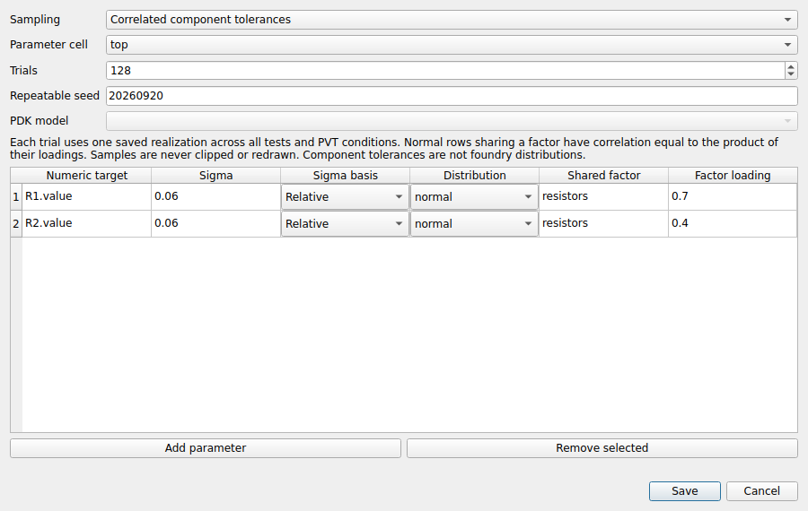</a>
<p><strong>Save the variation model.</strong><br>Reuse each sampled realization across the plan's tests and operating conditions.</p>
</td>
<td width="50%" valign="top">
<a href="docs/validation/dev25/images/statistical-results.png">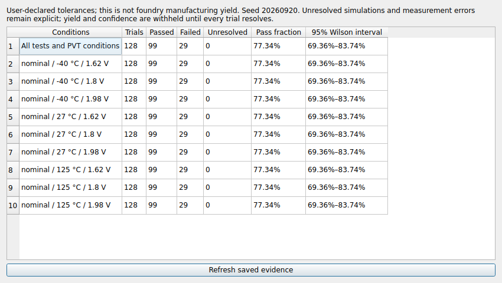</a>
<p><strong>Inspect the completed trials.</strong><br>Review per-condition and joint results, including failures and unresolved cases.</p>
</td>
</tr>
</table>

<sub>Actual editor and result captures from a 128-trial, nine-condition divider campaign. These are user-declared component tolerances; the pass fraction does not establish manufacturing yield.</sub>

**Try it:** open **Verification test plans → Edit plan → Statistical verification…**. Choose the parameter distributions and seed, run the campaign, then inspect **Statistical results…**. [Reference circuits and diagnostics](docs/ANALOG_REFERENCE_WORKFLOW.md) · [Statistical campaign guide](docs/ANALOG_REFERENCE_WORKFLOW.md#run-repeatable-statistical-campaigns).

### Connect analog and RTL in a SAR ADC

Build a **four-bit successive-approximation ADC** with an editable sample/hold, resistor DAC, behavioral comparator and synthesizable Verilog controller. ngspice solves the analog circuit while Icarus runs the controller; the experiment retains analog waveforms, a clock-edge table and every conversion decision.

[](docs/MIXED_SIGNAL_SAR.md)

**Try it:**

1. Choose **Analysis → Mixed signal → New SAR ADC example** (or gallery entry **13**), select local `ngspice`, `iverilog` and `vvp`, then choose **Run coupled simulation**.
2. Keep the **0.93 V** input and **1.8 V** reference. Expect final code **8** after four comparisons; DAC trials are **8 → 12 → 10 → 9 → 8**.
3. Try **0.4 V → code 3** and **1.2 V → code 10**. Open **Show analog waveforms** to compare `vin`, `held`, `vdac`, `cmp` and `track`.
4. Change **Rbit3 from 10 kΩ to 20 kΩ**. Observe the failing reference conversion check, then Undo and rerun.

The bridge supports bounded, clocked synchronous experiments using local executables. Its behavioral comparator and sampling switch do not establish transistor-level ADC accuracy or general Verilog-AMS support. The retained real-engine evidence is Linux-based; Windows and packaged execution need separate qualification. [Complete walkthrough and coupling contract](docs/MIXED_SIGNAL_SAR.md) · [Actual result panel](docs/images/mixed-signal-sar.png).

### Design digital blocks from RTL to GDS

Digital design now occupies the main window, with a source and hierarchy navigator, central documents, and a contextual inspector. Switch between **Design**, **Debug**, and **Implement** to edit RTL, inspect waveforms, or follow timing paths into the physical layout. Adjustable panes, remembered layouts, light/dark themes, and keyboard controls keep the workspace usable on smaller screens.

[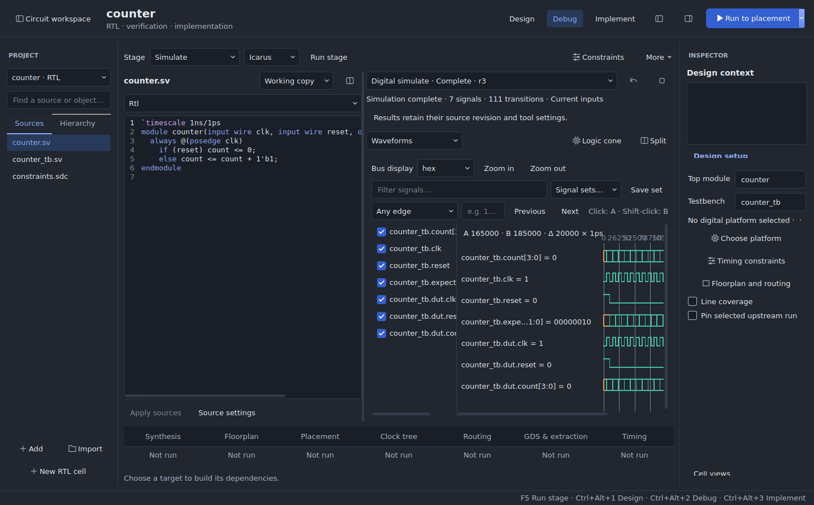](docs/DIGITAL_WORKSPACE.md)

<sub>Actual app capture of the counter example, with RTL editing and waveform inspection in the same workspace. [Workspace controls and shortcuts](docs/DIGITAL_WORKSPACE.md).</sub>

| Work on a block | What the workspace provides |
|---|---|
| **Design** | Independent RTL cells, source search, compiler hierarchy, optional language-server diagnostics/completion/definitions, and reviewable schematic-symbol interfaces |
| **Debug** | Icarus/Verilator simulation and regression, paged waveforms with two cursors and edge/value search, retained failures, captured source snapshots, and working-copy diffs |
| **Implement** | Clock/I/O/electrical constraints, mapped synthesis, formal equivalence, resumable targets through placement/routing/GDS, linked timing and physical inspection, and macro export |

**Try it:** open **Digital → New digital counter example**, **New UART regression example**, or **New APB FIFO peripheral**. In the digital workspace, choose **Included tools → Set up and verify** to prepare the included runtime, then run a simulation. Choose **Verify block** for lint, simulation/regression, synthesis, equivalence and timing, or **Run to placement / routing / GDS** to build the required implementation stages automatically. Failed, unproven, or incomplete checks stop the target; compatible results can be reused and interrupted plans resumed.

Desktop packages include the digital engines and a locked SKY130 HD platform. **Included tools** is the default: first launch guides setup, and clicking Run before setup finishes continues your request when the tools are ready. Linux uses a private native runtime; Windows uses an app-owned WSL 2 distribution. Enabling Windows Linux support may require administrator approval and a restart. Source checkouts need a built runtime or an explicit **Custom tools** selection. [Runtime setup and first implementation](docs/DIGITAL_FLOW.md#included-tools-and-first-setup) · [Detailed digital feature inventory](#digital-design-verification-and-implementation).

### Preview RTL in the VGA Playground

Edit project-owned Verilog beside a live Tiny Tapeout VGA preview. Choose from **Stripes, Music, Rings, Logo, Conway, Checkers, Drop and Gamepad**, create an RTL cell, then change its source and inspect the display. Keyboard/Gamepad inputs, reset, pause/resume and opt-in audio are available in the embedded view.

[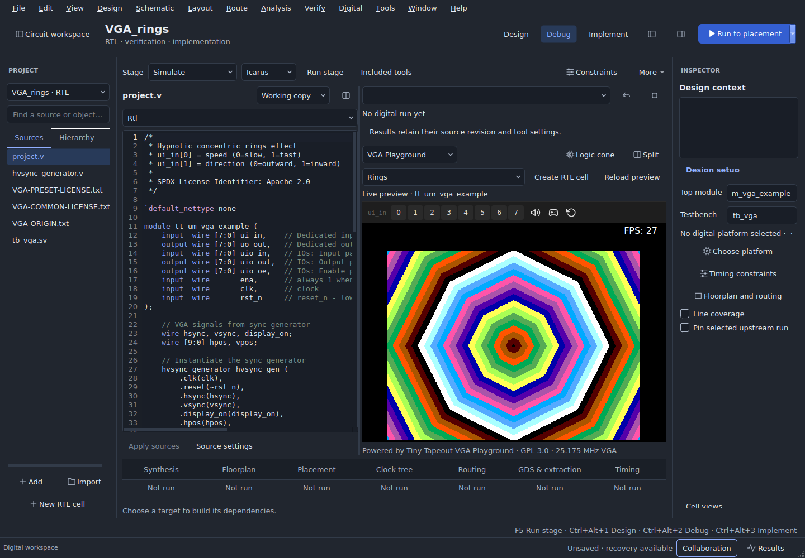](docs/VGA_PLAYGROUND.md)

<sub>Actual app capture of the Tiny Tapeout Rings preset. The preview runs offline after setup and stays with the native source editor. [Upstream attribution and licenses](docs/VGA_PLAYGROUND.md#upstream-and-attribution).</sub>

**Try it:** in the digital flow, open **More → VGA Playground**, choose a preset and click **Create RTL cell**. Desktop packages include the renderer; source checkouts need the [VGA asset build](docs/VGA_PLAYGROUND.md#source-setup-and-desktop-packaging). A visual preview complements the separate simulation, synthesis, timing and physical checks. [VGA controls and supported interface](docs/VGA_PLAYGROUND.md).

### Build a GF180MCU Banba bandgap

Follow a native design from its first schematic through a second optimization pass and a routed layout. This **3.3 V, approximately 0.6 V Banba reference** uses GF180MCU transistors, a 1:8 PNP ratio, process resistors and MIM capacitors, with a transistor-level amplifier and startup circuit. The saved projects include editable hierarchy, testbenches and optimizer evidence.

<table>
<tr>
<td width="50%" valign="top">
<a href="examples/gf180-banba/pass2/banba_core.png">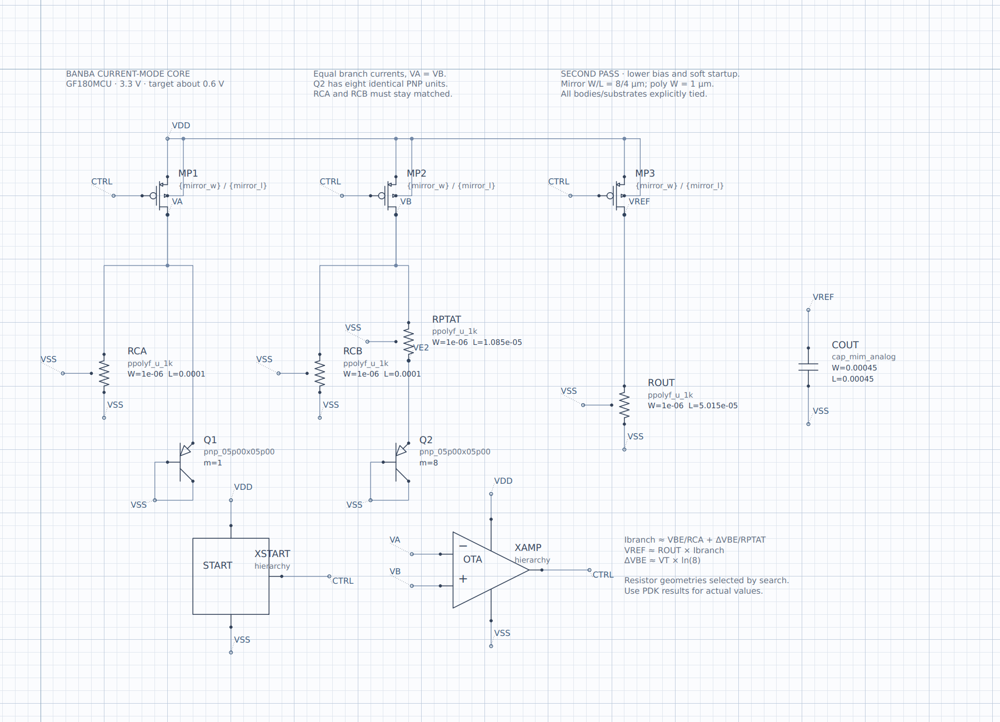</a>
<p><strong>Capture the reference.</strong><br>The second-pass core retains explicit body connections and matched resistor dimensions.</p>
</td>
<td width="50%" valign="top">
<a href="examples/gf180-banba/pass2/optimizer.png">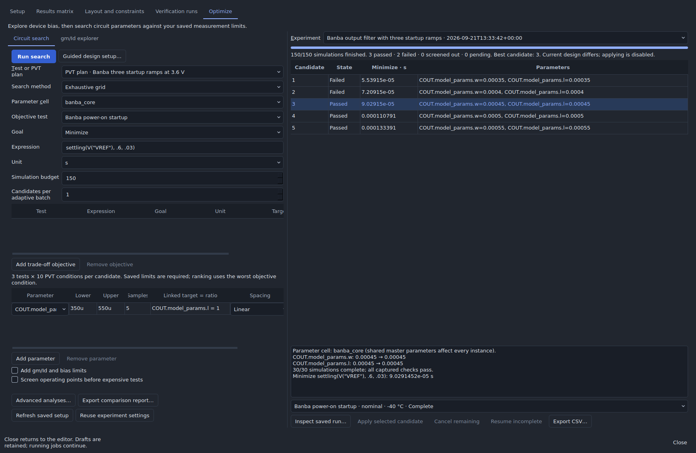</a>
<p><strong>Search against saved requirements.</strong><br>Three bounded searches ran 420 ngspice simulations across startup, accuracy and output-filter sizing.</p>
</td>
</tr>
</table>

[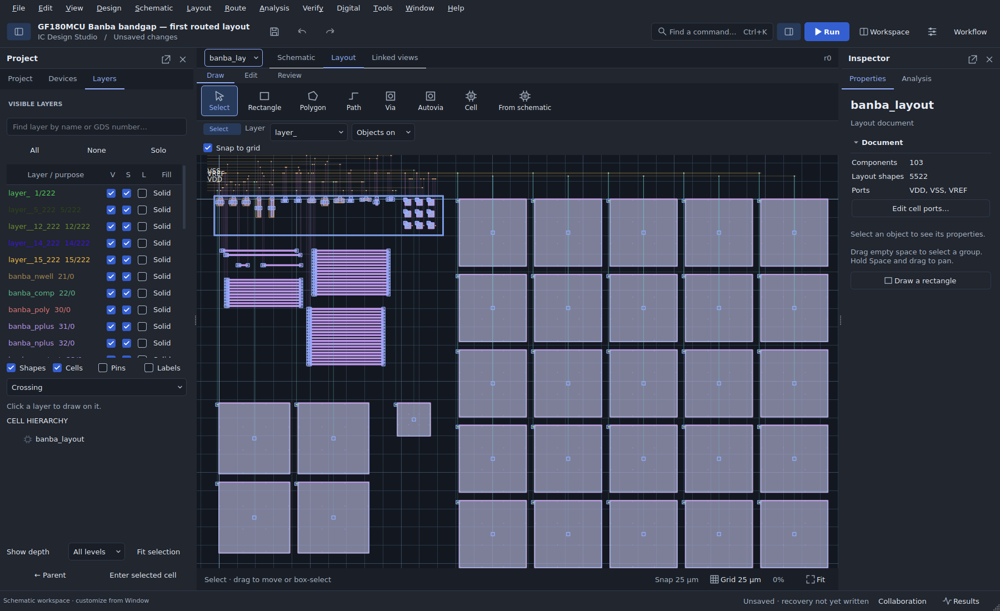](examples/gf180-banba/layout/README.md)

<sub>Actual native layout: 103 devices in an 852.1 × 566.5 µm footprint (0.482715 mm²), with a common-centroid PNP array, saved matching constraints, substrate guard and tiled capacitors. [Annotated overview](examples/gf180-banba/layout/layout-overview.png) · [Matched-device detail](examples/gf180-banba/layout/layout-core.png).</sub>

The second schematic pass reaches **600.616 mV at 44.40 µA**, with a sampled **10.63 ppm/°C** temperature coefficient over −40 to 125 °C at nominal process and 3.3 V. Lower current and reduced startup overshoot trade against slower settling, larger capacitor area and weaker 1 kHz supply rejection. See the [before/after plots and conditions](examples/gf180-banba/pass2/README.md#measured-results).

<details>
<summary><strong>Inspect the archived layout qualification</strong> · DRC, LVS, extraction and remaining limits</summary>

<!-- qualification:banba:start -->
**Archived qualification · Banba routed layout**

103 devices in an 852.1 by 566.5 micrometre editable core (0.482715 square millimetres). Full extracted qualification remains blocked.

| Check | Status | Scope |
|---|---|---|
| Native connectivity | Passed | 56 nets; saved matching and geometry checks are separately retained. |
| Unfilled core LVS | Passed | Pinned GF180 four-metal / MIM B deck; 103 devices. |
| Unfilled core density | Failed | 314 density findings; core geometry and antenna checks pass. |
| 600 micrometre fill DRC/LVS | Passed | 3.625 square millimetres. Includes the documented dummy-poly density-deck correction. |
| 550 micrometre fill DRC/LVS | Passed | 3.253175 square millimetres; 10.26% smaller than the retained 600 micrometre halo. Same dummy-poly correction; core masks unchanged. |
| Core capacitance-only PVT | Passed | 20 operating points and 60 startup transients; no distributed resistance. |
| Distributed RC | Blocked | Extractor output has incomplete device-terminal resistance graphs. |
| Fill coupling | Blocked | The retained Magic technology does not extract dummy-fill coupling. |
| Fabrication signoff | Not run | Process-owner review and a complete chip floorplan remain required. |

Archive results apply to the recorded source and tools. They do not qualify edits, packaged releases or fabrication signoff.
<!-- qualification:banba:end -->

</details>

**Try it:** open **File → Start here / example gallery**, then **Improve the Banba bandgap** or **Lay out the Banba bandgap → Open a copy**. In the layout example, select **banba_layout → Layout**. [First schematic](examples/gf180-banba/README.md) · [Second pass and optimizer](examples/gf180-banba/pass2/README.md) · [Native layout project](examples/gf180-banba/layout/banba-layout.icproj) · [GDS and reproduction](examples/gf180-banba/layout/README.md#files-and-reproduction).

### One cell. Both views.

Switch between **Schematic**, **Layout**, and **Linked views** while staying in the same cell. Import an existing schematic, attach its physical hierarchy, and inspect the design at the level that matters.

[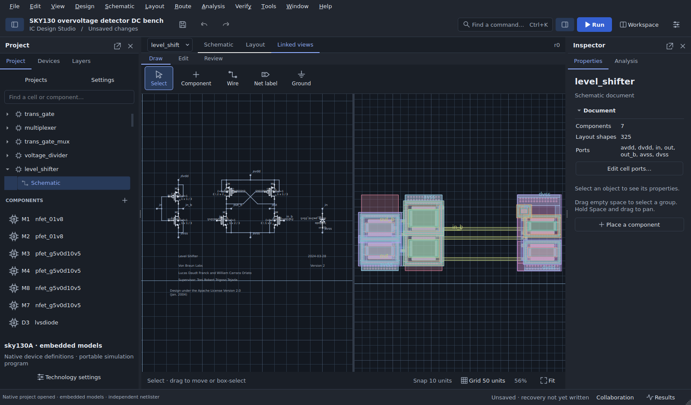](docs/OPEN_PROJECTS.md)

<sub>The level shifter from the Apache-2.0 overvoltage design by the Von Braun Labs contributors. Cell-view attachment and device-level LVS correspondence are separate. [Source, attribution, and reproduction](docs/OPEN_PROJECTS.md).</sub>

Draw rectangles, polygons and paths; edit vertices and stretch edges; combine shapes with Boolean operations; place vias and preview **Autovia** arrays in conductor overlaps. Matching, common-centroid, symmetry and routing constraints help preserve physical intent. Native buses and instance arrays retain member identities; supported parameter changes can regenerate linked physical variants after review.

<a id="inspect-the-layers-in-3d"></a>
<details>
<summary><strong>Inspect the same design in 3D</strong></summary>

Orbit, pan and zoom; hide layers; adjust display heights; separate the stack with an exploded view; export a PNG.

[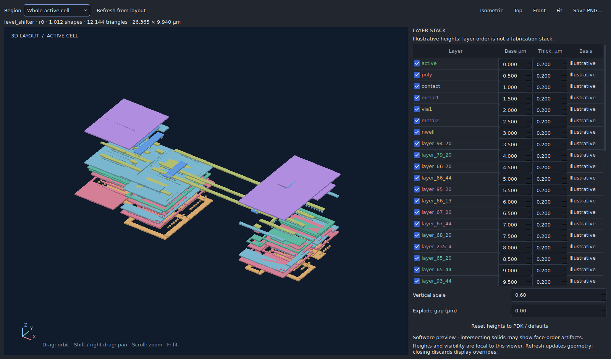](docs/LAYOUT_3D.md)

This read-only extrusion uses illustrative display heights; it does not establish fabrication stack dimensions. [3D viewer guide](docs/LAYOUT_3D.md).

</details>

[Drawing and geometry](docs/DRAWING_0.22.md) · [Vias and Autovia](docs/LAYOUT_VIAS.md) · [Native buses and physical variants](docs/ANALOG_IMPLEMENTATION_EXTENSIONS.md) · [Layout scale and editing](docs/LAYOUT_SCALE_AND_COLLABORATION.md)

### Create and characterize spiral inductors

Open **Tools → Inductor creator…** to build a **square, rectangular, hexagonal, octagonal, or circular** two-terminal spiral. Link its layout to a new or existing schematic inductor, set dimensions manually, or search toward a target inductance within your footprint and design-rule constraints.

[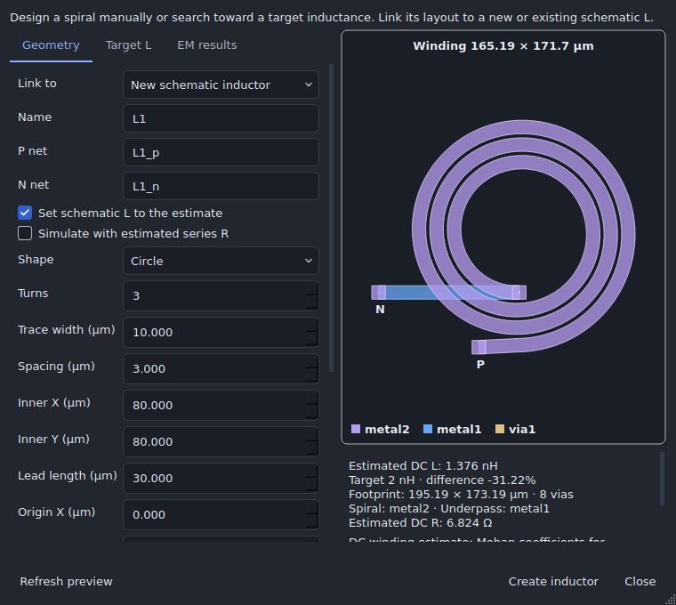](docs/INDUCTOR_CREATOR.md)

<sub>Actual creator capture using synthetic resistance coefficients. The preview shows the winding, underpass, terminals, dimensions, and estimates before creation.</sub>

| Capability | What you can do |
|---|---|
| **Shape and layout** | Set turns, width, spacing, inner openings, leads, metal/via stack, via arrays, origin, rotation and mirroring; rectangles have independent X/Y openings |
| **Target-L search** | Enter target inductance, tolerance, maximum footprint and width/spacing ranges; compare candidates by inductance error and area, then validate the selected candidate against the existing layout |
| **Preview and editing** | Inspect geometry and placement checks in the background; review suggested fixes; create or regenerate the linked schematic/layout device as one undoable edit; retain recipes through save/reopen |
| **Circuit estimates** | Inspect winding inductance and DC resistance when conductor/via coefficients are available; optionally set schematic L to the estimate or use estimated series resistance in simulation/export copies |
| **Physical PDK profiles** | Map layout layers to physical materials; enter thickness, conductivity and dielectric/substrate properties; save and reuse profiles tied to the process revision; choose an isolated inductor or surrounding-layout context |
| **Included openEMS simulation** | Choose a frequency band and run the packaged Windows/Linux solver; inspect progress and logs, cancel runs, and compare two meshes with **Verified result** or use a single-mesh **Quick preview** |
| **Results and exchange** | Inspect L(f), R(f), Q(f) and a sampled self-resonance bracket; save characterization with the project; export geometry and physical stackup bundles, or import matching impedance JSON and supported Touchstone S-parameters; identify results made stale by design changes |

**Run an EM simulation:** create and save the inductor, open **EM results → Run openEMS…**, complete **Set up physical layers…** if needed, choose **From / To (GHz)**, and click **Run simulation**. Desktop packages include the solver and its dedicated Python runtime; physical process data come from your PDK profile. Results include the excitation fixture and are not de-embedded. Analytical L/R estimates and EM characterization have different model scopes.

[Creator controls, target search and model scope](docs/INDUCTOR_CREATOR.md) · [openEMS setup, convergence and results](docs/OPENEMS.md) · [Physical PDK profiles](docs/INDUCTOR_CREATOR.md#pdk-profiles).

### Review a design together

Share a schematic or layout session, save a named checkpoint, and discuss the exact revision. Reviewers can reply, resolve discussions, and record decisions; completed runs can travel with their saved inputs.

[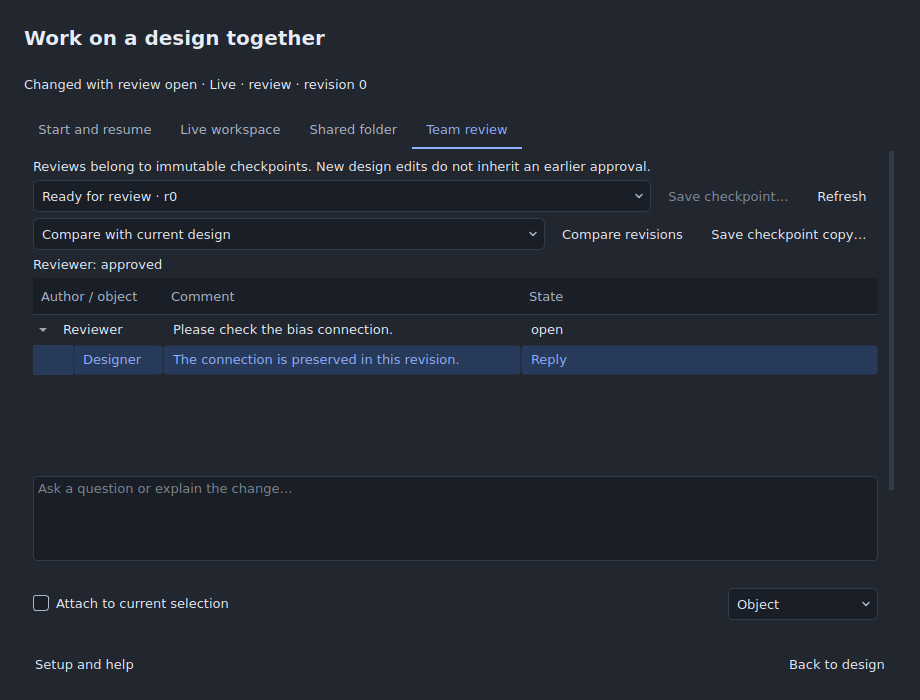](docs/WORKFLOW_REVIEW_0.22.md)

<sub>A local demonstration with two desktop clients. [Live editing](docs/LIVE_COLLABORATION.md) · [Review roles and discussions](docs/WORKFLOW_REVIEW_0.22.md).</sub>

See the [component browser, bulk layout placement and floating-panel update](docs/USABILITY_FEEDBACK.md) for the latest development-source interaction improvements.

<a id="a-comfortable-place-to-design"></a>

Dark/light themes, floating panels, saved workspace arrangements and command search keep the desktop adaptable. Recovery snapshots, pending-write status and protection against external file changes help preserve editing work. [Workspace and recovery](docs/STABILITY_0.22.md) · [Current recovery and verification improvements](docs/RELIABLE_DESIGN_WORKFLOWS.md).

<details>
<summary><strong>Useful shortcuts</strong></summary>

| Action | Shortcut |
|---|---|
| Run the current analysis | **F5** |
| Save the project | **Ctrl+S** |
| Find a command | **Ctrl+K** |
| Schematic / Layout / Linked views | **Alt+1 / Alt+2 / Alt+3** |
| Digital Design / Debug / Implement | **Ctrl+Alt+1 / Ctrl+Alt+2 / Ctrl+Alt+3** |
| Restore the default panels | **Window → Reset workspace** |

</details>

## Feature reference

Expand a category for the detailed inventory. Features requiring an external engine, a technology mapping, or a supported import subset are identified in their guides.

<details>
<summary><strong>Schematic capture, symbols, and hierarchy</strong></summary>

| Capability | Included tools |
|---|---|
| Circuit drawing | Device placement; repeated placement; manual wires; labels and ground; annotations; rotation, mirroring, duplication, and bulk parameter editing |
| Electrical editing | Connection-preserving stretch; explicit move; wire cut/rejoin; junction control; full-net inspection; terminal inspection; native buses, bit taps and per-member instance-array connections |
| Custom symbols | Generated or hand-edited artwork; lines, polygons, and text; pin identity, direction, and ordering; symbol properties |
| Reusable circuits | Named cells and ports; hierarchy navigation; make a cell from a selection; cell and instance parameters; schematic, symbol, and layout views |
| Editing controls | Selection filters; coordinate editing; capture profiles and keyboard commands; preview/cancel; undo/redo; Check and Save |

[Capture guide](docs/UPDATE_0.12.md) · [User guide](docs/USER_GUIDE.md)

</details>

<details>
<summary><strong>Simulation and waveform analysis</strong></summary>

| Capability | Included tools |
|---|---|
| Analyses | Built-in educational solver; native ngspice operating point, transient, DC sweep, AC response, and noise; graphical source/output/temperature configuration |
| Existing simulation programs | Supported imported SPICE control programs; analysis tables and measurements; saved programs and original source retention; optional first-point DC voltage guesses |
| Run management | Queued and cancellable runs; progress and logs; immutable saved inputs; failed-run inspection; rerun from saved input; revision-aware history |
| Waveform inspection | Voltage and current traces; pan/zoom and fit; X/Y markers; exact-coordinate and threshold inspection; previous-run comparison |
| Calculations and export | Saved multi-panel plots; complex AC arithmetic, phase and dB; FFT for uniform time samples; derivatives and integrals; RMS, peaks, crossings, settling, frequency, and delay measurements; schematic readouts; CSV export |

[Simulation setup](SIMULATION_SETUP.md) · [Native analyses](docs/UPDATE_0.20.md) · [Waveform tools](docs/UPDATE_0.16.md)

</details>

<a id="digital-design-verification-and-implementation"></a>
<details>
<summary><strong>Digital design, verification, and implementation</strong></summary>

| Capability | Included tools |
|---|---|
| Main-window workspace | Design/Debug/Implement modes; searchable source and compiler-hierarchy navigator; contextual inspector; remembered pane sizes and visibility; light/dark themes; keyboard mode switching; Current/Stale/Failed/Running stage states |
| RTL cells and source editing | Independent per-cell sources and undo; explicit file roles, compilation order, includes and defines; source search and go-to-line; captured run snapshots and working-copy diffs; optional stdio SystemVerilog language-server diagnostics, completion and definitions |
| Simulation and regression | Icarus and Verilator; saved testbench cases and definitions; retained assertions, failures and waveforms; optional Verilator line coverage; RTL cases in shared verification plans |
| VGA Playground | Offline embedded Tiny Tapeout preview beside the native RTL editor; eight project-owned presets; keyboard/Gamepad inputs, opt-in audio, pause/resume and reload |
| Digital waveform inspection | Four-state values and aliases; binary, hex, unsigned and signed display; two cursors and delta readout; filtering and saved signal sets; edge/value search; source-declaration navigation; streaming SQLite indexes and on-demand pages for large VCDs |
| Synthesis and equivalence | Verilator lint; Yosys elaboration, hierarchy and mapped standard-cell synthesis; optional slang frontend; EQY/SBY/Bitwuzla equivalence against captured RTL, including inferred memories; distinct PASS/FAIL/UNKNOWN/ERROR outcomes and retained counterexamples |
| Target execution | **Verify block** and **Run to placement/routing/GDS**; dependency planning; compatible-result reuse; explicit upstream selection; queued cancellation; persistent stop/resume across restarts; captured inputs, tool identities, logs and artifact checksums |
| Timing and synthesis constraints | Clock and I/O tables; uncertainty and transition; driving cells and loads; electrical limits; synthesis frontend and delay budget; selected Liberty corners; generated or manually maintained SDC with explicit ownership |
| Timing inspection | OpenSTA setup/hold paths, total negative slack, electrical violations and per-library-corner reports; power estimates; extracted SPEF timing; simultaneous timing/physical selection; compatible-run metric comparisons |
| Physical implementation | ORFS floorplan, placement, clock tree, routing and GDS/extraction stages; die/core bounds, density and threads; routing-layer bounds, pin-edge groups, fixed macros and halos; captured I/O, macro-placement and PDN Tcl |
| Connected inspection | Compiler hierarchy and bounded logic cones; source/netlist/physical cross-probing; OpenDB instance identity, transformed geometry, orientation and terminal connectivity; indexed instance selection, batched signal routes, net/layer filters, search and placement-density bins |
| Native cell integration | Compiler-derived schematic symbols with bus metadata and scalar terminals; review and undo for interface changes across instances, physical ports and testbenches; revision-aware RTL/symbol/schematic/layout and attached netlist/extracted views |
| Implemented macro exchange | Attach generated physical hierarchy to a native cell; export GDS, abstract LEF, netlist, SDC, SPEF and terminal/provenance metadata |
| Runtime and examples | Included, verified digital toolchain and SKY130 HD platform; Linux native and Windows private WSL 2 execution; optional custom toolchains; counter, UART and hierarchical APB FIFO examples with regression and deliberate-fault coverage; digital CLI workflows |

**Scope:** language-server support needs a separately installed server, and the optional slang frontend needs its matching Yosys plugin. Native symbols support up to 128 scalar terminals. Large-VCD support is bounded to 2 GiB and 20 million changes; FST and real/string dumps are unsupported. Power and density are estimates, and library-corner timing sweeps do not establish physical signoff. The separate [SAR bridge](docs/MIXED_SIGNAL_SAR.md) provides bounded clocked analog/digital experiments with local engines. General Verilog-AMS, per-instance analog/digital view substitution, foundry-qualified signoff and characterized macro Liberty generation remain outside the digital implementation flow.

[VGA Playground](docs/VGA_PLAYGROUND.md) · [Workspace controls and limits](docs/DIGITAL_WORKSPACE.md) · [Engines, setup, constraints and CLI](docs/DIGITAL_FLOW.md)

</details>

<a id="analog-design-optimization-and-verification"></a>
<details>
<summary><strong>Analog design, optimization, and verification</strong></summary>

| Capability | Included tools |
|---|---|
| Workspace and guided setup | Project variables and measurement limits; editable amplifier, differential-pair, and current-mirror fixtures; generated analyses, testbenches, and PVT plans; retained setup drafts |
| Reusable tests | Saved circuit testbenches; configured analyses and stimuli; repeatable measurements; specification limits and pass/fail results |
| Two-stage amplifier reference | Editable SKY130 Miller amplifier with process MIM compensation; saved bias, gain, loop-margin, integrated-noise and startup requirements |
| Variation | Parameter sweeps; process/voltage/temperature matrices; seeded Monte Carlo parameter variation; technology-declared statistical bindings; individual case review, editing, and enable/disable controls |
| Circuit search | Adaptive sensitivity-first, constrained Bayesian, experimental Gaussian-process, and exhaustive-grid methods; 1–8 parameter axes; linear/log/integer spacing; matching/ratio links; up to three objectives and measured Pareto candidates; gm/Id and bias limits |
| Candidate review and recovery | Worst-condition ranking; captured parameters and requirements; failed-waveform and saved-hierarchy navigation; pause/resume and reusable experiment settings; full-precision CSV export; design-identity checks and undoable application |
| gm/Id and device characterization | Captured operating-point sweeps; isolated-device cache tied to model and engine identities; measured current density, conductance, intrinsic gain/capacitance/speed where available; length comparisons; sizing suggestions and separate SPICE verification |
| Sensitivity and robustness | Local finite differences; Morris and Sobol global sensitivity; bounded worst-condition search; user-declared tolerances; explicitly validated PDK statistical bindings; saved conditions, assumptions, and reports |
| Electrical diagnostics | ngspice noise contributors, poles/zeros, supply-ramp startup, and loop gain from a user-built injection fixture; captured device bias across conditions; saved decks and source evidence |
| Verification plans | Multiple tests and operating conditions; parallel job execution; saved-input resume/retry; baseline deltas; requirement matrices; durable seeded statistical campaigns with per-condition and joint results; CSV reports |
| Verification automation | Operating-point screening; ordered test stages; bounded retries and worker-time budgets; identity-checked exact-result reuse; coarse/full SPICE refinement with full-resolution finalist verification; portable JSON reports |
| Layout connection | Device placement and regeneration; schematic-change review; matching and multi-group common-centroid constraints; unrouted-connection inspection |
| Physical comparison | Saved process-capacitance, process-RC or calibrated interconnect selection; bounded linked-hierarchy extraction; schematic versus post-layout measurements; retained DRC/LVS, integrity and failure evidence |

**Scope:** circuit searches use a finite simulation budget, with at most 500 jobs. Passing candidates must satisfy every required saved test and PVT condition; predictions and coarse runs cannot establish full-resolution passing performance. Missing model vectors remain unavailable, intrinsic device speed is not circuit bandwidth, and sampled tolerance/statistical pass fractions do not establish manufacturing yield. Updated sizing needs fresh layout/extracted verification.

[Analog workspace](docs/ANALOG_WORKSPACE.md) · [Optimizer and device characterization](docs/ANALOG_OPTIMIZER.md) · [Reference diagnostics and statistical campaigns](docs/ANALOG_REFERENCE_WORKFLOW.md) · [Advanced analyses](docs/ANALOG_OPTIMIZER.md#advanced-analyses) · [Test plans](docs/PROFESSIONAL_WORKFLOWS.md)

</details>

<details>
<summary><strong>Layout drawing, routing, and placement</strong></summary>

| Capability | Included tools |
|---|---|
| Drawing | Rectangles; polygons with holes; paths; reference-point move/copy; edge stretch; vertex editing; rotation; precise transforms |
| Geometry operations | Union, subtraction, intersection, and XOR; sizing; chopping; area erase; alignment and distribution |
| Canvas controls | Configurable grid spacing, origin, appearance, and snapping; object snapping; Manhattan/45°/free paths; rulers; layer search, visibility, selection, locks, and fills |
| Hierarchy | Physical cells and regular arrays; reusable masters; edit in context; hierarchy depth; flattening; reviewed parameter-driven physical variants and semantic instance locks |
| Connections | Manual vias and previewed Autovia arrays in selected conductor overlaps; coordinate and linked-terminal routing; saved route constraints; route preview; terminal and cell-port assignment; connected path editing |
| Analog placement | Common-centroid, matching, symmetry, and spacing constraints; declared-rule resistor/capacitor/MOS/contact/guard-ring generators; supported PDK device recipes and analog reference layouts |
| Inductor creator | Five spiral shapes; target-L search; background preview; linked schematic L; optional DC series RL; PDK profiles; included openEMS runtime; simple simulation controls and saved EM results |

**Autovia:** select overlapping metal shapes, choose **Autovia**, review the preview, then choose **Place vias**. Manual placement and Autovia use the project's configured layers, including imported SKY130 layouts. [Via placement guide](docs/LAYOUT_VIAS.md).

**Inductors:** choose **Tools → Inductor creator…** to create or regenerate a linked spiral, search toward a target L, run the included openEMS solver, or exchange EM characterization. [Feature tour](#create-and-characterize-spiral-inductors) · [Inductor creator guide](docs/INDUCTOR_CREATOR.md) · [openEMS simulation](docs/OPENEMS.md).

[Drawing](docs/DRAWING_0.22.md) · [Layout tools](docs/PRIORITIES_0.22.md) · [Layout editor reference](docs/UPDATE_0.11.md) · [Parametric geometry](docs/UPDATE_0.16.md)

</details>

<details>
<summary><strong>Linked design and 3D inspection</strong></summary>

| Capability | Included tools |
|---|---|
| Schematic/layout connection | Linked device footprints; cross-probing; whole-net highlighting; terminal connectivity; device mapping audits |
| Design changes | Missing/changed device review; resolved parameter variants; geometry proposals; route impact; before/after comparison; one-step application and undo |
| Workflow inspection | Active circuit or saved-testbench status; device links; missing connections; matching findings; stale-result identification; next-action navigation |
| 3D geometry | Extruded active cell or cropped viewport; nested instances and arrays; paths and holes; orbit/pan/zoom; isometric/top/front presets |
| 3D presentation | Layer visibility; editable display elevation/thickness; vertical scale; exploded views; refresh after edits; PNG export |

[Linked workflow](docs/WORKFLOW_REVIEW_0.22.md) · [3D viewer and display-height scope](docs/LAYOUT_3D.md)

</details>

<details>
<summary><strong>Verification and parasitic comparison</strong></summary>

| Capability | Included tools |
|---|---|
| Native checks | Configurable electrical rule checks; declared geometry rules; grid, width, spacing, and enclosure findings; live checks; revision-specific waivers |
| Connectivity | Physical net inspection; opens/shorts and terminal mapping; cross-probing; navigable findings |
| External engines | Configured external rule jobs; pinned Magic DRC/extraction and Netgen LVS flows; KLayout extraction and LVS report navigation |
| Parasitics | Ground-capacitance estimation; declared distributed interconnect RC and same-layer coupling; coupon calibration; baseline and specification comparison |
| Evidence | Saved decks, tool/model revisions, checksums, logs, reports, measurements, and deliberate-fault regression fixtures |

Native rules and RC estimates use declared technology data. Foundry qualification is limited to the exact processes and fixtures in the evidence; see the [qualification guide](docs/QUALIFICATION_0.22.md).

[Physical workflows](docs/PROFESSIONAL_WORKFLOWS.md) · [RC estimation scope](docs/UPDATE_0.16.md) · [External verification](docs/INTEROPERABILITY.md) · [Public-design DRC/LVS compatibility](docs/PUBLIC_DESIGN_COMPATIBILITY.md)

</details>

<details>
<summary><strong>PDKs, libraries, and external file exchange</strong></summary>

| Capability | Included tools |
|---|---|
| Technology management | Bundled SKY130/GF180 simulation subsets; installed PDK discovery; package registration; device catalogs; corners; immutable revisions and dependency checksums |
| Project bindings | Explicit device/terminal/layer/model mappings; PDK folder relinking; reviewed revision migration; compatibility and qualification status |
| Xschem | Dependency and hierarchy review; migration to editable native cells; supported array expansion; custom-library resolution; export and reviewed reimport; archived source material |
| External Xschem execution | Installed-engine netlisting for vector buses and Tcl-driven formats, with captured configuration and provenance |
| Physical exchange | GDSII/OASIS import/export; hierarchy, transforms, arrays, and text; reviewed external changes; original-file recovery; Magic workspace import/export; layout-to-schematic attachment |
| Other handoffs | Supported SPICE circuit/component import and deck export; saved testbench export; structural Verilog export; project folders; reproducible handoff bundles |

[PDK guide](docs/PDK_GUIDE.md) · [Exchange guide](docs/INTEROPERABILITY.md) · [Import a real project](docs/OPEN_PROJECTS.md)

</details>

<details>
<summary><strong>Live collaboration and team review</strong></summary>

| Capability | Included tools |
|---|---|
| Sharing | Local shared-folder workspaces; local or encrypted network hosting; invitations; owner/editor/reviewer/viewer roles |
| Joint editing | Shared schematic/layout changes and hierarchy; presence; object reservations; concurrent-edit conflict review; personal undo |
| Checkpoints | Named immutable revisions; visual schematic/layout comparison; object, terminal, net, and finding attachments |
| Discussion | Threaded comments and replies; resolve/reopen; checkpoint-specific approvals and decisions; read-only review roles |
| Shared evidence | Attach completed simulation or physical runs; inspect saved inputs; rerun locally with matching tools and PDKs |
| Recovery | Durable retry of submitted review actions across restart; restored unsent checkpoint-specific drafts; retained conflict edits; server persistence and backups |

General offline design-edit queuing remains planned. [Collaboration limits and hosting](docs/LIVE_COLLABORATION.md) · [Team review](docs/WORKFLOW_REVIEW_0.22.md) · [Review recovery](docs/REVIEW_RECOVERY.md)

</details>

<details>
<summary><strong>Projects, workspace, recovery, and developer tools</strong></summary>

| Capability | Included tools |
|---|---|
| Project organization | Project Hub; create/open/rename/duplicate; independent example copies; project/cell/view browser; search; portable native JSON documents |
| Workspace | Dark/light themes; dockable and floating panels; saved window arrangements; focused canvas; command palette; keyboard profiles; searchable help |
| Persistence | Undo/redo; session recovery snapshots; previous valid recovery state; pending/failed-write status and retry; protection against overwriting externally changed files |
| Setup | Engine diagnostics and paths; simulation runtime configuration; PDK checks; Windows source launcher; desktop packaging workflows |
| Automation and extension | Source CLI workflows; reproducible qualification and benchmark scripts; documented trusted local plugin example in source mode |

[Project Hub](docs/PROJECT_HUB.md) · [Recovery and editing](docs/STABILITY_0.22.md) · [Architecture](docs/ARCHITECTURE.md) · [CLI and plugin scope](docs/USER_GUIDE.md)

</details>

<details>
<summary><strong>Mixed-signal experiments and learning tools</strong></summary>

| Capability | Included tools |
|---|---|
| Clocked mixed-signal bridge | Coupled ngspice/Icarus execution; PWL stimuli; thresholded analog inputs and digital-to-analog drivers; saved configuration; bounded execution and cancellation |
| SAR example | Editable sample/hold, resistor DAC and behavioral comparator; project-owned RTL controller; analog traces, digital VCD and edge-by-edge decision history |
| Saved evidence | Circuit/RTL snapshots, engine and source identities, logs and checksums; saved-result reopening and corruption checks; reference conversion checks separate from simulation completion |
| Guided learning | Four six-lesson paths plus four capstone milestones; prediction, editor task, measured/structural checkpoint and reflection; prerequisite progression and practice mode |
| Lesson workspace | Native editable projects; side-by-side guide; run/result navigation; project resume/relink; search and text sizing up to 200%; saved reflection drafts |
| Learning records | Exportable JSON with progress, reflections, project snapshots and evidence references; current-design checks before awarding numerical credit |
| Sensor capstone | RC filter, sample/hold, SAR, block averager and alarm; deliberate repair exercises; independent nominal, range and hold checks |

The bridge uses one clock, 2–256 edges and up to 32-bit digital ports. It replays simulation history at each boundary and rejects ambiguous analog samples and unknown digital outputs. These are bounded synchronous teaching experiments; asynchronous feedback and general Verilog-AMS scheduling are outside its scope.

[Student Hub](docs/STUDENT_HUB.md) · [SAR walkthrough and validation](docs/MIXED_SIGNAL_SAR.md) · [Capstone examples](examples/student-hub/README.md)

</details>

## Work with real open designs

| Project | Explore | Evidence |
|---|---|---|
| **SKY130 overvoltage detector** | Hierarchical schematic, attached Magic layout, and a portable native DC testbench with embedded models | Strict full-circuit LVS with the pinned extraction correction; all 16 HSA trip codes and three deliberate fault controls. [Reproduce it](docs/OPEN_PROJECTS.md) |
| **GF180 bandgap reference** | A quick startup run, a six-case compatibility circuit, or the original 144-analysis characterization | Schematic/simulation compatibility across captured, native, and exported paths. [Project guide](docs/BANDGAP_COMPATIBILITY.md) |
| **Native GF180MCU Banba reference** | Editable schematic, second-pass optimizer searches and a routed layout with segmented resistors and tiled MIM capacitors | Pinned physical and capacitance-only results with explicit RC and fill-coupling limits. [Shared qualification](docs/REFERENCE_QUALIFICATION.md). [Schematic and optimization](examples/gf180-banba/pass2/README.md) · [Layout](examples/gf180-banba/layout/README.md) |
| **SKY130 transistor inverter** | Transistor-level Xschem import and switching behavior with included models | Simulation example plus separate pinned physical fixtures. [Examples](examples/README.md) · [Physical reference](docs/SKY130_REFERENCE.md) |
| **Native analog references** | Current mirror, differential pair, and amplifier designs; saved operating-point/AC tests and corner comparisons | Bounded SKY130 simulation and physical flows with deliberate defects. [Engineering guide](docs/PROFESSIONAL_WORKFLOWS.md) |

**Opening the overvoltage bench:** follow the reproduction guide to obtain `overvoltage-bench.icproj`. It opens on `detector_dc_bench` for **F5** simulation. For the embedded layout, select **`sky130_vbl_ip__overvoltage` → Linked views**, or choose **`level_shifter`** for a detailed view. The separate `overvoltage.icproj` opens the bare DUT.

## Open PDKs, explicit revisions

Choose the circuit and technology in **File → Project Hub**. Register included packages offline, discover existing installations, or select a PDK folder. Projects retain the chosen revision and dependency checksums.

| Process | Available path | For additional workflows |
|---|---|---|
| **SkyWater SKY130** | `sky130A/B` adapters; included `sky130A` simulation subset | Matching physical decks and engines for layout verification |
| **GlobalFoundries GF180MCU** | `gf180mcuA/B/C/D` adapters; included simulation subset | Corresponding physical rule decks |
| **IHP SG13G2** | Installed `ihp-sg13g2` adapter | Compatible ngspice and compiled OSDI models |
| **Custom technology** | Checksummed package interface | Explicit terminal, layer, model, and verification bindings |

Bundled analog simulation subsets contain models and symbols; analog physical verification needs matching PDK assets and decks. The managed digital runtime separately includes the full, locked SKY130 HD platform used by its implementation flow. [Set up a PDK](docs/PDK_GUIDE.md) · [Digital platform locks](docs/DIGITAL_FLOW.md#technology-locks-and-supported-versions) · [Simulation runtime](SIMULATION_SETUP.md) · [Third-party sources](THIRD_PARTY_NOTICES.md)

## Automate from the command line

Run these commands from the repository root after source setup. The first uses the included teaching solver; the second creates editable digital projects without running external engines.

```sh
# Simulate the RC example and save a result
python main.py --cli simulate examples/rc.icproj --engine builtin --output build/readme-examples/rc/result.json

# Generate independent digital examples
python main.py --cli digital example --design counter --output build/readme-examples/counter.icproj
python main.py --cli digital example --design uart --output build/readme-examples/uart.icproj
python main.py --cli digital example --design apb --output build/readme-examples/apb.icproj
```

With the required custom HDL engines installed, run a simulation or regression:

```sh
python main.py --cli digital run build/readme-examples/counter.icproj --stage simulate --toolchain custom --output build/readme-examples/counter-run
python main.py --cli digital run build/readme-examples/uart.icproj --stage regression --toolchain custom --output build/readme-examples/uart-run
```

Use a fresh output directory for each digital run. Desktop packages expose the same CLI through `ICDesignStudio` in place of `python main.py`; use `ICDesignStudio --cli digital setup` and `ICDesignStudio --cli digital status` for the included runtime. [Digital CLI and tool selection](docs/DIGITAL_FLOW.md) · [Automation and plugins](docs/USER_GUIDE.md).

## Project status

**IC Design Studio is an engineering preview.** The experimental source includes the Student Hub, bounded mixed-signal simulation, analog optimization and verification, native digital implementation, inductor EM workflows, and ongoing editing/recovery improvements. A source feature, an archived fixture result and a qualified desktop package have separate evidence.

| Read this | To understand |
|---|---|
| [Release status](docs/RELEASE_STATUS.md) and [downloads](docs/DOWNLOADS.md) | Exact source/package identities, published assets and remaining consumer acceptance |
| [Reference qualification](docs/REFERENCE_QUALIFICATION.md) | Recorded process checks and their passing, failing or blocked status |
| [Reliable design workflows](docs/RELIABLE_DESIGN_WORKFLOWS.md) | Current recovery, editing and evidence-driven workflow changes |
| [Roadmap](docs/ROADMAP.md) | Planned work and broader qualification goals |

Passing fixtures cover their recorded designs, tools and process assets. They do not establish arbitrary-design or fabrication signoff. General offline collaboration editing remains planned; macOS and consumer Windows/Linux acceptance retain the limits in the release records.

## Contribute and verify

Bring a small failing circuit, a reproducible PDK fixture, a usability improvement, or a focused fix. [CONTRIBUTING.md](CONTRIBUTING.md) explains the code map and review process.

```sh
python -m unittest discover -s tests -v
python scripts/check_release.py
```

For documentation-only changes, the release checker validates local links, the version badge, generated qualification text and gallery projects. See the contribution guide for engine-dependent and GUI checks.

[Desktop builds](.github/workflows/build-desktop.yml) · [Digital qualification](.github/workflows/digital.yml) · [External interoperability](.github/workflows/interoperability.yml) · [Physical qualification](.github/workflows/physical-qualification.yml) · [Screenshot sources](docs/images/readme/README.md)

<p align="center">
  <br>
  <strong>Open tools. Your design.</strong><br>
  <sub>Built with Python, Qt, KLayout, and the open circuit-design ecosystem.</sub><br>
  <sub><a href="LICENSE">GPL-3.0-or-later</a> · <a href="THIRD_PARTY_NOTICES.md">Third-party licenses and source</a> · <a href="docs/INDEX.md">Read the docs</a> · <a href="#start-in-three-steps">Get started ↑</a></sub>
</p>
