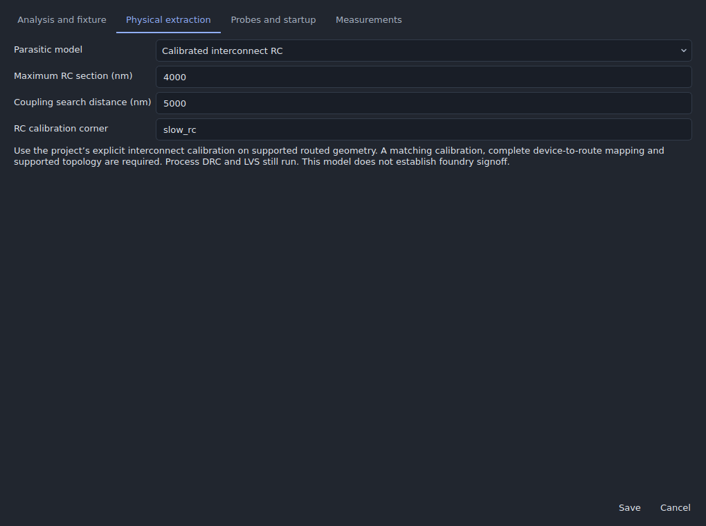
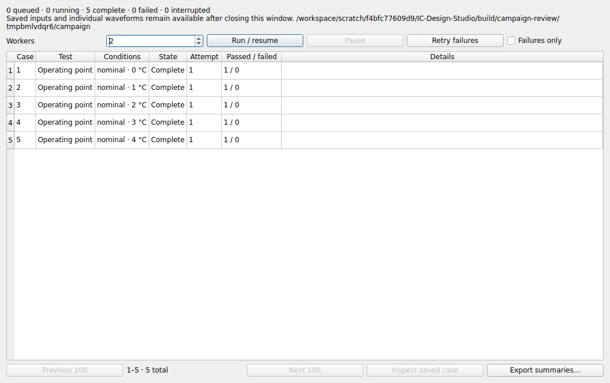
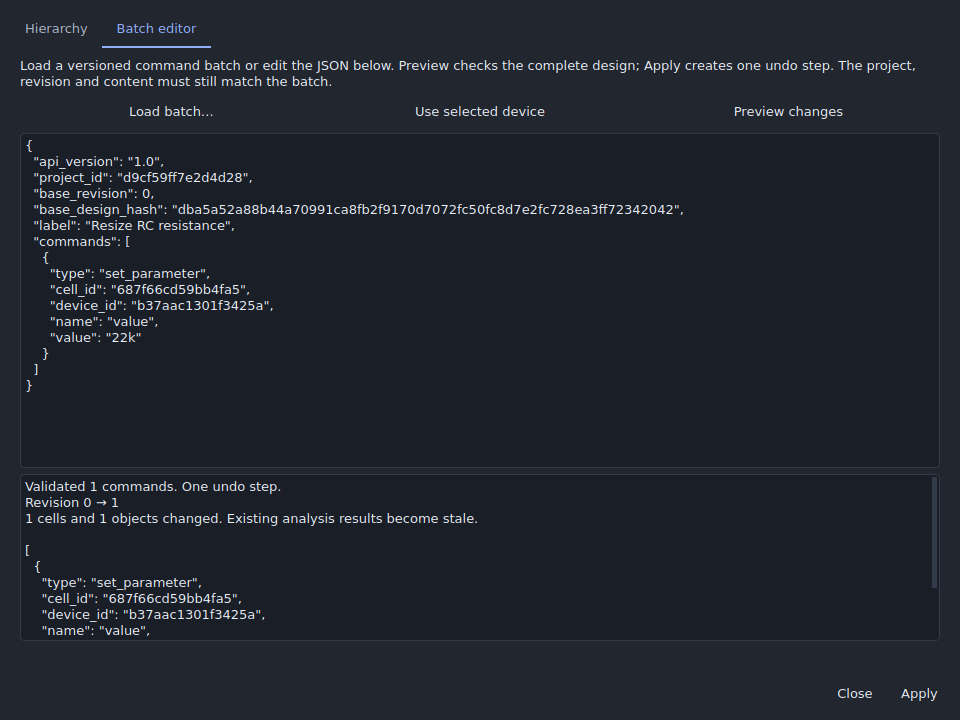

# Integrated analog design and verification

This development update connects saved physical extraction, explicit process
device semantics, constrained layout updates, durable verification campaigns,
and transactional desktop/script editing. Qualification belongs to the exact
source commit: earlier dev24 packages do not contain or qualify these changes.

## Saved extraction models

Open **Analysis → Analog design workspace → Verification runs**. Choose a saved
testbench and **Edit fixture / extraction…**, then select **Physical extraction**.
The extraction choice travels with the fixture, undo history and saved project.
Changing it invalidates results for the previous design identity.



| Model | Behavior and requirements |
|---|---|
| Process capacitance | Existing Magic capacitance profile using the locked process deck. Distributed wire resistance is omitted. |
| Process distributed RC | Runs the explicit Magic resistance/capacitance profile. Missing resistance or unsupported output fails the extraction stage; there is no silent fallback. |
| Calibrated interconnect RC | Uses the project's checked coupon calibration on supported flat Manhattan geometry. Section size, coupling search distance and an optional separate RC corner are saved with the testbench. |

The process flow retains preflight, schematic simulation, DRC, LVS extraction,
LVS comparison and post-layout simulation. A final integrity stage verifies
recorded inputs, generated files, process assets and executables. A late integrity
failure makes the overall result fail even when earlier numerical stages passed.
Saved measurement comparisons retain failures, missing values, units and deltas.

The calibrated mode requires complete terminal/port mapping and connected
geometry. External ports on route interiors split the resistor network correctly.
It rejects unsupported hierarchy, changed calibrations and stale/tampered
networks. Coupling is bounded by the selected search distance; pad/via resistance
idealization and the calibration's own limits remain visible. Temperature does
not invent new interconnect coefficients. Select an explicit calibrated corner
when a different interconnect condition is needed.

Use **Compare schematic and post-layout** in a saved test plan to apply these
choices across its model corners, temperatures and supplies. Every process case
still needs the matching Magic, Netgen and ngspice tools and process decks.
Synthetic calibration checks do not qualify a foundry process.

## Process devices and sizing

The shared MOS contract checks four-terminal model bindings, parameter units,
locked model definitions, fingers and parallel multiplicity. It supports standard
SKY130 1.8 V NFET/PFET and GF180 3.3 V NFET/PFET model adapters. Unrecognized model
internals or transformations remain unsupported rather than being inferred.

SKY130's ordinary symbols use total W across fingers; its supported `*_nf` symbols
use W per finger. GF180 model W/L are in metres, while the supported SKY130 model
interface uses micrometres. Netlisting, characterization and supported physical
generation now resolve those differences through the same contract.

In **Device characterization library → Size and transfer**, **Symbol W** is the
parameter transferred to the circuit. **Aggregate W** includes fingers and
parallel copies and is used for current-density normalization. Measurements and
cache provenance preserve this convention. Supported process operating-point
vectors also work through repeated schematic hierarchy.

Electrical characterization accepts supported integer fingers/multiplicity up to
64. Physical recipe limits remain stricter: the SKY130 generator accepts 1–8
fingers and multiplicity one, including equivalent total-W/per-finger symbols.
GF180 physical generation retains its bounded recipe and rejects incompatible
unit mappings. This update does not introduce arbitrary active dummy devices or
qualify new process geometries by assertion.

## Layout constraints survive changes

Schematic-driven layout preserves constrained device centers before retargeting
attached routes. It checks affected cells and their physical ancestors. By
default, existing findings may remain or improve, but a change cannot add or
worsen them. **Require all analog and route constraints to pass** enables strict
review. Preview application rechecks the exact candidate and original revision.

New matched-route records check centerline length, width, via parity, connected
geometry and endpoints; **Match each layer** also checks length per layer.
Shield records check reference-net connectivity, coverage, signal separation and
the saved maximum gap. Findings include affected geometry, measured errors and
remediation. Older length-only records retain their original meaning.

These checks preserve declared layout intent. Electrical matching still needs
extracted verification. Existing generic poly dummy patterns and guard geometry
retain their teaching-model status.

## Durable campaigns

Saved plans support up to 10,000 expanded cases. Ordinary interactive runs remain
bounded to 200 jobs. Choose **Create campaign…** in the test-plan workspace for
larger plans. Cases and attempt results are stored separately; the desktop pages
through summaries and loads a selected waveform only when inspected.



Campaigns capture each input and its conditions, seeds, source identity, engine
identity and locked PDK assets. Assets are copied once per campaign. Workers
recheck identities before running and before publishing a result. Input/result
modification is rejected. Failed requirements remain failures even if the
simulator exits successfully.

Workers claim cases transactionally and renew leases. An expired attempt may be
retried, but its old worker cannot overwrite the new attempt. Pause, resume and
retry retain previous evidence. Source changes require a new campaign.

```sh
python main.py --cli campaign create design.icproj --plan "PVT verification" --output runs/pvt
python main.py --cli campaign run runs/pvt --workers 4 --trust-project
python main.py --cli campaign status runs/pvt
python main.py --cli campaign pause runs/pvt
python main.py --cli campaign resume runs/pvt
python main.py --cli campaign export runs/pvt --output runs/pvt-summary.csv
```

The runner supports 1–16 local workers. Trusted workers on another host can use
the same campaign only with matching source/tools, identical mounted paths and a
filesystem whose locking/durability has been qualified. This is an explicit
shared-filesystem worker protocol, not an internet job service. The local lock
probe does not establish NFS, cloud-sync or cross-host filesystem correctness.
Every run requires `--trust-project`: captured projects can invoke executable
HDL/tool scripts. Keep them within the same trusted workflow as existing tool runs.

## Hierarchy and design automation

Open **Tools → Hierarchy and design automation…** (`Ctrl+Shift+H`). Inspect stable
instance paths, descend with Enter, return with Alt+Up and open the selected master
in schematic or layout. Compatible schematic cell substitutions preserve the
instance identity and require matching ordered ports and parameter interfaces.
Linked physical substitutions require explicit reconciliation and are rejected
by this bounded operation.

Preview a versioned command batch, inspect its changes and apply it as one undoable
transaction. Batches carry project, revision and design-hash guards. Rejected
commands leave both the document and undo history unchanged. Edits to shared
masters affect all occurrences. Routing constraints also apply to scripted edits.



```python
from icstudio.design_automation import envelope, commit_batch

batch = envelope(history.project, [{
    "type": "set_parameter", "cell_id": cell_id, "device_id": device_id,
    "name": "w", "value": "2u", "namespace": "intrinsic"
}], "Resize selected transistor")
report = commit_batch(history, batch)
```

```sh
python main.py --cli automation inspect design.icproj
python main.py --cli automation apply design.icproj --batch changes.json --preview
python main.py --cli automation apply design.icproj --batch changes.json --output edited.icproj
```

The stdin JSON-RPC methods `automation.capabilities`, `automation.inspect`,
`automation.preview` and `automation.apply` use the same implementation.
`automation capabilities` lists the supported commands and namespaces. The API
does not evaluate arbitrary Python supplied in a batch.

## Reproduction and evidence

The [local validation record](validation/analog-closure.json) identifies the tested
source, completed checks and unavailable external qualifications. The actual
[ngspice regression log](validation/analog-closure-real-ngspice.txt) is retained.
The desktop was inspected in [light appearance](images/analog-closure/verification-light.png)
as well as the dark screenshots above.

Core regressions cover numerical RC/coupling transfer, changed/stale evidence,
device units and emitted dimensions, constraint-preserving ECO, campaign worker
leases/recovery and atomic design commands. Real ngspice tests additionally check
saved-bench RC comparisons and process-model current/density scaling.

```sh
python -m unittest discover -s tests -v
QT_QPA_PLATFORM=offscreen python tests/gui_analog_closure.py --out build/analog-closure
QT_QPA_PLATFORM=offscreen python tests/gui_design_automation.py --output build/design-automation
QT_QPA_PLATFORM=offscreen python tests/gui_campaigns.py -v
QT_QPA_PLATFORM=offscreen python scripts/benchmark_design_automation.py --output build/design-automation-benchmark.json
python scripts/check_release.py
```

Set `ICSTUDIO_TEST_NGSPICE` to a working executable to run the actual-engine
regressions. The lifecycle benchmark separately measures edit, undo/redo,
offscreen canvases, save/reopen and recovery and verifies restored content.
It does not infer physical-display or full Studio refresh performance from those
measurements. Consumer acceptance and process/fabrication qualification retain
their separate gates.

The [recorded lifecycle measurements](validation/analog-closure-benchmark.json)
contain three samples per workload, including a saved amplifier and a synthetic
500-device, 10,000-shape design. Their median complete lifecycles were 193 ms and
1.90 s on this build host. These numbers describe the stated workload and host;
they are not a general desktop latency guarantee.
