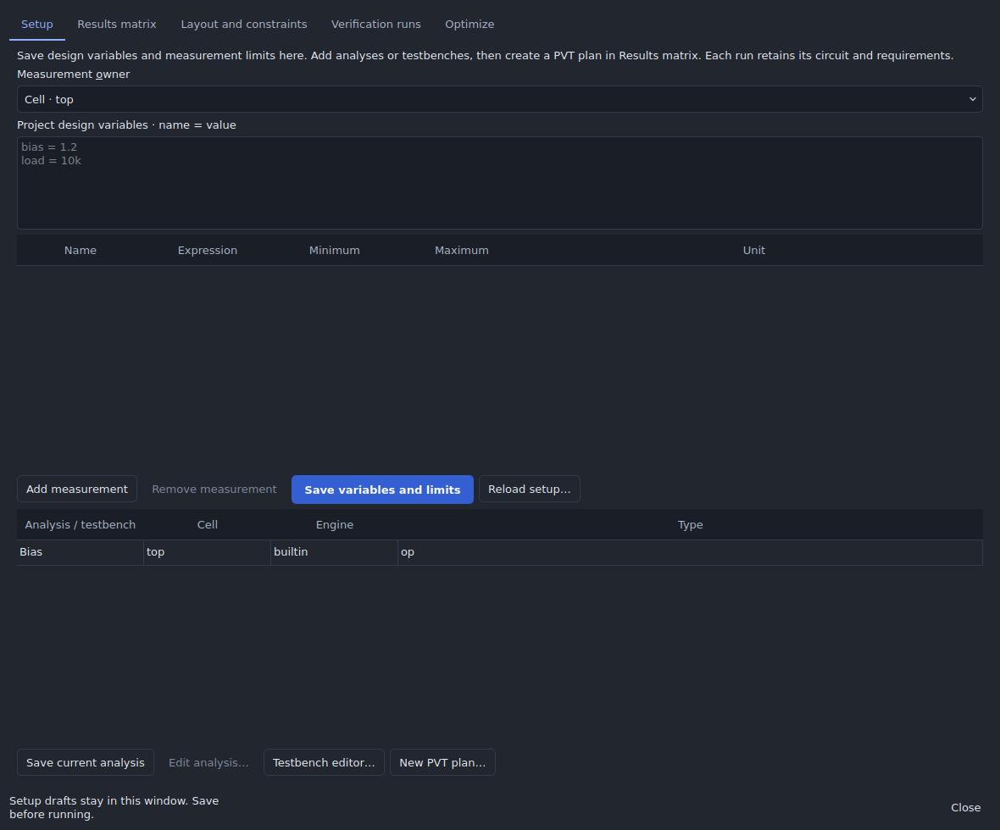
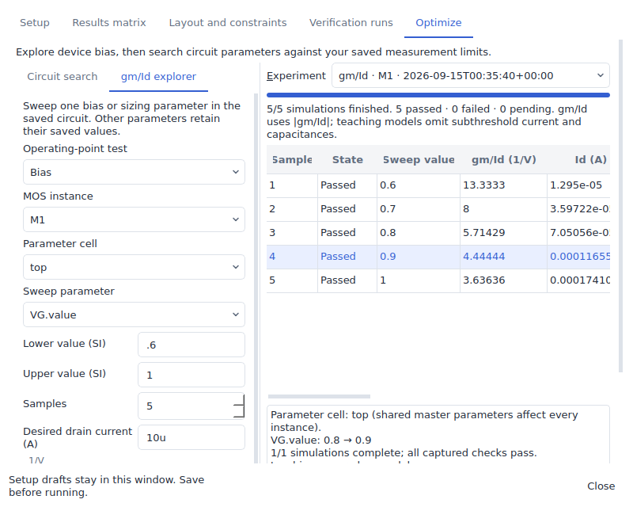
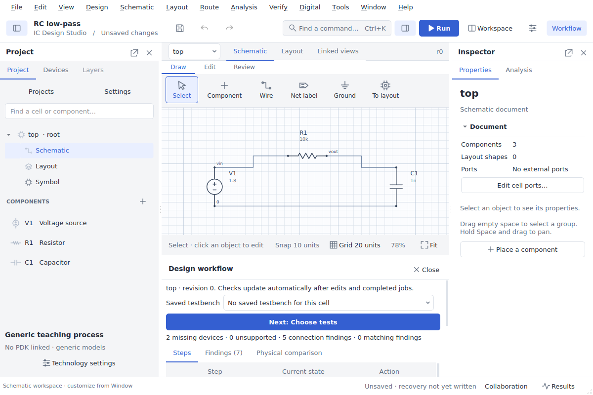
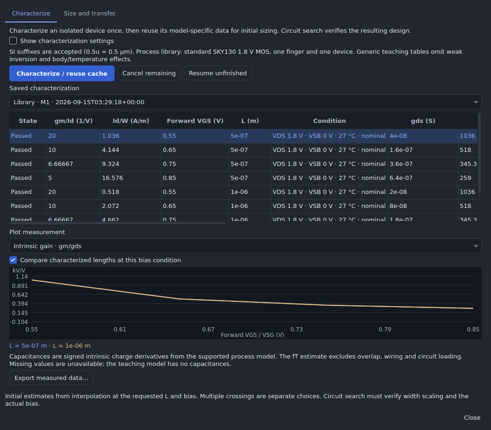

# Analog workspace GUI audit

Audited 2026-09-15 against Apple's Human Interface Guidelines. Scope: Setup,
Results matrix, Layout and constraints, Verification runs, the new Optimize tab,
the guided setup, characterization library, and the saved-run inspector. The existing desktop is Qt on Windows/Linux; Apple
guidance is used as a design review framework, not as a claim of native macOS
implementation or Apple certification.

**Assessment:** the main workflows now have clear actions, explicit result states,
reversible edits, and reachable controls at the tested sizes. The issues below
were fixed and checked in the running application. Full macOS assistive-technology
support and custom-canvas accessibility remain open validation work.

## Findings and changes

| Area | Finding before this change | Implemented change | Evidence / limit |
| --- | --- | --- | --- |
| Visual hierarchy | Dense rows gave save/run and auxiliary actions equal emphasis. | Primary styling for save/run, separate search configuration and candidate review, descriptive section labels. | Actual light/dark screenshots; primary action text contrast 5.67:1. |
| Window adaptation | Long horizontal action rows could force large widths; tables sized columns to arbitrarily long content. | Wrapping action layouts, scrollable pages, adjustable splitter, user-resizable table columns, bounded minimum window size. | All five tabs checked at 800×640 and 1180×980. Long data tables intentionally scroll horizontally. |
| Task feedback | Multi-job plans lacked a dedicated progress indicator and local cancellation. | Determinate progress bars, completed/total counts, explicit pass/fail/pending states, Cancel remaining and resume/retry controls. | Real queued cancellation, restart, and completion of six PVT jobs. No simulated progress animation. |
| Selection and errors | Several buttons stayed enabled without a usable selection. | Disable selection-dependent actions; keep validation errors beside their task; show candidate failures and changed-design state. | GUI assertions for empty, ready, running, completed, and stale states. Backend validation also enforces the gates. |
| Keyboard access | Some saved evidence depended on mouse double-clicks; unlabeled selectors lacked visible associations. | Label buddies, accessible names, ordinary Qt table navigation, keyboard activation, Save shortcut and Ctrl/Command+Return to run an optimizer task. | Qt accessibility interfaces and keyboard action tests. This is not a VoiceOver test. |
| Accidental loss | Reload silently discarded Setup drafts; runs could ignore unsaved edits. | Explicit discard/cancel UI when reloading dirty Setup; retain drafts when closing/reopening the window; block running/applying with unsaved Setup edits. | Draft retention and rejection tested. Project edits continue through undo/history. |
| Review and reversibility | Optimizer decisions previously had no integrated review flow. | Current → proposed parameter review, saved condition selector, circuit/waveform inspection, explicit Apply, undo and stale-input protection. | Real worker-to-review-to-apply-to-undo acceptance. No automatic application of a sweep estimate. |
| Color and appearance | Existing pass/fail text colors were too weak on a light background. | Higher-contrast pass/fail colors, textual statuses in every result, theme-aware gm/Id and inspector canvases. | Calculated standard text/status contrast ratios below. Both appearances visually checked; no status depends on color alone. |
| Numerical/chart accessibility | A plot alone would hide exact values from keyboard and assistive-technology users. | A named Qt table, read-only detail text, full-precision CSV, and saved-run inspection accompany the gm/Id plot. | Data remains available without mouse interaction with the custom plot. General schematic/canvas semantics need further work. |

## Measured contrast

Ratios use sRGB relative luminance for the configured foreground/background
colors. They are a check of these specific tokens, not a certification of every
pixel, selection, disabled state, or external operating-system theme.

| Text against panel background | Light | Dark |
| --- | ---: | ---: |
| Main text | 14.42:1 | 12.92:1 |
| Secondary text | 5.33:1 | 7.41:1 |
| Pass status | 5.61:1 | 7.78:1 |
| Fail/error status | 5.95:1 | 7.13:1 |

White text on the primary action background is 5.67:1. Disabled controls remain
visually distinct and programmatically disabled; their contrast was not used to
claim readable enabled controls.

## Desktop evidence

The acceptance script creates reproducible screenshots, retained simulation jobs,
CSV output, and `acceptance.json` under its specified output directory. It verifies
all five tabs at compact and normal sizes, enlarges interface text to 18 px, and
checks that action buttons fit their content area. Scrolling remains available
when all content cannot fit the viewport. Screenshots were visually inspected
after fixing clipped progress text, overly compressed search configuration,
crowded action rows, and table-header sizing.

## Remaining validation and improvements

- Run the workflow on physical Windows/Linux displays and a macOS build if one is
  supported. Check platform menu shortcuts, high-DPI rendering, focus rings,
  VoiceOver, and Full Keyboard Access with the actual platform integrations.
- The Qt controls expose names and roles. The custom schematic, layout and plot
  canvases do not yet expose every graphical primitive as semantic accessibility
  elements. Tables and textual evidence provide alternatives for these audited
  tasks; they do not make the whole editor fully accessible.
- Enlarged control text and scrolling were tested. Automatic adoption of macOS
  Dynamic Type and scaling of every custom canvas annotation were not verified.
- Conduct user testing with analog designers on larger real-world circuits. The
  audit checks concrete usability and accessibility behavior, not discoverability
  or efficiency for every expert workflow.

## Apple references

Consulted the official guidance and its indexed text on the audit date:

- [Human Interface Guidelines](https://developer.apple.com/design/human-interface-guidelines/)
- [Layout](https://developer.apple.com/design/human-interface-guidelines/layout)
- [Windows](https://developer.apple.com/design/human-interface-guidelines/windows)
- [Buttons](https://developer.apple.com/design/human-interface-guidelines/buttons)
- [Progress indicators](https://developer.apple.com/design/human-interface-guidelines/progress-indicators)
- [Keyboards](https://developer.apple.com/design/human-interface-guidelines/keyboards)
- [Accessibility](https://developer.apple.com/design/human-interface-guidelines/accessibility)
- [Color](https://developer.apple.com/design/human-interface-guidelines/color)
- [Alerts](https://developer.apple.com/design/human-interface-guidelines/alerts)

The application keeps its existing Qt design language and Windows/Linux behavior;
the changes apply Apple's principles of clarity, adaptation, feedback, user
control, and accessibility without introducing an imitation Apple-only shell.

## Follow-up: guided design, characterization and adaptive results

The follow-up desktop acceptance (`tests/gui_analog_experiments.py`) exercises
preview/invalidation/atomic creation, Pareto comparison, hidden-window adaptive
continuation, model-cache reuse, sizing transfer, failed-measurement navigation,
and schematic-linked sensitivity. Light/dark compact dialogs, control reachability
and native Qt accessibility names were checked. Screenshots were then inspected.

Changes made during this review:

- Hide unused bias rows once ports have assigned roles; keep advanced stimulus
  settings behind a disclosure and scroll to the generated proposal for review.
- Separate measured characterization from sizing/transfer in two named tabs.
  Place gm/Id and current density first in the table, with the bias condition
  visible alongside them.
- Give each objective its own results column. Put full expressions and exact
  values in the selected-candidate review and retain full-precision CSV output.
- Show failed-requirement controls only when relevant. Place sensitivity behind
  a disclosure so ordinary candidate review remains compact.
- Restore saved experiment settings explicitly and preserve undo for generated
  fixtures and candidate application. Sizing transfer only populates search fields.

These checks extend the earlier HIG review; the platform, custom-canvas and
assistive-technology limitations above still apply. No Apple certification or
unperformed native-platform accessibility testing is claimed.

## Navigation and optimizer follow-up

The navigation audit covers all top-level menus, editor view tabs, navigator and
inspector tabs, every grouped results page, Design workflow, and the analog
workspace's setup/search/characterization dialogs. Apple's guidance on
[modality](https://developer.apple.com/design/human-interface-guidelines/modality),
[windows](https://developer.apple.com/design/human-interface-guidelines/windows),
[toolbars](https://developer.apple.com/design/human-interface-guidelines/toolbars),
and [the menu bar](https://developer.apple.com/design/human-interface-guidelines/the-menu-bar)
informs the following placement and dismissal decisions.

| Finding | Resolution |
| --- | --- |
| Analog design appeared in Analysis, Layout and Verify. | Analysis is the single menu home. The command palette now uses the visible name Analysis instead of the old internal Simulate key. |
| Opening Design workflow compressed the canvas; its minimum size also affected Results. | Start hidden, remove automatic tabification with Results, use a compact scrollable panel and keep a labeled Close button outside the scroll area. |
| Reset reopened Design workflow, preventing an obvious return to the initial editor. | Reset restores the schematic arrangement with the workflow closed. Add View → Reset workspace and Ctrl/Command+Shift+0; retain the Window command. |
| Workflow entry points offered no obvious toggle. | The Workflow toolbar button shows and closes the panel. Escape closes the focused workflow. Window exposes its visibility toggle; Design contains its task entry. |
| Closing the analog workspace could leave auxiliary dialogs in view. | Close its child dialogs, retain setup drafts, and explain that running jobs continue. Cancel in guided setup is independent of setup validation. |
| Placement tools, physical verification and logs were mixed together. | Separate Layout, Verification and Job log categories; retain stable controller page identities and remembered page selection. |
| Simulation and engineering panels requested 480–500 pixels regardless of window height. | Bound their initial height relative to the current window; controls remain scrollable. |
| Digital appeared after Help and was absent from the shared command index. | Place Digital with task menus before Tools, keep Help last, and index Digital commands. |
| Open project folder was in Import. | Move it beside other project-opening commands in File. |
| Characterization data lacked gain/speed context and explicit dismissal. | Add named measurement selection, signed capacitance columns, length comparisons with a legend, full-precision CSV, model limitations, SPICE verification status and Close. |
| Faster search could hide unexecuted tests or blur prediction and evidence. | Label Screened out separately, count avoided runs, and permit Apply only after all required conditions pass. Predictions only propose future jobs. |

### Reviewed placement

| Surface | Contents and rationale |
| --- | --- |
| Editor tabs | Schematic, Layout, Linked views: representations of the same editable design. |
| Navigator | Project hierarchy, Devices library, Layers: selecting and finding design objects. Layers remains contextual to layout. |
| Inspector | Properties and Analysis: settings for the current selection/cell. |
| Analysis | Analog workspace, simulation setup, specifications, testbenches, variation/characterization, program analyses: planning and running electrical experiments. |
| Waveforms | Saved waveforms and study plots: inspecting electrical results. |
| Layout | Placement and rules: constructing physical geometry and managing constraints. |
| Verification | Checks, physical workflow evidence, extracted comparisons: checking the design and its physical implementation. |
| Job log | Execution diagnostics, distinct from design-rule findings. |
| Analog workspace | Setup, results matrix, optimization, physical handoff and verification views remain together for continuity. Their presence does not create duplicate top-level analog launchers. |

### Acceptance and limits

`tests/gui_optimizer_refinement.py` records a complete navigation inventory and
screenshots. It checks each results page's category, compact/normal panel closing,
Escape and toolbar toggling, restoration of canvas space, named arrangements,
reset with retained drafts, staged execution using real worker processes, and
native Qt accessible names. With `ICSTUDIO_TEST_NGSPICE` set, it also executes the
SPICE sizing verification through the desktop queue. The new check is included
in the desktop CI workflow.

The numerical tests check eight axes without expanding the Cartesian product,
logarithmic/integer spacing, declared catalog finger counts, paired proposals,
batch budgets/replay, missing capacitance data, signed device vectors and
screening/verification gates. Real ngspice-46 checks cover standard SKY130 NMOS
and PMOS at two body biases, two temperatures and two corners, plus sizing
verification. The separate equal-budget benchmark is recorded in
[optimizer documentation](ANALOG_OPTIMIZER.md).

This is an implementation audit using Apple's guidance, not a claim that every
dialog in the application has undergone native platform accessibility testing.
Physical Windows/Linux displays, high DPI, macOS/VoiceOver if supported, and
semantic access to custom canvas elements remain the platform checks listed
above. Specialized import/export and digital setup dialogs retain their existing
flows; the new review covers their navigation locations rather than every field.
