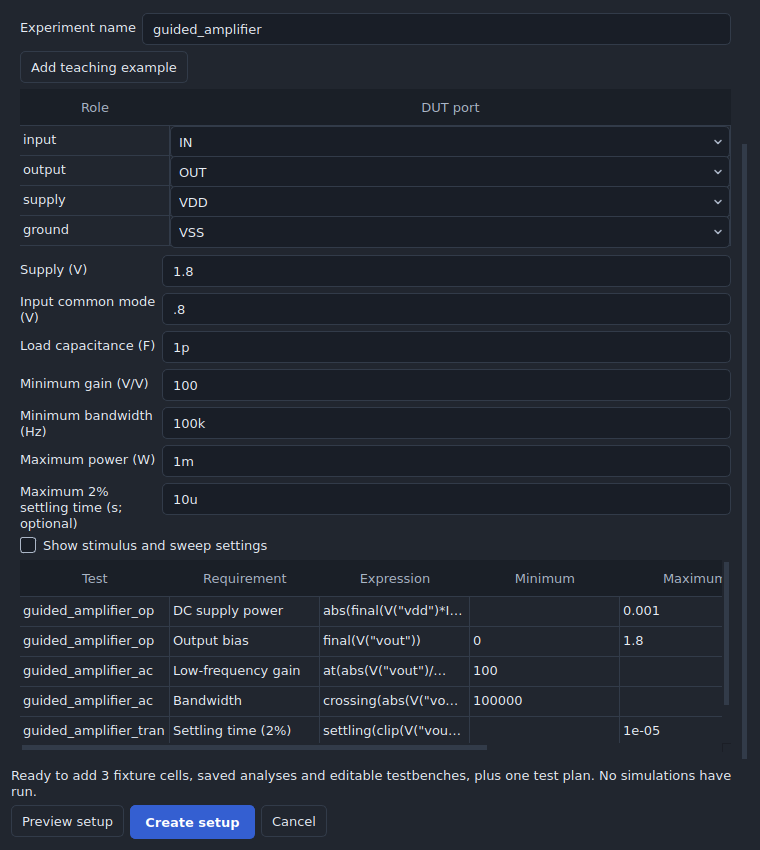
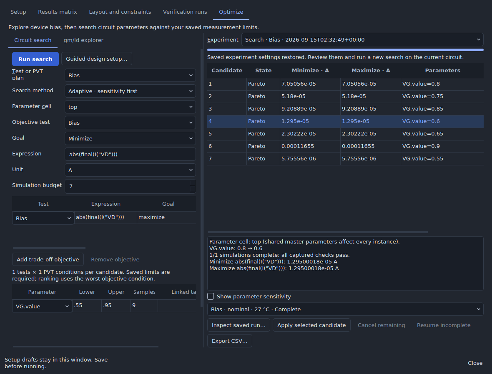
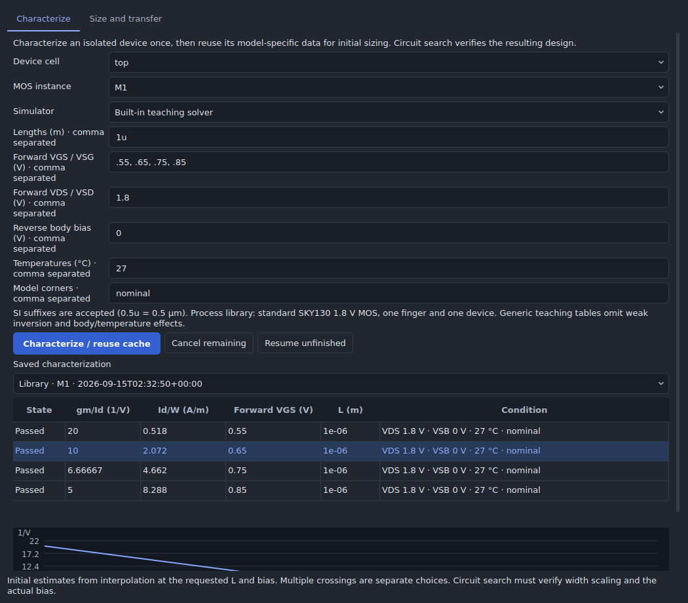
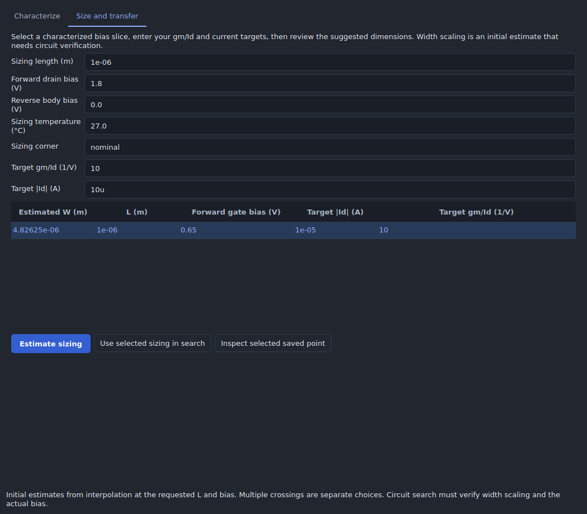

# Analog optimizer

Open **Analysis → Analog design workspace → Optimize**. This tool runs the
existing analog simulators and retains every candidate as a separate saved job.
No additional optimization package or new simulator is required.

## Guided starting point

Open **Setup → Guided design setup** (also available in Circuit search). Choose
an amplifier, differential pair or current mirror, then map the DUT's exposed
ports. **Add teaching example** supplies an editable generic DUT when starting
from an empty project. Enter explicit DC voltages for any unused bias ports.

Enter supply, load, gain, bandwidth and power goals; settling time is optional.
The current-mirror template uses reference current, ratio, tolerance and output
compliance instead. Additional stimulus and sweep settings sit behind a disclosure
control. **Preview setup** shows the actual requirements and expressions.
**Create setup** adds fixture cells, saved analyses, editable testbenches and a
PVT plan in one undoable operation. The fixtures reference the original DUT, so
subsequent sizing changes reach every test. No simulation runs until requested.
Native saved testbenches use ngspice and preserve the original root model scope.

## Circuit search

1. In **Setup**, save an analysis or testbench and its scalar measurement limits.
   For multiple tests or operating conditions, create a plan in **Results matrix**.
   Save all variable/limit drafts before running a search.
2. In **Optimize → Circuit search**, choose that analysis or analog PVT plan.
   Choose the cell containing the adjustable parameters. Editing a shared cell
   master changes every instance of that master; this is stated in candidate review.
3. Select the objective test, a scalar expression, its unit, and **Minimize**,
   **Maximize**, or **Target**. Existing saved limits remain hard constraints.
   For example, maximize `final(V("vout"))`, with `V` as the unit. Use the waveform
   calculator's supported scalar functions for gain, delay, settling, and other
   measurements appropriate to the chosen analysis.
4. Add one to eight parameter axes. Each has lower/upper bounds and a sample
   count. SI prefixes such as `2u`, `10k`, and `100n` are supported. Project
   variables use `@name`; instance fields use existing names such as
   `M1.params.w`, `R1.value`, or a native device parameter. Choose **Linear**,
   **Logarithmic** (positive bounds), or **Integer** spacing. Integer samples are
   deduplicated; finger counts/multiplicities and their links must remain positive
   integers. Declared editable catalog fields such as `M1.model_params.nf` are
   available alongside native fields. Derived catalog expressions remain live.
5. Optional matching/ratio links share an axis: in **Linked target = ratio**,
   enter `M2.params.w = 1` for equal widths, or `M2.params.w = 2` for twice the
   swept width. Separate multiple links with commas. Every target may occur only
   once. Links are numerical relationships in this search, not persistent layout
   matching constraints.
6. Optionally enable **Add gm/Id and bias limits**, choose an operating-point test
   and MOS instance, and enter minimum/maximum gm/Id and/or minimum bias margin.
   Missing required device values fail the candidate.
7. Choose **Adaptive · sensitivity first**, **Constrained Bayesian · trade-offs**, **Gaussian process · experimental**,
   or **Exhaustive grid**, a simulation budget, and **Run search**. Every passing
   candidate must complete every test and PVT condition. The total must fit the
   budget, with an absolute maximum of 500 jobs. Overlapping plan, supply, or corner overrides are rejected instead
   of silently cancelling a search parameter.

Use **Add trade-off objective** to add up to two further objectives, possibly
from other tests in the plan. Results show each objective separately, with its
unit and direction; the exact expressions remain in the review text and CSV.
A **Pareto** candidate passes every constraint and has no other passing tested
candidate that is at least as good in every objective and better in one. There
is no single automatically preferred candidate for a multi-objective experiment.

Adaptive mode begins at the nearest allowed saved/seeded parameter values and
runs independent neighboring probes. **Show parameter sensitivity** reports
local finite differences of worst-condition metrics, scaled over the requested
parameter range. Linked parameters move together, and the worst PVT condition
can change, so these are local trends rather than causal explanations.

Further adaptive candidates use deterministic bounded pattern search around
measured promising/Pareto points, including paired parameter moves, with global
grid coverage when local proposals are exhausted. Samples define discrete
parameter resolution. Adaptive pattern search does not guarantee a global optimum. The simulation
budget includes all test/PVT jobs for the initial probes and later candidates;
manual retries are additional executions of existing conditions.

**Candidates per adaptive batch** accepts 1–8. Independent candidates can use the
existing parallel job queue; each next batch waits for the preceding batch's
required evidence. All proposals are persisted before execution. A changed engine
environment stops continuation instead of mixing incomparable evidence.

**Screen operating points before expensive tests** runs all saved OP conditions
first. Candidates that fail these checks are **Screened out**; their remaining
analyses are never queued or represented as simulated. Accepted candidates still
complete all required tests and PVT conditions before they can pass or apply.
The progress display counts executed jobs separately from avoided jobs. The
budget conservatively reserves the full plan per candidate; screening savings
are not used to silently increase the number of candidates. Cancel and restart
pause deferred stages until explicit resume.

The optional Gaussian-process backend learns from measured candidates. It uses
a fixed RBF kernel, rotating normalized objective weights, expected improvement,
and an approximate feasibility surrogate. Training is bounded to 64 observations
and proposals to 256 per step. It has no additional package dependency. Predicted
values guide search only; they never appear as verified measurements or yield
probabilities. This option remains experimental and adaptive remains the default.

An equal-budget ngspice-46 benchmark used 24 simulations per method and circuit:

| Circuit / measured goal | Adaptive | Gaussian process |
| --- | ---: | ---: |
| Divider: minimum supply current within output limits | 9.00 µA | 83.11 µA |
| MOS: absolute error from a 20 µA current target | 3.65 µA | 0.225 µA |

These two small deterministic examples show different strengths, not a general
advantage. Reproduce with `scripts/benchmark_analog_search.py --executable /path/to/ngspice --out benchmark.json`.

Adaptive batches are checkpointed before enqueueing and continue while the
workspace is hidden. Cancel pauses further proposals. After application restart,
an incomplete experiment stays paused until **Resume incomplete**. Saved
settings can be restored with **Reuse experiment settings** for a new run on the
current design. Engine changes reject replay of old unfinished jobs.

Ranking uses the worst objective condition: maximum value when minimizing,
minimum value when maximizing, or maximum absolute error when targeting a value.
A candidate passes only after every associated job completes, its objective is
valid, and all saved limits, testbench measurements, and enabled device limits
pass. Failed, missing, cancelled, and interrupted work remains visible.

Select a candidate to review current/proposed parameters and failure details.
Use **Show failed requirement** to open its exact saved waveform and referenced
net/devices, or choose a saved condition and **Inspect saved run** to see its original circuit,
waveforms, and diagnostics. **Apply selected candidate** becomes available after
the search finishes and the selected candidate passes. Applying checks the
original design identity again and uses the normal undo history. A changed
circuit or unsaved Setup draft blocks application. Undo creates a new revision,
so a new search is required before applying historical candidates again.

**Cancel remaining** stops this experiment's queued/running jobs. **Resume
incomplete** retries missing, interrupted, cancelled, or engine-failed jobs using
their captured inputs. Completed candidates with failed performance limits are
retained rather than rerun unchanged. Experiments and results reload from the
existing local job store. **Export CSV** includes numerical values at full stored
precision, parameters, failures, and the experiment/base design identities.

## gm/Id explorer

Save an **operating-point** analysis first. In **gm/Id explorer**, choose that
analysis, a MOS instance, a parameter cell, and one parameter to sweep. Usually
this is a gate-bias source, but it may also be width, length, or a project variable.
Other parameters and the saved corner/temperature remain fixed. Run 2–100 points.
For a testbench circuit, save an operating-point analysis of its bench cell.
The separate saved-testbench flow currently captures selected probes without
the primitive MOS vector contract, so it is not offered as a gm/Id source.

The table and plot use captured `abs(gm / Id)`, in 1/V. Signed drain current,
gm, VGS, VDS, and `abs(VDS) - abs(VDSAT)` bias margin are shown when available.
Negligible/zero current, missing vectors, and simulation failures remain explicit;
the curve leaves gaps instead of interpolating across missing samples. These are
in-circuit operating points: changing gate bias can also change drain/body bias.

For teaching primitive MOS devices, the explorer also resolves each selected
hierarchy instance's actual W/L, including instance parameter overrides, and
calculates `abs(Id) / W`. Enter a desired drain current and select a point to
estimate `W = desired current / current density`. This is an initial estimate at
the captured length and bias. It does not change the design; validate proposed
widths with Circuit search before applying them.

Native/process MOS readouts use the existing explicit model-vector mapping.
gm/Id does not require a width convention. The explorer deliberately leaves
width-normalized density/sizing unavailable for native or catalog-bound devices,
where model units, fingers, multiplicity, and internal subcircuit paths can differ.
Their explicit numeric sizing parameters can still be swept in Circuit search.

## Isolated-device characterization library

Open **Optimize → gm/Id explorer → Device characterization library**. Choose an
existing MOS device, comma-separated lengths, forward gate/drain biases, reverse
body biases, temperatures and deterministic corners. **Characterize / reuse
cache** either runs the isolated fixtures or reuses an exact matching cache.
The **Size and transfer** tab accepts a gm/Id and absolute drain-current target
and displays estimated W, L and forward gate bias. Select an estimate to populate
an adaptive search's sizing ranges and initial seed; it does not edit the circuit.
Set the appropriate circuit bias in the editable fixture and verify the search.

The process adapter supports the pinned standard SKY130 `nfet_01v8`/`pfet_01v8`
models with direct W/L emission, `nf=1`, and `m=mult=1`. It validates the model's
micrometre parameter scale, four terminals, locked definition checksum and exact
internal MOS path. Other native/catalog models remain usable in the in-circuit
explorer when they expose gm/Id, but do not receive invented width conventions.
The isolated process fixture uses the installed locked PDK model environment;
native DUT-specific model overrides must be verified in the actual circuit.

Library dimensions are metres, amperes, siemens and volts. Forward VGS/VDS mean
VSG/VSD for PMOS; positive VSB denotes reverse body bias for either polarity.
Density is `abs(Id)/total_drawn_W` in A/m. The generic teaching library supports
only zero body bias, 27 °C and nominal corner, with its square-law limitations.

Each experiment is bounded to 500 simulations. Tables retain signed Id/gm,
absolute gm/Id, density, bias, captured headroom, gds, intrinsic gain, available
intrinsic capacitances, sample status and source run
fingerprints. Cache identity includes the model/geometry contract, locked model
assets, grid and engine/workflow identity. Invalid samples remain explicit.
Multilinear interpolation requires complete enclosing samples and forbids
extrapolation or crossing missing data. Inverse gm/Id lookup exposes multiple
bias crossings as separate choices. Width scaling is an initial estimate,
especially when narrow-width effects change the model behavior.

Choose **Plot measurement** to inspect current density, gm/Id, gds, intrinsic
gain (`abs(gm)/gds`), intrinsic Cgg, or the intrinsic speed estimate
`abs(gm)/(2πCgg)`. **Compare characterized lengths** overlays the same bias slice
for each measured L. Exact values and source identities are available through
**Export measured data**. Missing neighboring capacitances remain unavailable
during interpolation; derived gain/speed metrics use interpolated raw vectors.

The SKY130 adapter captures signed Cgg/Cgs/Cgd/Cgb charge derivatives. The speed
estimate excludes overlap capacitance, wiring and circuit loading and is not
circuit bandwidth. The teaching solver supplies gds from its actual current
model but does not invent device capacitances. Zero/nonpositive gds or Cgg does
not produce infinite gain or speed.

**Size and transfer → Verify selected sizing with SPICE** creates a separate saved
ngspice job with the proposed W/L and bias. Both |Id| and gm/Id must be within 5%
of their targets for **Verified**; otherwise the errors are displayed as
**Outside tolerance**. Engine identity and circuit snapshot must match the saved
job. This checks isolated width scaling; circuit search must still verify the
actual DUT bias, performance requirements, and full PVT plan.

## Model and release boundaries

- The bundled teaching solver works without an external installation. Its
  square-law MOS model omits subthreshold current, body effect, and device
  capacitances. It cannot support meaningful weak-inversion, gm/C, fT, or
  transistor temperature analysis. MOS temperature sweeps require ngspice and
  suitable models; failures remain visible.
- Process simulation uses the existing ngspice setup and model assets. The tool
  does not generate PDK curves from generic equations or invent hidden device
  vectors. Existing engine identity checks govern resumed jobs.
- Searches are bounded and reproducible. Advanced studies support explicit
  statistical verification and captured ngspice noise contributors, with the
  model and sampling limits below. No missing capacitance/noise values are
  invented, and sampled pass fractions are not a manufacturing-yield guarantee.
- Optimization accepts analog schematic analyses/testbenches and PVT plans.
  After applying a candidate, use **Layout and constraints** and **Verification
  runs** to update layout and validate extracted performance. An optimizer pass
  does not establish extracted or foundry-qualified performance.

The SPICE-generated lookup approach is described in
[Jespers and Murmann's gm/Id design resources](https://github.com/bmurmann/Book-on-gm-ID-design).
Device-vector availability follows the particular model and simulator; see the
[ngspice manual](https://ngspice.sourceforge.io/docs/ngspice-manual.pdf).

## Validation

`tests/test_analog_optimizer.py` exercises numerical NMOS/PMOS gm/Id, current
density, hierarchy overrides, ratio links, PVT budgeting, worst-condition ranking,
constraint evaluation, stale/mismatched evidence, and restart behavior. A real
ngspice test runs when `ICSTUDIO_TEST_NGSPICE` is configured.

`tests/gui_analog_optimizer.py --out build/analog-optimizer-evidence` runs real Qt
worker jobs and checks cancel/resume, apply/undo, saved-run inspection, gm/Id
readouts, CSV export, accessibility metadata, keyboard activation, and compact /
enlarged-text layouts in both appearances. See the
[Apple HIG audit](ANALOG_GUI_AUDIT.md) for its scope and remaining limitations.

`tests/test_analog_experiments.py` covers generated fixtures, native model scope,
adaptive sensitivity/budgets, Pareto constraints, cache identity, interpolation,
missing samples and sizing. Real ngspice/SKY130 tests cover both polarities,
body bias, temperature, corners and native saved testbenches when
`ICSTUDIO_TEST_NGSPICE` is set. `tests/gui_analog_experiments.py` exercises the
new flows through actual Qt widgets and worker jobs, including hidden-window
continuation, cache reuse and saved requirement/sensitivity navigation.

## Advanced analyses

Open **Analysis → Analog design workspace → Optimize → Circuit search →
Advanced analyses…**. Choose a category and use **Run selected study**. The
window uses Circuit search's selected saved plan, parameter cell, axes,
objectives and simulation budget. Each category shows its own saved experiments.
**Show exact selected evidence** reveals full precision and source details;
**Inspect saved run** opens the original circuit/waveforms. **Export report**
writes portable JSON with conditions, measurements, assumptions and run/tool
identities. A report is also saved automatically with the experiment's job data.

This is a modeless window: **Close**, Escape, or **View → Reset workspace**
returns to the editor and preserves draft controls. Queued work continues when
hidden. **Pause** cancels queued/running jobs for that experiment and prevents
further proposals. **Resume** retries incomplete jobs. Restarted experiments
remain paused until explicitly resumed. None of the analysis actions edits the
schematic; only the explicit full-SPICE finalist Apply action changes parameters,
through the normal undo history.

### 1. Global sensitivity

**Morris** reports signed mean elementary effect, absolute mean effect (μ*),
standard deviation (σ), and a 95% bootstrap interval for μ*. A large σ can
indicate nonlinearity, interaction, or both. Effects are scaled over each
parameter's configured range and retain the objective's unit.

**Sobol** reports Jansen first-order and total-order estimates and bootstrap
intervals. The difference helps identify interactions. Sampling uses seeded
independent pick-freeze pairs on the configured discrete grids; this is not a
low-discrepancy Sobol-sequence sampler. Before duplicate reuse, R Morris
trajectories cost R(D+1) candidates and N Sobol base pairs cost N(D+2). Every
candidate runs the entire saved plan, and preparation rejects an excessive
budget before enqueueing. Results are conditional on those ranges, spacing and
independent grid-coordinate distributions; linked targets form one input.

Missing/invalid samples are not imputed or silently discarded. All sampled
objectives must exist before their index is reported. A flat output has undefined
Sobol indices. Finite-sample estimates outside [0,1] are shown without clipping;
wide intervals indicate that a larger study is needed. These are model
sensitivities, not causal attribution or proof of a global optimum.

### 2. Constrained Bayesian search

Choose **Constrained Bayesian · trade-offs** in the main search menu. Separate
Matérn 5/2 Gaussian processes fit each objective and up to six common, most
limiting normalized constraints. Length scales are fitted by bounded marginal
likelihood search. The proposal uses a Monte Carlo estimate of expected
hypervolume improvement, weighted by modeled feasibility. Before a feasible
design exists, it prioritizes reduced predicted constraint violation. Pending
parallel candidates receive a proximity penalty.

Training is bounded to 32 measured observations and the proposal pool to 96
untried coordinates, with 12 posterior draws per proposal. This keeps the
standard-library implementation practical and requires no ML runtime download.
It is an approximate constrained EHVI strategy, not qNEHVI or a claim of
state-of-the-art sample efficiency. The original adaptive and simpler GP modes
remain available.

Candidate review retains predicted means, uncertainty, fitted length scales and
modeled constraints. Predictions are exclusively proposal evidence. Every saved
requirement, including ones omitted from the surrogate, must pass measured
verification. Solver errors, missing measurements and engine-identity mismatches
are excluded from model training instead of being learned as physical failures.

### 3. Robustness and worst conditions

Add uncertain parameters or **Use search ranges**. Include `temperature` or
`supply` to vary operating conditions; supply requires an explicit supply target
for each plan entry. Varying temperature/supply replaces that dimension's saved
grid while retaining the other PVT dimensions. Plan/corner overrides that mask a
varied circuit parameter are rejected.

**Search worst conditions** starts with nominal and individual boundary probes,
then alternates local refinement around the worst measured normalized violation
with stratified global coverage. It finds adverse measured conditions within the
declared bounds; it does not certify the global worst case.

**User-declared tolerances** supports normal and uniform variations with absolute
or relative standard deviation. Relative `0.01` means 1%. Uniform half-width is
√3σ. Normal variables may share a Gaussian factor; the correlation of two rows
is the product of their factor loadings. Distinct factors are independent.
Invalid physical samples abort preparation with their values rather than being
clipped/resampled. Integer finger/multiplicity variables belong in an integer
circuit search, not a continuous tolerance distribution.

**Validated PDK statistical model** requires the existing PDK contract's
`validated`, `evidence` and explicit numeric `variations` mappings. Unsupported
foundry statistical decks are not guessed or converted automatically. Results
report pass/fail/unresolved trials and a Wilson 95% binomial interval only after
all trials return valid evidence. Declared component-tolerance pass fractions
are labeled separately from PDK statistical results; neither is universal yield.

Enable **Validate the selected passing Circuit search candidate** to build a
separate verification snapshot from that candidate. The report links to its
original experiment and parameter values. It does not optimize distribution
parameters or silently apply the candidate.

### 4. Electrical diagnostics

Choose a saved graphical analysis or a single-entry PVT plan for its cell.
Diagnostics retain the plan's conditions. The table shows captured quantities
directly; exact values and model limitations are available in selected evidence.

| Diagnostic | Captured evidence and assumptions |
| --- | --- |
| Noise contributors | ngspice `.noise` source vectors; output and input-referred RMS noise integrated over the sampled band. Device subtotals overlap component rows and must not be summed together. Integration uses trapezoidal squared amplitude density, so sweep resolution matters. |
| Poles and zeros | ngspice `.pz` for explicitly named input/output port pairs: real/imaginary parts in rad/s and magnitude in Hz, with RHP entries marked. Transfer-function cancellations and unobserved modes can hide internal instability. |
| Supply ramp and startup | Cross-product of entered supply ramp times and initial node voltages, plus saved PVT. The generated deck replaces one top-level supply with a PWL ramp and uses `.ic`/UIC. The last 20% of saved samples must remain within the output window. Final voltage, observed settling time and extrema are retained. |
| Loop gain and margins | AC data from a user-built injection fixture. Choose return/injection nets and polarity for characteristic `1 + T`. All sampled unity-gain and negative-real-axis crossings are reported with interpolated margins. No crossing means unavailable, not infinite margin. Multiple crossings/open-loop RHP poles require a Nyquist/fixture review. |
| Device bias | Per-device region when explicitly reported, gm/Id, and model VDSAT headroom across conditions. Missing regions stay unavailable; a negative headroom is labeled below model VDSAT. Saturation and weak/moderate/strong inversion are not interchangeable classifications. |

Noise, PZ, startup and loop diagnostics use ngspice; bias readouts also support
the teaching solver's explicitly reported regions. They operate on the current
snapshot, not an automatically generated valid loop-break fixture. The detailed
saved input deck is inspectable. Electrical diagnostics do not automatically
become new hard search constraints: save the corresponding scalar requirements
in the plan when they should gate ordinary candidate verification.

### 5. Coarse/full SPICE refinement

Select an ngspice plan with AC, noise or transient analysis. Configure a pool of
coarse candidates, a smaller number of full candidates (at least three), a
resolution factor and seed. Coarse runs reduce points per decade or increase
transient step. Circuit topology, device models, sizing, corners and analysis
limits remain the same. Every full candidate uses the original saved plan.

Three paired candidates initialize GP models of full-minus-coarse objective and
constraint scores. Promotions use corrected predictions and uncertainty, while
reports retain the coarse and full measurements in distinct rows. A failed or
unavailable cheap measurement never establishes passing performance. The budget
reserves `(coarse candidates + full candidates) × saved conditions` jobs.

Only **Apply full-SPICE finalist** can change the design, after the study finishes
and that candidate passes all full-resolution requirements and engine/snapshot
checks. Coarse predictions never satisfy verification. This implementation uses
two numerical SPICE fidelities; it does not claim reduced-model or extracted-RC
surrogates. Use the existing layout/ECO and extracted verification workflow after
applying a changed design. Changing sizing does not validate an old extraction.

### 6. Ordered verification and automation

In **Verification workflow**, load the selected plan's tests and assign every
test to exactly one named stage. **Use workflow in Circuit search** configures
the next search. The default suggestions are bias, frequency response,
transient, and final checks; empty stages are omitted. Plans can use different
names/order. Existing experiments retain their captured configuration.

All conditions in earlier stages must pass before a later stage is queued.
Physical performance failure screens out the candidate and counts later jobs
as avoided. Simulation/measurement errors block advancement. Zero, one or two
automatic retries repeat exact failed simulation inputs; performance failures
and cancellations are not automatically retried. The search budget reserves
retry capacity. A total worker-time limit sums parallel worker time and stops
remaining jobs when exhausted; a new search can use a larger budget.

Optional exact-result reuse checks the complete circuit, settings, executable,
workflow and model identities. It also verifies currently installed locked
model/OSDI assets, rejects nonfinite/mismatched results, and excludes results
whose inspection requires external raw artifacts. Reuse creates a new saved
result with a source-run reference and zero worker time. Reports include every
candidate, failure, skipped case, condition, fingerprint and tool identity.

`tests/test_analog_advanced.py` checks analytic Morris/Sobol examples, fitted GP
behavior, exact hypervolume, correlated variation, confidence intervals,
worst-condition refinement, stage gates, retry/time budgets, identity-safe reuse,
diagnostic calculations and full-resolution promotion. Real ngspice checks cover
RC noise, poles and startup when `ICSTUDIO_TEST_NGSPICE` is set.
`tests/gui_analog_advanced.py` runs actual Qt workers, exercises the categories,
cached stages, reports, closing/reset, and real SPICE refinement/application. It
is included in Windows/Linux desktop CI. Local offscreen checks do not replace
physical display, assistive-technology or large-circuit qualification.
