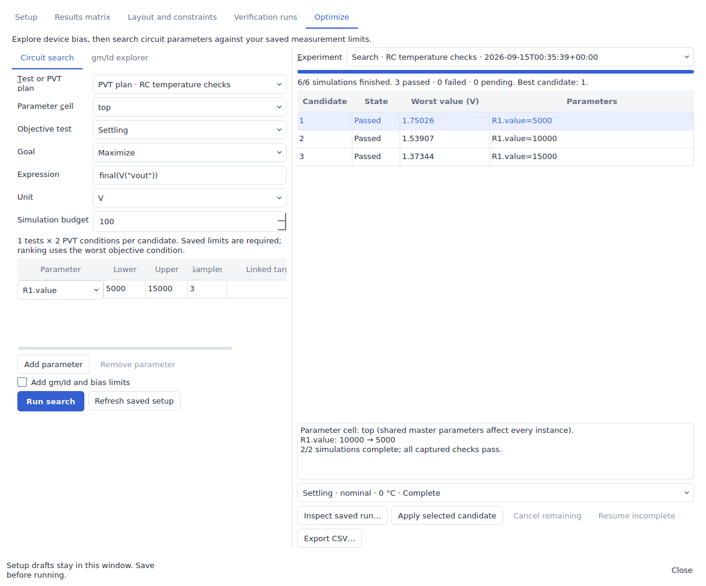
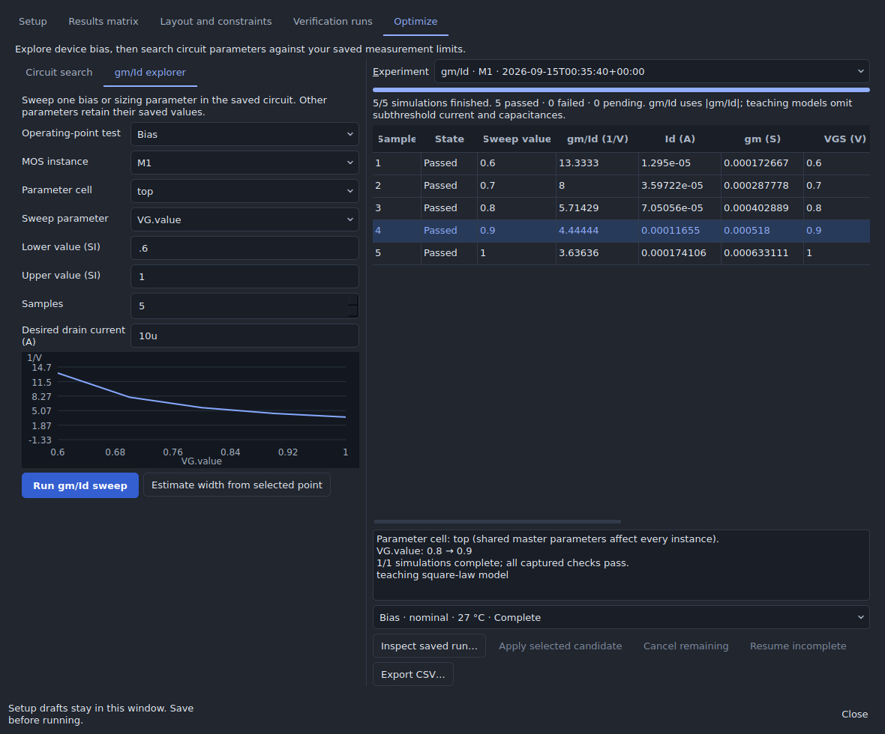

# Analog optimizer

Open **Simulate → Analog design workspace → Optimize**. This tool runs the
existing analog simulators and retains every candidate as a separate saved job.
No additional optimization package or new simulator is required.

## Circuit search

1. In **Setup**, save an analysis or testbench and its scalar measurement limits.
   For multiple tests or operating conditions, create a plan in **Results matrix**.
   Save all variable/limit drafts before running a search.
2. In **Optimize → Circuit search**, choose that analysis or analog PVT plan.
   Choose the cell containing the adjustable parameters. Editing a shared cell
   master changes every instance of that master; this is stated in candidate review.
3. Select the objective test, a scalar expression, its unit, and **Minimize**,
   **Maximize**, or **Target**. Existing saved limits remain hard constraints.
   For example, maximize `final(V("vout"))`, with `V` as the unit. Use the waveform
   calculator's supported scalar functions for gain, delay, settling, and other
   measurements appropriate to the chosen analysis.
4. Add one to three parameter axes. Each has lower/upper bounds and a sample
   count. SI prefixes such as `2u`, `10k`, and `100n` are supported. Project
   variables use `@name`; instance fields use existing names such as
   `M1.params.w`, `R1.value`, or a native device parameter.
5. Optional matching/ratio links share an axis: in **Linked target = ratio**,
   enter `M2.params.w = 1` for equal widths, or `M2.params.w = 2` for twice the
   swept width. Separate multiple links with commas. Every target may occur only
   once. Links are numerical relationships in this search, not persistent layout
   matching constraints.
6. Optionally enable **Add gm/Id and bias limits**, choose an operating-point test
   and MOS instance, and enter minimum/maximum gm/Id and/or minimum bias margin.
   Missing required device values fail the candidate.
7. Choose a simulation budget and **Run search**. Every grid candidate runs every
   test and PVT condition. The total must fit the budget, with an absolute maximum
   of 500 jobs. Overlapping plan, supply, or corner overrides are rejected instead
   of silently cancelling a search parameter.

Ranking uses the worst objective condition: maximum value when minimizing,
minimum value when maximizing, or maximum absolute error when targeting a value.
A candidate passes only after every associated job completes, its objective is
valid, and all saved limits, testbench measurements, and enabled device limits
pass. Failed, missing, cancelled, and interrupted work remains visible.

Select a candidate to review current/proposed parameters and failure details.
Choose a saved condition and **Inspect saved run** to see its original circuit,
waveforms, and diagnostics. **Apply selected candidate** becomes available after
the search finishes and the selected candidate passes. Applying checks the
original design identity again and uses the normal undo history. A changed
circuit or unsaved Setup draft blocks application. Undo creates a new revision,
so a new search is required before applying historical candidates again.

**Cancel remaining** stops this experiment's queued/running jobs. **Resume
incomplete** retries missing, interrupted, cancelled, or engine-failed jobs using
their captured inputs. Completed candidates with failed performance limits are
retained rather than rerun unchanged. Experiments and results reload from the
existing local job store. **Export CSV** includes numerical values at full stored
precision, parameters, failures, and the experiment/base design identities.

## gm/Id explorer

Save an **operating-point** analysis first. In **gm/Id explorer**, choose that
analysis, a MOS instance, a parameter cell, and one parameter to sweep. Usually
this is a gate-bias source, but it may also be width, length, or a project variable.
Other parameters and the saved corner/temperature remain fixed. Run 2–100 points.
For a testbench circuit, save an operating-point analysis of its bench cell.
The separate saved-testbench flow currently captures selected probes without
the primitive MOS vector contract, so it is not offered as a gm/Id source.

The table and plot use captured `abs(gm / Id)`, in 1/V. Signed drain current,
gm, VGS, VDS, and `abs(VDS) - abs(VDSAT)` bias margin are shown when available.
Negligible/zero current, missing vectors, and simulation failures remain explicit;
the curve leaves gaps instead of interpolating across missing samples. These are
in-circuit operating points: changing gate bias can also change drain/body bias.

For teaching primitive MOS devices, the explorer also resolves each selected
hierarchy instance's actual W/L, including instance parameter overrides, and
calculates `abs(Id) / W`. Enter a desired drain current and select a point to
estimate `W = desired current / current density`. This is an initial estimate at
the captured length and bias. It does not change the design; validate proposed
widths with Circuit search before applying them.

Native/process MOS readouts use the existing explicit model-vector mapping.
gm/Id does not require a width convention. The explorer deliberately leaves
width-normalized density/sizing unavailable for native or catalog-bound devices,
where model units, fingers, multiplicity, and internal subcircuit paths can differ.
Their explicit numeric sizing parameters can still be swept in Circuit search.

## Model and release boundaries

- The bundled teaching solver works without an external installation. Its
  square-law MOS model omits subthreshold current, body effect, and device
  capacitances. It cannot support meaningful weak-inversion, gm/C, fT, or
  transistor temperature analysis. MOS temperature sweeps require ngspice and
  suitable models; failures remain visible.
- Process simulation uses the existing ngspice setup and model assets. The tool
  does not generate PDK curves from generic equations or invent hidden device
  vectors. Existing engine identity checks govern resumed jobs.
- This release implements an exhaustive bounded grid and single-parameter
  in-circuit gm/Id sweeps. It does not implement adaptive/Bayesian optimization,
  an isolated-device multidimensional LUT library, statistical yield optimization,
  or Pareto-front search.
- Optimization accepts analog schematic analyses/testbenches and PVT plans.
  After applying a candidate, use **Layout and constraints** and **Verification
  runs** to update layout and validate extracted performance. An optimizer pass
  does not establish extracted or foundry-qualified performance.

The SPICE-generated lookup approach is described in
[Jespers and Murmann's gm/Id design resources](https://github.com/bmurmann/Book-on-gm-ID-design).
Device-vector availability follows the particular model and simulator; see the
[ngspice manual](https://ngspice.sourceforge.io/docs/ngspice-manual.pdf).

## Validation

`tests/test_analog_optimizer.py` exercises numerical NMOS/PMOS gm/Id, current
density, hierarchy overrides, ratio links, PVT budgeting, worst-condition ranking,
constraint evaluation, stale/mismatched evidence, and restart behavior. A real
ngspice test runs when `ICSTUDIO_TEST_NGSPICE` is configured.

`tests/gui_analog_optimizer.py --out build/analog-optimizer-evidence` runs real Qt
worker jobs and checks cancel/resume, apply/undo, saved-run inspection, gm/Id
readouts, CSV export, accessibility metadata, keyboard activation, and compact /
enlarged-text layouts in both appearances. See the
[Apple HIG audit](ANALOG_GUI_AUDIT.md) for its scope and remaining limitations.
