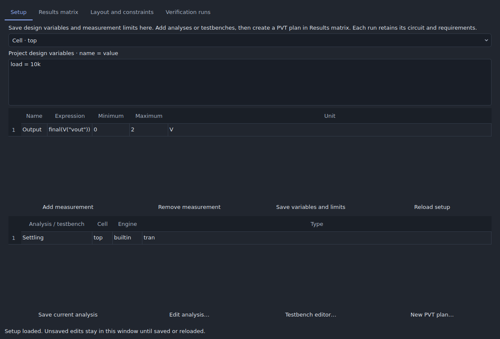
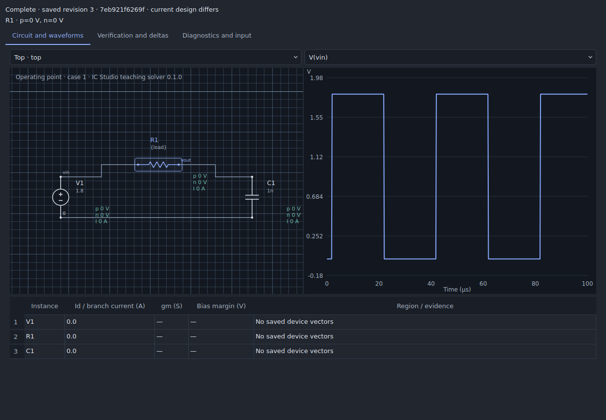
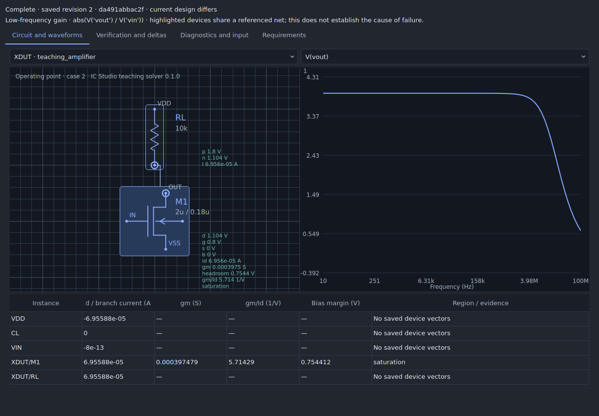

# Analog design workspace

Open **Analysis → Analog design workspace**. Analysis is its single menu home.
The workspace connects setup, results, layout updates, and retained
verification evidence without replacing the circuit you are editing.

**Close** returns to the editor and closes the workspace's auxiliary dialogs;
setup drafts remain available when reopened and running jobs continue. Use
**View → Reset workspace** (Ctrl/Command+Shift+0), also available in Window, to
restore the initial schematic arrangement. This resets panels, not project data.
The separate **Design → Design workflow** panel is closed initially. Its visible
**Close** button, the **Workflow** toolbar toggle, or Escape while focused dismiss
it. Named workspace arrangements remain available in Window.

**Optimize** adds [bounded circuit search and a gm/Id explorer](ANALOG_OPTIMIZER.md),
including PVT requirements, saved candidate review, and undoable application.
The [GUI audit](ANALOG_GUI_AUDIT.md) records improvements against Apple's Human
Interface Guidelines and the platform/accessibility checks still outstanding.

## Setup and PVT results

1. In **Setup**, enter project variables as `name = value`, then save expressions
   and limits for a cell or saved testbench. For example, `load = 10k` can drive a
   resistor value `{load}`. Measurement expressions use the existing waveform
   calculator, such as `final(V("vout"))` with minimum, maximum, and unit fields.
2. Save an analysis or testbench. In **Results matrix**, create a plan and select
   its tests, corners, temperatures, and optional DC supply sweep.
3. Optional plan variable overrides refer to existing project variables. They
   apply to the run snapshots; the edited project keeps its values. Corner
   overrides and the selected supply sweep take precedence over those defaults.
4. Run the plan. Double-click a result to open its saved circuit, probes, and
   diagnostics. Baseline deltas require the same requirement definition and
   condition. Retry includes completed jobs whose requirements failed, as well
   as engine failures and cancelled jobs.

Setup edits use the normal commit and undo history. A concurrent change to
variables or requirements blocks saving a stale editor. Switching requirement
owners retains drafts inside the window, including after closing/reopening it.
**Reload setup** asks before discarding drafts. Save edits before starting runs.

## Debugging a saved run

The saved-run inspector displays the captured revision and variables, a hierarchy
selector, a schematic, voltage/current probes, and a device operating-point table.
Repeated instances of the same master have separate paths. Selecting a device
locates its instance and an available pin waveform. The waveform cursor annotates
saved time-domain voltages on that instance. Opening old evidence does not replace
the active document.

Native graphical ngspice operating-point analyses now request primitive MOS
vectors through hierarchy. Current, gm, and `abs(vds) - abs(vdsat)` bias margin
are shown when captured. The teaching solver retains its explicitly labelled
square-law region classification. A missing model vector remains unavailable;
the application does not manufacture a region or infer hidden subcircuit devices.

A catalog binding may declare `operating_point_device`, for example
`xcore.mdevice`, identifying one relative MOS path inside its locked subcircuit.
That exact path is requested and mapped back to the schematic instance. This
contract also supports explicit native device metadata. It is not an automatic
mapping of arbitrary PDK models or a sum of multi-device subcircuit currents.
Ngspice naming and saved-vector behavior follow its
[official manual](https://ngspice.sourceforge.io/docs/ngspice-manual.pdf).
Real-engine qualification must use the particular model and simulator version.

The Diagnostics tab retains the original engine log and suggests targeted checks
for floating nodes, small timesteps, convergence failures, and missing models.
These suggestions do not change solver options or the circuit.

## Device generation and schematic-driven layout

**Layout and constraints** shows the active cell's placement inventory and saved
constraints. Select a device to show linked views or place/regenerate it. **Review
schematic changes** uses the existing hierarchy-aware ECO review, including
parameter variants and route preservation checks. **Show unrouted connections**
displays the terminal groups that still need routing.

Teaching MOS arrays now offer:

- 1–64 fingers, with exact total schematic W and L on the technology grid.
- Automatic or explicit contact rows and shared or isolated finger diffusion.
- Optional poly-only edge dummies and a contacted bulk guard ring.
- Stable shape roles and pin identities during regeneration, preserving a
  translated placement. Changed parameters are flagged by the existing audit.

These shapes remain illustrative teaching geometry. Poly-only dummies add no
electrical transistor. Process devices continue to use the existing supported
recipes: SKY130 1–8 fingers and the bounded single-finger GF180 recipe. Their
finger count comes from the schematic model parameters. Process dummies and
guard-ring recipes have not been invented for unsupported technologies.

Common-centroid placement accepts two or more groups with an even number of
explicit units per group, including unequal ratios such as 2:4:4. Every unit pair
is reflected through the common center. An even column count produces multiple
rows; leaving it blank produces one row. Duplicate members, overlapping
footprints, and off-grid placement are rejected atomically. This is a centroid
placement tool, not a gradient optimizer. Existing routes retain their positions;
check connections after arranging devices.

## Physical verification and extracted comparisons

Choose a saved testbench in **Verification runs** and launch the existing physical
flow. Open its saved run to inspect DRC/LVS stages, locations, retained errors, and
schematic/extracted measurement deltas in one panel. Location markers operate on
the saved layout, so a newer working revision cannot misdirect them.

The same saved testbench scalar specifications are evaluated on both simulation
implementations. Failed and missing values remain visible; mismatched units do
not produce a numerical delta. Both implementations and their overlay use
checksum-verified waveform files. The existing distributed-RC comparison also
opens in this inspector using its embedded before/after waveforms.

Magic, Netgen, ngspice and the matching process assets are still required for the
process flow. The teaching simulator supports local analog experiments out of
the box. This change does not bundle new process engines, introduce a new solver,
or claim foundry signoff. The physical flow retains its existing capacitance-only
extraction limits; distributed resistance uses the separate calibrated RC flow.

## Validation

`tests/test_analog_workspace.py` covers instance isolation, captured-vector
mapping, safe model paths, variable overrides, comparison identity/units,
generator identity and sizing, and atomic multi-group centroid placement.
`tests/gui_analog_workspace.py --out build/analog-workspace` exercises setup
save/undo, queued PVT jobs, matrix navigation, stale-editor rejection, failed
requirement retries, and saved-layout marker navigation in the real Qt desktop.

## Guided experiments and linked diagnostics

**Setup → Guided design setup** creates editable amplifier, differential-pair
and current-mirror fixtures and measurement plans. The optimizer now supports
adaptive sensitivity-first search, up to three objectives, and a reusable
isolated-device gm/Id library. See [the optimizer guide](ANALOG_OPTIMIZER.md).

Activate a failed requirement to inspect its captured derived waveform and
highlight devices connected to a referenced net in the saved hierarchy.
Sensitivity rows open the saved parameter-probe circuit. MOS annotations and
tables include captured gm/Id alongside current, gm and bias margin. These links
show relevant evidence; they do not assert which device caused a failure.

