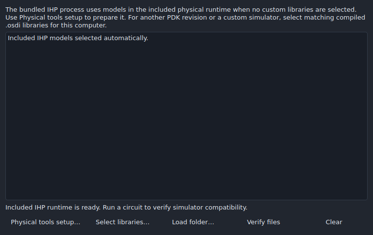
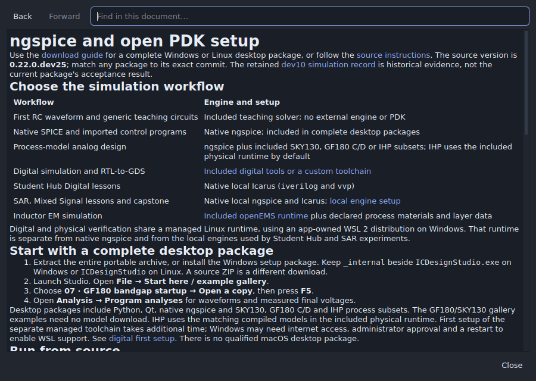

# Application audit — 2026-10-01

Branch: `codex/student-hub-design-paths`. Starting revision:
`f8d0b5ff9a8aa77fe3aafc9182109c25045e84f0`.

This audit reproduced the desktop build failure, exercised the application’s
menus and workspaces, and ran real simulation and physical checks for SKY130,
GF180 C/D and IHP SG13G2. The fixes include regressions and release gates.
The results qualify the executed cases; they do not establish that every
possible circuit, imported construct, or operating system configuration works.

## Failure and repairs

| Problem reproduced | Repair |
| --- | --- |
| Both desktop release jobs selected a GF180 catalog key for IHP, producing `Unknown PDK catalog device`. | Release cases now select the process’s registered device and supply. IHP must run with its matching compiled models; missing setup fails the gate. |
| Ordinary IHP analyses could use ngspice without the required OSDI runtime. Imported/native control programs did not load configured OSDI libraries. | Route IHP analyses and programs to the included runtime by default. Preserve explicit custom configurations, verify their hashes, and load them after validating imported commands. Retain transferred program waveforms in the host job folder. |
| Compatible Xschem import discarded an explicitly selected PDK. | Preserve the selected technology, including its revision lock and IHP runtime requirement. |
| IHP model import stopped on Latin-1 micro signs in HBT model comments. | Record source encoding and retain original bytes and hashes. Model staging and native migration remain checksummed; modified sources still fail. |
| Exported GF180 symbols referred to `@L`/`@W` in LVS while exporting `l`/`w`, blocking independent native reimport. | Bind the preserved LVS format to the exported live parameter names. |
| Native/captured handoffs called a serializer that rejects those project types. Moving locked handoffs could invalidate exchange metadata and PDK paths. | Use each document’s serializer, include its models, rebase every project and dependency lock, and refresh the affected sidecar hashes. |
| SPICE, GDS, image and handoff exports could omit pending inspector edits. | Flush pending edits before export and stop on invalid drafts. |
| Zoom In/Out raised a Qt point-type exception. | Use floating-point canvas coordinates while preserving the point under the viewport center. |
| Repeated switching among digital examples restored a deleted Qt window. | Exclude temporary digital windows from saved circuit panels and verify dock validity before restoring visibility. |
| Runtime guidance described included tools as external-only; older GUI assertions expected retired UI behavior and only two PDK packages. | Update compatibility/runtime guidance and tests for the current queue, dependency review, menus and four packaged variants. |

The failing baseline jobs are in [desktop run 36797138235](https://github.com/jonahsaunders/IC-Design-Studio/actions/runs/36797138235).
Code fixes were first pushed in [87cf772](https://github.com/jonahsaunders/IC-Design-Studio/commit/87cf772018e69b9287aa7194c1654b44040b7c3b).

## Executed coverage

| Check | Result and evidence |
| --- | --- |
| Unit suite | 1,243 tests: 1,190 passed, 53 skipped because their external engine/fixture conditions were absent. No failures. Separate real-engine probes below supplement those skips. |
| GUI acceptance | 74 general GUI scripts passed, plus the real SKY130 interface-change/physical-flow script: [75 results](validation/app-audit/gui-tests.json). |
| Menu and tab survey | 308 menu entries inventoried; 303 enabled entries invoked; 66 workspace tabs visited; no unexpected exceptions. [Menu inventory](validation/app-audit/menus.json), [tab inventory](validation/app-audit/tabs.json), [summary](validation/app-audit/menu-checks.json). |
| Device/corner simulation | All 51 real ngspice cases passed across MOS variants, diodes, IHP resistors, capacitor and bipolar devices: [results](validation/app-audit/device-corners.json). Nominal cases also check Xschem round trips. |
| Process inverter flows | Four variants passed DC, transient, deliberately failing and repaired DRC/LVS, final combined checks, and tampered-evidence rejection: [results](validation/app-audit/inverter-qualification.json). |
| Independent import/export simulation | Eight cases passed: native and captured programs for all four variants, after handoff export and relocation into paths containing spaces and Unicode: [results](validation/app-audit/pdk-exchange.json). |
| Release materials | Repository document/link/gallery checks passed. |

The menu sweep cancels file selections and confirmation dialogs. Its 75
prerequisite guards are reported separately from successful operations. Dialog
buttons are inventoried, while the action-specific GUI scripts exercise real
submissions, editing, queueing, cancellation, import/export and recovery.
Undo/Redo, layout-only grid snapping and stopping a running simulation are
initially disabled in the generic menu fixture; their applicable states are
covered by the editing, grid and cancellation probes. Closing is tested at the
end of the sweep. This is not a claim that merely opening a menu verifies every
button’s full behavior.

The acceptance scripts cover the Student Hub and process picker, schematic and
layout editing, hierarchy, symbols, analysis and waveforms, analog studies,
digital source/workspace controls, 3D views, collaboration/recovery, project
lifecycle and interchange. Fixture-based openEMS and digital tests are identified
by their scripts; they do not imply full native solver qualification.

## Real process measurements

All physical results below use real Magic and Netgen, not parser fixtures.

| Process | Locked package revision | Supply | Measured switching threshold | DRC after repair | LVS after repair |
| --- | --- | ---: | ---: | --- | --- |
| SKY130 A | `01b4bb7a87cc7fe5` | 1.8 V | 0.869841 V | Pass | Pass |
| GF180 C | `627ca682d68e1e92` | 3.3 V | 1.531999 V | Pass | Pass |
| GF180 D | `7dd87219f1333dbb` | 3.3 V | 1.531999 V | Pass | Pass |
| IHP SG13G2 | `3abac20fcb57e184` | 1.2 V | 0.617303 V | Pass | Pass |

SKY130 physical checks use the full pinned qualification package, separately
prepared from the smaller bundled simulation package. GF180 C and D have
separate physical configurations and were each tested. The broader device/corner
probe uses locally registered process adapters; its exact identities are in its
JSON record and should not be confused with the inverter package revisions.

Local engines: ngspice 42; Magic 8.3.684 at
`4f53bb3091d1e4a9b2009a58f157a8a4331d4c84`; Netgen 1.5.300 at
`1de6f88f1eebb786efadecc28e9e0dde37e8c433`.
IHP uses all six libraries compiled with the pinned OpenVAF build and generic
CPU target. Local wrappers supply library paths and redirect temporary files
into the writable workspace; no numerical engine or process model is replaced.

Handoff regressions additionally reopen GDS/OASIS sidecars and native/captured
Xschem exchange after removing original sources, verify preservation hashes,
check relative PDK dependency locks, and reject changed model bytes. Native bus
and instance-array exports still report their documented unsupported cases
instead of silently changing connectivity.

## Reproduce

Use Python 3.12 and the repository requirements. Use fresh output directories.

```sh
python -m unittest discover -s tests -v
python scripts/check_release.py
QT_QPA_PLATFORM=offscreen python tests/gui_menu_audit.py --out build/menu-audit
QT_QPA_PLATFORM=offscreen python tests/gui_audit_regressions.py --out build/audit-regressions
QT_QPA_PLATFORM=offscreen python tests/gui_project_hub.py
python tests/probe_pdk_exchange.py --ngspice /path/to/ngspice --out build/pdk-exchange
```

The exchange probe uses the installed included IHP runtime unless
`--osdi-directory /path/to/compiled-models` selects native compiled libraries.
`scripts/qualify_student_inverter.py` reproduces each real physical flow with
`--pdk-manifest`, `--out`, `--ngspice`, `--magic` and `--netgen`; add
`--osdi-directory` for native IHP execution. The broader device/corner matrix is
`scripts/verify_release_pdks.py` with `--pdk-root`, `--ngspice`, `--osdi` and
`--output`.

The desktop workflow now gates the menu regressions, tab survey, all bundled
process choices, managed inverter runs and all eight program handoff cases on
Linux and Windows. Its simulations reuse the installed runtime’s explicit state
directory. These checks supplement the existing packaging, native display,
external tool, VGA, digital implementation and physical qualification workflows.



The screenshot verifies the dialog’s layout under the GUI routing fixture;
its readiness response is mocked. Real process execution is recorded separately
above. Local GUI checks use Qt’s offscreen platform. Native Windows/WSL,
installer, audio-device and hardware-rendering acceptance depend on their CI
or manual checks; local offscreen success is not a substitute.

At this report’s preparation, the first fix revision passed GitHub’s external
tool interoperability and VGA Playground workflows, including real embedded
rendering. The full desktop, reference-design and physical matrices were still
running. Consult the branch’s current Actions results for release status.

## Follow-up on experimental

PR [54](https://github.com/jonahsaunders/IC-Design-Studio/pull/54) was merged into
`experimental` as `5f6cbc9dfe48cc8057520cf8b3113a91583991ec`. Additional repairs
were published in `30dae7b2bcfcae0346d316d09ec0c31caec28537` and the follow-up
containing this report. PR documentation now uses immutable commit links, so
removing the source branch will not break its images or evidence links.

| Additional failure reproduced | Repair and check |
| --- | --- |
| Relative help links opened blank documents; Markdown heading fragments did not scroll. | Initialize the browser source, resolve links against that document, create heading anchors, and provide working Back/Forward controls. All 13 help entry points and 1,137 local document links, including fragments, passed. |
| Links were almost unreadable in dark mode; packaged help omitted top-level guides. | Apply the theme's readable link color and bundle the root guides/notices. Qt cannot render the HTML-rich root README correctly; its links open the matching Git commit in the web browser. Other guides remain local. |
| Changing PDKs left every template at 1.8 V and selected IHP high-voltage devices by alphabetical order. | Preselect canonical core devices and the documented nominal supply: SKY130 1.8 V, GF180 3.3 V, IHP 1.2 V. Preserve edits while navigating within one revision. Test invalid input and actual create submissions for all four revisions. |
| Collaboration's Check schematic button dispatched an uppercase token and ran layout mapping instead of ERC. | Dispatch electrical rules and verify the resulting electrical findings view. |
| Custom OSDI paths remained tied to the original computer's folders in handoffs. Standalone SPICE export omitted selected libraries. | Verify/copy custom libraries, preserve platform and checksum restrictions, rebase every handoff project/sidecar, refresh exchange hashes, and emit relative preload commands in all three SPICE export paths. Reopen moved projects after deleting originals; changed libraries remain blocked. |
| Windows core CI compared its shortened temporary-directory spelling with the equivalent resolved path. | Resolve the fixture root before asserting dependency destinations. This changes the assertion, not the portability requirement. |
| Main setup guides described IHP as external-only and omitted included GF180 C. | Update Project Hub, getting-started, simulation and PDK guidance to match current runtime selection and included packages. |

The configured real-engine unit run completed **1,244 tests: 1,230 passed,
14 environment-dependent skips, no failures**. All **75 GUI acceptance scripts**
passed in fresh profiles. The menu survey again visited **303 enabled commands
and 66 tabs**. An extended survey dispatched **399 button invocations** across
menu-opened dialogs without unhandled exceptions. These are invocations, not
399 distinct controls: multiple menu paths lead to the same dialog.

The extended survey also recorded 89 controls disabled by prerequisites, 67
hidden by the current mode, 30 absent from its default fixture, and 3 setup/server
operations assigned to isolated acceptance tests. Those rows remain visible in
the evidence rather than being counted as successful submissions. File pickers
were cancelled in this broad survey; the action-specific tests supply actual
files, selections, jobs, fixtures and isolated collaboration servers.

| Menu/workspace | Relevant acceptance coverage |
| --- | --- |
| File, Project Hub, Student Hub | `gui_project_hub`, `gui_getting_started`, `gui_project_pdk`, `gui_student_hub`, `gui_student_inverter`, `gui_student_usability`, `gui_deep_controls` |
| Editing, schematic, hierarchy | `gui_editor`, `gui_capture`, `gui_wiring`, `gui_hierarchy`, `gui_consistency`, `gui_native_vectors`, `gui_professional_workflows` |
| Layout and verification | `gui_layout_*`, `gui_physical_variants`, `gui_workflow_review`, `gui_workflow_evidence`, `gui_sky130_devices`, plus the real process qualification recorded above |
| Analysis and waveforms | `gui_analysis015`, `gui_analog_*`, `gui_optimizer_refinement`, `gui_campaigns`, `gui_native_workflows`, `gui_reference_workflow`, `gui_cancel`, `gui_run_lifecycle015` |
| Digital and mixed signal | `gui_digital`, `gui_digital_workspace`, `gui_digital_setup`, `gui_digital_first_run`, `gui_mixed_signal`; real VGA rendering is a separate CI gate |
| Tools, collaboration and exchange | `gui_lifecycle`, `gui_inductor`, `gui_inductor_jobs`, `gui_openems`, `gui_design_automation`, `gui_*collaboration`, `gui_host_annotations`, `gui_interoperability`, `gui_native_migration`, `gui_xschem017` |
| View, Window and Help | `gui_overhaul`, `gui_experimental`, `gui_dark`, `gui_usability`, `gui_audit_regressions`, `gui_deep_controls` |

All five transistor templates ran through real ngspice for all four variants:
**24 saved-bench runs**, including separate amplifier bias and AC measurements.
Every configured measurement passed; each ring oscillator crossed half its supply
at least three times. These are nominal starting-circuit checks, not arbitrary
sizing, PVT, rail-to-rail swing, fabrication or extracted-RC qualification.
The eight moved native/captured program handoffs also passed real simulation again.
Custom binary portability is limited to the recorded operating system and CPU
architecture. A SPICE-only export without selected custom libraries still needs
its destination simulator's matching model runtime; use the project handoff to
retain Studio's automatic included-runtime selection.

Evidence: [summary](validation/app-audit/experimental-checks.json),
[GUI results](validation/app-audit/experimental-gui-tests.json),
[button dispatch records](validation/app-audit/experimental-buttons.json),
[submission checks](validation/app-audit/experimental-controls.json),
[link checks](validation/app-audit/experimental-links.json),
[24 template runs](validation/app-audit/template-simulations.json), and
[eight relocated program runs](validation/app-audit/experimental-pdk-exchange.json).

```sh
QT_QPA_PLATFORM=offscreen python tests/gui_deep_controls.py --out build/deep-controls-fresh
python tests/probe_pdk_templates.py --ngspice /path/to/ngspice --osdi-directory /path/to/compiled-models --out build/template-audit-fresh
```

The Linux package job for
[desktop run 36803341100](https://github.com/jonahsaunders/IC-Design-Studio/actions/runs/36803341100)
completed successfully, including release archive execution. Its Windows job
failed only at the shortened-path assertion described above. The subsequent
[experimental run 36806419722](https://github.com/jonahsaunders/IC-Design-Studio/actions/runs/36806419722)
was still queued/running when this follow-up evidence was prepared. New release
builds must finish their own gates; a prior Linux package pass does not certify
an updated Windows installer.


