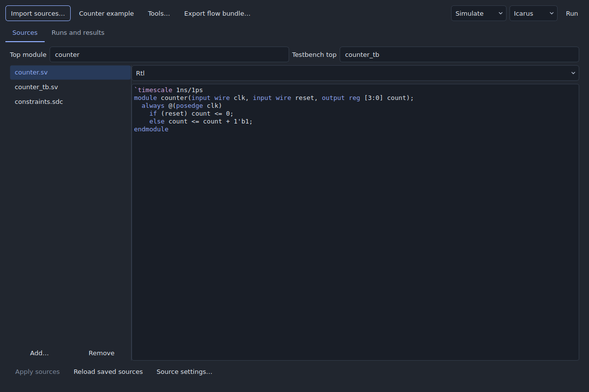
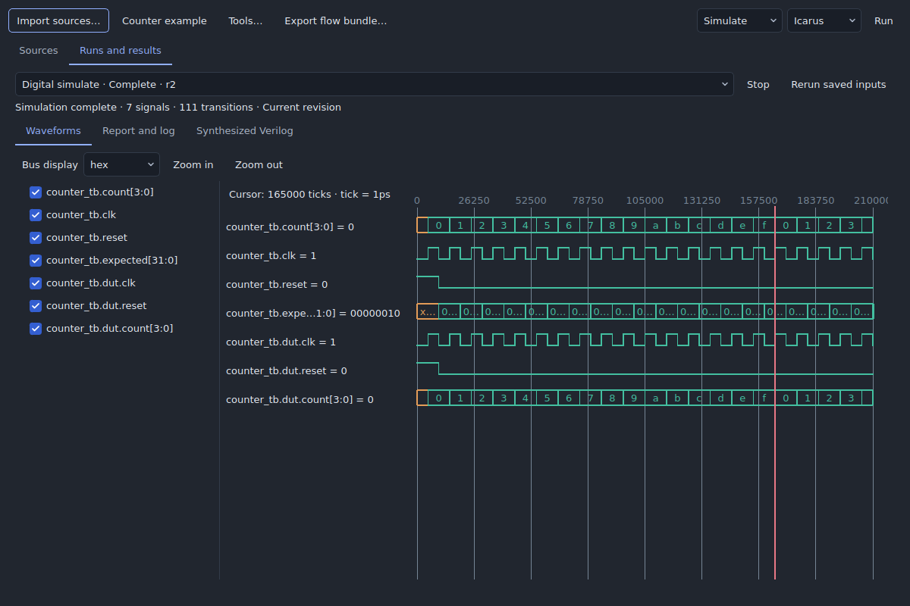

# Digital flow — initial integration

Open **Digital → New digital counter example**, then **Digital → Digital flow**.
The counter project includes RTL, a self-checking testbench, and an example SDC.
The editor, tool controls, run history and four-state waveforms are native Qt
views inside IC Design Studio.





## Available now

| Stage | Engine | Saved output |
|---|---|---|
| Simulate | Installed Icarus (`iverilog` and `vvp`) | VCD, digital waveform index, log and commands |
| Simulate | Installed Verilator with a C++ compiler and make | VCD, digital waveform index, log and commands |
| Lint | Installed Verilator | Diagnostics and commands |
| Synthesize | Installed Yosys | Generic Verilog netlist, JSON netlist and cell statistics |
| Export flow bundle | No engine required | Captured sources, Yosys script, EQY configuration and SKY130 HD ORFS starting configuration |

Use **Tools** in the Digital flow window to configure executable paths, or leave
them empty to discover installed tools on PATH. This increment does not bundle
the executables or install a container/WSL runtime. Verilator simulation needs
its normal build dependencies. Optional external engines retain their upstream
licenses; see [third-party notices](../THIRD_PARTY_NOTICES.md).

Verilator's Make-based simulation build requires run and source paths without
spaces. Use Icarus for such paths, or choose a space-free CLI output directory.

**Run** applies the current source draft, validates the captured dependencies,
and queues an immutable job. **Stop** cancels the selected job. Runs use the same
queue, process cancellation and durable status files as analog simulation.
Digital results appear in the digital window; they are not numeric analog traces.
They can also be opened from the shared simulation run list.

**Apply sources** creates an undoable project transaction. Saving the project
also applies an open digital editor's draft. If the saved sources changed since
the draft was opened, reload them explicitly before applying. Imported sources
are embedded copies: changes to the original folder do not alter the project.
Import the manifest again to capture an external revision.

## Sources and portable projects

Projects gain an optional `digital` object with `version: 1`. Existing schema-1
analog projects remain valid. Digital sources, roles, compilation order,
include directories, preprocessor definitions, top names, timeout and waveform
filename participate in project save, undo, recovery, and revision hashing.

Import a JSON manifest beside its explicitly listed source files:

```json
{
  "version": 1,
  "top": "counter",
  "testbench": "counter_tb",
  "include_dirs": ["."],
  "defines": {},
  "waveform": "wave.vcd",
  "timeout": 60,
  "files": [
    {"path": "counter.sv", "role": "rtl"},
    {"path": "counter_tb.sv", "role": "testbench"},
    {"path": "constraints.sdc", "role": "constraint"}
  ]
}
```

Roles are `rtl`, `testbench`, `include`, `data`, and `constraint`. Add include
headers and text memory initialization files explicitly. The supported portable
subset requires literal relative `include` and `$readmemh`/`$readmemb` paths.
Conditional dependencies must also be present; macro-generated filenames are
rejected. Compilation runs from the captured sources directory. Use the source
settings dialog for include paths, defines, waveform filename and timeout.

The initial format supports 128 UTF-8 files totaling 16 MiB. Path traversal,
case-insensitive duplicate paths, and file/directory collisions are rejected.
HDL and EDA scripts execute with the user's operating-system permissions, as do
Studio's other trusted local external engines; capture is not a sandbox.

## Simulation and waveforms

Testbenches must terminate and use `$fatal(1, "reason")` for failed checks.
Successful process exit alone does not prove functional correctness; the supplied
counter testbench checks reset, twenty increments, and modulo-16 wraparound.
To view traces, emit a VCD using `$dumpfile("wave.vcd")` and `$dumpvars` (or choose
the emitted filename in source settings). A missing or unsupported VCD causes
the run to fail with diagnostics; raw output remains available in its run folder.

The viewer preserves integer ticks, timescale, vector width, aliases and X/Z
values. Select signals, zoom, click for a cursor and select binary/hex/unsigned
bus display. Verilator is mostly two-state; its traces do not provide Icarus's
four-state semantics. Language support is engine-specific; `-g2012` does not
imply complete SystemVerilog support.

The first viewer supports bit-vector VCD, at most 32 MiB, 2,048 declarations,
4,096 bits per signal, 200,000 value changes and 64 MiB of decoded values. Real/string dumps and FST import
are not yet supported. Reduce dump scope/duration for larger designs. Parsing
runs in the worker, retains all accepted transitions (including same-tick
changes), and the viewer paints visible lanes/time ranges.

## Synthesis, EQY and physical handoff

**Synthesize** uses Yosys's built-in `read_verilog -sv`, hierarchy checks and
generic synthesis. The output is suitable for netlist inspection and generic
gate simulation. Cell counts are not physical area; this stage does not map to
a PDK, check clock constraints, or claim timing closure.

**Export flow bundle** writes an empty selected directory with:

- `sources/`: the exact embedded inputs;
- `synth.ys`: run from `sources/` with `yosys -s ../synth.ys`;
- `equivalence.eqy`: after synthesis, run `eqy -f ../equivalence.eqy` from `sources/`;
- `config.mk`: a starting design configuration for an independently installed ORFS;
- `manifest.json`: source checksums and an explicit `physical_status: not_run`;
- `README.txt`: working directories, commands and qualification scope.

The EQY template compares RTL with the generic Yosys output, using its SAT
strategy with depth 20. Inspect the proof status: an unproved partition or
timeout is not a pass. Reset/state assumptions and more complex designs need
qualified strategies. EQY is not launched or interpreted by the desktop yet.

The ORFS handoff requires exactly one SDC source, paths without spaces, a full
matching `sky130hd` platform and the separately installed ORFS tools. ORFS owns
technology-mapped synthesis for this handoff. The generic EQY template does not
prove that different mapped netlist. Review the SDC and floorplan, supply a
qualified platform revision, and explicitly configure memory-file dependencies
before physical execution. The bundled analog simulation subsets are insufficient
for this step. Export itself does not run OpenROAD or establish physical DRC,
LVS, timing closure or fabrication signoff.

Future increments will add mapped-netlist equivalence gates, in-app ORFS stages,
physical/timing report adapters, generated-layout attachment and toolchain packaging.

## CLI and validation

```sh
python main.py --cli digital example --output counter.icproj
python main.py --cli digital import project.json --output imported.icproj
python main.py --cli digital run counter.icproj --output runs/sim-1
python main.py --cli digital run counter.icproj --stage synth --output runs/synth-1
python main.py --cli digital run counter.icproj --stage lint --output runs/lint-1
python main.py --cli digital export counter.icproj --output flow-bundle
```

Use a fresh run directory. `--simulator verilator` selects Verilator simulation;
`--tool yosys=/path/to/yosys` (repeatable) selects executables. Input JSON,
source checksums, selected executable checksums, reported tool versions,
commands, logs and outputs are retained. Source-mode runs also fingerprint the
digital runner/parser sources. This is not a lock of all transitive OS/compiler
libraries. Saved replay rejects changed tool identities; start a new run to use
a newly installed tool. Artifact checksum validation detects damaged results.

```sh
python -m unittest tests.test_digital -v
QT_QPA_PLATFORM=offscreen python tests/gui_digital.py
```

The engine tests skip when tools are absent. Set `ICSTUDIO_TEST_IVERILOG`,
`ICSTUDIO_TEST_VVP`, `ICSTUDIO_TEST_VERILATOR`, or `ICSTUDIO_TEST_YOSYS` to specific test executables.
The desktop test requires Icarus and checks editing/undo, real worker execution,
waveforms, failed checks, stale results, reloading, replay, cancellation and saving.
