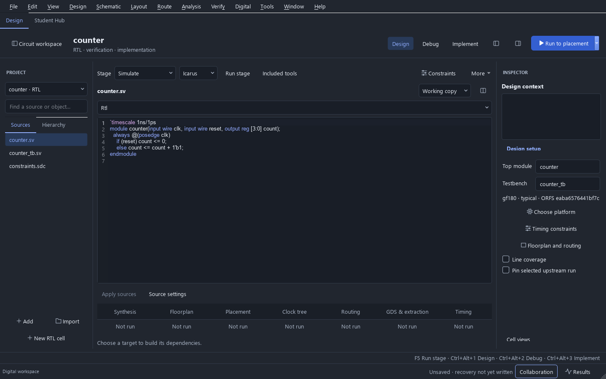

# Digital process profiles and qualification

Current source can import complete ORFS digital platforms for SKY130 HD,
GF180MCU and IHP SG13G2. Current source runtime builds bundle these three locked
platforms and offer them in the platform chooser and CLI. The published
0.23.0 desktop runtime still includes only SKY130 HD; these changes do not
retroactively qualify or change that package.

## Explicit process choices

The profiles target ORFS `eaba6576441bf7c1743ea56ecdb1904210ec02c2`:

| Import name | Standard cells and physical option | Captured library corners |
|---|---|---|
| `sky130hd` | SKY130 HD | TT, 1.80 V, 25 C |
| `gf180` | GF180 MCU 9-track 5 V; `5LM_1TM`, `9K` | TT 5.00 V / 25 C; SS 4.50 V / 125 C; FF 5.50 V / -40 C |
| `ihp-sg13g2` | SG13G2 standard cells, nominal 1.2 V | Typical 1.20 V / 25 C; slow 1.08 V / 125 C; fast 1.32 V / -40 C |

The GF180 profile does not qualify 7-track, 1.8/3.3 V libraries, every metal
stack, or both analog C/D adapters. IHP's higher-voltage cells, SRAMs, I/O,
BiCMOS and RF devices are outside this digital profile. The captured SKY130
profile has only a typical library; it cannot supply a full PVT acceptance sweep.
Nangate45 remains a separate import option and does not qualify these processes.

Use **Choose platform → Included** in the digital inspector, or the CLI's
`--included-platform gf180` / `--included-platform ihp-sg13g2`, after the included
runtime passes setup. Only platforms present in that package are offered.
For a custom checkout, use **Choose platform → ORFS gf180** / **ORFS ihp-sg13g2**, or
`--orfs-platform gf180` / `--orfs-platform ihp-sg13g2` with `--orfs` and custom
tools. Import captures the complete platform files, tie-cell identities, library
corners and process options. It selects every declared timing corner; the
**Constraints** dialog can change that selection. The synthesis corner is the
corner selected during import. Re-importing replaces incompatible old corner names.

The included package retains the complete selected platform directories, their
file locks and licenses. Build-time symlinks to sibling collateral are materialized
before unused platforms are removed, then the locks are verified again. Setup
validates the package catalog and requires the acceptance counter to pass for
every advertised platform; a partial result cannot mark the installation Ready.
Legacy SKY130-only payloads remain usable and retain their original scope.



The screenshot uses the real installed GF180 catalog entry after Windows setup
passed. The displayed project is a fresh counter; qualification results are
retained separately from this interface capture.

ORFS checkouts must preserve symbolic links and use LF executable scripts. The
import rejects unresolved links, missing link targets and CRLF executable scripts
with an actionable error. Include sibling dependencies: SKY130 HD's extraction
rules link to the SKY130 HS folder. A partial source ZIP is not sufficient.

## Integration safeguards

- Compressed GF180 Liberty files are hash-checked and expanded into bounded,
  separate job artifacts. Synthesis, proof and timing read those exact libraries.
- Tie-cell mapping uses explicit cell/output-pin pairs for each profile.
- Physical runs bind the selected libraries and process options on the make
  command line, preventing platform defaults from overriding the captured choice.
- ORFS receives every selected timing corner for optimization. Corner edits
  invalidate physical checkpoints, while compatible mapped logic remains reusable.
- IHP's captured stream-layer map is mirrored into the location required by the
  pinned ORFS KLayout generator. It is not replaced by a guessed layer mapping.
- The pinned GF180 nominal RC script leaves cut-layer resistance unset, although
  its technology LEF specifies resistance on single-cut reference vias. The profile
  creates a retained `platform_rc.tcl` wrapper that sources the captured script,
  reads `Via1_HH` through `Via4_HH` from the loaded database, requires positive
  resistance and converts ohms to the engine's current input units. Power-grid
  checking stays enabled. Slow/fast profiles retain their upstream RC settings.

The original ORFS and PDK files remain unchanged. The GF180 wrapper is an
integration repair for the declared profile, not a new foundry-qualified model.
See the pinned [GF180 RC source](https://github.com/The-OpenROAD-Project/OpenROAD-flow-scripts/blob/eaba6576441bf7c1743ea56ecdb1904210ec02c2/flow/platforms/gf180/setRC.tcl)
and [technology LEF](https://github.com/The-OpenROAD-Project/OpenROAD-flow-scripts/blob/eaba6576441bf7c1743ea56ecdb1904210ec02c2/flow/platforms/gf180/lef/gf180mcu_5LM_1TM_9K_9t_tech.lef).

## Repeatable acceptance fixture

The [2026-10-06 validation record](validation/digital-platforms-2026-10-06.json)
retains passing real-engine results for all three profiles, source hashes,
unchanged-constraint checks, routed-rule counts and per-corner timing values.
It also identifies the exact scope and timing of local regressions.

The [bundled-runtime record](validation/bundled-platforms-2026-10-06.json) retains
fresh Linux and Windows installation results for the three-platform candidate,
its archive/source identities and per-corner timing. Both installations passed
26 digital checks plus the separate physical-engine positive/negative probes.
These source-driven installation runs do not replace final frozen-desktop or
foundry qualification. The CLI additionally mapped GF180 and IHP with container
networking disabled. Published 0.23.0 packages remain unchanged.

With Python dependencies and the pinned digital engines installed on Linux:

```sh
python scripts/qualify_digital_platforms.py --orfs /path/to/ORFS --output build/digital-platforms --physical
```

Tool paths can be supplied with `--tool NAME=EXECUTABLE` or the existing
`ICSTUDIO_TEST_*` variables. `--platform` can select one profile. An empty output
directory is required. The digital CI gate runs all three profiles and retains
reports, commands, mapped/physical netlists, proof results, GDS and extracted data.

Each profile uses the same four-bit counter, 50 ns clock, 0.1 ns uncertainty,
declared I/O delays and 0.01 pF output load, within a 200 by 200 micrometre die.
The fixture requires mapping, equivalence, detection of a corrupted mapped
register, physical finish, zero final detailed-router violations, passing
extracted timing at every selected library corner, and physical-netlist equivalence.

Pre-layout hold failures remain in the evidence. Physical optimization repairs
them under the same constraints; passing extracted timing is required afterwards.
Without `--physical`, unclosed pre-layout timing fails qualification. Missing or
unrecognized evidence cannot qualify a platform.

This small counter verifies the declared integration path. It does not qualify
arbitrary RTL, full PVT/RC coverage, foundry DRC/LVS, antenna/density/fill, chip I/O,
CDC/RDC, EM/IR limits, packaging, or a tapeout. Broader analog and digital release
acceptance remains in [public-release targets](PUBLIC_RELEASE_TARGETS.md).

## UART and hierarchical APB acceptance

The broader workload gate runs the built-in UART transmitter and hierarchical
APB FIFO on every declared profile:

```sh
python scripts/qualify_digital_workloads.py --orfs /path/to/ORFS --output build/digital-workloads
```

It retains the examples' original RTL and SDC, including the UART's 10 ns clock
and APB's 20 ns clock. Both use a 400 by 400 micrometre die, a core from
20 to 380 micrometres on each axis, density 0.6 and two implementation threads.
All captured library corners are selected. The fixture allows 600 seconds per
engine command; a timeout cannot qualify a case. `--design uart` / `--design apb`
and `--platform` select smaller diagnostic runs.

Each workload must pass Icarus and Verilator behavioral tests, mapped equivalence,
deliberate-fault detection with a counterexample, physical finish with zero final
router violations, extracted timing at every selected corner and physical-netlist
equivalence. Pre-layout violations remain visible and must close under the same
constraints after routing. The report records source, input, engine and result
identities; the job folders retain the actual netlists, logs, proofs and geometry.

The negative control now identifies a mapped register using its clock, D and Q
port metadata. A combinational gate's D pin is insufficient. UART targets the
`busy` register; counter/APB select an eligible register. The exact before/after
cell instance is saved in `qualification_fault.json`. Earlier counter records
used the first D pin in the serialized netlist, so their detected-fault results
should not be interpreted as proof of this newer register-selection method.

The proof portfolio is described in [digital flow](DIGITAL_FLOW.md). Fully mapped
netlists use structural cell instances and omit signed declaration qualifiers
that OpenSTA cannot parse. Widths, bit selections and connections are retained;
the original synthesis output is saved when this conversion is needed. Formal
equivalence checks the exact converted netlist subsequently used for timing and
physical implementation. RTL arithmetic and reset behavior are unchanged.

These are block integration checks. They do not supply missing SKY130 PVT
libraries, independent RC extractions, chip-level DRC/LVS or foundry acceptance.
