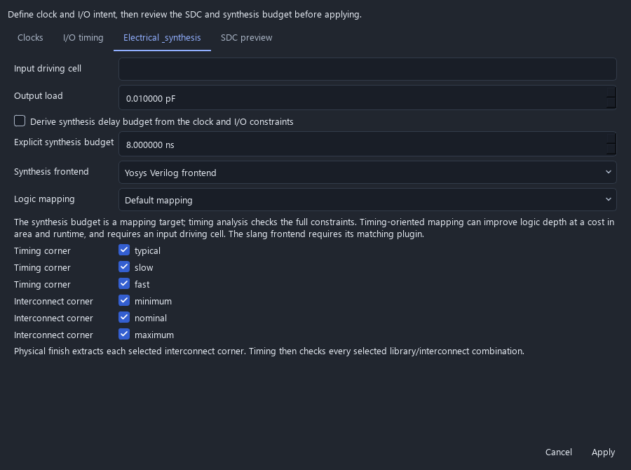

# Digital process profiles and qualification

Current source can import complete ORFS digital platforms for SKY130 HD,
GF180MCU and IHP SG13G2. Current source runtime builds bundle these three locked
platforms and offer them in the platform chooser and CLI. The published
0.23.0 desktop runtime still includes only SKY130 HD; these changes do not
retroactively qualify or change that package.

## Explicit process choices

The profiles target ORFS `eaba6576441bf7c1743ea56ecdb1904210ec02c2`:

| Import name | Standard cells and physical option | Captured library corners |
|---|---|---|
| `sky130hd` | SKY130 HD | TT, 1.80 V, 25 C |
| `gf180` | GF180 MCU 9-track 5 V; `5LM_1TM`, `9K` | TT 5.00 V / 25 C; SS 4.50 V / 125 C; FF 5.50 V / -40 C |
| `ihp-sg13g2` | SG13G2 standard cells, nominal 1.2 V | Typical 1.20 V / 25 C; slow 1.08 V / 125 C; fast 1.32 V / -40 C |

The GF180 profile does not qualify 7-track, 1.8/3.3 V libraries, every metal
stack, or both analog C/D adapters. IHP's higher-voltage cells, SRAMs, I/O,
BiCMOS and RF devices are outside this digital profile. The captured SKY130
ORFS import profile has only a typical library. Source runtime builds instead
prepare the matched three-library, three-interconnect SKY130 platform described
below; older runtime archives keep their original coverage.
Nangate45 remains a separate import option and does not qualify these processes.

Use **Choose platform → Included** in the digital inspector, or the CLI's
`--included-platform gf180` / `--included-platform ihp-sg13g2`, after the included
runtime passes setup. Only platforms present in that package are offered.
For a custom checkout, use **Choose platform → ORFS gf180** / **ORFS ihp-sg13g2**, or
`--orfs-platform gf180` / `--orfs-platform ihp-sg13g2` with `--orfs` and custom
tools. Import captures the complete platform files, tie-cell identities, library
corners and process options. It selects every declared timing corner; the
**Constraints** dialog can change that selection. The synthesis corner is the
corner selected during import. Re-importing replaces incompatible old corner names.

The included package retains the complete selected platform directories, their
file locks and licenses. Build-time symlinks to sibling collateral are materialized
before unused platforms are removed, then the locks are verified again. Setup
validates the package catalog and requires the acceptance counter to pass for
every advertised platform and library/interconnect pair; a partial result cannot
mark the installation Ready. New payload manifests declare both corner dimensions,
which must match the locked platform catalog and installation evidence before
desktop packaging. Each bundled platform also retains license and source notices
that accompany its exported macro geometry.
Legacy SKY130-only payloads remain usable and retain their original scope.


The screenshot uses the real installed GF180 catalog entry after Windows setup
passed. The displayed project is a fresh counter; qualification results are
retained separately from this interface capture.



This offscreen Windows capture uses the new installed and qualified SKY130
catalog entry. Selecting it enables all three library and three interconnect
corners. The workflow also checks save/reopen, switching to GF180 and undo.
It is separate from final packaged-desktop consumer acceptance.

ORFS checkouts must preserve symbolic links and use LF executable scripts. The
import rejects unresolved links, missing link targets and CRLF executable scripts
with an actionable error. Include sibling dependencies: SKY130 HD's extraction
rules link to the SKY130 HS folder. A partial source ZIP is not sufficient.

## Integration safeguards

- Compressed GF180 Liberty files are hash-checked and expanded into bounded,
  separate job artifacts. Synthesis, proof and timing read those exact libraries.
- Tie-cell mapping uses explicit cell/output-pin pairs for each profile.
- Physical runs bind the selected libraries and process options on the make
  command line, preventing platform defaults from overriding the captured choice.
- ORFS receives every selected timing corner for optimization. Corner edits
  invalidate physical checkpoints, while compatible mapped logic remains reusable.
- IHP's captured stream-layer map is mirrored into the location required by the
  pinned ORFS KLayout generator. It is not replaced by a guessed layer mapping.
- The pinned GF180 nominal RC script leaves cut-layer resistance unset, although
  its technology LEF specifies resistance on single-cut reference vias. The profile
  creates a retained `platform_rc.tcl` wrapper that sources the captured script,
  reads `Via1_HH` through `Via4_HH` from the loaded database, requires positive
  resistance and converts ohms to the engine's current input units. Power-grid
  checking stays enabled. Slow/fast profiles retain their upstream RC settings.

The original ORFS and PDK files remain unchanged. The GF180 wrapper is an
integration repair for the declared profile, not a new foundry-qualified model.
See the pinned [GF180 RC source](https://github.com/The-OpenROAD-Project/OpenROAD-flow-scripts/blob/eaba6576441bf7c1743ea56ecdb1904210ec02c2/flow/platforms/gf180/setRC.tcl)
and [technology LEF](https://github.com/The-OpenROAD-Project/OpenROAD-flow-scripts/blob/eaba6576441bf7c1743ea56ecdb1904210ec02c2/flow/platforms/gf180/lef/gf180mcu_5LM_1TM_9K_9t_tech.lef).

## Repeatable acceptance fixture

The [2026-10-06 validation record](validation/digital-platforms-2026-10-06.json)
retains passing real-engine results for all three profiles, source hashes,
unchanged-constraint checks, routed-rule counts and per-corner timing values.
It also identifies the exact scope and timing of local regressions.

The [bundled-runtime record](validation/bundled-platforms-2026-10-06.json) retains
fresh Linux and Windows installation results for the three-platform candidate,
its archive/source identities and per-corner timing. Both installations passed
26 digital checks plus the separate physical-engine positive/negative probes.
These source-driven installation runs do not replace final frozen-desktop or
foundry qualification. The CLI additionally mapped GF180 and IHP with container
networking disabled. Published 0.23.0 packages remain unchanged.

With Python dependencies and the pinned digital engines installed on Linux:

```sh
python scripts/qualify_digital_platforms.py --orfs /path/to/ORFS --output build/digital-platforms --physical
```

Tool paths can be supplied with `--tool NAME=EXECUTABLE` or the existing
`ICSTUDIO_TEST_*` variables. `--platform` can select one profile. An empty output
directory is required. The digital CI gate runs all three profiles and retains
reports, commands, mapped/physical netlists, proof results, GDS and extracted data.

Each profile uses the same four-bit counter, 50 ns clock, 0.1 ns uncertainty,
declared I/O delays and 0.01 pF output load, within a 200 by 200 micrometre die.
The fixture requires mapping, equivalence, detection of a corrupted mapped
register, physical finish, zero final detailed-router violations, passing
extracted timing at every selected library corner, and physical-netlist equivalence.

Pre-layout hold failures remain in the evidence. Physical optimization repairs
them under the same constraints; passing extracted timing is required afterwards.
Without `--physical`, unclosed pre-layout timing fails qualification. Missing or
unrecognized evidence cannot qualify a platform.

This small counter verifies the declared integration path. It does not qualify
arbitrary RTL, full PVT/RC coverage, foundry DRC/LVS, foundry antenna/density/fill, chip I/O,
CDC/RDC, EM/IR limits, packaging, or a tapeout. Broader analog and digital release
acceptance remains in [public-release targets](PUBLIC_RELEASE_TARGETS.md).

## Final antenna and power connectivity

New physical finish jobs require explicit OpenROAD antenna and power-grid
connectivity reports, including signal-input model coverage and the presence of
routing-layer antenna rules. Missing coverage or reports cannot pass. The checks
use the captured final database without changing its geometry or rules. Power
net names come from all POWER/GROUND nets in that database, with required power
and ground coverage and connected supply terminals.

The native acceptance script runs those same checks on each retained final
counter, then creates two isolated damaged database copies: one with an actual
power grid removed and one with deliberately excessive routed metal connected
to an existing modeled gate. It requires the native checker to detect the
corresponding fault, preserves original evidence, and retains commands, logs,
mutations and checksums. The antenna copy is intentionally invalid test geometry.

```sh
python scripts/qualify_digital_physical_checks.py --evidence build/digital-platforms --output build/digital-physical-checks
```

The input must contain all three qualified final jobs, under each process's
`finished` or installed-runtime `gds` folder. Use an empty output folder and
`--openroad /path/to/openroad` to select the captured engine. The digital CI gate
runs these controls after producing the reference implementations. The
[OpenROAD antenna](https://openroad.readthedocs.io/en/latest/main/src/ant/README.html)
and [power-grid connectivity](https://openroad.readthedocs.io/en/latest/main/src/psm/README.html#check-power-grid)
checks have narrower scope than foundry signoff. Model/rule presence is not
evidence that a supplied deck covers every fabrication requirement; final
streamed-GDS, density, electrical reliability and chip-level acceptance remain
separate requirements.

## UART and hierarchical APB acceptance

The [2026-10-06 workload record](validation/digital-workloads-2026-10-06.json)
retains six passing block cases, covering 48 stages and 14 extracted library-corner
timing checks. Every final detailed-router check reported zero violations, both
mapped and physical equivalence passed, and every deliberate register fault
produced a failing proof with a counterexample. The record binds the production
source, tool versions, process locks and unchanged constraints to the retained
evidence. Its raw strategy status entries distinguish fresh proofs from EQY's
cached copies of earlier strategy results.

The same backend also passed 26 installed-runtime checks plus physical-engine
positive/negative probes on each of Linux and Windows. One earlier Windows
attempt stopped on a WSL connection error; the complete retry passed on unchanged
source. These checks use the existing runtime candidate and do not qualify a
new frozen desktop package.

The broader workload gate runs the built-in UART transmitter and hierarchical
APB FIFO on every declared profile:

```sh
python scripts/qualify_digital_workloads.py --orfs /path/to/ORFS --output build/digital-workloads
```

It retains the examples' original RTL and SDC, including the UART's 10 ns clock
and APB's 20 ns clock. Both use a 400 by 400 micrometre die, a core from
20 to 380 micrometres on each axis, density 0.6 and two implementation threads.
All captured library corners are selected. The fixture allows 600 seconds per
engine command; a timeout cannot qualify a case. `--design uart` / `--design apb`
and `--platform` select smaller diagnostic runs.

GF180 UART uses the captured slow synthesis library and the profile's WC/FuncRCmax
extraction option. Its explicit synthesis settings are timing-oriented mapping,
an 8 ns delay target (10 ns minus the two 1 ns I/O budgets), the captured
`gf180mcu_fd_sc_mcu9t5v0__buf_4` input driver and zero additional output load.
These are mapping choices; the original timing SDC is unchanged and all three
Liberty corners still have to pass. Other cases retain their original mapping
settings and imported typical corner. Every run records these choices separately
from the selected timing corners and physical results.

Each workload must pass Icarus and Verilator behavioral tests, mapped equivalence,
deliberate-fault detection with a counterexample, physical finish with zero final
router violations, extracted timing at every selected corner and physical-netlist
equivalence. Pre-layout violations remain visible and must close under the same
constraints after routing. The report records source, input, engine and result
identities; the job folders retain the actual netlists, logs, proofs and geometry.

The negative control now identifies a mapped register using its clock, D and Q
port metadata. A combinational gate's D pin is insufficient. UART targets the
`busy` register; counter/APB select an eligible register. The exact before/after
cell instance is saved in `qualification_fault.json`. Earlier counter records
used the first D pin in the serialized netlist, so their detected-fault results
should not be interpreted as proof of this newer register-selection method.

The proof portfolio is described in [digital flow](DIGITAL_FLOW.md). Fully mapped
netlists use structural cell instances and omit signed declaration qualifiers
that OpenSTA cannot parse. Widths, bit selections and connections are retained;
the original synthesis output is saved when this conversion is needed. Formal
equivalence checks the exact converted netlist subsequently used for timing and
physical implementation. RTL arithmetic and reset behavior are unchanged.

These are block integration checks. They do not supply missing SKY130 PVT
libraries, independent RC extractions, chip-level DRC/LVS or foundry acceptance.

## Separate SKY130 PVT and interconnect platform

The platform preparer creates a separate manifest from the pinned ORFS checkout
and checksum-pinned `chipfoundry/volare` archives at
`sky130-fa87f8f4bbcc7255b6f0c0fb506960f531ae2392`. Install the repository's Python
requirements first, including the archive reader installed with `py7zr`.

```sh
python scripts/prepare_sky130_digital.py --orfs /path/to/ORFS --output build/sky130-pvt-platform --cache build/sky130-pdk-cache
python scripts/qualify_digital_workloads.py --orfs /path/to/ORFS --manifest build/sky130-pvt-platform/platform.json --output build/sky130-corners
```

Import the generated file through **Platform → Platform JSON manifest**, or pass
it to the CLI with `--platform`. Import selects all captured library and
interconnect corners; **Constraints** can change those selections independently.
Existing platform locks and older bundled SKY130 profiles keep their original
scope. Source runtime builds invoke this same preparer before publishing the
platform catalog; it does not update an installed runtime in place.


The editor capture uses the actual separately prepared SKY130 manifest. It shows
configuration choices; the capture itself is not engine qualification.

| Library corner | Characterization |
|---|---|
| typical | TT, 1.80 V, 25 C |
| slow | SS, 1.60 V, 100 C |
| fast | FF, 1.95 V, -40 C |

The corresponding cell LEFs, GDS and CDL come from that same archive release.
The generated adapter overrides the ORFS physical-view paths and retains the
original configuration, archive hashes, selected file hashes and license. It
does not mix newly selected timing libraries with the old cell geometry.

**Physical finish** independently extracts minimum, nominal and maximum
interconnect using each corner's technology LEF and `spef_extractor` rules.
Each extraction rebuilds its database from the same final routed DEF so via and
layer properties come from the selected corner. It does not scale a nominal
SPEF. The explicit 0.1 fF coupling threshold, input hashes, output hashes, element
counts and scripts are retained in the extraction report.
Macro export retains every named SPEF, extraction script and report, with
artifact-key references and original geometry/netlist hashes in its manifest.
It also copies the platform's captured license/source notices and their hashes
from the job snapshot. Missing or changed captured notices stop export. Custom
platform manifests must capture their own notices; an empty notice list is
reported explicitly and supplies no redistribution authorization.
Before copying metadata, export verifies that the saved input snapshot matches
the implementation result's project/cell identities, design hash, source hash
and stage identity when present. This binds exported top names, constraints and
notice selections to the original job. A mismatch stops before replacing an
existing export; restore the original snapshot or run physical finish again.

After included-runtime setup, run the read-only handoff checks with:

```sh
python scripts/qualify_macro_exports.py --output build/macro-integrity-installed/report.json
```

Use `--evidence` to select a retained installed-runtime evidence directory. The
qualifier requires the SKY130, GF180 and IHP finished counter jobs, checks valid
exports and five altered-input cases per platform, and records exporter, qualifier
and original-job hashes. Original engine evidence remains unchanged. Missing jobs,
incorrect platform labels or an accepted altered input fail the command and write
a failed receipt in place of any stale passing one. These checks verify export
integrity; they do not rerun engines or establish chip-level acceptance.

Post-route timing checks the Cartesian product of selected library and
interconnect corners: all nine pairs by default. The report and timing table
identify both corners. A violation in any pair fails the aggregate verdict;
missing or mismatched extraction evidence stops the run. Changing the RC selection
invalidates finish and timing results while allowing compatible placement and
routing checkpoints to remain reusable. Pre-layout timing still has no extracted
parasitics and cannot establish this coverage.

The [source-bound SKY130 corner record](validation/sky130-corners-2026-10-06.json)
qualifies the UART and APB examples through 16 stages and all 18 extracted timing
pairs. It retains the original 10 ns and 20 ns constraints, reports zero final
router violations, and includes mapped/physical equivalence and actual-register
negative controls. An independent audit checks source and artifact hashes, the
extraction inputs, numerically distinct parasitic results, and exported macro
contents. Linux and Windows each also passed 26 checks against the existing
three-platform runtime on this backend; that compatibility result does not add
the new SKY130 platform to the installed payload.

The subsequent [included-corner runtime record](validation/bundled-corners-2026-10-06.json)
qualifies fresh Linux and Windows installations of the new payload. Each passed
26 digital checks, physical-tool positive/negative probes and 15 extracted timing
pairs: nine SKY130 and three each GF180/IHP. Independent audits verify saved
job/source identities, every retained artifact, distinct SKY130 parasitic data,
and all three macro exports with their captured licenses and source notices.
The record also retains the separate export-input integrity defect found on that
source revision. Current source adds the input-binding rejection described above;
the historical record is not rewritten as proof of the later repair.

The [macro-input integrity record](validation/macro-integrity-2026-10-07.json)
qualifies the repair on source `0a62eca8bff708e0be7f317df61f70b01a5ff938`.
Each installed runtime passed 26 digital checks, 15 timing pairs and the physical
tool probes. Independent audits verified the retained jobs and exports, and the
export qualifier passed 18 original/altered-input cases on each operating system.
The Windows record preserves a failed WSL file-read attempt and its complete
successful retry. These source-driven checks reuse the existing runtime archive;
they do not qualify the frozen desktop packages.

These block cases still require matched-deck physical checks and the full
public-release acceptance gates. They do not establish foundry signoff, all
operating voltages/temperatures, chip I/O or complete multi-mode signoff. The
source runtime build now bundles this PVT/RC platform, with fresh installation
qualification required by the build gates. Exact desktop packages still require
their own acceptance before this becomes a released feature.
