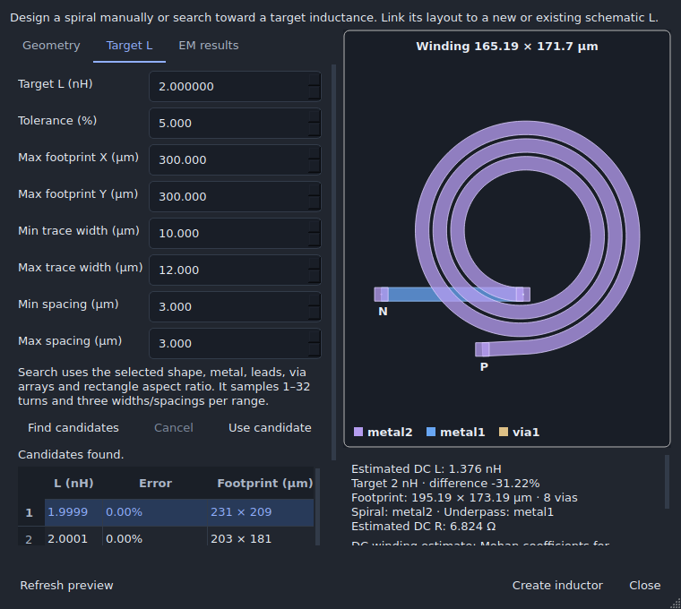
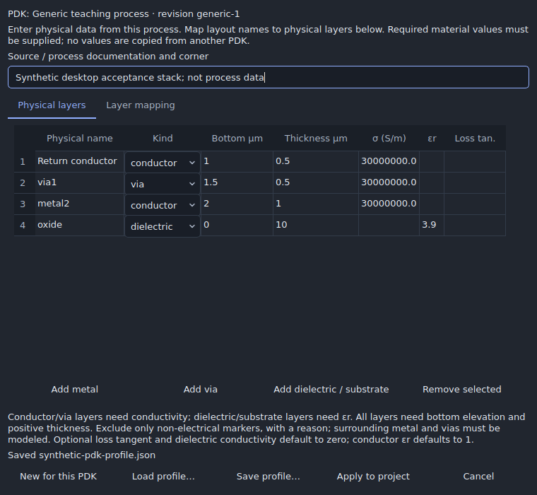
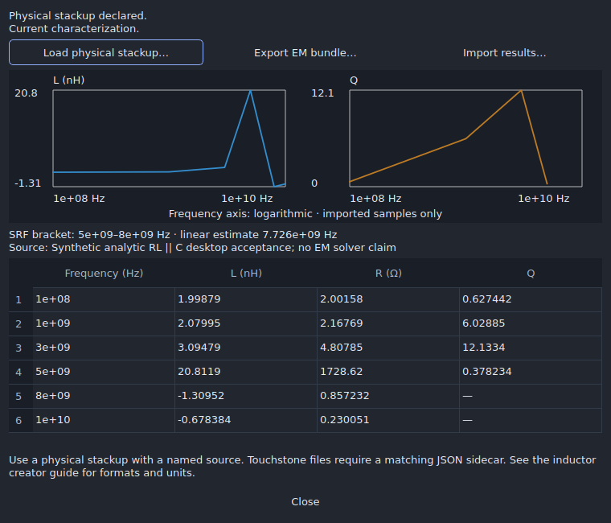

# Inductor creator

Open **Tools → Inductor creator…**. Dev23 adds five two-terminal spiral shapes,
target-L search, background validation, declared DC resistance and EM exchange.
Dev22 square recipes remain compatible, including geometry and stable IDs.
EM setup uses reusable physical profiles for the selected PDK, with no process-name
allowlist. See [PDK profiles](#pdk-profiles) for the required data and supported model.

## Shapes and estimates

| Shape | Geometry | DC winding estimate |
|---|---|---|
| Square | Original Manhattan spiral | Mohan square coefficients |
| Rectangle | Independent X/Y inner openings | Thin-strip Neumann partial-inductance integral |
| Hexagon | Six contracting support lines per turn | Mohan hexagonal coefficients |
| Octagon | Eight contracting support lines per turn | Mohan octagonal coefficients |
| Circle | Archimedean spiral, 128 segments per turn | Mohan circular coefficients |

Angled/curved mask vertices are snapped to the technology grid, with additional
clearance for quantization and square via landing pads. Normal width, spacing,
enclosure, collision and connectivity checks still apply. Each device has a
winding, underpass, two via arrays and P/N pads. The complete footprint includes
leads; winding dimensions exclude them.


Regular spirals use equation (2) and Table II in
[Mohan et al., *Simple Accurate Expressions for Planar Spiral Inductances*,
IEEE JSSC 34(10), 1999](https://doi.org/10.1109/4.792620):

\[
L=\frac{\mu_0 n^2 d_{avg} c_1}{2}
\left[\ln\left(\frac{c_2}{\rho}\right)+c_3\rho+c_4\rho^2\right],
\quad d_{avg}=\frac{d_{out}+d_{in}}2,
\quad \rho=\frac{d_{out}-d_{in}}{d_{out}+d_{in}}.
\]

| Shape | c₁ | c₂ | c₃ | c₄ |
|---|---:|---:|---:|---:|
| Square | 1.27 | 2.07 | 0.18 | 0.13 |
| Hexagon | 1.09 | 2.23 | 0 | 0.17 |
| Octagon | 1.07 | 2.29 | 0 | 0.19 |
| Circle | 1 | 2.46 | 0 | 0.20 |

For legacy squares, `d_out = d_in + 2*n*width + 2*(n-1)*spacing`.
Three turns, 10 µm width, 3 µm spacing and an 80 µm opening give a 152 µm
winding and approximately 1.638 nH. The contracting polygon/circular recipes use
the mean actual X/Y winding extents for outer diameter. Departure from concentric
ideal geometry and polygonization introduce additional approximation; characterize
the exact geometry for RF work.

Rectangles do **not** reuse the square fit. Their Neumann integral includes
signed parallel mutual terms and uses `exp(-1.5)*width` as a thin-strip geometric
mean distance for self terms. A separate numerical quadrature checks the
implementation. This assumes uniform current and negligible conductor thickness.

L estimates exclude leads/underpass contributions, frequency-dependent resistance,
substrate loss, Q and self-resonance. Model identities are saved in recipes.
Neither these estimates nor synthetic acceptance fixtures establish RF accuracy
or fabrication qualification. Center-tapped/differential coils and transformers
are separate electrical configurations outside this five-shape update.

## Manual creation and regeneration

1. Select a shape and **New schematic inductor**, or an existing standard `L`.
   Imported native subcircuits need their own supported physical implementation.
2. Set turns, width, spacing, openings, leads, mapped metal/via stack, via arrays,
   origin, rotation and mirror. Dimensions and coordinates are in µm.
3. Review geometry, L/target mismatch, complete footprint and any DC R estimate.
   The preview is dimmed while placement validation is pending.
4. Resolve errors. **Apply suggested fix** explicitly adjusts an invalid field;
   geometry collisions can be outlined in the preview.
5. Choose **Create inductor**. The app selects the footprint in layout. Creation
   is one undoable edit, including a new schematic L and attached P/N net labels.

A new L needs a unique name beginning with L and distinct terminal nets; its
value uses the estimate. Existing L values stay unchanged unless **Set schematic
L to the estimate** is selected. Locked layers, invalid geometry and changed
designs cannot be applied. Background workers use project snapshots, and outdated
or closed-dialog completions cannot enable creation.

Select the full footprint to move it with connected editing. Reopen the creator
from a selected shape, or select its schematic L and use **Place / regenerate…**.
Regeneration restores saved dimensions and the translated origin, retains IDs
for unchanged roles, and refuses to detach terminal routes or ports. Undo manual
winding edits first: they invalidate recipe recognition. Save/reopen and the
matching GDSII/OASIS export sidecar preserve generator metadata and full metal.

Intact windings count as two-terminal devices for connectivity, rather than plain
shorts between P and N. External shorts remain visible. Contacts outside the pads
produce `INDUCTOR.TAP`; changed/incomplete recipes produce `INDUCTOR.STALE`.
Interconnect RC extraction remains blocked for cells containing these windings.

## Target-L search

Enter target nH, tolerance, maximum complete footprint X/Y and width/spacing
ranges in **Target L**. Search retains shape, metal, leads, orientation, via arrays
and the rectangle opening aspect ratio. It samples 1–32 turns and up to three
widths/spacings per range, solving for on-grid openings. Distinct turn/width/spacing
families are ranked by relative L error, then footprint area. This finite search
does not guarantee a global optimum or calibrated RF performance.



Select a row and **Use candidate** to run full placement validation.
Candidate geometry checks alone do not establish clearance from existing layout.
Results distinguish no legal footprint from legal candidates outside tolerance.
Cancelling or changing inputs discards a search. Hover a candidate to inspect its
width, spacing and full-precision footprint.

## DC resistance and optional series RL

DC R uses the selected corner's existing `pdk.parasitics`/`parasitic_corners`
sheet coefficients for both conductors. Per-cut resistance must be declared in
`pdk.via_resistance_ohm[via_recipe_name]` or `resistance_ohm` on that routing via.
Missing data is never inferred. For example, these **PDK fields** are synthetic
teaching values, not a process calibration:

```json
{
  "parasitics": {
    "metal1": {"sheet_ohm": 0.08},
    "metal2": {"sheet_ohm": 0.04}
  },
  "via_resistance_ohm": {"M1 to M2": 2.0}
}
```

R sums winding/P-lead `Rs*length/width`, underpass `Rs*length/width`, and
`2*Rcut/(rows*columns)` for two parallel-cut arrays. This uniform-current estimate
excludes spreading, temperature extrapolation, skin/proximity effects and
substrate loss. Missing or invalid coefficients leave R unavailable.

**Simulate with estimated series R** adds a resistor to simulation/export copies,
shared by the teaching solver and SPICE writer. Editable schematic/layout data
remain intact and the retained/updated L choice is honored. This option applies
to ideal L devices, not inductors already bound to PDK models. Changed geometry,
coefficients, selected corner or manually edited L invalidates the saved model;
regenerate to accept updated estimates or uncheck the option.

## EM exchange and imported results

After creation, select the device and open **EM results → Open saved inductor
characterization…**. This exchanges evidence with an external solver; no field
solver or inferred process stackup is included.

1. **Edit PDK profile…** enters material data and maps project layers to physical
   layer names. **Load physical stackup…** accepts an existing JSON profile as an
   undoable edit. Illustrative 3D display heights are never treated as material data.
   Choose **Inductor and surrounding layout** or **Isolated inductor** explicitly.
2. **Export EM bundle…** writes ZIP entries `geometry.gds`, `manifest.json`,
   `results-template.json` and instructions. GDS contains an isolated `INDUCTOR`
   cell and a `CONTEXT` cell including winding and surrounding flattened metal.
   Simulate **one** cell; do not superimpose both. The manifest records exact
   geometry, P/N points/layers, mappings, recipe, process lock and stackup.
   When the profile is complete and compatible, the bundle also contains the
   matched pair `solver-geometry.gds` / `stackup.xml` for the Mühlhaus workflows.
   Otherwise `solver-setup-missing.txt` lists the blockers.
3. Configure the external solver's mesh, boundaries, reference plane, substrate
   and material treatment. Record solver/version, settings and convergence evidence.
4. **Import results…** associates matching evidence with the saved recipe.
   Changed winding, context, ports or stackup reject or mark the results stale.

Stackup JSON needs `source` and 1–2,048 uniquely named `layers`. Every used metal
and via in the **selected scope**, including surrounding metal, must be mapped.
Each layer declares `kind` (`conductor`, `via`,
`dielectric`, or `substrate`), `z_um`, and positive `thickness_um`. Conductors/vias
need positive `conductivity_s_m`; dielectric/substrate layers need positive
`epsilon_r` and may declare nonnegative `loss_tangent`/`conductivity_s_m`.
Include the dielectric/substrate environment. An example layer structure is:

```json
{
  "name": "metal2", "kind": "conductor",
  "z_um": 2, "thickness_um": 1, "conductivity_s_m": 30000000
}
```

Those example numbers are illustrative; use actual process data. An incomplete
stackup can be exported for inspection, but importing results requires completing
it and re-exporting. The external solver must interpret materials and conductor
cutouts in dielectric slabs; this exporter does not construct a solver volume mesh.

### PDK profiles

The same code accepts SKY130, GF180, IHP, and user-defined process identities.
Compatibility is based on supplied data, not a built-in list of foundry names.
This does **not** mean every PDK ships with complete EM data or has been qualified.
A simulation-only PDK still needs physical layer/via rules for layout generation.

| Capability | Required PDK data |
|---|---|
| Generate the five shapes | Layer names, GDS layer/datatype, grid, width/spacing rules, and a mapped `routing_vias` connection |
| Estimate DC resistance | Declared conductor sheet resistance and per-cut via resistance |
| Prepare physical EM exchange | Physical elevations, thicknesses, conductivities, dielectric/substrate properties, and explicit layer mapping |
| Run and qualify EM simulation | Separately installed solver, excitation ports, mesh/boundary settings, and convergence evidence |

Open **Tools → Physical EM profile…** to configure the process before creating a
coil, including when routing-via rules are still missing. The same editor is available
in the creator's **EM results** tab and saved characterization. **Physical layers** edits materials and dimensions;
**Layer mapping** associates layout layers with those physical names. Names need
not match. Multiple drawing-purpose layers may map to one physical layer.

Required fields are left blank until supplied. The supported model is uniform,
isotropic, nonmagnetic, positive-thickness layers with frequency-independent
conductivity, permittivity and loss tangent. Optional loss tangent and dielectric
conductivity default to zero; conductor permittivity defaults to one. Enter known
losses explicitly. Dispersive, anisotropic, magnetic, patterned-dielectric or
zero-thickness sheet models require a solver-specific extension; unsupported fields
are rejected rather than silently discarded.

**Save profile…** writes reusable JSON; **Load profile…** reuses it with a matching
PDK revision. **Apply to project** is one undoable edit. Profiles are bound to the
process identity, revision, effective physical rules and layer map. They can move
between installation folders, but a different process, revision or physical mapping
requires a new verified profile. **New for this PDK** starts with unknown material
values; it does not transfer another process's numbers. Private foundry data remain
in the user's project/profile and are not uploaded by these controls.

The profile extends the original stackup with these fields:

```json
{
  "schema": 2,
  "source": "Process documentation, revision and corner",
  "layout_map": {
    "met4": "Return conductor",
    "via4": "Upper cuts",
    "met5": "Top conductor"
  },
  "excluded_layers": {"drawing_note": "Non-electrical annotation only"}
}
```

This is a **mapping fragment**: a complete profile also needs the physical `layers`
array described above. The editor adds the `technology` revision binding. Legacy
source/layers JSON remains supported through exact-name mapping and is bound to the
current PDK when loaded. Do not remove a binding to reuse unverified process data.
Known conductors, vias and inductor layers cannot be excluded. Unknown layout layers
must be mapped or explicitly identified as non-electrical markers with a reason.



### Mühlhaus workflow exchange

The exporter writes the documented absolute-position XML subset used by
[gds2openEMS](https://github.com/VolkerMuehlhaus/gds2openEMS) and
[gds2palace](https://github.com/VolkerMuehlhaus/gds2palace_ihp_sg13g2).
It requires contiguous, non-overlapping dielectric/substrate slabs covering the
conductors; explicitly add any air gaps. Overlapping metal within dielectric slabs
is intentional and is handled by the destination workflow. XML variables, derived
layers, mesh and solver settings are not generated.

Use **`solver-geometry.gds` and `stackup.xml` together**. The solver GDS has one
`EM_MODEL` cell containing the selected scope. Each physical drawn layer receives a
unique solver layer number and datatype zero, preventing loss of distinction when
the original PDK uses one GDS number with multiple datatypes. `solver-layers.json`
records the original layer/datatype, physical name, solver number and exclusions.
Original, unmodified masks remain in `geometry.gds`.

Coordinates use the original layout origin and 1 nm GDS database unit; XML heights
are in µm. Use the P/N coordinates and mapped physical names to create the destination
workflow's excitation port geometry. This export does not include a runnable
Mühlhaus workflow. The optional [Run openEMS integration](OPENEMS.md) uses the
direct Python API with its own explicit port fixture. No IHP or other foundry
stackup is substituted.
Installing the workflow package alone does not install its field solver.

The schema-2 manifest fingerprints the PDK identity, scope, geometry, context,
materials and mappings. Results from the earlier manifest format must be re-exported
and characterized for the updated identity. The result JSON schema remains 1.

### Supported result formats

Impedance JSON retains `schema: 1`, `scope`, `fingerprint` and `port_definition` from the
template, supplies an actual `source`, and fills equal-length `frequency_hz`,
`z_real_ohm`, `z_imag_ohm` arrays. Provide 2–10,000 finite samples at positive,
strictly increasing frequencies. Negative differential resistance is unsupported.
The convention is `V(P)-V(N)` with current entering P and leaving N.

Touchstone **1.x** `.s1p`/`.s2p` supports S-parameters in RI, MA or DB,
Hz/kHz/MHz/GHz, comments/line wraps and positive real reference impedance.
Version 2 keyword blocks, other parameter types and singular S-to-Z conversions
are rejected. Include a same-name `.json` sidecar retaining template schema,
fingerprint and port definition, and naming the actual characterization source.
Keep the same `scope` in a Touchstone sidecar. Use positive-frequency solver data,
not a destination workflow's optional extrapolated 0 Hz sample.
One-port data describes P-to-N. Two-port data uses P and N against a common
reference, with `Zdiff = Z11 + Z22 - Z12 - Z21`.



The viewer derives `L(f)=Im(Z)/(2πf)`, `R(f)=Re(Z)` and `Q(f)=Im(Z)/Re(Z)`
where impedance is inductive and resistance positive. SRF is the first
positive-to-nonpositive reactance **bracket**, with a linear estimate inside it.
Sparse samples can make that estimate poor: refine the sweep around the bracket.
No unobserved resonance is extrapolated. Imported metrics do not automatically
replace the circuit model or establish solver/process accuracy.

## Reproduce acceptance

```sh
python -m unittest discover -s tests -p 'test_inductor*.py' -v
QT_QPA_PLATFORM=offscreen python tests/gui_inductor.py --out build/inductor-evidence
python -m unittest discover -s tests -v
python scripts/check_release.py
```

Tests cover shape continuity/grid/rules, transformed export, target constraints,
independent rectangular quadrature, series-RL AC response, immutable edits,
Touchstone conversion and evidence provenance. Qt checks cover stale completion,
close/error recovery, shape controls, responsive search, fixes and EM exchange.
The same desktop probe runs in experimental acceptance and frozen-package checks.
Electrical/EM fixtures are synthetic references, not fabricated measurements.
Native Windows/Linux and external engine claims require their own hosted runs.
