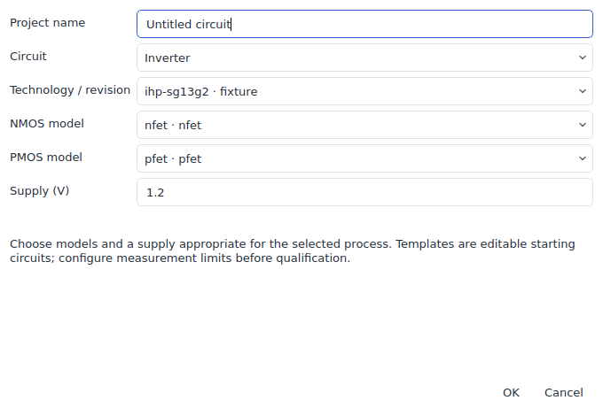
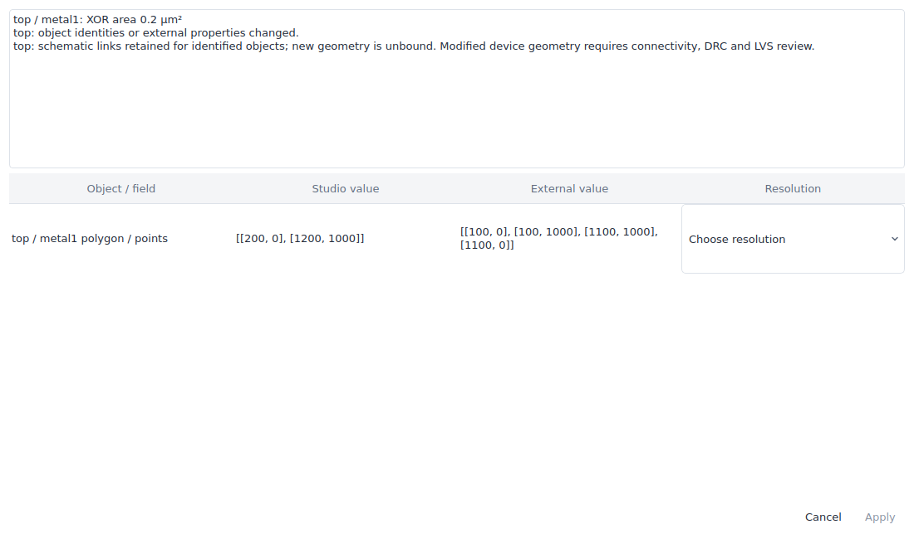

# Xschem, Magic and KLayout exchange

Circuit entry points are technology agnostic. **File → New project** chooses an empty circuit, RC filter, inverter, ring oscillator, current mirror or differential pair first. The dialog then selects a registered **Technology / revision**, catalog models and supply. **File → Examples** uses the same dialog. Registering another catalog adds it to that secondary selector without adding menu actions or code branches.

All registered PDKs use this path, including SKY130, GF180 variants and IHP. Templates use the chosen model's terminal order, dimensions and emission scale. Supply voltage is explicit; an unavailable model is explained instead of being replaced with another process's model. A template is a starting circuit, not a qualified reference measurement.



The screenshot uses a small IHP-named test catalog to demonstrate selection; it does not represent process qualification.

## Shared PDK contract

**Tools → External tool exchange → Export tool technology package** writes:

| File | Meaning |
| --- | --- |
| `interoperability.json` | Versioned process identity, revision, file-lock digest, database units, grid, layer purposes, device terminal orders and parameter semantics |
| `technology.lyt` | Portable KLayout technology with relative layer-style path |
| `layers.lyp` | Layer/datatype names, visibility and colors |
| `technology.json` | Studio technology descriptor |

A PDK package can declare the optional `technology.interoperability` object. Names and asset paths are examples; use the actual package's model keys and locked files:

```json
{
  "version": 1,
  "global_nets": ["0", "VDD"],
  "net_aliases": {"VSS": "0"},
  "layer_purposes": {"m1": "drawing", "m1_pin": "pin"},
  "port_layers": {"m1": "m1_pin"},
  "devices": {
    "nmos_model_key": {
      "body_terminal": "b",
      "width_basis": "per_finger",
      "finger_parameter": "nf",
      "multiplicity_parameter": "m"
    }
  },
  "tools": {
    "magic": {"technology": "libs.tech/magic/process.tech", "drc_style": "drc(full)"},
    "netgen": {"setup": "libs.tech/netgen/process_setup.tcl"}
  }
}
```

Electrical model names, parameter scales and terminal order come from the existing simulation catalog. Body and finger semantics are declarations for review; they do not synthesize unimplemented geometry recipes. Aliases are explicit and cycle checked. They are used for interface comparison and are not silently applied to a design's nets. Every automatically resolved engine asset must match the exact PDK file lock.

The saved-bench physical flow now accepts a registered process with explicit locked Magic and Netgen bindings. That does not create new native device generators or make a process's rule deck available. Existing native recipe support remains separately reported in PDK capabilities.

## Reviewed layout edits

Export GDS or OASIS and keep the adjacent `.icstudio.json`, `.exchange.json` and `.report.json` files. Edit the layout in the external tool, then choose **File → Import → Review imported layout changes** in the current Studio project.

Review compares three documents: the export baseline, the current Studio project and the external edits. Independent edits merge. Competing edits to the same field require **Keep Studio edit** or **Use external edit**. Applying is one undoable transaction. Project, candidate and source-file checksums are rechecked at Apply. Changing the PDK or altering the baseline blocks the merge.



Identified shapes and instances retain IDs and schematic links. Copied shapes and placements get new identities without schematic links; ambiguous copied IDs stop review. New geometry has deterministic IDs, so repeating the same review is idempotent. Moving linked geometry does not certify connectivity: the review flags it and the new project revision makes prior verification stale.

GDS drawing properties 125/126/127 carry owning-cell, instance and shape identities. OASIS also retains cell properties. External object properties are retained where the target stream format supports them. GDS does not support arbitrary cell properties; use OASIS for those. Objects whose identity properties were stripped can only be reconciled by an unambiguous existing geometry/placement match. Missing external cells are retained and reported, rather than deleting their schematic views.

External layout imports retain the exact original bytes. Unsupported native transforms or precision open a conversion dialog: explicitly choose a top cell, flatten it and round to the 1 nm native grid. The original remains recoverable through **Restore original layout file**. Conversion has bounded hierarchy and geometry budgets.

## Xschem

Native capture/migration preserves ordered scalar terminals, hierarchy, instance parameters, custom symbol artwork and captured model dependencies. `spice_sym_def` can derive terminal order from a literal subcircuit or its captured include closure. Conflicting interfaces stop migration. Explicit global nets retain their scope through hierarchy, flattened netlists and cross-probing. Library globals remain inside their original `.lib` sections.

Native device emission supports separate `format` and `lvs_format` definitions. Native LVS export wraps the selected top in a subcircuit and omits simulation control/analysis programs. Xschem export/reimport retains both formats.

**Netlist with Xschem** executes the installed engine for vector buses, generated symbols and Tcl formats. It captures the source directory, declared library folders, bundled standard symbols, explicit startup configuration, engine identity, command, logs and output checksums. The selected startup file executes only when the user runs that workflow; ordinary import does not execute Tcl. Dynamic dependencies outside the captured roots require additional library roots. Native graphical editing remains scalar; the external engine is the path for full vector/Tcl semantics. The generated SPICE can be used by the existing external-testbench workflow, or imported when it meets the editable SPICE subset.

Each run uses its own temporary directory. An empty netlist, unresolved Tcl output or a reported engine error marks the run as failed even if Xschem exits successfully. The failure includes a diagnostic and preserves `engine.log` with the captured inputs.

## Magic

**Open Magic workspace** captures the current project and matching technology support folder, then creates native `.mag` cells and an extracted deck. Assigned labels are promoted to ports, ordered to match the schematic, and retain declared class/use/shape attributes. The extracted top's port sequence is checked, not just its set of names.

| Profile | Settings |
| --- | --- |
| `lvs` | Hierarchy on, blackbox off, device merging off, scaling off, capacitors and lumped resistance filtered |
| `capacitance` | Same identity settings, capacitance threshold zero, distributed resistance off |
| `rc` | Zero capacitance/resistance thresholds, explicit `ext2sim` / `extresist all` / `ext2spice extresist on` sequence |

The exact settings are retained. RC extraction behavior and numerical accuracy still depend on the chosen engine version and matching technology deck.

Open the generated cells in Magic and save edits. **Review Magic workspace edits** captures the edited native tree and produces `edited.gds` with the original baseline. Select it in layout review. Magic's native instance names preserve Studio IDs via legacy GDS property 98; reimport also accepts standard property 61 from newer Magic versions. Keep those names when moving an existing instance. New copies remain separate objects.

## KLayout LVS

**Run KLayout LVS** captures a selected `.lvs` script and its dependency folder and runs it in a queued worker. The script receives `$input`, `$top`, `$schematic` and `$report`. It must write its comparison database using `report_lvs($report)`. The captured rule folder is the working directory. Rules, source layouts, reference netlists, engine identity and comparison databases remain with the result.

**Open KLayout LVS database** reads `.lvsdb` circuit, net, device, pin and instance comparisons, including layout net geometry. Double-click a row to navigate; repeated physical cells require choosing an occurrence. Queued results include unambiguous emitted-device mappings back to schematic objects. A standalone external database has no trusted Studio revision association; use a matching project. Changing the project after opening a report blocks cross-probing.

## CLI and checks

Run `python -m icstudio.cli <command> --help` for `xschem-netlist`, `magic-workspace`, `magic-workspace-export`, `layout-review`, `tool-technology`, `pdk-template` and `klayout-lvs-report`.

Regression coverage includes concurrent edits and conflicts, copied IDs, property-only edits, stale/corrupt baselines, locked assets, reordered ports, scalar globals, separate LVS formats, subcircuit pin order and explicit geometry conversion. The same template tests use five small catalog fixtures, including a future process ID; those fixtures are API coverage, not real-PDK electrical qualification.

KLayout tests extract a resistor from geometry, compare an independent SPICE reference and detect an injected resistance mismatch. Magic tests create native ports and cells, move a native instance and recover its identity. The external-engine CI workflow installs Magic, Xschem and ngspice and exercises vector/Tcl netlisting plus native migration simulation. Desktop tests exercise the secondary selector, conflict choices and undo and retain screenshots as CI artifacts.

Both verification workflows run on pushes to `experimental`; no pull request to `main` is needed. Linux and Windows desktop jobs run independently. The external-engine workflow retains test inputs and engine logs in its artifact, including failed runs. Git checkout preserves exact source bytes on every platform so bundled-library and original-schematic checksums remain valid on Windows.
