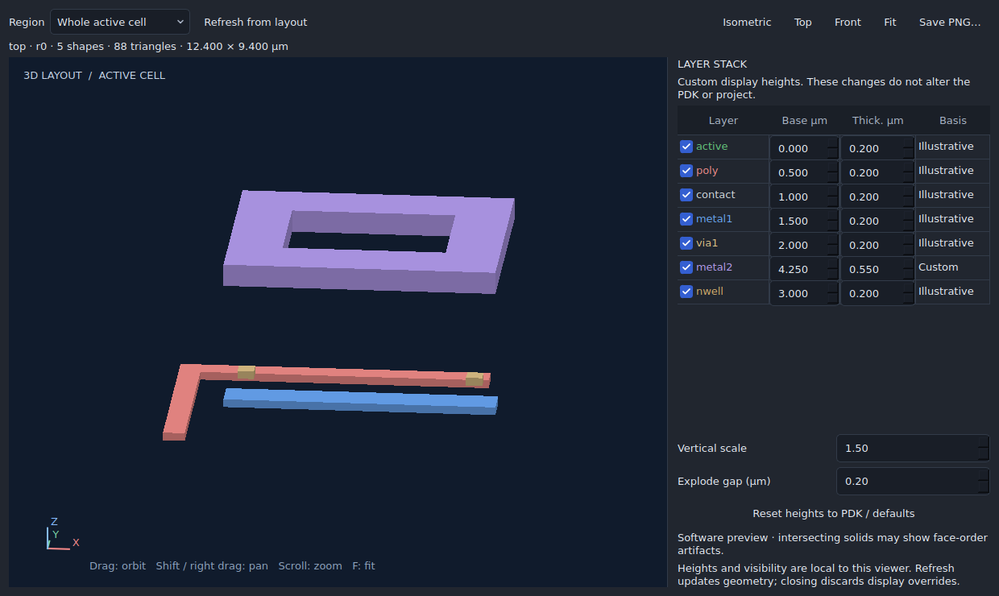

# 3D layout viewer

Open **Layout → 3D layout viewer…** or find it in the command palette. The
separate window shows an extruded snapshot of the active cell, including nested
instances, regular arrays, rotations, mirrors, paths and polygon holes. It uses
the PDK's layer colors. Layout text, pin labels and schematic symbols are not
solid geometry and are not drawn in 3D.



| Control | Action |
|---|---|
| Left drag | Orbit around the layout |
| Shift-drag, right drag or middle drag | Pan |
| Mouse wheel | Zoom |
| Fit / F | Center and fit visible geometry |
| Isometric / 1, Top / 2, Front / 3 | Set the camera direction |
| Layer checkbox | Show or hide a layer |
| Base µm / Thick. µm | Change its display elevation and thickness |
| Vertical scale | Exaggerate vertical dimensions |
| Explode gap | Separate successive layers for inspection |
| Refresh from layout | Replace the snapshot with the current active cell |
| Save PNG | Save the view together with region, revision and stack information |

The viewer is read-only. Its display controls do not change layout, PDK metadata,
connectivity, undo history or saved project data. Edits in the main window mark
the snapshot as stale; click Refresh to update it. Refresh retains display
overrides within the same project and PDK. Reset restores PDK/default heights;
closing the window discards overrides. Switching projects or changing PDK stack
metadata resets the stack. A failed refresh clears the old geometry.

## Layer heights

Without supplied heights, layers are placed in PDK list order at 0.5 µm intervals
with 0.2 µm thickness. **These are illustrative defaults**, including for implant,
well and cut masks. They do not describe a fabricated device. The viewer does
not simulate oxidation, etching, sidewall taper, dielectric fill or device physics.
No substrate or dielectric geometry is invented. Overlapping shapes remain
independent extrusions.

A technology package's `technology` object (the project's `pdk` object) can
provide this optional metadata:

```json
{
  "stack_3d": {
    "source": "Document and revision supplying these dimensions",
    "layers": [
      {"layer": "metal1", "z_um": 0.7, "thickness_um": 0.3},
      {"layer": "via1", "z_um": 1.0, "thickness_um": 0.5},
      {"layer": "metal2", "z_um": 1.5, "thickness_um": 0.4}
    ]
  }
}
```

Names must match the actual PDK layer names. Each entry must be unique. Base
elevation is finite within ±100,000 µm; thickness is 0.001–100,000 µm. Missing
layers keep illustrative defaults and are labeled individually. Malformed
metadata is rejected when opening the viewer. “PDK” identifies the source of
the dimensions, not foundry qualification. Display edits are labeled Custom.
XY coordinates retain the layout's integer-nanometre geometry and are converted
to micrometres; mesh coordinates use a local origin for precision far from zero.

## Large layouts and graphics

Start with **Whole active cell**. If it exceeds the detail budget, zoom into the
desired area in the 2D layout, select **Current 2D viewport**, and refresh after
subsequent 2D pans or zooms. Shapes are clipped to that rectangle, including
new cut faces at its edges; the viewer labels this as a cropped region. The 3D
layer checkboxes are independent of the 2D layer filters and hierarchy depth.

Hierarchy stays in KLayout's spatial database during region queries. The viewer
refuses more than 12,000 queried shapes, 20,000 input vertices or 60,000 output
triangles, with an actionable message and no partial rendering. A million-instance
array can be inspected through a small region without expanding the whole array.
These limits bound per-view detail; they are not a frame-rate guarantee. Hide
layers for clarity; use a smaller region to reduce mesh generation work.

Desktop OpenGL uses a depth buffer for solid occlusion. Qt's offscreen/minimal
platforms and systems without a usable context use a software preview. Software
preview preserves extrusion geometry and holes but sorts faces and can show
occlusion artifacts between intersecting solids. The active renderer is shown
below the stack controls. No additional Python package is required.

## Verification

```sh
python -m unittest discover -s tests -p test_layout_3d.py -v
QT_QPA_PLATFORM=offscreen python tests/gui_layout_3d.py --out build/layout-3d-evidence
QT_QPA_PLATFORM=xcb LIBGL_ALWAYS_SOFTWARE=1 xvfb-run -a -s '-screen 0 1440x1000x24' python tests/gui_layout_3d.py --require-opengl --out build/layout-3d-opengl-evidence
```

The last command requires Xvfb and Mesa on Linux. CI runs software-view acceptance
on Linux and Windows and requires real OpenGL context/shader/framebuffer execution
through Mesa on Linux. Geometry tests independently check cap area, outward
winding, enclosed volume, holes, clipping, units and hierarchical transforms.
Desktop tests exercise controls, snapshot refresh, PNG output, close/reopen and
bounded million-instance inspection. Reports and screenshots are retained with
the desktop workflow artifacts. Hardware-specific driver qualification remains
separate from the Mesa execution.
