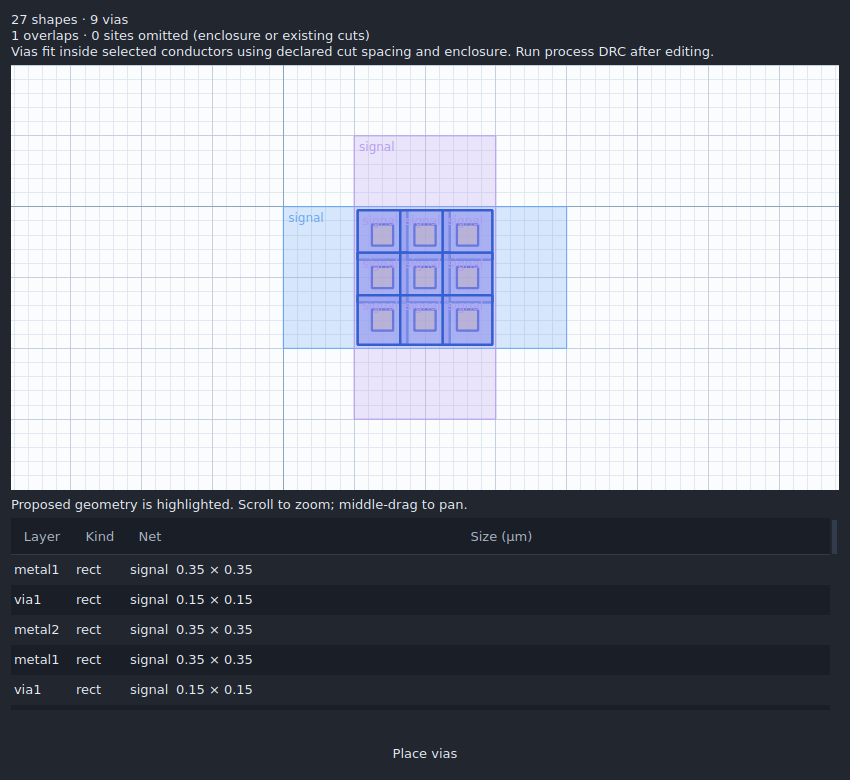

# Vias and Autovia

## Place a via

1. Open **Layout** and choose **Via** in the drawing toolbar, or **Route → Place via**.
2. Choose the conductor connection in the **Via connection** dropdown. Changes apply immediately to the preview and the next click.
3. Enter an optional net, then click on the layout grid. Each click creates the cut and both conductor pads as one editable via group. **Escape** exits placement.

For an exact location, choose **Route → Place via… → Coordinates** and enter X/Y in micrometres. Canvas and coordinate placement both honor layer locks and the enabled preview checks. A blocked placement displays its reason. Undo removes the complete stack.

The generic teaching technology supports metal1/via1/metal2. A mapped SKY130A technology supports M1/M2 and local interconnect/M1; mapped GF180MCU C supports M1/M2. These geometry operations do not require installed Magic or Netgen files. Running physical verification still requires the matching locked decks and engines.

Older attached native projects, including the dev20 overvoltage bench, can retain a generic technology name even though their schematic library identifies SKY130. Via tools recover the family from the saved library variant and use the imported GDS mask mappings. The recovered definitions persist with the first via edit; they do not create a physical PDK lock or change qualification status. Explicit `routing_vias` definitions take precedence. Layer numbers alone never select a process.

## Fill an overlap automatically

1. Select two or more overlapping conductor shapes in the active cell. Use **Shift-click** to add to the selection, or box-select the conductors. Exclude existing cuts and physical instances.
2. Choose **Autovia** in the drawing toolbar, or **Route → Autovia…**. Keep **Detect from selection**, or choose a specific connection.
3. Review the highlighted via arrays and their count in **Autovia preview**.
4. Choose **Place vias**. The entire operation has one undo step and is retained when saving and reopening the project.



Autovia places centered regular arrays where both conductor enclosures fit entirely inside the selected overlap. It checks actual polygons, including path geometry, concave edges and holes. It preserves existing cuts and their spacing, including cuts inside child instances. Child geometry is checked but not changed.

Different named nets cannot be joined. Checks include labels elsewhere on a connected conductor, assigned schematic terminals, cell ports, and a blank conductor that would bridge two named nets. Selecting overlapping unlabelled conductors expresses intent to connect them; give them net labels or assign terminals when circuit intent must be checked.

Net checks follow the project's declared conductor and via mappings. Include additional routing layers in the connectivity descriptor when those layers participate in the circuit.

The operation supports 2–200 selected local conductor shapes, at most 20,000 candidate sites, and a default maximum of 1,024 vias (adjustable to 4,096). Large selections or a via count above the limit are rejected before any edit. An overlap too narrow for the pads, or already occupied by cuts, produces no new via. Preview installation rejects intervening design changes and newly locked layers.

This is conservative array placement in selected overlaps. It does not route between separated conductors or promise optimal packing in irregular polygons. Run process DRC and connectivity checks after editing; these local geometry checks do not establish full process signoff.

## Technology definitions

Other mapped technologies can declare `routing_vias` in their technology descriptor. All lengths are integer nanometres:

```json
{
  "routing_vias": [
    {
      "name": "M1 to M2",
      "lower": "metal1",
      "cut": "via1",
      "upper": "metal2",
      "size": 150,
      "enclosure": 100,
      "spacing": 150
    }
  ]
}
```

This example is the generic teaching geometry. Use values qualified for your own technology. A cut must have positive size, centered vertices on the technology grid, and pads at least as wide as both conductor minimums. Names must be unique. Autovia requires positive cut spacing and uses the larger of recipe spacing and the cut layer's declared spacing. The mapped connection is added to the project's connectivity metadata when vias are placed. A bare GDS import needs explicit technology mappings before using these tools.

The existing native single-cut/pad dimensions are retained. SKY130 array spacing uses 170 nm for via and 190 nm for mcon, from [SkyWater periphery rules via.2 and ct.2](https://skywater-pdk.readthedocs.io/en/main/rules/periphery.html). GF180 uses the same 260 nm via spacing as the repository's [GF180 geometry adapter](../icstudio/gf180_layout.py).

## Verification

```sh
python -m unittest discover -s tests -p test_layout_vias.py -v
QT_QPA_PLATFORM=offscreen python tests/gui_layout_vias.py --out build/layout-vias-evidence
```

The Qt test uses actual toolbar/dropdown/dialog controls and mouse clicks. It checks both SKY130 connections, generic manual placement, locked-layer rejection, coordinate placement, Autovia preview/install, geometric connectivity, undo/redo and native save/reopen. Core regressions also cover holes, paths, negative coordinates, exact enclosure fits, existing hierarchical cuts, net conflicts and stale proposals. Desktop CI runs the Qt test on Linux and Windows and retains its report and screenshots. Offscreen Qt execution is distinct from native display or external process DRC qualification.

Pass `--project path/to/overvoltage-bench.icproj` to additionally check manual placement and Autovia in a copy of the real imported `level_shifter` cell. Physical CI runs this against the generated detector bench. It verifies the SKY130 mask mappings and restores the imported cells through undo; the fixture file is never overwritten.
