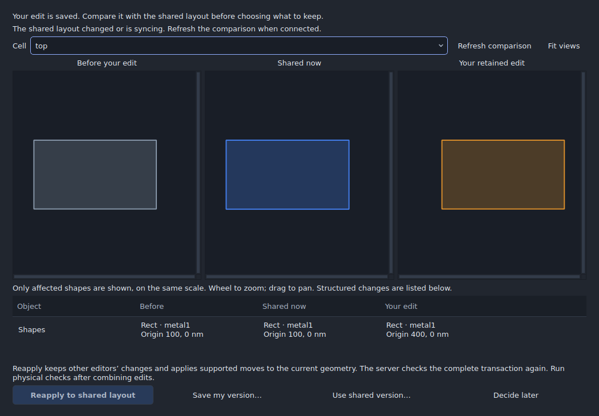

# Live desktop schematic and layout collaboration

## Submitted review recovery in dev19

The dashboard now persists submitted review actions before sending and restores
them on resume. Retry retains the same request ID across a lost acknowledgement;
read refreshes do not clear it. See [review recovery](REVIEW_RECOVERY.md) for
supported actions, explicit discard and the distinction from unsent drafts or
offline design editing. Physical LAN/VPN acceptance remains separate from the
automated two-desktop HTTPS checks.

This experimental feature shares schematics and layouts through a self-hosted server. Open
**Tools → Collaboration → Host a session…** to share on your local network or
VPN. Choose a permission and copy an expiring invitation. A collaborator pastes
the complete link into **Join a workspace** in the desktop app. Existing team
servers remain available through **Use an existing team server…**. Their browser
invitation page can also launch the installed desktop application.

This repository supplies the server and desktop client. It does not supply a
running public service. A host must run the server at an address collaborators
can reach. Browser links launch the installed desktop app; there is no browser
design editor. The earlier shared-folder collaboration remains available under
the dashboard’s **Shared folder** tab.

## Revision-based team review

Open **Tools → Collaboration → Team review** to create immutable named checkpoints, attach comments to objects, compare revisions, record decisions and share completed simulations or physical runs. Teammates can reproduce saved inputs with their own configured engines and matching PDK. The [workflow guide](PROFESSIONAL_WORKFLOWS.md#team-review) describes permissions, retry behavior and storage limits. Use dev16 for [reviewer permissions and threaded discussions](WORKFLOW_REVIEW_0.22.md); it upgrades the server database to version 3 while retaining document protocol 2. See [schematic collaboration](SCHEMATIC_COLLABORATION.md) for the complete editing and review workflow.

## Find your way around

All collaboration commands are grouped under **Tools → Collaboration**. The
command palette and status-bar button open the same dashboard.

| Dashboard area | What you can do |
|---|---|
| **Start and resume** | Share, join, or resume a recent workspace without finding recovery files |
| **Live workspace** | See teammates, recent edits, and who has reserved a cell, net or object |
| **Invite people and manage access** | Create/revoke invitations, or save a copy and delete an owned workspace |
| **Review conflicting edit** | Compare original, shared and retained geometry before choosing a resolution |
| **Shared folder** | Create/join a folder, claim cells/layers, publish, refresh and leave |
| **Back to design** | Close the dashboard while collaboration continues |


## Start a local server with a button

In dev17, open **Tools → Collaboration → Start and resume → Start local
server**. The included server starts in the background. Enter your name and
choose **Start sharing**. The app creates and supplies the workspace creation
key automatically; no script, Python installation or file copying is needed in
the packaged desktop app. The same button is available in **Share this project**.

This server accepts connections **only from this computer**. Invitations work in
another IC Design Studio window on the same computer. To collaborate with people
on other computers, use the dev18 **Host a session…** workflow below, or choose
**Use a team server** and enter your team's reachable HTTPS server address and
administrator key. Switching to a team server clears the automatic local key.

Keep IC Design Studio open while hosting. Closing the dashboard leaves the
server running; exiting the application stops it. **Stop local server** stops
hosting after you leave local workspaces in this application. Workspaces, keys,
invitations and accepted edits remain saved in the application's private data
folder under `local-collaboration`. **Resume workspace** starts this saved
server again automatically and restores the session, including personal undo.
Owner recovery fills the key automatically while the local server is running.

The app chooses an available loopback port on first use and retains that address
for existing invitations and sessions. If another application occupies that
address later, close that application and retry. An inline error explains
startup failures; saved server data is retained. Only one app instance may host
the same local server data at once. This does not provide public hosting, a
network tunnel, or automatic HTTPS setup.

## Host a session on your network

Use dev18 or later on both computers. No scripts or manual certificate/key copying
are needed in the packaged application.

1. Open your project and choose **Tools → Collaboration → Host a session…**.
2. Choose your local network or VPN interface, enter your name, and select
   **Start hosting and share project**. The app generates the encryption
   certificate and creation key, starts the server, and checks the connection
   from your computer.
3. Choose **Can edit schematics and layouts**, **Can review and comment**, or
   **Can view**, then **Create and copy invitation**. Send the complete invitation
   to your teammate. It expires in seven days; **Manage invitations…** offers
   other expiry periods and revocation.
4. Your teammate opens **Tools → Collaboration → Join a workspace**, pastes the
   invitation and chooses **Check connection first**. This checks their encrypted
   connection without joining or sending workspace credentials. They then enter
   their name and join.
5. Your hosting screen changes from waiting to **Teammate connection confirmed**.
   Choose **Back to design** to continue working while hosting.

Keep the host application running. Closing its dashboard leaves hosting active;
exiting the application stops it. After leaving hosted workspaces, **Stop network
server** stops listening without deleting saved data. **Resume workspace**
automatically restarts an owned network host and preserves personal undo. If its
private IP address changes, the app renews its address certificate while retaining
its host identity, port and workspaces; copy a fresh invitation for other computers.

Both computers need a route to the selected private IPv4 address. This works on a
local network or a VPN that permits device-to-device connections. If a connection
fails, the screen shows the port to allow through the host firewall on that trusted
network. Guest Wi-Fi may isolate devices. A successful host self-check does not
prove a teammate can reach it. The wizard does not configure firewalls, routers,
port forwarding or an internet relay; use a reachable team HTTPS server for
networks that cannot connect directly.

The app stores the host identity, private keys, creation key, database and port
under its private `network-collaboration` data directory. Back up that entire
directory with the server stopped. Do not share its private key files. The
invitation contains only the public host authority and expiring join credential;
certificate trust is limited to requests for that session's server. Certificate,
hostname and validity checks remain enabled, with no system trust-store changes.
The server certificate renews automatically near expiry; the persistent host
authority lasts ten years. A bad clock or damaged identity produces an error
instead of silently replacing the authority. The old loopback and publicly
trusted HTTPS invitation formats remain supported.

## Edit annotations directly

In the schematic canvas, click an annotation to highlight and select it. Drag to
move it, Shift-click to add it to a selection, or draw a selection box around
several notes. Double-click a note or press Enter to open its text and position
in the inspector, then choose **Apply changes**. **Reset** discards the draft.
Press Delete on the canvas to remove selected notes, or use **Delete annotation**
in the inspector. Undo restores them. While typing in the text field, Delete edits
the text. Duplication creates independent notes with new identities. The
**Annotations** selection filter lets you select circuitry beneath a note.

These edits synchronize through both live and shared-folder workspaces. Notes
remain part of cell metadata in document protocol 2, so simultaneous annotation
or metadata changes use conservative conflict checks. They are not electrical
net labels. Layout text keeps its existing Labels selection and property controls.

## Start a team server (administrator setup)

Use Python 3.12 with the application's `requirements.txt` installed:

```sh
python -m icstudio.live_server --data ./private-live-data
```

The server listens on `http://127.0.0.1:8765`. This address is useful for testing
two desktop windows on the same computer. The server creates
`private-live-data/creation-key.txt`; enter its contents in the **Workspace
creation key** field when sharing a project. Keep this key with the host. Invitees
receive invitation links, not the workspace creation key.

For other computers, configure a trusted HTTPS reverse proxy for a dedicated
origin, forwarding to the loopback listener, or supply a valid TLS certificate:

```sh
python -m icstudio.live_server --data ./private-live-data --listen 0.0.0.0 --port 8765 --certfile fullchain.pem --keyfile privkey.pem
```

Use the reachable HTTPS origin in **Share this project**, for example
`https://layout.example.org`. A reverse proxy must allow 16 MiB JSON requests and
forward the `Authorization` header. Do not cache API responses. Direct HTTP is
accepted by the desktop client only on loopback addresses; non-loopback server
listeners require TLS. Certificate verification is never disabled. Firewall,
DNS, certificate renewal and server availability are managed by the host.

The application entry point also accepts `python main.py --collaboration-server
--data ./private-live-data`. The packaged application includes these modules,
though running a source Python server gives the host a visible console.

## Share and join

1. Open a project and choose **Share this project**. Enter the server origin, creation
   key and your name. Sharing copies the current project into a new workspace.
2. The **Live workspace** tab lists teammates, reservations and recent edits. Choose **Invite people and manage access**, then an
   invitation permission and expiry (1–30 days), then **Create and copy invitation**.
3. Send the link to your collaborator. Anyone holding that link can join with its
   permission until it expires or is revoked. Names are display names, not
   independently verified identities.
4. Invitees choose their name and join. Schematic and layout edits and presence update
   automatically. Colored cursors and selection outlines identify participants
   viewing the same cell. Switch between schematic and layout without leaving. PDK settings stay fixed in the shared session.
5. Select an invitation and choose **Revoke selected invitation** to prevent new
   joins and invalidate existing sessions created through it. Revocation cannot
   erase project copies already downloaded by a recipient.

The Windows installer registers the `icstudio://` invitation handler and removes
it on uninstall. Source checkouts, portable packages, Linux and macOS can always
use the in-app **Join a workspace** command. They can also launch directly:

```sh
python main.py --join "FULL_INVITATION_LINK"
```

The browser landing page keeps the invitation credential in the URL fragment;
the server does not receive it in the landing-page request. The landing page
does not load third-party scripts or send invitation data to another service.
Opening a link starts a separate desktop window and asks for the participant's
name before joining.

## Editing, reservations and undo

Editors can change different objects in the same cell and on the same layer.
Selections reserve existing objects for 12 seconds, renewed while selected;
deselecting or leaving releases them. A disconnected editor's reservations
expire automatically. Generated geometry, instance/port changes and other
structured layout collections reserve the whole affected cell. Objects with the
same explicit net name also share a reservation and conflict boundary. This is
deliberately conservative for connected edits and generated footprints.

Every edit is one validated server transaction. If another editor changes an
affected object or connected group after the client's base revision, the server
rejects the edit. Reservations are checked again when committing; a race while
acquiring a selection never grants permission to overwrite another edit.
Connected moves and generated edits commit their complete change sets together.

The reservation table names the owner and affected scope, including whole-net
or whole-cell reservations, and shows the remaining lease time. Selecting an
object still reserves it; this release does not change the conflict boundaries.

**Undo and Redo apply to your accepted edits only.** They preserve disjoint edits
by other participants and reject overlapping intervening edits, even when another
person moves geometry away and then back. Each session retains up to 100 personal
undo operations. Rejoining through a link creates a new identity; use **Resume
saved live session** to retain your existing personal history.

Layout transactions still require ordinary DRC/LVS and connectivity review.
Object conflict detection does not prove geometric spacing, manufactured device
correctness or foundry signoff. Technology changes and existing-object/cell reordering require leaving the session. Schematic editing, cell creation/deletion and supported symbol/port changes synchronize through the same transaction history. Existing
layout text collections are treated as one atomic collection because they do
not yet have stable individual IDs.

## Connection loss and recovery

The client sends asynchronous HTTP updates every 500 ms while connected, backing
off to eight seconds during an outage. Unchanged polls omit project data. This
is polling-based live collaboration, not WebSocket/CRDT replication. Network
I/O never blocks the Qt event loop. Incoming geometry is deferred while a drawing
gesture or inspector edit is in progress.

One local edit may await acknowledgement at a time. The client saves its request
ID and proposed change before sending it. If the acknowledgement is lost, retrying
that request returns the already committed result without applying the edit
again. New edits pause until the pending transaction is settled. This version
does not support accumulating independent offline edits.

The private `live-sessions` folder under the app's user data directory retains
session credentials, pending edits and conflict snapshots. **Resume workspace**
in the dashboard recovers one after restarting the app. Treat these files as credentials;
do not commit, email or upload them. They are separate from normal `.icproj`
documents. Active sessions renew their seven-day inactivity expiry, but invitation
expiry and revocation still apply.

The dashboard discovers saved sessions in the background; choose **Resume
workspace** to reopen one. Idle presence updates do not rewrite the full project
journal.

When a conflict occurs, the proposed project remains in the private recovery
journal. **Review conflicting edit** opens a read-only comparison of the original,
current shared, and retained design on a common scale. Choose the affected cell
and Schematic or Layout view, zoom or pan, and inspect object summaries. Structured objects are listed; their
generated geometry is not reconstructed in this comparison.

**Reapply to shared design** accepts unchanged targets and supported translations
of ordinary shapes, retaining shared changes. It rejects unsupported overlapping
changes, deleted targets and conflicting generated geometry. The complete proposal
is one server-validated transaction; a newer shared revision requires refreshing
the comparison. The conflict is retained until acknowledgement, including across
connection loss. This does not establish DRC/LVS correctness.

**Save my version** writes an independent `.icproj` copy. **Use shared version**
asks before discarding the retained edit. **Decide later** keeps the journal.
**Leave workspace** preserves the displayed project for ordinary local editing.



## Recover ownership and remove old workspaces

An owner who returns after the seven-day session expiry can choose **Recover
owner access** beside the saved workspace or in the disconnected live session.
Ask the server administrator for the workspace creation key. Recovery rotates
the owner's session credential while preserving the actor identity, accepted
edits, retry IDs and personal undo. Invitations and expired session tokens cannot
authorize this operation. The previous owner session token becomes invalid.
This recovery flow needs the saved owner journal; invitation-based rejoining
does not restore ownership. View/edit invitees need a valid invitation to rejoin.

To remove an unused workspace, open **Invite people and manage access → Save a
copy and delete workspace**. After confirmation and a successful local save, the
server removes that workspace, invitations, sessions and shared history in one
transaction. Deletion requires ownership and the same shared revision as the saved
copy; intervening edits reject it. It frees a workspace slot. Other participants'
already-downloaded files are unaffected. Full archive/restore and ownership
transfer are not part of this release.

## Server persistence and limits

Dev15 upgraded the server database and shared-folder journal to version 2.
Dev16 upgrades only the server database to version 3 for reviewer permissions
and threaded discussions; see [the upgrade notes](WORKFLOW_REVIEW_0.22.md#upgrade-and-compatibility). All
clients must update together. Existing projects, sessions and history are kept;
old HTTP clients receive an update message. See [upgrade details](SCHEMATIC_COLLABORATION.md#updating-an-existing-team).

SQLite stores accepted projects, edit history, request IDs, invitations and
session identities in atomic transactions with full synchronization. Server
restarts preserve accepted edits and personal history. Credentials are hashed
in the server database; the creation key is a separate host-only file. Presence
is transient. Claims expire after a crash. Keep the private data directory on
storage with reliable local filesystem semantics; use a SQLite-consistent backup
or stop the server before copying its database and WAL files.

This prototype bounds each project to 8 MiB and 20,000 stored schematic and layout objects,
each edit to 2,000 changed objects, and requests/responses to 16 MiB. Hierarchical
arrays retain their compact stored representation. Each workspace permits up to
100 sessions and 100 active invitation links; the server permits 100 workspaces
and 16 concurrent HTTP requests. These are safety bounds, not measured service
capacity guarantees. History storage grows with accepted transactions; the host
must monitor disk capacity and retain backups. A disk failure cannot publish
half an edit, but it prevents further durable changes.

The service has no hosted account management, tenant billing, SSO, internet discovery, NAT traversal, automatic deployment, binary
asset transfer or browser editor. Participants must resolve simulation PDK assets
locally. This is an engineering preview for small trusted teams.

## Verification

```sh
python -m unittest discover -s tests -p test_live_collaboration.py -v
python tests/gui_live_collaboration.py --out build/live-collaboration-evidence
```

For headless runs, set `QT_QPA_PLATFORM=offscreen`. The tests use real HTTP requests,
simultaneous clients, three Qt editor windows, view/edit links, revocation,
reservations, conditional personal undo, server restart, lost acknowledgements
and local-session recovery. The desktop workflow runs these checks on Windows
and Linux. Only screenshots and the non-secret report are uploaded as artifacts;
the generated server database and session journals stay out of release artifacts.
