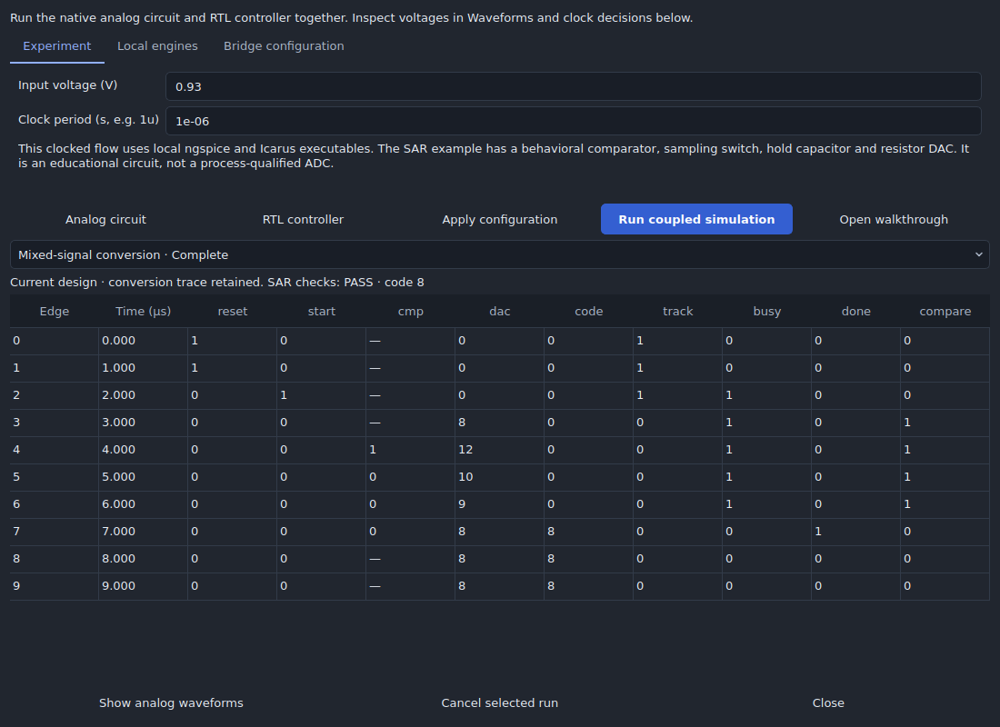
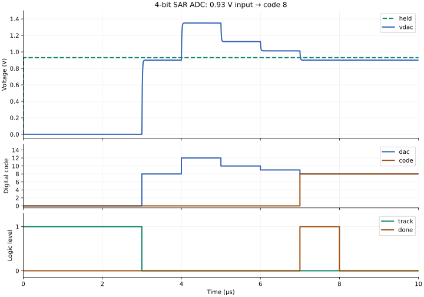

# Build and inspect a four-bit SAR ADC

Choose **Analysis → Mixed signal → New SAR ADC example**. This creates an
independent native project with an editable analog circuit and Verilog controller.
Choose local **ngspice**, **iverilog** and **vvp** executables in the experiment
panel, or leave paths blank to find installed tools. Select **Run coupled
simulation**. The default 0.93 V input should produce code **8** after four
comparator decisions. Saved jobs retain the circuit, RTL, bridge configuration,
engine/source identities, waveforms and the complete decision history.



The initial flow runs native local executables. The separately managed digital
WSL/container runtime is not a backend for this bridge. Use a local Linux
installation or native Windows executables; Windows execution remains subject to
separate qualification. Missing tools produce a setup error, not a substitute
Python simulation.

## Architecture and design targets

This original teaching design uses a 1.8 V range and four output bits:

| Parameter | Value |
| --- | --- |
| Nominal input range | 0–1.8 V |
| Quantization step | 112.5 mV |
| Nominal clock period | 1 µs |
| Start-to-completion latency | Five clock periods: acquisition + four comparisons |
| DAC | Binary-weighted resistors: 80 kΩ, 40 kΩ, 20 kΩ, 10 kΩ, plus 80 kΩ termination |
| DAC load | 2 pF; nominal output resistance 5 kΩ, time constant 10 ns |
| Sampling switch | 100 Ω on, 1 TΩ off; 20 pF hold capacitor |
| Comparator | Behavioral finite-gain tanh transfer, editable input offset, 1 kΩ / 1 pF output pole |
| Digital controller | Synthesizable synchronous Verilog, MSB-first successive approximation |

The resistor conductances sum to 16/80 kΩ, giving
`Vdac = 1.8 × (8·b3 + 4·b2 + 2·b1 + b0) / 16`.
The controller tries the most significant bit, holds the DAC for one complete
clock, samples the comparator, retains or clears that bit, and tries the next.
The Python coordinator exchanges signals; the conversion decisions are made by
the Verilog executed in Icarus. ngspice solves the sampling switch, capacitors,
DAC network and comparator response with their full previous history.



This is a behavioral mixed-signal design, not a transistor-level or
process-qualified ADC. The comparator and switch do not model device noise,
offset distribution, kickback, metastability, clock jitter or charge injection.
The retained tests do not establish ENOB, SNDR, DNL/INL, layout quality or signoff.

## Walkthrough

1. Run the default experiment. In **Show analog waveforms**, select `vin`, `held`,
   `vdac`, `cmp` and `track`. The input is acquired while `track` is high, then held.
2. Inspect **Analog circuit**. Follow Rbit0 through Rbit3 to `vdac`. Open the
   native property inspector to edit values. The named electrical nets connect
   the components; external bridge nodes supply `vin`, `track` and `d0`–`d3`.
3. Open **RTL controller**. Read the IDLE, ACQUIRE and CONVERT states. Apply source
   edits before running again; earlier results retain their original source.
4. Return through **Analysis → Mixed signal → Mixed-signal experiment**. At edges
   3–7 the default DAC codes should be **8, 12, 10, 9, 8**. Completion pulses at
   edge 7, five clocks after `start` at edge 2. Code 8 remains latched afterward.
5. Try 0.4 V and 1.2 V. Expect codes 3 and 10. Run each experiment and compare the
   analog staircase and comparator decisions. At an exact transition either
   adjacent code is physically plausible; an intermediate comparator voltage is
   reported as an ambiguous sample, rather than rounded silently.
6. Change Rbit3 from 10 kΩ to 20 kΩ. The reference conversion check should fail.
   Restore the value with Undo. A completed simulation and a passing ADC check
   are separate states in the result panel.
7. Explore settling: use 0.3 V, a 10 ns period, 100 ps rise and 100 ps maximum
   analog step in **Bridge configuration**. The DAC no longer settles sufficiently
   before comparison. Restore the nominal settings afterward.
8. Test sample-and-hold behavior with `vin` points
   `[[0,0.93],[0.0000035,0.93],[0.000003501,0.2]]`. The input changes after the
   acquisition window, so the conversion should still represent 0.93 V.

The bridge configuration is saved in the project and participates in Undo. Its
node lists run least-significant bit first. Reference voltage in `verification`
is design intent; changing physical DAC drivers does not silently change it.
Use **Cancel selected run** to stop the worker. Save and reopen the project to
revisit captured results; edited inputs mark old results as an earlier design.

## Clocked coupling contract

Version 1 supports one clock, 2–256 edges, scalar thresholded analog inputs and
up to 32-bit digital ports. PWL voltage stimuli and digital-to-analog drivers have
distinct nodes. Clock periods are whole picoseconds; finite rise times and a
bounded maximum analog time step are mandatory.

For edge `k`, SPICE advances the complete input history to `k·period + 1 ps`.
An enabled analog input is low at or below its low threshold and high at or above
its high threshold. Values between thresholds fail the run. Sampling enables
come from the previous edge's RTL outputs; they avoid evaluating the unused
comparator during reset/acquisition. The digital simulator then consumes this
input and emits outputs at `k·period + 2 ps`. Analog drivers begin their declared
ramps at that time. Unknown/high-impedance digital outputs fail the run.

Both engines replay from time zero at each boundary. The entire analog waveform
history is retained, so the hold capacitor is not reinitialized at each bit.
Previous RTL outputs must match the previous prefix exactly. Replay is deliberately
bounded and becomes expensive for long runs; it is intended for small synchronous
experiments. Subcycle output glitches, asynchronous feedback, bidirectional ports
and general Verilog-AMS scheduling require a different integration contract.

Results include standard analog traces and a captured edge table. Each job keeps
`bridge/bridge.vcd`, `bridge-samples.json`, raw SPICE results, netlists, logs,
commands and artifact checksums. Reopening a result verifies its artifacts and
its captured design/configuration identity. A total timeout and the existing
worker cancellation protocol bound execution.

## Reproduce qualification

Install ngspice and Icarus, then run:

```sh
python -m unittest tests.test_mixed_signal -v
python scripts/verify_sar_adc.py --out build/sar-qualification
QT_QPA_PLATFORM=offscreen python tests/gui_mixed_signal.py
```

The qualification script requires real engines. Optional `--ngspice`,
`--iverilog` and `--vvp` arguments select executables. Unit/GUI checks accept
`ICSTUDIO_TEST_NGSPICE`, `ICSTUDIO_TEST_IVERILOG` and `ICSTUDIO_TEST_VVP`.
The numerical campaign checks all 16 code centers, both sides of every transition
at ±0.05 LSB, rails and saturation, an input change during hold, a fourfold finer
time step, and deliberate DAC/RTL/settling faults. The regression suite also
checks back-to-back conversions, saved results, corruption detection and reset.

## Retained validation

The [real-engine campaign](validation/mixed-signal-sar/qualification.json) passed
all **50 input cases**, sample-and-hold and time-step checks, and detected all
three deliberately introduced faults. The changed DAC weight produced code 10
instead of 8; inverted RTL decisions produced 0 instead of 8; a 10 ns clock with
0.3 V input produced 1 instead of 2. These failing circuit results were detected
by the unchanged reference requirements.

The [default conversion](validation/mixed-signal-sar/nominal-edges.json) retains
the measured decision table and capture hashes. The [desktop record](validation/mixed-signal-sar/desktop.json)
covers editing, configuration undo, real worker execution, waveform display,
save/reopen, exact replay and cancellation. The [unit checks](validation/mixed-signal-sar/checks.json)
record the full suite and separately enabled real-engine regressions.

This evidence uses ngspice 42, Icarus 12, Python 3.12 and Qt offscreen on Linux.
[Host details](validation/mixed-signal-sar/host-runtime.json) record the original
engine binary hashes and a host-only scratch-file adapter needed in this execution
environment. The committed desktop workflow repeats the campaign on ordinary
Ubuntu installations and uploads the complete raw run directories. Native Windows
and packaged mixed-signal execution are not established by this Linux record.

Engine references: [ngspice manual](https://ngspice.sourceforge.io/docs.html) and
[Icarus command-line interface](https://steveicarus.github.io/iverilog/usage/command_line_flags.html).
