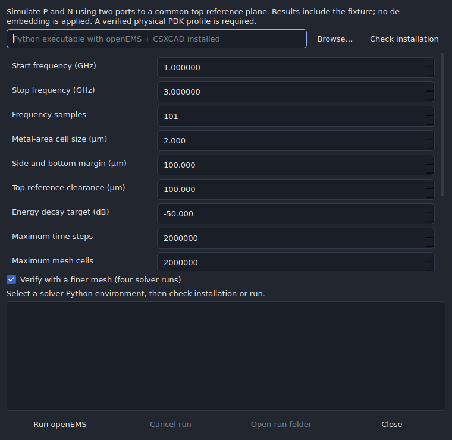

# openEMS inductor simulation

## Quick start

The Windows x64 and Linux x86_64 desktop packages include **openEMS, its Python
bindings and a dedicated Python runtime**. No separate installation, terminal
commands, Python selection or paid simulator is needed. After extracting the
complete desktop download:

1. Create and save an inductor, then open **EM results → Run openEMS…**.
2. Check the physical-layer status. If data are missing, choose **Set up physical
   layers…** to load your process profile or enter its published values.
3. Choose **From / To (GHz)** and click **Run simulation**.
4. When the run finishes, close the simulation window to see L, R and Q versus
   frequency. The result is saved with the project and can be undone.

Studio automatically checks the included solver before every run, prepares the
model, runs both terminal excitations, checks convergence and attaches matching
results. The frequency range and options are remembered. **Verified result** is
the initial default and compares two meshes; **Quick preview** runs one mesh and
clearly marks mesh convergence as unchecked. Cancellation and time limits remain
available in either mode.

**Advanced settings** contains mesh and resource controls, solver selection and a
manual installation check. **Show run details** opens the log; failures open it
automatically. **Open run folder** retains inputs and diagnostics even on failure.

All solver components are open source. The build recipe pins openEMS 0.0.36,
CPython 3.11.16 and compatible Python packages. The runtime is separate from the
application's Python/Qt environment. Original notices, exact openEMS/CSXCAD/fparser
source and dependency provenance accompany it. See [third-party notices](../THIRD_PARTY_NOTICES.md).

Physical process data are still required: installing a solver cannot determine
metal thickness, conductivity, substrate properties or your actual fabrication
stack. Profiles can be saved and reused. Studio identifies missing data directly
and never fills them with guessed foundry values.

## Custom installations and source builds

An existing installation can be selected under **Advanced settings → Solver
Python**. The selection is remembered; `ICSTUDIO_OPENEMS_PYTHON` provides an
explicit override. Missing saved paths fall back to the included runtime. **Use
included solver** restores the packaged interpreter. No global Python, PATH or
registry settings are changed.

To prepare the same runtime from a source checkout, run
`python scripts/stage_openems.py`. Windows requires no solver compiler. Linux
build hosts use the Ubuntu 24.04 development dependencies listed in that script
and in the desktop workflow. End users of the resulting package need none of
those build tools. `scripts/package.py` requires and verifies the included runtime;
a package cannot silently omit it. The separate legacy Windows source assembler
is not the qualified desktop release path.

The upstream [installation documentation](https://docs.openems.de/python/install.html)
remains available for custom installations. `pip install openEMS` alone is not a
supported setup recipe. This integration does not require gds2openEMS, Octave,
AppCSXCAD or a commercial simulator. Automatic WSL path translation is not
implemented. A failed included-runtime check can be repaired by re-extracting the
complete desktop download.

## Physical model and fixture

The selected isolated/context scope and physical profile are snapshotted before
work starts. Conductor/via masks retain their exact polygons, including holes,
physical layer mapping, thickness and conductivity. The driver extrudes those
masks into the declared dielectric/substrate slabs. Coordinates are converted
from nm to µm; the solver grid uses a `1e-6` metre unit. No PDK is identified by a
hardcoded name. Unsupported or incomplete profiles block the run. Refer to the
[profile editor and exchange guide](INDUCTOR_CREATOR.md) for required data.

The automatic fixture has **two vertical 50 Ω ports**, one from each P/N pad to
a common **top PEC reference plane**. Its clearance above the stackup is explicit.
All five spiral shapes and quarter-turn/mirror orientations can use it. A port
that would pass through another conductor is rejected. The other five boundaries
use MUR absorption, with the chosen side/bottom margin. Air fills space outside
the declared slabs.

**Results include this fixture.** There is no de-embedding. Reference clearance,
side/bottom margins and boundary reflections can change L, Q and resonance. Study
them separately before using results as an intrinsic coil model. A finer-mesh
check does not establish fixture or boundary independence. For a different
reference structure, use the external exchange workflow.

Materials are uniform and isotropic. A declared dielectric loss tangent becomes
constant conductivity at the arithmetic band centre, added to any explicit
conductivity: `σ = σdeclared + 2π fcentre ε0 εr tanδ`. This sweep approximation is
recorded with the results. Anisotropic or dispersive materials need a specialized
external model.

## Settings and convergence

Set the frequency band, sample count, metal-area mesh size, margins and reference
clearance. The mesh resolves winding width/spacing, via edges/interiors, metal
thickness and estimated skin depth at the upper frequency. Outside the metal area,
cells may grow to ten times the chosen size, bounded by 20 cells per wavelength
in the highest-permittivity material. Fine features can require millions of cells
and time steps. Cell and wall-time limits stop the job. Reducing the simulation
scope may be more useful than raising a limit.

Start with a moderate frequency span (the default is 1–3 GHz). Very wide Gaussian
excitation bands can leave static charge in low-loss models and stall the energy
decay check. If energy stops falling, inspect the log and characterize narrower
bands; do not treat a time-limit exit as a converged measurement.

**Verify with a finer mesh** defaults on: two terminal excitations at the base
mesh, then two at a 0.7 mesh scale, each in a fresh process. Every solver log must
confirm the requested energy decay. Exit code zero alone is insufficient. The
application compares complex differential Z and R at every sample against the
finer result, with a 1 mΩ denominator floor. Both changes must meet the selected
tolerance before automatic attachment. Disabling this check is allowed and is
recorded as **mesh convergence NOT checked**.

**Cancel run**, closing either dialog, a wall-time limit or application shutdown
stops the current external process and prevents later excitations or imports.
Only one openEMS operation runs at a time. Model preparation and FDTD work execute
outside the UI thread. On completion, the full two-port S matrix is converted with
`Zdiff = Z11 + Z22 - Z12 - Z21`; the application attaches L(f), R(f), Q(f) and any
bracketed SRF in one undoable edit. A changed project, geometry, context or profile
prevents attachment. The schematic inductance is not automatically replaced.

## Retained files

**Open run folder** provides `model.json`, the exact `driver.py`, the original
manifest/GDS/XML exchange, per-excitation XML/probes/logs, and, on success,
`results.json` plus `results.s2p`. Results record model/driver hashes, versions,
fixture dimensions, material approximation, solver settings, mesh sizes and
convergence evidence. Failed mesh comparison leaves `mesh-comparison.json` and raw
excitation data for inspection. Studio does not upload process or PDK artifacts.

The [validation record](validation/openems.json) distinguishes numerical conversion
and lifecycle fixtures from actual native solver execution. These checks do not
qualify a foundry process or establish fabrication/RF accuracy.
