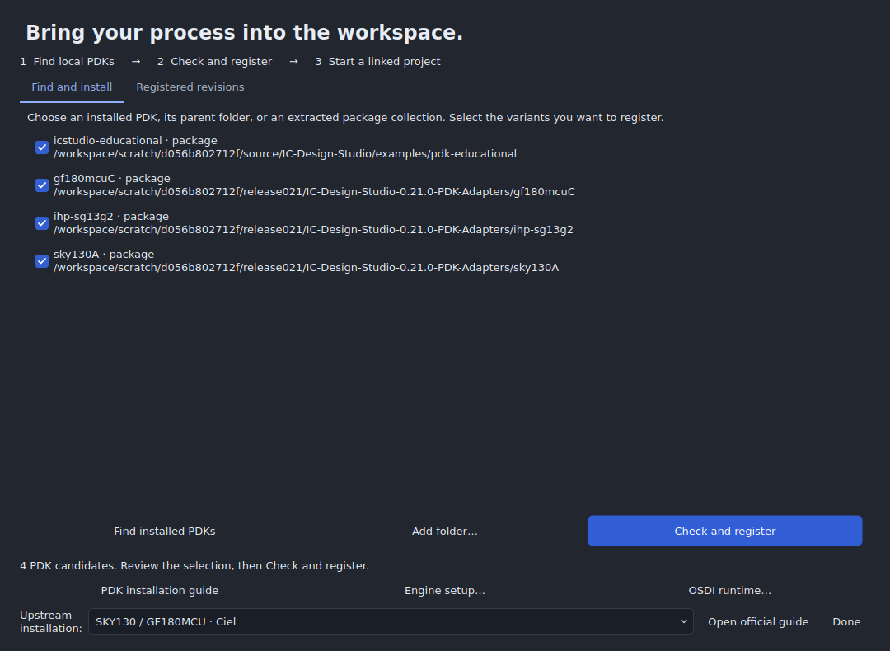

# Open PDK setup

IC Design Studio has stock adapters for SKY130, GF180MCU and IHP SG13G2, plus a checksummed package interface for custom technologies. An adapter maps electrical models, device terminals and layout layers into the app. Successful registration does not prove that a particular model, corner or physical rule deck is qualified.

## Choose the easiest route

| You have… | Use… |
|---|---|
| No PDK and want to learn the interface | The built-in example gallery; no PDK required |
| The release's PDK adapter archive | Extract it, then **Add folder** on its outer collection directory |
| A Ciel installation | **Find installed PDKs**; enabled variant folders are discovered under `PDK_ROOT` or `~/.ciel` |
| An existing open_pdks installation | **Add folder** on the parent directory or a specific variant |
| IHP's tool-ready PDK tree | **Add folder** on `ihp-sg13g2`, then configure OSDI models |
| A raw SKY130/GF180 source checkout | Build it with open_pdks or obtain a prebuilt installation through Ciel first |
| Another process | Supply an explicit technology/package adapter; see Custom PDKs below |

## Register and start a project

1. Choose **Tools → Set up an open PDK**.
2. Choose **Find installed PDKs** or **Add folder**. The assistant inspects a limited set of folders; it does not scan your entire disk. Discovery accepts a variant, a parent of several variants, or a package collection with one archive wrapper directory.
3. Review the checked variants and choose **Check and register**. Model dependencies and asset hashes are checked in the background. One invalid package does not prevent another selected package from being registered; errors remain in the setup report.
4. On **Registered revisions**, select a revision. Read its placeable-symbol count, model corners and physical capability summary.
5. Choose **New project with this PDK**. Open **Devices** to search and place models, select a corner in the Analysis inspector, and save the project.

**Link current project** is available when its electrical and physical mappings are compatible. Existing models or layer numbers are never silently substituted. **Manage / verify revisions** opens verification, relocation and revision-management controls.



## Obtain a tool-ready installation

The official [Ciel README](https://github.com/fossi-foundation/ciel) documents its Linux/macOS package manager and supported families. It can download and enable pinned builds. [open_pdks](https://github.com/fossi-foundation/open-pdks) builds SKY130 and GF180MCU tool installations from source. Follow [IHP's installation instructions](https://ihp-open-pdk-docs.readthedocs.io/en/latest/install/installation.html) for SG13G2.

Ciel uses `PDK_ROOT` when set and otherwise defaults to `~/.ciel`. The assistant also checks the legacy `~/.volare` location and common system PDK directories. Enable the desired version in Ciel first, or add its specific installation folder. Deep version archives are not searched automatically.

On native Windows, the supplied adapter collection is the simplest local route. Ciel's documented host requirements are Linux/macOS; automatic WSL provisioning is not part of this release. The app can use files accessible from Windows, but simulator and compiled model binaries must be built for the host that executes them.

## What each adapter expects

| Family | Recognized model entry point | Layers and symbols | Runtime |
|---|---|---|---|
| SKY130 | `libs.tech/ngspice/sky130.lib.spice` | KLayout `.lyp` and Xschem primitive symbols | ngspice |
| GF180MCU | `libs.tech/ngspice/sm141064.ngspice`, plus design parameters when present | KLayout `.lyp` and Xschem primitive symbols | ngspice |
| IHP SG13G2 | `libs.tech/ngspice/models/corner*.lib` | KLayout `.lyp` and Xschem device symbols | OSDI-capable ngspice and compatible compiled models |

GF180 corners combine MOS, bipolar, diode, resistor and capacitor sections consistently. Available corners are the common supported choices across the loaded libraries. For IHP, groups without a corresponding slow/fast section retain their nominal section; these aliases do not imply that every device group varies together.

Symbols that depend on unsupported dynamic expressions, scripts or missing model definitions stay indexed with an explanation. Open-source availability alone does not establish an automatic mapping for every symbol.

## IHP OSDI models

OSDI libraries contain native compiled model code. The compiler, host architecture, simulator interface and model revision must agree. The bundled Windows ngspice executable alone does not establish IHP compatibility.

With a compatible OpenVAF executable, compile the included IHP Verilog-A sources:

```sh
python scripts/compile_ihp_osdi.py --pdk-root /path/to/ihp-sg13g2 --openvaf /path/to/openvaf --output /path/to/new-osdi-output
```

Use a fresh output directory. In **Tools → Set up an open PDK → OSDI runtime**, choose **Load folder** and select the output directory. The project records hashes and host information. Run a small circuit using the actual device family to validate the simulator/model combination. A file hash match is not an execution test.

The script builds the six model libraries expected by the pinned companion IHP snapshot. New upstream model layouts may need an adapter update; use the upstream instructions for those revisions.

## The companion adapter collection

The optional `IC-Design-Studio-0.21.0-PDK-Adapters.zip` includes these pinned subsets, reindexed with the current adapter:

| Variant | Placeable / indexed symbols | Scope |
|---|---|---|
| `sky130A` | 71 / 74 | Primitive models, symbols, layers and physical assets present in the source snapshot |
| `gf180mcuC` | 20 / 22 | Primitive models, symbols and layers |
| `ihp-sg13g2` | 35 / 45 | Models, symbols, layers, Verilog-A sources and their notices |

These are **not full foundry PDK installations**. The collection excludes standard-cell libraries and process collateral not needed by its locked adapters. `collection.json` identifies exact revisions and manifest hashes. Each package retains upstream provenance and license files. No target-platform OSDI binaries are included.

## Preserve a reproducible revision

Folder registration indexes files in place. Managed package installation copies the locked assets into the application's data directory. Licenses, available provenance and IHP compilation sources are retained in managed copies. A package exported from a local registration no longer retains a dependency on its original developer folder after installation.

Keep old revisions while projects still depend on them. Use **Manage / verify revisions → Verify** to check hashes; use **Locate** when an unchanged installation moved. Use the existing PDK revision migration workflow to review actual content changes.

## Custom PDKs and contribution path

Start with [the educational package](../examples/pdk-educational/package.json). A package contains `schema: 1`, a unique `id`, a `revision`, a `technology` object and a `files` mapping from relative paths to SHA-256 hashes. Include model files and all transitive dependencies. Model catalog entries declare pin order, netlist prefix, parameter units and explicit model bindings. Layout layers declare GDS layer/datatype pairs.

Add all applicable notices and source requirements to the package's locked assets. An adapter contribution should include a small device circuit, a known result for a stated corner, and tests for missing or changed dependencies. Physical recipes and verification must declare their scope separately; importing a layer map supplies no process design rules.

Implementation references: [stock import adapters](../icstudio/pdk_import.py), [model catalog](../icstudio/catalog.py), [package registry](../icstudio/pdks.py), [physical adapters](../icstudio/process_adapters.py). The script [prepare_pdk_collection.py](../scripts/prepare_pdk_collection.py) builds portable packages from already installed supported variants.
