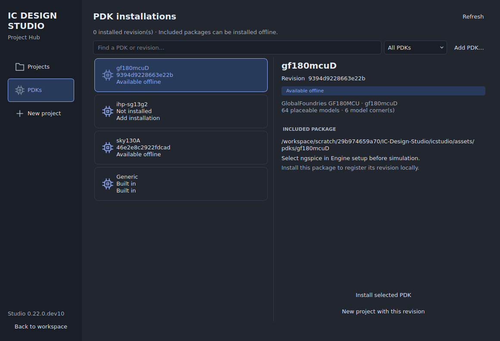

# Project Hub

Open **File → New project** to start a design, **File → Project Hub** to inspect PDK installations, or the workspace's **Projects** button for saved designs.

## Create a project

1. Choose **New project** in the hub sidebar.
2. Select a process and its exact revision. Search by family, variant or revision; use the filter to show installed or included packages.
3. Enter a project name and choose a starting circuit: empty, RC low-pass, inverter, ring oscillator, current mirror or differential pair. For transistor templates, select catalog models and an appropriate supply voltage.
4. Choose **Create project**, or **Install PDK & create project** for an included package. Installation and file verification run in the background.
5. Save with **Ctrl+S** in the workspace to choose the project file location. Unsaved work in an existing project is handled before it is replaced.

The new project retains the selected revision and its checksummed files. Installing another revision does not upgrade existing projects. Generic teaching projects remain available without an installed PDK.

## Understand the PDK list

| Status | Meaning | Action |
|---|---|---|
| Installed | Registered revision whose installation folder exists | Create a project or verify its files |
| Available offline | Included package that has not been registered | Install from the PDK page or during project creation |
| Add installation | Supported family with no local registration or included package | Add its tool-ready installation or adapter package |
| Folder missing | Registered folder has moved or disappeared | Locate the matching folder |
| Needs repair | Registration metadata cannot be read or resolved | Restore the registration metadata and refresh |
| Built in | Generic teaching technology | Create a project without PDK installation |

The revision field shows the package's actual revision identifier, which may be a commit/content hash rather than a numbered release. This is a local inventory; it does not check online for newer releases. **Installed** does not mean a simulator or physical verification deck has been qualified. **Verify installed files** checks the registration's file hashes, and project creation checks them again.

Included GF180MCU and SKY130 packages are simulation subsets. IHP appears as **Add installation** until its local installation or adapter is registered; its simulations also need compatible ngspice/OSDI support. Other PDKs and multiple revisions use the same list when registered through the technology package interface. Adding a process does not add a first-level menu item.

## Add or recover an installation

Choose **Add PDK**. In setup, choose **Find installed PDKs** to search the supported local locations, or **Add folder** to select an installation, variant parent or extracted package collection. Review the candidates, then choose **Check and register**. **Done** returns to the hub and refreshes the inventory. Opening the hub alone does not scan your disk or install packages.

On the **PDKs** page, a selected revision shows its full identifier, folder, placeable model count, model corner count and runtime prerequisites. Hover over the model summary for the corner names. **Locate installation folder** only accepts a folder matching that revision's locked files. Existing projects keep their saved locks and paths; use their normal relink/relocate workflow if they reference a moved folder.

The **Projects** page lists saved designs and their linked revisions. Search, open a listed design, or choose **Open from disk**. **Manage project files** retains the existing forget, locate, delete and restore controls.

## Validation

Automated backend coverage includes fresh-install visibility, multiple revisions, future PDK families, offline install-and-create, invalid choices, malformed registrations and changed package files/metadata. The native Qt acceptance script checks installation, verification, search/filtering, catalog model creation, recent projects, setup refresh, cancellation, missing-folder recovery and worker shutdown guards. The packaged desktop probe also opens the hub and checks the included revision identifiers.

Run `python -m unittest tests.test_project_hub` and, with a desktop or `QT_QPA_PLATFORM=offscreen`, `python tests/gui_project_hub.py`. Linux and Windows CI run the GUI acceptance script; their build results remain the release gates for packaged execution.
