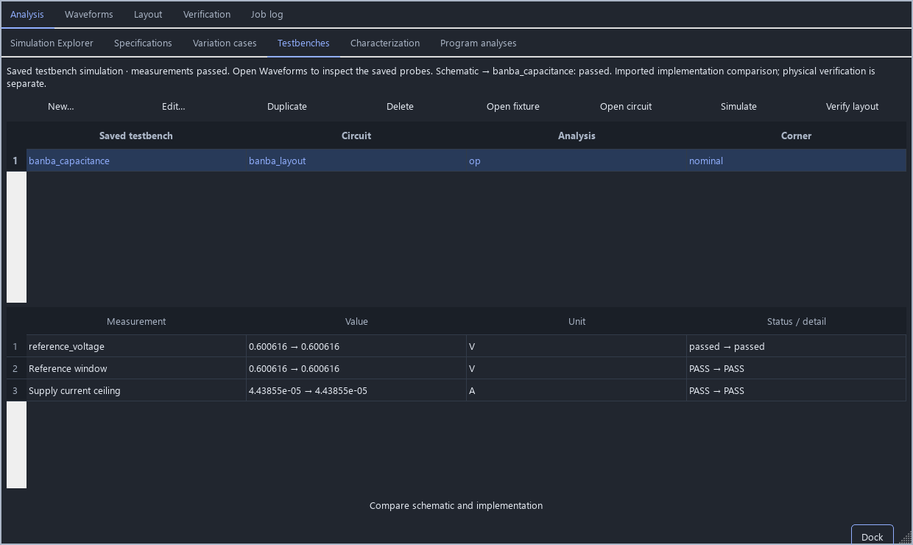

# Compare schematic and captured implementations

Saved testbenches can select named implementations of their circuit cell. A
captured SPICE subcircuit travels inside the native project with its checksum,
port interface and a fingerprint of the source circuit, physical hierarchy and
technology. This provides a repeatable way to evaluate an archived extracted
netlist using the same fixture, corner, temperature and output limits as the
editable schematic.

## Desktop workflow

1. Open **Saved testbenches**, select a fixture and choose **Edit**.
2. In **Circuit implementation**, choose **Import implementation…**. Select a
   SPICE file, its top subcircuit, a unique name and its extraction model.
3. Save the testbench. **Simulate** uses its selected implementation.
   **Compare schematic and implementation** runs both versions and shows the
   measurement and specification results side by side.
4. Select **Schematic** to return to the editable circuit.

Importing is part of the Save transaction: Cancel leaves the project unchanged,
and undo/redo includes the captured view and its selection. Multiple benches can
select the same captured view. Circuit, layout or model changes mark a view
stale and block its simulation. Fixture stimuli and limits can change without
invalidating the circuit implementation. Moving an identical locked PDK package
to another installation directory does not invalidate a view.

Ports match by case-insensitive name, so extracted port order may differ from
the schematic. Include all dependent circuit subcircuits in the imported file.
External `.include`, `.lib`, control programs and top-level analyses are not
accepted there; the project supplies the locked process models. Supported
records are bounded to 16 MiB each and 50 views per project. Saved projects add
optional `implementation_views` records and `testbenches[].implementation_view`.

**Verify layout** continues to run fresh process checks and extraction. Naming
a view “Extracted RC” describes its supplied contents; it does not establish
extraction accuracy, LVS equivalence or a clean DRC result. A comparison passes
when both implementations meet their saved limits. It reports numerical deltas
but does not enforce equivalence tolerances between the two results. With no
limits it is only marked completed. This is selection at the saved fixture's
circuit boundary; arbitrary per-instance hierarchical configurations remain
future work.

SPICE export honors the selected implementation and includes its captured
subcircuits. Native embedded model files are materialized beside the exported
deck. Benches requiring a DC startup pre-solve must be run in Studio; use that
run's generated deck and model directory to retain the converged nodesets.



## PDK parameter editing

The device inspector now previews resolved process parameter values while
dimensions or formula fields are edited. Blank parameter overrides restore the
PDK default. Width, length and other parameters honor the catalog's positive,
integer, choice and optional minimum/maximum constraints in model units.
Constraints are supplied by the catalog; this change does not invent process
limits missing from an upstream model. Formula syntax is cached, while values
are reevaluated against the current device dimensions on every edit.

## Hierarchical layout navigation

Scene updates retain unchanged hierarchy bounds and index linked devices once.
Queries reuse hierarchy-path mappings. A full-chip view exceeding the rendering
budget draws bounded top-level cell outlines directly; it no longer expands
12,000 shapes before falling back to an outline. These outlines are display
summaries. Zoomed selection, snapping and geometry queries retain their exact
shape identities and mapped nets. Rendering is not a substitute for physical
verification.

## Reproduce the reference checks

Install the project's Python requirements and provide ngspice 42. To include
Franck's SKY130 detector, obtain the exact locked source without Windows newline
conversion:

```sh
git -c core.autocrlf=false clone https://github.com/LDFranck/sky130_vbl_ip__overvoltage work/franck
git -C work/franck checkout 53cf579f63d34227af67f0189b49ee09185f1db5
python scripts/qualify_reference_views.py --output build/reference-views --ngspice /path/to/ngspice --franck-source work/franck --baseline-ref 0ffa9102cea629b69b2de5c380f7d5ec91788b77
```

The script checks all 67 source-file hashes, produces reopenable projects,
retains each simulation deck and result, and writes `report.json`. The baseline
option loads the spatial-query implementation from that trusted Git revision
for timings against identical input files. Timings cover the native scene
query and unchanged scene update, excluding Qt painting and live checks.

The three reference cases have distinct scope:

| Reference | Executed check | Scope |
|---|---|---|
| Supplied GF180 `5vfullv2-compatibility.sch` | 60 native catalog models; all six transient/DC/AC cases through the desktop worker | Run with `tests/gui_bandgap_compatibility.py` |
| GF180 Banba layout | Same operating-point fixture against schematic and archived capacitance extraction; VREF and supply-current limits | Original captured extraction, not fresh DRC/LVS |
| LDFranck SKY130 detector | Nominal 27 °C, code-zero rising 3–6 V sweep; endpoint limits and a 3.25–3.35 V trip window | Archived layout netlist; no new PVT, falling hysteresis or RC qualification |

Run the desktop transaction and worker check with
`python tests/gui_implementation_views.py --out build/reference-views-gui`.
Set `ICSTUDIO_TEST_NGSPICE` to the executable and `QT_QPA_PLATFORM=offscreen`
for automated GUI runs. The [executed evidence](validation/reference-views.json)
records input and implementation hashes and measured timing samples. Windows
source execution with an offscreen Qt interface does not qualify a packaged
release or another operating system.
