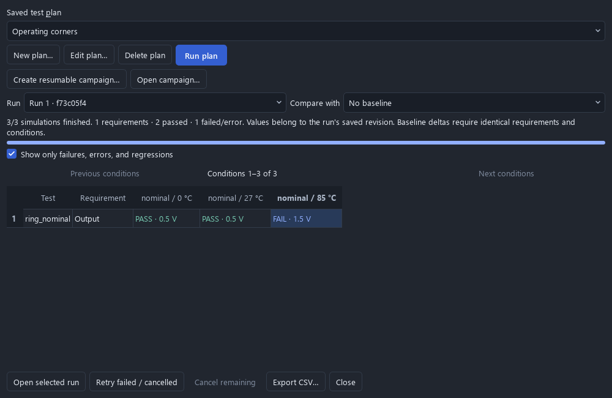
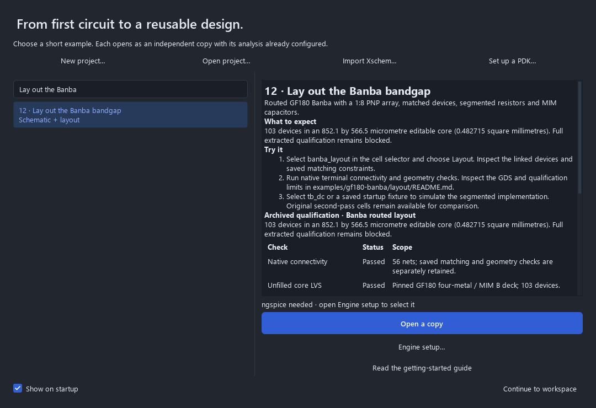

# Reliable editing and evidence-driven verification

This page records the source change and its retained validation. Later source
and packages need their own execution evidence; consult [release status](RELEASE_STATUS.md)
and the current [reference qualification catalog](REFERENCE_QUALIFICATION.md).
The measurements and archived Banba results below retain their original scope.

This experimental source update implements five improvements. It does not
publish a package or establish consumer-machine or fabrication acceptance.

1. **Recovery acknowledgement checks the written file.** Every new snapshot has
   a receipt containing its exact byte hash, project hash, revision, write ID and
   writer process. A stale but otherwise valid JSON replacement is rejected.
   Recovery preserves a verified previous snapshot and reports fallback;
   legacy snapshots remain readable. Fault tests include an abrupt subprocess
   exit between file publication and receipt publication.
2. **Large layout edits retain unchanged drawing work.** Pictures cover consecutive
   groups of 256 shapes, preserving overlap order. A one-shape move redraws its
   affected group; undo and redo use the same narrow refresh when the change is
   limited to unowned flat coordinates. Schematic coordinate moves and undo/redo
   also retain unrelated panels; edits to names, nets, values and structure
   keep their full validated refresh. Live geometry workers receive isolated
   in-memory snapshots. Pixel comparisons cover overlap, pan, scale, selection,
   themes, layer visibility and undo/redo.
3. **Workflow progress follows saved evidence.** Electrical, physical and selected
   verification-plan states distinguish Not run, Running, Stale, Blocked, Failed
   and Passed. A plan must retain every expected condition from one matching
   group with all saved requirements passing. The panel opens the failing
   requirement and condition, offers rerun actions, and ends at optional team
   review after completed verification. Missing measurements are never passes.
4. **Banba fill uses a bounded area search.** The selected 550 micrometre halo
   reduces area by 10.26%, to 3.253175 mm², without modifying the circuit masks
   or relaxing existing fill rules. Actual pinned DRC, density, antenna and LVS
   pass with the documented dummy-poly deck correction. See the
   [retained physical evidence](../examples/gf180-banba/layout/density-optimized/manifest.json).
   Distributed RC and dummy-fill coupling remain blocked by the extractor's
   documented limitations.
5. **Reference status comes from one reviewed catalog.**
   [Qualification records](../examples/qualification.json) bind source and evidence
   hashes and assert the corresponding report values. The gallery, workflow's
   Reference evidence tab, README and [reference status](REFERENCE_QUALIFICATION.md)
   use this record. Edited copies and changed/missing evidence become stale.
   Release checks reject stale generated documentation. Archived results never
   substitute for running the current document's verification.

The [consumer acceptance checker](NATIVE_DESKTOP_ACCEPTANCE.md) additionally
requires every observed task, a consumer display environment, a frozen clean
source commit and independently matched package bytes for Windows and Ubuntu.
The physical-machine, accessibility, signing and network observations remain
open until actual evidence is collected.

## Reproduction

```sh
python -m unittest discover -s tests -p 'test_*.py'
python scripts/check_release.py
QT_QPA_PLATFORM=offscreen python tests/gui_layout_chunks.py
QT_QPA_PLATFORM=offscreen python tests/gui_workflow_evidence.py --out build/workflow-evidence
QT_QPA_PLATFORM=offscreen python tests/gui_analog_scale.py --out build/edit-evidence \
  --iterations 5 --command-path interactive --electrical-ledger --live-checks \
  --display-class offscreen --max-edit-p95-ms 200
```

For Windows offscreen rendering, set `QT_QPA_FONTDIR=C:\Windows\Fonts` so actual
font metrics and readable screenshots are used. The benchmark records each
sample, median, nearest-rank 95th percentile, maximum, repaint counts, recovery
checks and product hashes before/after. The 200 ms target is a declared-host
95th-percentile target; it is not a guarantee for every sample or display.
The hosted desktop gate retains its existing per-edit ceiling and now measures
background live checks too. A new source revision still needs its own hosted
package qualification.

## Retained source validation

The [validation record](validation/reliable-workflows/summary.json) contains
1112 passing unit tests (45 environment skips), the real ngspice 42
gallery run, GUI regressions, screenshots and raw timing samples. On this Windows
11 desktop with Qt 6.8.3, live checks and five iterations per workload, edit p95
changed from 1505.3 ms to 117.7 ms. The updated median was
62.2 ms and the maximum was 730.1 ms. Both measurements use
the same harness and fonts; code hashes remain unchanged during each run.
The earlier measurement taken concurrently with physical verification missed
the target and is retained separately. These are source/offscreen measurements,
not native consumer-display latency or package acceptance.




