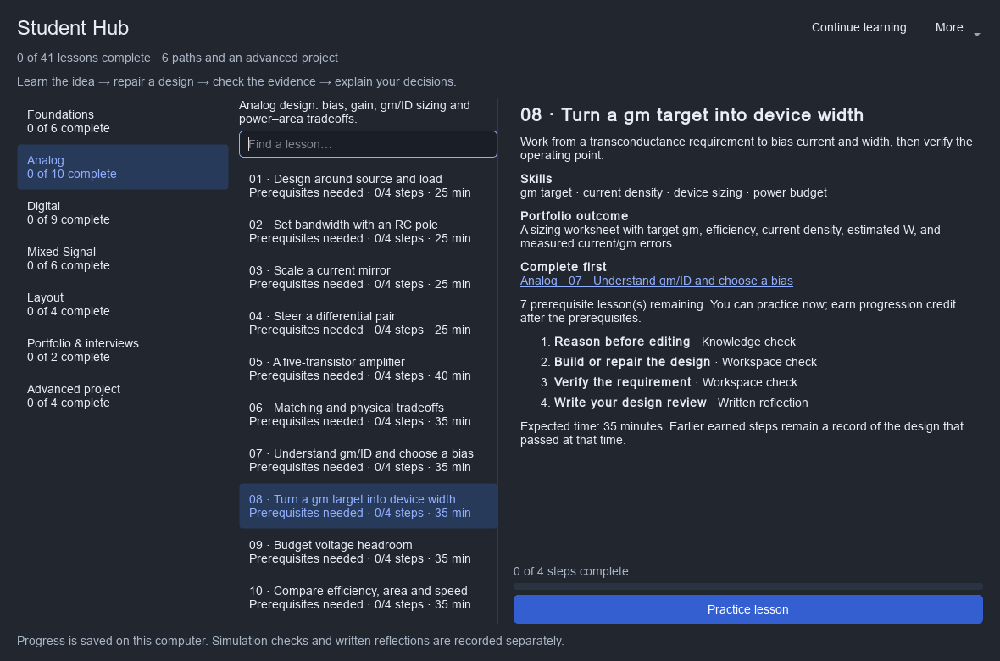
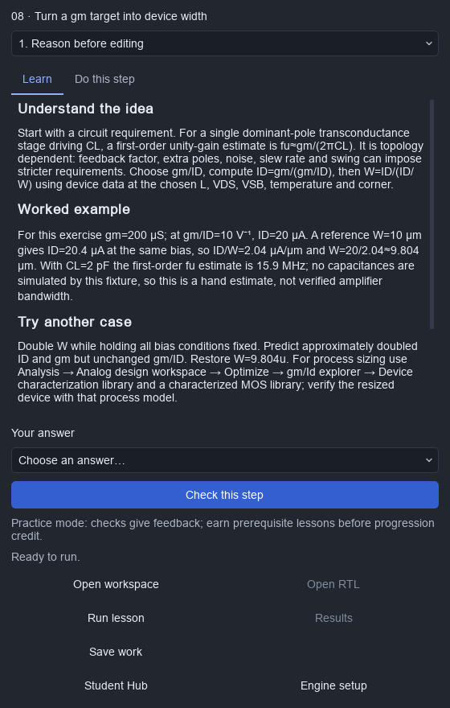

# Student Hub

Open **File → Student Hub** or choose **Student Hub** in the example gallery.
Six learning paths cover foundations, analog, digital, mixed signal, layout and
portfolio preparation. Four additional milestones build one sensor-acquisition
project: **41 lessons and 164 steps** in total. Every lesson includes a concept,
worked example, follow-up experiment, interview prompt and portfolio outcome,
plus a prediction, practical task, evidence checkpoint and written reflection.



## Learn beside the real editor

1. Choose **Continue learning**, or select a path and a lesson.
2. **Start lesson** creates an independent, saved project. Existing work goes
   through the normal save/discard/cancel flow before another document opens.
3. The **Student lesson guide** stays beside the schematic, layout or RTL editor.
   Read **Learn** for the explanation and worked example, then **Do this step**
   for the current task. Edit the real design and use **Run lesson**.
4. **Results** opens the existing waveform or digital/mixed-signal workspace.
   **Check this step** evaluates the current design and captured evidence. Read
   the result, then choose **Next step** when ready.
5. Write your reasoning in the reflection field. Draft notes save automatically;
   **Record reflection** adds the note to the learning record.
6. **Save work** preserves circuit/RTL edits. **Resume lesson** reopens that file
   next time. The four advanced milestones share one project and retain earlier
   repairs.

The guide can be reopened from **View → Lesson guide**. **Student Hub**
returns to the progression map. Use **Cancel lesson runs** to stop only the jobs
launched for that lesson project. Duplicate submissions are blocked while a run
is queued, running or stopping. A failed simulator run does not earn credit.

The Hub adapts to a narrow window. **More → Text size** enlarges text up to 200%
in both the Hub and guide; scrolling keeps controls reachable. Use **Cmd+F** on
macOS or **Ctrl+F** on Windows/Linux to search the current path. Return in search
focuses the lesson list; Return on a lesson opens it. Tab navigates controls.

**More → Locate lesson project** reconnects a moved file after checking its
project identity. **More → Reload progress** recovers changes saved by another
window; if both windows edited the same reflection, choose which version to keep
or cancel to preserve the unsaved draft. A failed draft save blocks dismissal or
app exit until the draft can be preserved. **Export learning record** saves the
current lesson's circuit/RTL edits before exporting; cancelling Save cancels export.

See the [two-pass interface audit](STUDENT_HUB_AUDIT.md) for findings, validation,
and the remaining native macOS acceptance work.


## Learning paths

| Path | Progression | Final outcome |
| --- | --- | --- |
| Foundations | First RC transient → nets/ground → parameter edits and Undo → hierarchy → loading/debugging → layout and reproducibility | A saved, measured circuit and a learning record |
| Analog (10 lessons) | Loaded divider → RC bandwidth → current mirror → differential pair → amplifier → matching; gm/ID bias → width → headroom → efficiency tradeoff | A measured sizing worksheet and circuit design rationale |
| Digital (9 lessons) | Truth tables → counter → handshake → PWM → averaging → serial transmitter; latch repair → saturating arithmetic → pipeline validity | Repaired RTL, failing cases and independent reference simulations |
| Mixed Signal | Bridge thresholds → acquisition/hold → quantization → timing repair → DAC-weight repair → repeated conversions | A working SAR converter with explicit analog/digital timing |
| Layout (4 lessons) | Minimum width → edge spacing → via enclosure → common centroid | Repaired geometry, measured rule checks and a physical verification plan |
| Portfolio & interviews (2 lessons) | Requirements and verification plan → reproducible design story | A design brief, interview narrative and readable portfolio report |

The first three Foundations lessons unlock Analog and Digital. Mixed Signal
requires the bandwidth and counter lessons. Layout and portfolio preparation
start after Foundations 6. The original Analog 6, Digital 6, Mixed Signal 6 and
Foundations 6 still unlock the advanced project; the added lessons do not revoke
previous credit or add prerequisites to the existing capstone. All lessons remain available for
preview and **Practice lesson**: practice checks give feedback but do not bypass
prerequisite credit. Estimates are per lesson, not deadlines.

Knowledge questions check the selected answer. Circuit checkpoints inspect
specific properties or numerical results. Structural layout checks establish only
that the lesson geometry exists in the original introductory lessons. The new
Layout path additionally measures its specific geometry requirements and reruns
fixed generic DRC. Reflections are **recorded, not automatically
assessed for correctness**. Their wording asks learners to state observations,
reasoning and limitations for instructor or peer review.

## gm/ID: from requirement to verified bias

Analog 7–10 teach `gm = ∂ID/∂VGS`, efficiency in V⁻¹, current density,
width estimation and voltage headroom. Each starter has a bias or sizing problem;
the numerical checkpoint reads the captured operating point and rejects stale
results. **Results** opens the saved analog run inspector with device values.

For the included generic NMOS at L=1 µm, VGS=.65 V and VDS=1 V, a 10 µm
reference width gives ID=20.4 µA and gm/ID≈10 V⁻¹. A 200 µS gm target therefore
requires ID=20 µA and W≈9.804 µm. The final exercise reaches approximately the
same gm at half the current and twice the width, then asks what capacitance,
noise and process evidence is missing. These are teaching-model operating-point
results; a hand estimate of bandwidth is not a measured amplifier specification.

For process-model work, continue through **Analysis → Analog design workspace →
Optimize → gm/Id explorer → Device characterization library**. Characterize the
chosen length, drain/body bias, temperature and corner; size within measured
data, rerun the proposed device and verify circuit performance. See the
[analog optimizer](ANALOG_OPTIMIZER.md). The methodology reference is
[Jespers and Murmann's book and companion material](https://github.com/bmurmann/Book-on-gm-ID-design).



## Layout: repair, measure and explain

Use the rectangle inspector's **Geometry (µm)** fields; stored coordinates use
integer nanometres. The four exercises require 0.20 µm route thickness,
0.20 µm edge spacing, at least 0.075 µm via enclosure on both metals, and equal
centroids for four separated, equal-size tiles. The checker preserves the
original shapes/layers/nets and applies a fixed generic deck, so deleting an
offending shape or relaxing editable PDK rules does not pass.

The matching exercise uses labeled metal tiles to teach placement arithmetic.
It does not extract resistor or transistor devices. Each review distinguishes
geometric DRC, extracted connectivity, LVS and parasitic verification. Actual
process rules depend on the selected PDK; consult, for example, the
[SKY130 process design rules](https://skywater-pdk.readthedocs.io/en/main/rules.html)
and the application's [PDK guide](PDK_GUIDE.md).

## Digital: learn from failing implementations

The three additional RTL starters intentionally omit a combinational assignment,
wrap an accumulator that should saturate, or misalign validity with pipeline
data. Run the broken starter, repair the RTL, then rerun the unchanged reference
bench. The benches check input histories, arithmetic boundaries, invalid-cycle
hold, bubbles and reset as appropriate to each interface. Passing compilation
alone does not earn the simulation checkpoint.

The pipeline lesson explains edge timing, latency versus throughput, setup/hold
verification and why clock-domain crossings need a separate design. Its interface
has no backpressure. Synthesis and static timing remain follow-up work in the
[digital flow](DIGITAL_FLOW.md); the conceptual reference is
[Yosys's explanation of synthesis and sequential logic](https://yosyshq.readthedocs.io/projects/yosys/en/0.39/CHAPTER_Basics.html).

## Prepare a portfolio and a design conversation

The portfolio path guides students through a requirement with units and operating
conditions, assumptions, an alternative design, a test matrix and a 90-second
project explanation. Every lesson supplies a related interview prompt and an
artifact to keep. The two portfolio milestones share a saved current-mirror
case study, while the final review can cite any completed design lesson.

**More → Export portfolio report** writes standalone HTML that opens in a browser
and can be printed. It includes lesson status, portfolio outcomes, student drafts
and captured evidence. **Export learning record** still provides the JSON project
snapshots. Both save the active lesson first and respect Save cancellation.
Review drafts and local file paths before sharing. The HTML references evidence;
it does not embed raw simulation files. Neither export certifies engineering
correctness of reflections or guarantees employment.

## Engines and models

**More → Engine setup…** in the Hub selects native local `ngspice`, `iverilog` and
`vvp` executables. Blank Icarus fields search PATH; blank ngspice uses Studio's
native discovery, including its bundled executable and `ICSTUDIO_NGSPICE`.
Earlier mixed-signal executable selections are used as defaults. Missing tools
produce a setup error; the Hub does not download engines automatically.

On Ubuntu, `sudo apt install ngspice iverilog` supplies these tools. On Windows,
select native executable paths. The Windows source launcher provisions ngspice
only; Icarus needs a separate native installation. See the
[SAR local-engine setup](MIXED_SIGNAL_SAR.md#local-engine-setup). WSL executable
paths and a Ready managed digital runtime do not configure these lesson tools.

Foundations and Analog use the included teaching solver and generic devices.
Digital uses Icarus and embedded reference testbenches. Mixed Signal and the
capstone run the actual ngspice/Icarus closed loop described in the
[SAR walkthrough](MIXED_SIGNAL_SAR.md). The managed digital container/WSL toolchain
is not the runtime for these lessons. Tool availability and successful process
startup alone are not numerical qualification.

The analog lessons deliberately introduce concepts without an external PDK.
Generic MOS results exclude body effect, subthreshold behavior and device
capacitances. The SAR comparator and switch are behavioral. The course does not
establish foundry DRC/LVS, transistor-level ADC accuracy, ENOB/SNDR or silicon
performance. Later physical work needs a selected, qualified process and its
actual decks and models.

## Advanced project: sensor acquisition system

The signal chain is an RC input filter, sample/hold, four-bit SAR, four-sample
block averager, and threshold alarm. The starter intentionally contains three
faults: an excessive filter capacitor, inverted SAR comparator interpretation,
and an incorrect averaging shift. Each milestone repairs one block and measures
its own requirements before the final system campaign.


| Requirement | Target |
| --- | --- |
| Reference / clock | 1.8 V / 1 µs |
| Input filter | 1 kΩ and 100 pF; 100 ns time constant |
| Nominal input sequence | 0.2, 0.4, 0.6, 0.8, 1.0, 1.2, 1.4, 1.6 V |
| Raw codes | 1, 3, 5, 7, 8, 10, 12, 14 |
| Completion edges | 7, 15, 23, 31, 39, 47, 55, 63 |
| Acquisition error | Less than 2 mV at the first comparison of each conversion |
| Averaging | Non-overlapping blocks of four; `(sum + 2) >> 2`, halves rounded upward |
| Averaged codes | 4 and 11 |
| Average-valid edges | 32 and 64; SAR completion is consumed on the next clock |
| Alarm | Assert when the averaged code is at least 10; nominal outputs 0 then 1 |

**Run qualification** captures four copies of the reviewed design: nominal,
below-range input, above-range input, and input changes after acquisition.
The open project is unchanged. All code, cadence, averaging, alarm, sample-count,
decision-count and acquisition requirements must pass for all four cases.
The checker uses fixed independent reference requirements; it does not infer
expected codes from the edited DAC or RTL.

The original correct reference design can be generated and independently tested
with `python scripts/verify_student_capstone.py --out build/student-capstone`.
It is separate from the intentionally faulty teaching starter. The script also
injects filter, comparator-decision, averaging and alarm faults to demonstrate
that the acceptance requirements detect them.

## Progress and evidence

Progress is stored in the application's local data directory under `student-hub`.
Project files remain normal `.icproj` documents. **Save As** followed by **Save
work** updates the lesson's resume location. If a lesson file goes missing or is
replaced by another project, the Hub reports the problem instead of resetting it.
Corrupt or concurrently changed progress is not silently overwritten.

An earned checkpoint includes its project identity/design hash and, for a run,
the captured job/result hashes, engine/environment identity and run location.
Digital and mixed-signal artifacts are revalidated using the existing job reader.
Results from earlier edits, another project, interrupted jobs or a changed
reference testbench cannot earn a numerical checkpoint. Even Undo produces a
new project revision; rerun before earning a new simulation checkpoint.

Earned steps are historical achievements, not claims about all future edits.
Updating a checkpoint lesson or its grading revision requires rechecking that lesson;
unrelated application releases preserve progression. Dependent progression also
checks its prerequisites. Teaching notes are stored separately in `study-guide.json`,
so improving an explanation does not invalidate existing checkpoint credit.
**Export learning record** writes JSON
with progress, reflections, saved project snapshots and evidence references. Save
edits before exporting. Raw run directories are referenced, not embedded; include
them separately when sharing a complete reproducible simulation package.

## Feature map and further work

| Feature | Guided entry | Further workflow |
| --- | --- | --- |
| Schematic, properties, nets and ground | Foundations 1–3 | [Getting started](GETTING_STARTED.md) |
| Hierarchy, cells and reusable blocks | Foundations 4 | [Getting started](GETTING_STARTED.md) |
| Analysis, traces and comparison | Foundations 1–5; Analog 1–5 | [Analog workspace](ANALOG_WORKSPACE.md) |
| Bias, gm/ID, specifications and closure | Analog 3–5 and 7–10 | [Analog closure](ANALOG_CLOSURE.md) |
| Optimization and variation studies | Analog 5 reflection | [Analog optimizer](ANALOG_OPTIMIZER.md) |
| Layout, matching and physical evidence | Foundations 6; Analog 6; Layout 1–4 | [Layout scale and collaboration](LAYOUT_SCALE_AND_COLLABORATION.md), [PDK guide](PDK_GUIDE.md) |
| RTL, testbenches and digital waveforms | Digital 1–9 | [Digital workspace](DIGITAL_WORKSPACE.md) |
| Synthesis, timing and implementation | Digital 6 extensions | [Digital flow](DIGITAL_FLOW.md) |
| Bridge timing, DACs and SAR conversion | Mixed Signal 1–6 | [Mixed-signal SAR](MIXED_SIGNAL_SAR.md) |
| Captured runs, cancellation and handoff | Every measured lesson; capstone 4 | [Project Hub](PROJECT_HUB.md) |

These links expose the broader application without treating unperformed
optimization, physical verification or implementation as completed course work.

## Developer verification

```sh
python -m unittest discover -s tests -p 'test_student*.py' -v
python scripts/verify_student_capstone.py --out build/student-capstone
QT_QPA_PLATFORM=offscreen python tests/gui_student_hub.py
QT_QPA_PLATFORM=offscreen python tests/gui_student_design_labs.py
```

Run from the repository root in its Python environment, with a fresh output
directory for each captured campaign. In PowerShell, set
`$env:QT_QPA_PLATFORM = 'offscreen'` before the GUI command instead of using the
POSIX assignment prefix. The capstone script also accepts `--ngspice`,
`--iverilog` and `--vvp` paths for an explicitly selected native toolchain.

The unit suite exercises all 41 starters, prerequisite cycles, persistence,
concurrent writes, stale/corrupt evidence, all sixteen Foundations/Analog lessons,
nine real RTL reference benches, layout repair and bypass rejection, escaped HTML
portfolio exports, six mixed-signal lessons and capstone fault
detection. Engine tests require installed tools or `ICSTUDIO_TEST_NGSPICE`,
`ICSTUDIO_TEST_IVERILOG` and `ICSTUDIO_TEST_VVP`. The desktop check additionally
tests save cancellation, practice without credit, shared capstone work, export,
autosaved notes and cancellation. CI uploads raw evidence directories.

## Retained execution evidence

The [design-path expansion checks](validation/student-design-paths/checks.json)
record 1,225 unit tests (54 optional skips), 16 focused tests with native Icarus
and ngspice (no skips), and three Windows offscreen GUI workflows. The new
layout repairs were performed through the real inspector; this remains generic
geometry evidence rather than foundry or packaged-desktop qualification.

The following records describe the earlier 28-lesson course on Linux.

The [capstone campaign](validation/student-hub/capstone.json) passed all four
acceptance cases and detected all four deliberately injected faults. The
[desktop record](validation/student-hub/desktop.json) records the exercised
learning workflow. [Test commands and outcomes](validation/student-hub/checks.json)
include the full suite (1,216 tests, 51 skipped), 10 focused progression/engine
tests, and the six final progression regressions, including update-stable credit
and packaged-build identity handling. The [release consistency check](validation/student-hub/release-check.json)
also passed.

Numerical and desktop evidence was executed on Linux with Qt offscreen,
Python 3.12, ngspice 42 and Icarus 12. The existing
[host runtime record](validation/mixed-signal-sar/host-runtime.json) identifies the
same underlying binaries and workspace-specific scratch-file adapter. The frozen
identity check emulates the packaged source layout; this record does not claim a
complete packaged or native Windows run. Raw captures are retained by the CI
workflow; compact reports and screenshots are committed here.
