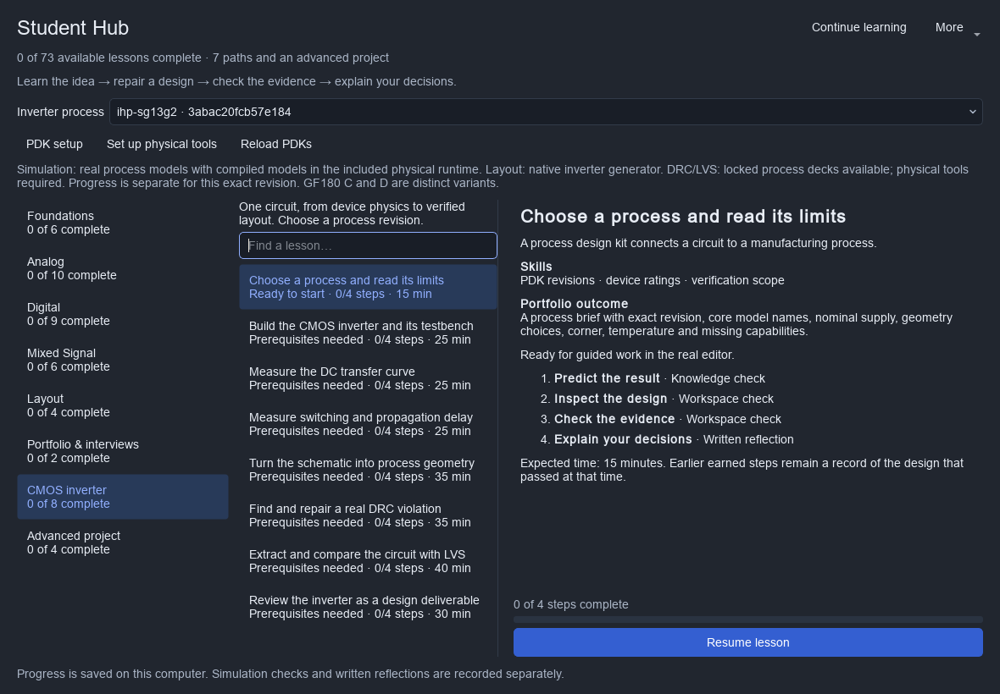
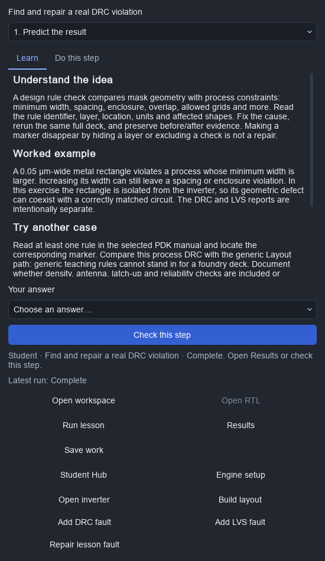
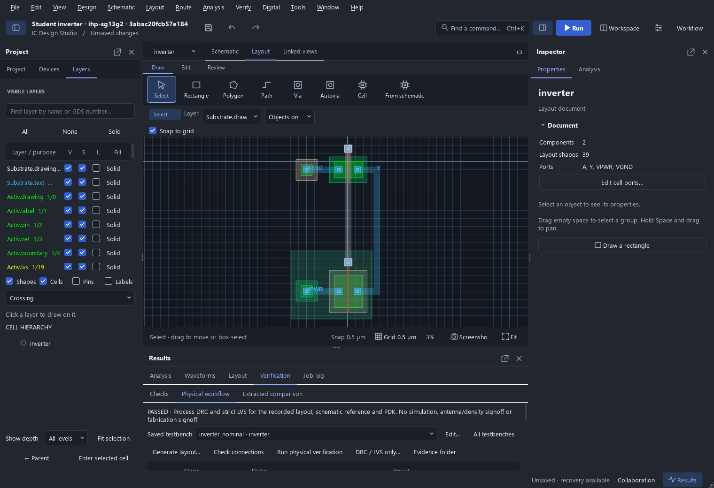

# CMOS inverter: from PDK to DRC/LVS

Open **File → Student Hub → CMOS inverter · PDK to LVS**. Choose a PDK revision, then follow eight lessons: process selection, schematic, DC transfer, switching, layout, DRC repair, LVS repair and design review. Each lesson includes an explanation, worked example, hands-on instructions, a checked task and an interview question.

The Hub discovers the bundled process packages, registered PDK revisions and the open project's locked PDK. Projects, reflections and credit are separate for each process revision. **Open workspace** shows the testbench; **Open inverter** shows its child circuit, switching to layout view in the physical lessons. **Save work** preserves your edits; starting the next lesson resumes the same project.

## Available processes and actual capabilities

| Process | Nominal starter | Simulation | Physical course |
|---|---|---|---|
| SKY130A | Core 1.8 V NMOS/PMOS, W 1/2 µm, L 0.15 µm | Included model package; native ngspice required | Native inverter layout when required masks are mapped. Full matching Magic/Netgen decks and physical tools are required for DRC/LVS. |
| GF180MCU C / D | Core 3.3 V NMOS/PMOS, W 1/2 µm, L 0.28 µm | Both variants include primitive models; native ngspice required | Editable native inverter and M1/M2 vias. Each variant includes its own full Magic and Netgen decks. C uses the 0.9 µm top-metal option; D uses 1.1 µm. |
| IHP SG13G2 | Low-voltage 1.2 V NMOS/PMOS, W 1/2 µm, L 0.13 µm | Included process models and six compiled OSDI libraries in the managed Linux/WSL runtime | Editable native inverter and M1/M2 vias, full upstream Magic DRC and Netgen LVS. The included Magic 8.3.684 satisfies the deck's minimum 8.3.617 requirement. |

These are the application's supported open PDK families, not a claim to support every open PDK in existence. Every registered revision appears in the chooser; revisions without the expected core device bindings explain their missing setup. A missing engine, model, geometry adapter or rule deck cannot earn a physical pass. GF180 C/D and IHP include the physical assets needed by this course; the bundled SKY130 simulation subset still needs a full physical package.

Choose a bundled GF180 C/D or IHP revision directly in the Hub. Click **Set up physical tools** once, then start the lessons. IHP simulations automatically use the included Linux/WSL simulator and compiled models; students do not need OpenVAF or a Windows linker. GF180 and SKY130 use native ngspice selected under **Engine setup**. Leave Magic/Netgen blank to use the included physical runtime. Custom native engines and explicitly configured OSDI libraries remain supported.

Use **PDK setup → Reload PDKs** for separately installed revisions. The included IHP model binaries are accepted only when their entire recorded Verilog-A dependency closure matches the selected package. Source checkouts must build the runtime with `scripts/build_digital_runtime.py`; see [PDK setup](PDK_GUIDE.md) for reproducible package preparation.

## What the checks actually measure

- **Binding and schematic:** locked assets, correct core model identities, complementary four-terminal topology, parent/child connectivity and nominal supply.
- **DC:** a real ngspice sweep of VIN over 0–VDD, output rail levels, an approximately monotone inverting curve and the VOUT=VIN crossing. Teaching targets are VOH ≥ 0.9 VDD, VOL ≤ 0.1 VDD and 0.2 VDD < VM < 0.8 VDD. Noise-margin calculation is taught but is not automatically graded.
- **Switching:** three settled truth-table cycles, plus interpolated 50% input/output crossings for tPHL and tPLH. Runs use a 20 ns input period, 62 ns duration and 20 ps requested step. There is no arbitrary speed requirement across processes.
- **Layout:** physical geometry and four named ports. This is an interface checkpoint, not a DRC or LVS result.
- **DRC:** a full process-deck run. Add DRC fault creates an isolated 50 nm-wide metal-1 rectangle in a native generated layout. Capture real violations, repair the fault, then earn the zero-violation checkpoint from a fresh run.
- **LVS:** actual layout extraction followed by a strict unique Netgen match with equivalent pins and no property errors. Add LVS fault increases the schematic NMOS width by 30% without changing its layout. Capture the property mismatch, repair it and rerun. The generated-layout stale indication during this exercise is intentional.
- **Handoff:** DRC and LVS must both pass for the current captured design. Save the project, export the learning portfolio and retain the referenced evidence directories.

**Repair lesson fault** restores only the injected shape or width; it does not replace the whole layout. **Build layout** refuses to overwrite existing geometry. Imported layouts can use manually introduced, documented defects for the same failure/repair checkpoints. Every change requires a fresh matching run. Checks refuse another lesson's results, old designs, blocked runs and missing or altered hashed physical artifacts.

For IHP core MOS devices, comparison follows the locked upstream symbol's LVS format: the simulation-only `mm_ok` flag is excluded for literal 0/1 values. The original netlist, compared netlist and symbol checksum are retained in the report. Width, length, multiplicity and connectivity remain subject to strict LVS; the 30% width defect must still fail. All adjacent Magic/Netgen rule dependencies are checked before and after verification.

The final review distinguishes nominal schematic simulation from post-layout and PVT evidence. This course does not automatically run parasitic extraction, statistical characterization, antenna/density checks or reliability signoff. Continue with the saved-testbench physical workflows and the other Student Hub paths. A portfolio should state which checks were actually performed and at what conditions.

## Continue toward a design portfolio

Use the inverter as a first design review, then work through Foundations, Analog (including gm/ID sizing), Layout (width, spacing, vias and matching), Digital (RTL, testbenches and repair exercises), Mixed Signal, Career and the advanced sensor project. The course is a foundation for progressively harder designs; it does not claim to teach every IC topic or guarantee a job.

Primary process references:

- [SKY130 design rules](https://skywater-pdk.readthedocs.io/en/main/rules.html)
- [GF180MCU design manual](https://gf180mcu-pdk.readthedocs.io/en/latest/physical_verification/design_manual/drm_01.html)
- [IHP open PDK installation and model setup](https://ihp-open-pdk-docs.readthedocs.io/en/latest/install/installation.html)

## Validation

`tests/test_student_inverter.py` checks course separation, missing setup, model substitution rejection, waveform checks and, with `ICSTUDIO_TEST_NGSPICE`, actual bundled SKY130/GF180 DC and transient runs. `tests/test_student_physical.py` checks distinct physical decks, editable vias, stale geometry, IHP single-finger limits, narrow LVS normalization and model-source compatibility. `tests/gui_student_inverter.py` exercises selection, queued simulation, layouts, repair actions, project resumption and text scaling. Set `ICSTUDIO_TEST_MANAGED=1` with a prepared runtime for IHP simulation and GF180/IHP physical checks through the GUI queue.

See the [original inverter validation](validation/student-inverter/checks.json) and [GF180/IHP physical qualification](validation/student-physical/checks.json) for exact revisions, engines, measurements and scope. External process and tool execution is reported separately from unit/UI tests.

The GF180 C/D and IHP single-finger generators accept W 1–10 µm and L up to 2 µm (minimum L 0.28 µm for GF180, 0.13 µm for IHP). All four minimum/maximum W/L combinations per process passed full DRC and strict LVS. The default 1/2 µm NMOS/PMOS inverter passed DC, transient, injected DRC and LVS failures, repairs and modified-evidence rejection. This qualifies the documented core devices and course fixtures; other device families, arbitrary routing, extracted-RC timing, process corners and fabrication signoff require their own validation.

For a repeatable full-process exercise, run `scripts/qualify_student_inverter.py --pdk-manifest FULL_PDK/package.json --out FRESH_DIRECTORY --ngspice NGSPICE --magic MAGIC --netgen NETGEN`. Alternatively leave the physical paths blank for the prepared included runtime. `--runtime-record` accepts an existing managed-runtime ready record for an explicitly selected installation; the backend rechecks its identity and files. Preserve the matching payload/state environment settings when using that option. The script checks both faults, both repairs and rejection of modified logs; it fails rather than skipping missing capabilities.
