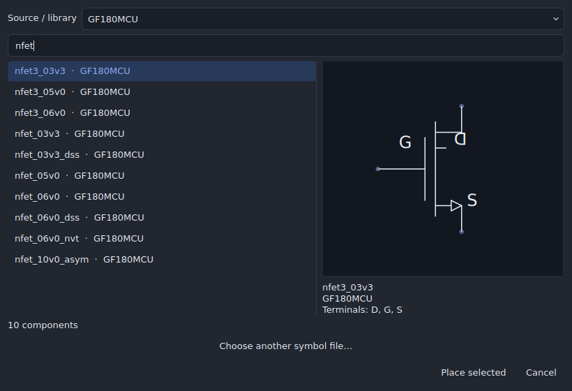

# Component browsing, layout placement and floating panels

These changes are in development source after the dev20 draft. Existing dev20
packages do not include them. The matching PR's desktop checks qualify the new
source separately from the earlier release checkpoint.

## Find and preview a component

Choose **Schematic → Place component…** or **Component** in the Draw toolbar.
Use **Source / library** to narrow the available components before searching.
The standard Devices panel also combines its source filter with the existing
category filter. Generic components, project cells and linked catalog libraries
have distinct groups.

Native imported definitions and Xschem symbols have a source selector, search,
vector symbol preview and terminal list beside the results. Changing the source
or search updates the selected result and preview together. An empty result
clears the preview and disables placement. The browser keeps definitions with
the same label from different sources separate. Older native projects use the
retained source archive when the library can be identified; otherwise their
definitions appear under **Project definitions**.

Select an entry, inspect the symbol, then choose **Place selected** and click the
schematic. The preview does not change the saved symbol or circuit definition.

## Select a wire close to a component

A wire within the pointer tolerance takes priority over a component's bounding
rectangle. **Alt+click** or **Tab** still cycles overlapping objects. The
right-click menu's **Select overlapping object** submenu names the available
choices. **Schematic → Selection filter → Wires** remains useful for working on
wires alone; restore Devices when finished.

## Bring the schematic into layout

Choose **Schematic → Place schematic devices in layout…**, **To layout** in the
schematic Draw toolbar, or **From schematic** in the layout Draw toolbar.

The review initially selects all missing devices with supported physical
implementations, including child cells. Shared masters are built once. Existing
placements remain unchanged. Review the unsupported rows: sources, simulation
programs and devices without physical recipes cannot be converted automatically.
This command creates physical implementations; it does not remove the schematic
or automatically route every net.

Set the new footprint origin and pitch, inspect **Preview selected changes**,
then choose **Apply**. The change is one undoable transaction. The review can
show geometry before and after. Use the existing schematic-change review to
update changed devices, and verify connectivity/DRC/LVS after layout editing.

## Enter a child schematic

Right-click a reusable cell instance and choose **Enter schematic** or **Enter
symbol**. Inside a child schematic, right-click and choose **Return to parent**.
The menu displays the active keyboard profile's shortcuts; the default Studio
profile uses **E**, **Shift+E** and **Ctrl+B**, respectively.

## Resize a popped-out panel

Floating panels use the operating system's window frame and a visible outline.
Drag a frame edge to resize one dimension, or a corner to resize both. The
visible bottom-right resize handle also supports diagonal dragging. Choose
**Dock** beside that handle to return the panel to the main window. Saved
workspaces restore the appropriate floating frame or docked header.

The automated desktop checks exercise real diagonal handle dragging and repeated
float/dock cycles. Native consumer display, scaling and accessibility acceptance
remain part of the [release follow-ups](RELEASE_FOLLOWUPS.md).
