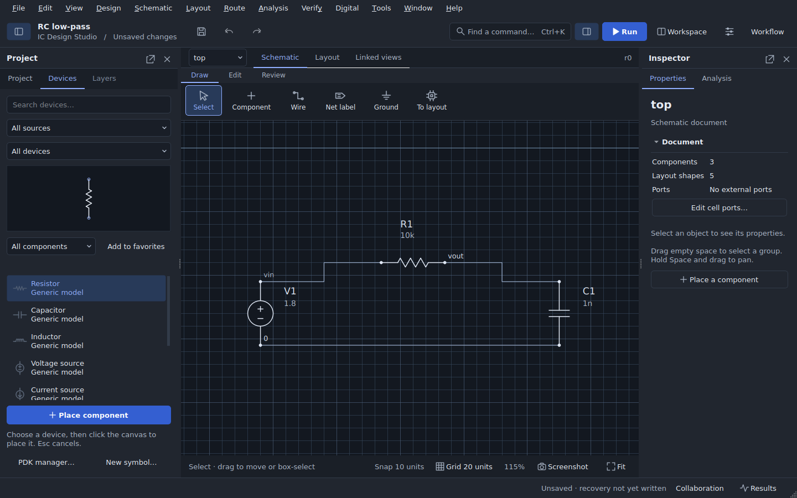

# View screenshots

Use **Screenshot** beside **Fit** to save the schematic or layout as a PNG.
In a narrow workspace the button shows a camera icon. In **Linked views**, choose
**Schematic screenshot…** or **Layout screenshot…** from its menu.

For the [3D layout viewer](LAYOUT_3D.md), use **Screenshot…** in that window's
toolbar. This exports the displayed snapshot, including the current orbit, pan,
zoom, visible layers and layer-height settings. Refresh the 3D view first if you
want to capture newer layout edits.

The image contains the view's design, without toolbars, panels, grids, selection
highlights, drag previews or editing handles. Current framing, colors, theme,
layer visibility, layout context, symbols and labels are retained. Schematic
operating-point annotations retain their current/stale notice. The 3D export
omits navigation help and axes. Switch to the light theme before a schematic or
2D layout screenshot if you prefer a light background.

Images render at twice the view's logical resolution, capped at 4,096 pixels on
the longest side. PNG preserves lines and text without JPEG artifacts. Use
**Fit** for the whole design or pan and zoom to frame a detail before exporting.
The suggested filename includes the cell and view. Saving does not change the
design, selection, camera, undo history or saved-project state.

The GUI checks exercise all three export buttons, image geometry and dimensions,
hidden layers and styling, cancellation, write failures and unchanged design/view
state. The 3D suite also checks holes and depth occlusion. Both software and
OpenGL export paths are covered by desktop CI; local offscreen checks exercise
the software path.
