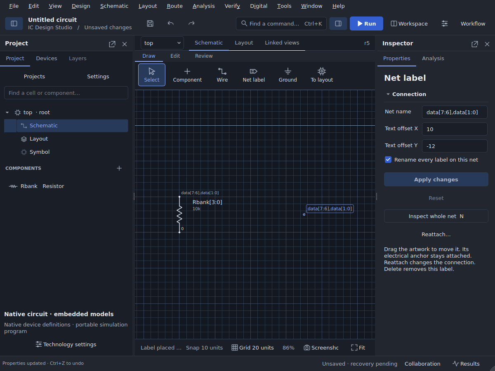
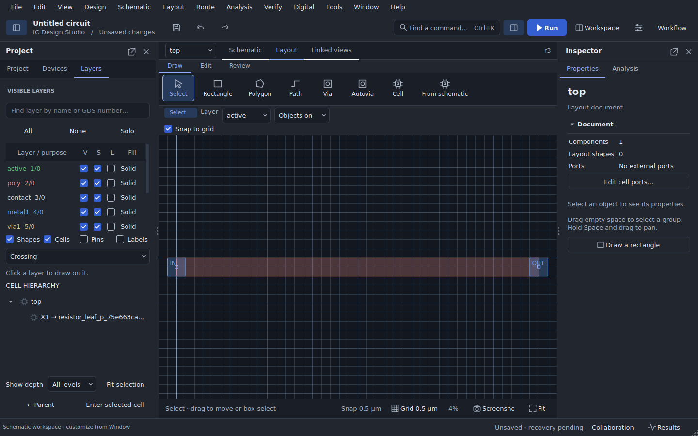

# Experimental analog extension evidence

These records cover the source changes described in
[Process extraction, device arrays and native hierarchy](../../ANALOG_IMPLEMENTATION_EXTENSIONS.md).
They are separate from archived release qualifications. Each physical record
identifies its actual engines, input hashes and supported fixture scope.

- [Source regressions](source-regressions.json) record the full 1,172-test run
  (19 platform/tool skips), the final 87-test integration run, and release checks.
- [Physical device and GF180 extraction results](physical-qualification.json)
  retain the executed cases, numerical comparisons and source fingerprints.
- [Primitive resistor RC](primitive-rc.json) retains strict DRC/LVS and the
  independently checked 467.2-ohm contribution from two extracted metal leads.
- [Floating-fill capacitance](floating-fill.json) records full-precision
  absent/near/far extraction and zero-charge reduction on four GF180 metals.
- [Transformed hierarchical RC](hierarchical-rc.json) compares two SKY130
  inverter instances, including a mirrored 90-degree instance, against an
  independently flattened geometry reference using strict Netgen LVS.
- [Native vector desktop checks](native-vectors-ui.json),
  [physical specialization desktop checks](physical-variants-ui.json), and
  [SKY130 device desktop checks](sky130-devices-ui.json) cover actual offscreen
  Qt interaction, review, undo and persistence. These desktop fixtures do not
  establish process correctness.
- [Fixed PNP desktop checks](sky130-bipolar-ui.json) additionally exercise the
  separately versioned bipolar adapter in the native generation form.

The accompanying scripts retain complete raw decks and engine logs when rerun.
The compact records here omit installed PDK trees and engine binaries. Physical
results apply to the listed fixtures and locked inputs; arbitrary edited layouts,
consumer desktop packages and fabrication signoff require separate verification.

