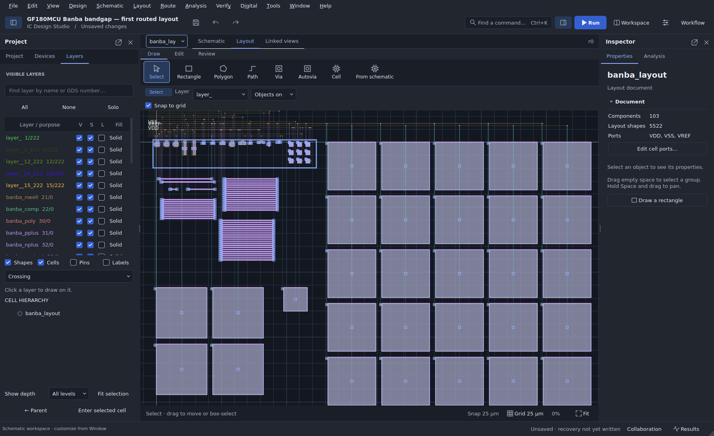

# Example projects

For an external hierarchical SKY130 design, see the [overvoltage import and qualification walkthrough](../docs/OPEN_PROJECTS.md). Its source is pinned and downloaded explicitly; its current full-layout LVS needs attention.

Use **File → Start here / example gallery** for guided examples that open as independent copies. The first six projects below use embedded native definitions or generic teaching models; none needs a downloaded PDK. Five have short, saved analyses. The sixth is a placement exercise. Later entries include real-PDK simulations and the Banba design sequence described below.

| Order | Project | Expected result / exercise | Engine |
|---|---|---|---|
| 1 | [RC low-pass](rc.icproj) | Smooth charging after an input edge; inspect X/Y markers | Built-in |
| 2 | [Native divider](native-divider.icproj) | **0.5 V** at `out` from a 1 V source and two 1 kΩ resistors | ngspice |
| 3 | [Inverter with layout](inverter_layout.icproj) | Output switches opposite to input; inspect teaching geometry | Built-in |
| 4 | [Native RC](native-rc.icproj) | Short transient baseline with mapped R/C geometry for parasitic comparison | ngspice |
| 5 | [Reusable divider](reusable-divider.icproj) | Enter a child circuit, inspect ports and run through the parent | Built-in |
| 6 | [Common-centroid resistors](common-centroid-resistors.icproj) | Review saved constraints and arrange four resistors | None |

## From waveform to a measurement

Open the RC example, run with **F5**, then select **Results → Waveforms**. Choose the output trace. Use **Markers…** to enter exact X/Y coordinates and select a threshold comparison. Move the marker, observe its readout and save your copy. See the [waveform workflow guide](../docs/UPDATE_0.15.md) for additional controls.

## Native parameter studies

Open the native divider and run its saved operating point. In **Analysis → Variation cases**, configure a native parameter study using `R1.native.value`. The baseline output is 0.5 V. Increasing the upper resistor to 3 kΩ makes the ideal output 0.25 V. The [native workflow guide](../docs/UPDATE_0.20.md) covers the review table, sensitivity, bounded search and applying a selected case.

## Explore layout

The inverter uses generic educational geometry and models. For the common-centroid example, choose **Layout → Placement and constraints** to inspect the saved group before arranging it. The native RC project adds explicit electrical-to-geometry mappings. Choose **Analysis → Post-layout → Distributed RC and specification comparison** to compare its baseline against declared interconnect estimates. These are teaching exercises; their dimensions and RC coefficients are not process-calibrated.

## Exchange and reusable components

- [Xschem amplifier](xschem-amplifier/amplifier.sch): small hierarchical import/exchange exercise with local symbols.
- [Amplifier testbench](amplifier-testbench.icproj): reusable circuit and fixture structure.
- [Interface update](amplifier-interface-update.icproj): compare an edited reusable component interface.
- [Manual wiring](manual-wiring.icproj): practice net labels, wire editing and connection inspection.
- [KLayout teaching rules](klayout/teaching-widths.drc): self-contained demonstration script for the external rule runner. Requires an installed KLayout executable and matching teaching layers.
- [Educational PDK package](pdk-educational/package.json): a small checksummed package for learning the installation flow.

Additional `.icproj` files are working development examples; the gallery provides the shortest introduction. Keep long PDK circuits out of routine smoke tests. Use a small representative circuit to test a new engine, model or adapter.

## Included real-PDK simulations (dev10)

The gallery includes the supplied GF180 bandgap in two forms: a short 5 V / 25 °C startup check and the byte-for-byte original 144-analysis characterization. A SKY130 1.8 V inverter is also included. Open a copy and press F5; bundled symbols and models resolve automatically.

The original upload and its identity record are in `gf180-bandgap/`. The short variant changes only the simulation control block. See [simulation setup](../SIMULATION_SETUP.md) for output locations and validation scope.

## Native Banba design exercise

Follow the GF180MCU Banba reference through three gallery entries. Each opens an independent project copy using the bundled models and ngspice.

| Gallery entry | What to explore | Status |
|---|---|---|
| 10 · [Build a Banba bandgap](gf180-banba/README.md) | Native core, transistor-level amplifier, startup circuit, two testbenches and a 27-simulation resistor search | About 0.596 V at 27 °C; fast startup overshoots and retains a failing requirement |
| 11 · [Improve the Banba bandgap](gf180-banba/pass2/README.md) | Revised bias and startup, three optimizer searches with 420 simulations, before/after performance plots and independent PVT checks | About 0.601 V at 44.40 µA nominal; lower current and overshoot trade against settling, capacitor area and mid-band supply rejection |
| 12 · [Lay out the Banba bandgap](gf180-banba/layout/README.md) | Routed native layout and GDS, 1:8 common-centroid PNP array, matching constraints, segmented resistors and tiled MIM capacitors | Native checks and segmented schematic simulations pass; full foundry DRC/LVS and extracted performance remain open |

Select **banba_layout → Layout** in the third project. These examples use a 3.3 V supply and an unbuffered output with a 5 pF external testbench load; they do not establish fabrication readiness. See the linked guides for measured conditions, trade-offs and reproduction steps.
