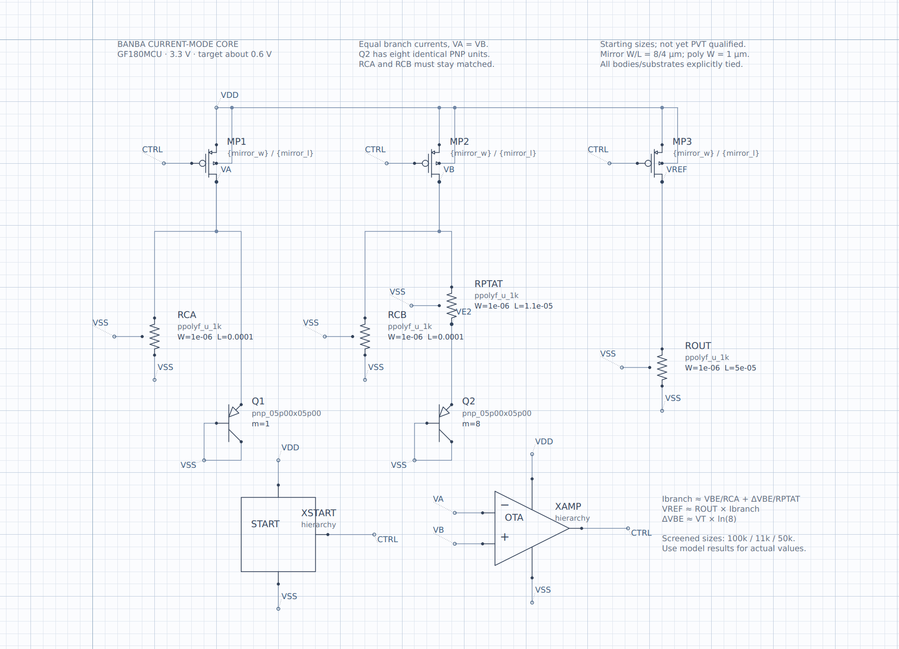
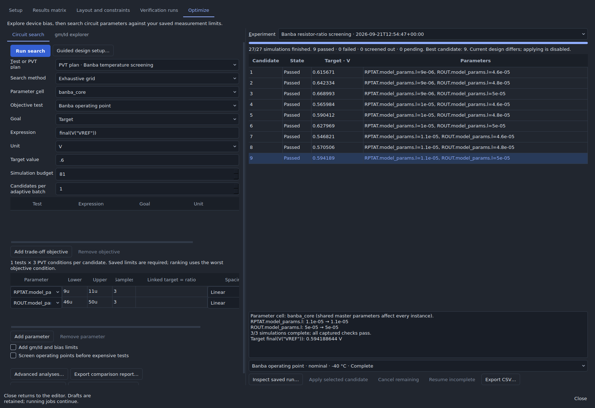

# GF180MCU Banba bandgap — first schematic

The [second pass](pass2/README.md) preserves this baseline and adds lower-power biasing, resistor retuning, and startup/output filtering, with broader model checks and reproducible optimizer results.

Open **File → Start here / example gallery → Build a Banba bandgap → Open a copy** on the experimental branch. Alternatively, open `examples/gf180-banba/banba.icproj` from this checkout. The native project uses the included, checksummed `gf180mcuD` package; ngspice is required for simulation. Keep the repository's folder structure when opening the project directly.

This is a new, editable design, independent of the imported 5 V bandgap example. It implements the current-summing idea in [Banba et al., *A CMOS Bandgap Reference Circuit with Sub-1-V Operation*, JSSC, 1999](https://doi.org/10.1109/4.760378). **This implementation assumes a 3.3 V supply; it does not claim sub-1-V supply operation.**



## Sheets and devices

| Sheet | Contents |
| --- | --- |
| `banba_core` | Three matched PMOS current branches, 1:8 diode-connected vertical PNPs, PTAT resistor, matched CTAT resistors, output resistor |
| `error_amplifier` | PMOS input pair, NMOS mirror load, second gain stage, independent resistor bias, MIM Miller compensation |
| `startup` | Mirrored-current detector, pull-up resistor, sense transistor and gate pull-down |
| `tb_dc` | 3.3 V DC supply and 5 pF load; project top |
| `tb_startup` | 0 → 3.3 V supply, 1 µs delay, 100 ns edge, 500 µs transient |

All on-chip devices have GF180 catalog bindings: `pfet_03v3`, `nfet_03v3`, `pnp_05p00x05p00`, `ppolyf_u_1k`, and the `cap_mim_analog` symbol bound to `cap_mim_2f0_m3m4_noshield`. Supply sources and the external 5 pF load are ideal testbench elements. There is no ideal amplifier or generic transistor model in the reference.

With VA approximately equal to VB, the matched branches establish

\[
I_{branch}\approx \frac{V_{BE}}{R_{CA}}+\frac{V_T\ln(8)}{R_{PTAT}},\qquad
V_{REF}\approx R_{OUT} I_{branch}.
\]

The PNP emitters connect to the reference branches; their bases and collectors connect to VSS. The amplifier polarity makes increasing VA relative to VB lower the PMOS gate voltage. All MOS bodies and resistor substrates have explicit connections.

## Starting dimensions

| Parameter | Saved value |
| --- | --- |
| Core PMOS and startup mirror W/L | 8/4 µm, shared `mirror_w` and `mirror_l` |
| PMOS input pair W/L | 24/2 µm, shared `pair_w` and `pair_l` |
| Q1 / Q2 multiplicity | 1 / 8 identical 5 × 5 µm PNP units |
| RCA = RCB W/L | 1/100 µm |
| RPTAT W/L | 1/11 µm, selected by the initial search |
| ROUT W/L | 1/50 µm |
| Miller capacitor W/L | 31.62/31.62 µm, approximately 2 pF |

The resistor labels are geometries, not guaranteed resistance values. Rough 1 kΩ/square estimates are 100 kΩ, 11 kΩ and 50 kΩ; simulation includes the PDK's geometry, temperature and contact effects. Layout segmentation, matching and foundry geometry limits still need review.

## Executed checks

Using ngspice 42 and bundled PDK revision `9394d9228663e22b`:

| Check | Result |
| --- | --- |
| Native validation, explicit-wire connectivity and hierarchical ERC | Passed; no ERC issues |
| Initial 10 µm RPTAT, 27 °C | VREF 0.621088 V; supply current 78.94 µA |
| Selected 11 µm RPTAT, 27 °C | VREF 0.595910 V; supply current 76.99 µA |
| Selected VA / VB, 27 °C | 0.703114 / 0.703353 V |
| Selected VREF at −40 / 27 / 125 °C | 0.595612 / 0.595910 / 0.594189 V |
| Selected startup final / peak VREF | 0.595910 / 2.719290 V |
| Startup overshoot specification, peak ≤ 0.75 V | **FAIL** |

The 0.75 V startup ceiling is an initial engineering check, not a user-supplied requirement. It is saved on `tb_startup` so the problem remains visible. A settled operating point does not establish reliable startup. The selected candidate is only the best of the initial temperature grid; the temperature plan does **not** include the failing startup test. No full process/supply qualification, mismatch analysis, loop-gain check, output-load qualification, or layout verification has been performed.

[`validation.json`](validation.json) records the results, candidate scores and file/engine hashes. The schematic was also opened and rendered in Studio. The application fixes exposed by this exercise have focused regression coverage.

## Repeat the analog search

Open the analog workspace's **Circuit search** page and use:

| Control | Setting |
| --- | --- |
| Test or PVT plan | Banba temperature screening |
| Parameter cell | `banba_core` |
| Search method | Exhaustive grid |
| Objective test | Banba operating point |
| Goal / expression / unit / target | Target / `final(V("VREF"))` / V / 0.6 |
| First parameter | `RPTAT.model_params.l`: 9u to 11u, 3 samples |
| Second parameter | `ROUT.model_params.l`: 46u to 50u, 3 samples |
| Temperatures / process / supply | −40, 27, 125 °C / nominal / 3.3 V |

This is nine candidates × three temperatures = **27 simulations**. The optimizer minimizes worst-case absolute error from 0.6 V while enforcing the saved 0.5–0.7 V initial output window. Candidate 9 selected RPTAT length 11 µm and ROUT length 50 µm; those dimensions are saved in the schematic. `optimizer.json` supplies the same settings for scripts; the GUI table above is the manual entry route.

When tuning RCA, link `RCB.model_params.l = 1` in that axis to preserve their matching. Keep the shared mirror and input-pair variables linked. The optimizer now exposes PDK resistor and capacitor width/length; parameterized MOS symbols also render without a numeric-conversion crash.



Reproduce the model checks and optimizer run from the repository root:

```sh
python scripts/verify_gf180_banba.py --ngspice /path/to/ngspice --out /new/results
python -m unittest tests.test_gf180_banba tests.test_analog_optimizer tests.test_catalog_migration
```

`scripts/create_gf180_banba.py` regenerates the native schematic with the selected sizes. Regeneration creates new document/object IDs, so rerun verification afterward. It does not overwrite the recorded validation report.

## Next design task

Fix the fast power-on overshoot, then verify startup over slow/fast supply ramps and temperature. Include the startup limits in the optimization plan before accepting further candidates. Follow that with loop stability, a dense temperature sweep, supply/process corners, mismatch, PSRR/noise, and layout-aware resistor/device sizing.
