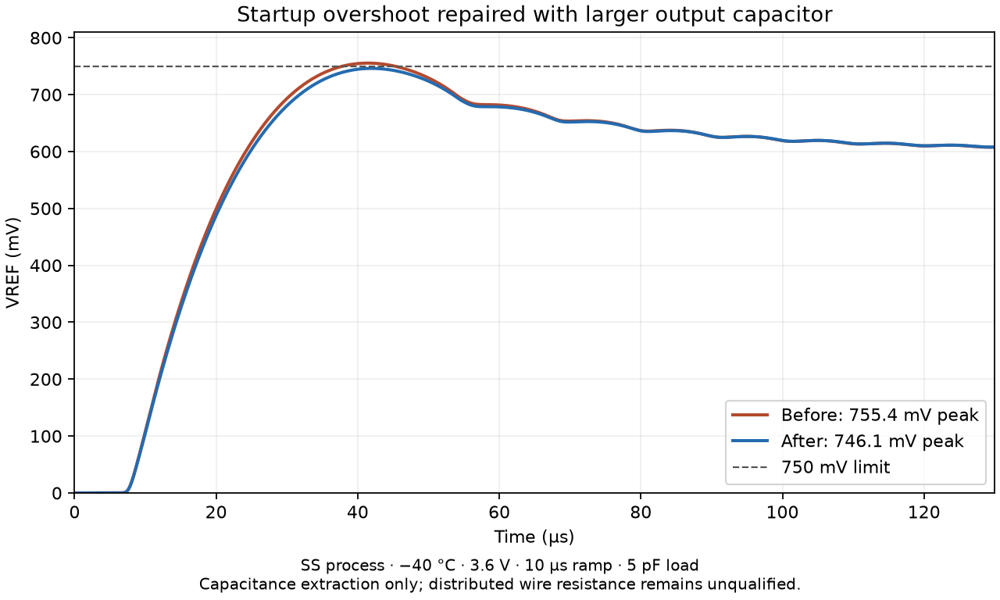

# GF180MCU Banba bandgap — first routed layout

Open [`banba-layout.icproj`](banba-layout.icproj), select **banba_layout** in the cell selector, then choose **Layout**. The example gallery also includes **Lay out the Banba bandgap**. Every physical device has an editable schematic instance and assigned terminals. The original second-pass hierarchy remains available in the same project for comparison; the saved testbenches instantiate the segmented physical implementation.

For density closure, use the separate [finished GDS and evidence](density/README.md). It adds a 600 µm fill collar to this editable core and passes geometry, density, antenna and strict LVS with an explicit dummy-poly accounting correction to the pinned density deck. Its footprint is **2052.1 × 1766.5 µm (3.6250 mm²)**, about **7.51 times** the core area. The original circuit masks are unchanged. This is a substantial area tradeoff; fill coupling and distributed RC remain unqualified.


The layout is **852.1 × 566.5 µm**, about **0.4827 mm²**, including the routing envelope. This is a first routed implementation, not a fabrication-qualified macro. It has 103 devices, 293 explicit terminal assignments and 56 connected nets. The saved project passes Studio's electrical, terminal connectivity, bounded width/spacing/grid, matching and centroid checks. Four fault-injection tests check that open routing, shorted supplies, a missing MIM dielectric rule and displaced PNP placement are detected.

## Placement and routing

- Q1 is the center device of a 3 × 3 array of identical 5 × 5 µm PNPs. The surrounding eight devices form Q2; both groups have the same geometric centroid. The unit GDS comes from the pinned GF180 primitive library, with its contacts and BJT recognition masks retained.
- The three core PMOS mirrors, amplifier input pair, active load and CTAT resistors have saved matching constraints. The amplifier pairs also have saved symmetry axes. These are equal-orientation adjacent devices; the MOS bank is not a common-centroid array with edge dummies.
- A contacted P-substrate guard surrounds the MOS and PNP bank. Each PMOS has a contacted N-well body connection. The resistor sections have explicit substrate taps.
- Local resistor series connections use M1. M2 provides vertical terminal access; M3 carries separate horizontal net buses. MIM terminals use M4 access and explicit via stacks. VDD/VSS buses are 1.6 µm wide; signal buses are 0.8 µm. Routing remains conservative and can be shortened further.
- MIM arrays sit away from the sensitive active devices. Bottom plates are contacted from above outside FuseTop; the native connectivity contract models the dielectric so vias over FuseTop do not falsely short the two capacitor electrodes.


## Physical sizing changes

The layout uses explicit physical units in its schematic, so the simulation includes their terminal resistance and capacitor perimeter effects. It does not rely on equal total area or drawn length alone to claim electrical equivalence.

| Schematic element | Physical implementation |
| --- | --- |
| Q2, multiplicity 8 | Eight parallel 5 × 5 µm PNP units |
| RBIAS, 1/1000 µm | Ten series 1/100 µm resistor sections |
| RDET, 1/1600 µm | Sixteen series 1/100 µm sections |
| RPULL, 1/2000 µm | Twenty series 1/100 µm sections |
| COUT, revised to 457.5 µm square | 25 parallel 91.5 × 91.5 µm tiles |
| CTRACK, 193⅓ µm square | Four parallel 96.670 × 96.670 µm tiles |
| CMILLER, 44.72136 µm square | One 44.720 × 44.720 µm tile |

The capacitor dimensions are snapped to the 5 nm grid. Total drawn MIM plate area is approximately 0.24869 mm². GF180's [MIM Option B rules](https://gf180mcu-pdk.readthedocs.io/en/latest/physical_verification/design_manual/drm_10_4_2.html) limit a single capacitor to 10,000 µm² and require larger values to use multiple parallel capacitors. The resistor construction follows the [high-resistance poly rules](https://gf180mcu-pdk.readthedocs.io/en/latest/physical_verification/design_manual/drm_10_03.html).

**Physical stack:** four metals, MIM option B between M3 and M4, nominal 2 fF/µm². This corresponds to physical variant **B** in the upstream verification tools. The project retains the bundled **gf180mcuD simulation package** and its pinned model revision; that package is a model subset and does not establish a complete physical D process stack. A physical five-metal D stack would require moving MIM to M4/M5 and changing the associated capacitor model. The four-metal choice here preserves the second-pass M3/M4 model.

## Electrical checks

These are **archived segmented schematic simulations of the original 90 µm output tiles, before parasitic extraction**, using ngspice 42, the bundled GF180 models and a 5 pF external load. They are retained for comparison; the revised layout is qualified separately by the capacitance-extracted results below.

| Metric | Second-pass schematic | Original layout schematic |
| --- | ---: | ---: |
| Nominal VREF | 600.616 mV | 600.616 mV |
| Nominal supply current | 44.398 µA | 44.386 µA |
| Temperature span, −40 to 125 °C | 1.0526 mV | 1.0526 mV |
| Sampled box temperature coefficient | 10.6275 ppm/°C | 10.6280 ppm/°C |
| Nominal startup peak | 600.616 mV | 600.616 mV |
| Nominal settling into 0.6 V ± 1% | 97.85 µs | 98.61 µs |

In that archived run, all 20 corner/supply operating points and 60 independent startup runs passed the same screening limits as the second pass: nominal/ff/ss/fs/sf × −40/125 °C × 2.7/3.6 V, with 100 ns, 10 µs and 1 ms supply ramps. The output window is 0.57–0.63 V, current limit 70 µA, startup peak limit 0.75 V, and final-window ripple limit 0.6 mV. Settling must occur by 250 µs for the two faster ramps or 1.25 ms for the slow ramp. Temperature comparison uses eight nominal-process points. The process aliases use the bundle's combined corner mapping, not every independent combination of device-family corners.

[`validation.json`](validation.json) records native geometry, terminal and matching checks. [`simulation.json`](simulation.json) records the **pre-extraction** results above. The later upstream-rule and extraction results for the unfilled core are in [`physical-verification.json`](physical-verification.json) and [`physical-evidence/README.md`](physical-evidence/README.md). Geometry DRC, antenna checks and strict LVS pass. The [filled candidate](density/README.md) additionally closes density in its enlarged footprint. Distributed RC, fill coupling, loop stability, mismatch, trimming, current-density and manufacturing acceptance are not established.

## Upstream physical verification

The following archived results describe the revised **unfilled core GDS**, checked with the pinned GF180 verification package, physical variant B. KLayout 0.28.16 resolves the earlier 0.28.15/Python 3.12 runtime crash. The schematic model calls are translated into the upstream reader's primitive CDL format, with resolved dimensions and guarded multiplicities. Device combining and purging are disabled.

| Check | Result |
| --- | --- |
| Geometry, connectivity and off-grid DRC | 0 findings |
| Antenna | 0 findings |
| Strict LVS | 103 devices, 56 nets and 3 ports matched |
| Whole-die density | 314 markers: PL.8, M1.4, M2.4 |
| Capacitance extraction | Completed with a separately checked device/terminal/dimension bijection |
| Distributed RC | Rejected; raw output and diagnostics retained |

Poly, M1 and M2 cover approximately **1.100%, 0.308% and 0.693%** of the unfilled macro envelope. The respective whole-die minima are **14%, 30% and 30%**. Those core findings remain reproducible. The new finished GDS supplies a concrete surrounding fill region, with process keepouts and an explicit boundary that includes the full enlarged area in the density denominator. Its measured poly/M1/M2 coverage is **38.897%, 31.050% and 31.090%**. The [fill evidence](density/README.md) documents the mask-accounting correction, fresh DRC/LVS, electrical screening and remaining extraction limits.

The [dummy-metal rules](https://gf180mcu-pdk.readthedocs.io/en/latest/physical_verification/design_manual/drm_13_3.html) specify 2 × 2 µm tiles, 1.2 µm layout spacing and 6 µm clearance from MIM areas. Expanding the actual FuseTop polygons by 6 µm occupies 312,700.244 µm² of the 482,714.650 µm² envelope, leaving 35.220% before any routing or other keepouts. A regular 3.2 µm-pitch fill pattern has 39.063% occupancy, so even an optimistic area estimate adds only about 13.758% metal coverage. Filling the existing footprint is therefore insufficient for the 30% target. The finished candidate pays for closure by enlarging the physical footprint; actual chip integration must preserve adequate fill area and rerun verification.

The supplied Magic PNP declarations incorrectly put the emitter in the substrate slot and test the area of an absent second terminal. The verification script generates a corrected technology file with explicit emitter/collector terminals and emitter-area bounds, preserving all four supported PNP model choices and the C/B/E model pin order. All nine extracted PNPs then match the independently verified 5 × 5 µm schematic devices. The upstream checkout and the layout remain unchanged.

Capacitance-only simulation does **not** qualify distributed wire resistance. Magic 8.3.600 produces a negative RC redistribution weight. A diagnostic build of 8.3.684 produces an incomplete resistance graph and a missing PNP source-connection warning; its normal build crashes on the revised layout. These outputs are refused by the checks; no negative weights are clamped and no missing connections are invented. Splitting `ext2sim` and `extresist` into separate processes helped the earlier diagnostic runs, but did not resolve distributed RC extraction.

The original capacitance-extracted layout failed one startup check: **755.4 mV** at SS, −40 °C, 3.6 V and a 10 µs supply ramp. Increasing the 25 COUT tiles from 90 to **91.5 µm** fixes that failure. After regenerating the layout and repeating DRC, LVS and extraction, **all 20 operating points and all 60 startup cases pass** the existing screening limits. Worst startup peak is **746.1 mV**, nominal VREF is **600.616 mV**, the corner VREF range is **598.899–603.107 mV**, and maximum corner supply current is **61.249 µA**. This uses 175 extracted parasitic capacitors, with a summed element value of 2.366 pF, alongside the physical device models and the 5 pF external load. The summed element value is not an effective capacitance at any particular node.



## Files and reproduction

- [`banba-layout.icproj`](banba-layout.icproj): complete editable project, original hierarchy and segmented implementation.
- [`banba-layout.gds`](banba-layout.gds): physical cell only. Keep its `.icstudio.json`, `.exchange.json` and `.report.json` companions for a Studio round trip with device identities.
- [`studio-layout.png`](studio-layout.png): the saved project opened in the application.
- [`upstream/NOTICE.md`](upstream/NOTICE.md): primitive geometry provenance, hashes and license.

From the repository root, with the normal Studio dependencies installed:

```sh
python scripts/create_gf180_banba_layout.py
python -m unittest tests.test_gf180_banba_layout -v
python scripts/verify_gf180_banba_layout.py --ngspice /path/to/ngspice --out /new/results
python scripts/render_gf180_banba_layout.py --out /new/previews
```

The generator uses stable device and shape IDs, checks the upstream PNP hash, and refuses GDS export if its native checks fail. Regenerating the design requires refreshing saved verification evidence. The renderer requires matplotlib.

To reproduce the upstream checks, use clean checkouts of `globalfoundries-pdk-libs-gf180mcu_fd_pv` at `05e7b6adf19edf942969c1c9625f02fd87874f06` and `open_pdks` at `aa3fc215a80d32437b8cca1cb3fdee819d18c4c9`. Install `docopt` and `jinja2` along with the normal project dependencies. The KLayout executable must be named `klayout` because the upstream wrappers invoke it by name. Use Magic 8.3.684 at `4f53bb3091d1e4a9b2009a58f157a8a4331d4c84` and ngspice 42. This later Magic version includes the upstream sidewall-capacitance coefficient correction; 8.3.600 results are retained only as diagnostics.

```sh
# For Linux builds using Tcl 8, keep the descriptor limit within Tcl's range.
ulimit -n 1024
python scripts/verify_gf180_banba_physical.py \
  --pv /path/to/globalfoundries-pdk-libs-gf180mcu_fd_pv \
  --open-pdks /path/to/open_pdks \
  --klayout /path/to/klayout --magic /path/to/magic \
  --ngspice /path/to/ngspice --out /new/physical-results
python -m unittest tests.test_gf180_banba_physical tests.test_gf180_banba_layout -v
```

The physical verification command deliberately exits nonzero while density or RC closure remains incomplete. It retains reports, commands, raw extraction, simulation decks, waveforms and logs. A passing capacitance-only simulation never changes the overall signoff status.

To reproduce **only DRC and LVS**, without Magic, ngspice or an `open_pdks` checkout:

```sh
python scripts/verify_gf180_banba_physical.py --drc-lvs-only \
  --pv /path/to/globalfoundries-pdk-libs-gf180mcu_fd_pv \
  --klayout /path/to/klayout --out /new/drc-lvs-results
```

This still runs geometry, density and antenna checks, plus strict LVS. Its exit code is zero only when every requested check passes. Missing/malformed reports and nonzero engine exits fail the check even when available reports contain no markers. The default **unfilled core** correctly exits **1** for PL.8/M1.4/M2.4 while recording successful LVS. `physical-verification.json` records the scope, artifact hashes and separate DRC/LVS results; `signoff` remains false. KLayout 0.28.16 reproduced all 314 density markers and the 103-device/56-net/3-port match on 2026-09-21. Use the [finished-GDS command](density/README.md#reproduction) for the density-filled candidate.
