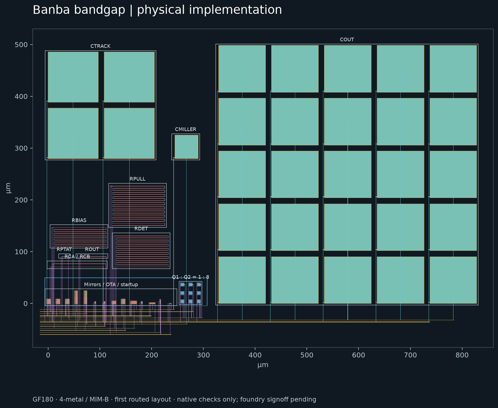
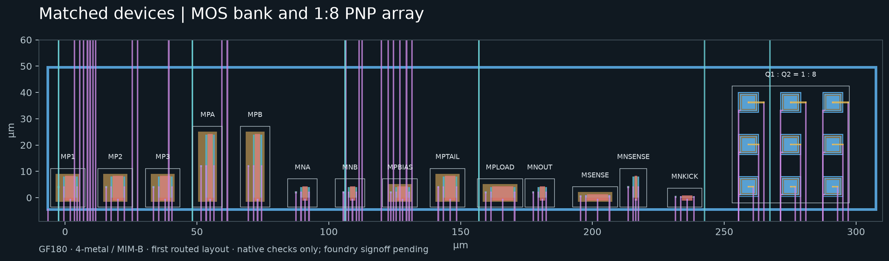

# GF180MCU Banba bandgap — first routed layout

Open [`banba-layout.icproj`](banba-layout.icproj), select **banba_layout** in the cell selector, then choose **Layout**. The example gallery also includes **Lay out the Banba bandgap**. Every physical device has an editable schematic instance and assigned terminals. The original second-pass hierarchy remains available in the same project for comparison; the saved testbenches instantiate the segmented physical implementation.



The layout is **844.6 × 559.0 µm**, about **0.4721 mm²**, including the routing envelope. This is a first routed implementation, not a fabrication-qualified macro. It has 103 devices, 293 explicit terminal assignments and 56 connected nets. The saved project passes Studio's electrical, terminal connectivity, bounded width/spacing/grid, matching and centroid checks. Four fault-injection tests check that open routing, shorted supplies, a missing MIM dielectric rule and displaced PNP placement are detected.

## Placement and routing

- Q1 is the center device of a 3 × 3 array of identical 5 × 5 µm PNPs. The surrounding eight devices form Q2; both groups have the same geometric centroid. The unit GDS comes from the pinned GF180 primitive library, with its contacts and BJT recognition masks retained.
- The three core PMOS mirrors, amplifier input pair, active load and CTAT resistors have saved matching constraints. The amplifier pairs also have saved symmetry axes. These are equal-orientation adjacent devices; the MOS bank is not a common-centroid array with edge dummies.
- A contacted P-substrate guard surrounds the MOS and PNP bank. Each PMOS has a contacted N-well body connection. The resistor sections have explicit substrate taps.
- Local resistor series connections use M1. M2 provides vertical terminal access; M3 carries separate horizontal net buses. MIM terminals use M4 access and explicit via stacks. VDD/VSS buses are 1.6 µm wide; signal buses are 0.8 µm. Routing remains conservative and can be shortened further.
- MIM arrays sit away from the sensitive active devices. Bottom plates are contacted from above outside FuseTop; the native connectivity contract models the dielectric so vias over FuseTop do not falsely short the two capacitor electrodes.



## Physical sizing changes

The layout uses explicit physical units in its schematic, so the simulation includes their terminal resistance and capacitor perimeter effects. It does not rely on equal total area or drawn length alone to claim electrical equivalence.

| Schematic element | Physical implementation |
| --- | --- |
| Q2, multiplicity 8 | Eight parallel 5 × 5 µm PNP units |
| RBIAS, 1/1000 µm | Ten series 1/100 µm resistor sections |
| RDET, 1/1600 µm | Sixteen series 1/100 µm sections |
| RPULL, 1/2000 µm | Twenty series 1/100 µm sections |
| COUT, 450 µm square | 25 parallel 90 × 90 µm tiles |
| CTRACK, 193⅓ µm square | Four parallel 96.670 × 96.670 µm tiles |
| CMILLER, 44.72136 µm square | One 44.720 × 44.720 µm tile |

The capacitor dimensions are snapped to the 5 nm grid. Total drawn MIM plate area is approximately 0.24188 mm². GF180's [MIM Option B rules](https://gf180mcu-pdk.readthedocs.io/en/latest/physical_verification/design_manual/drm_10_4_2.html) limit a single capacitor to 10,000 µm² and require larger values to use multiple parallel capacitors. The resistor construction follows the [high-resistance poly rules](https://gf180mcu-pdk.readthedocs.io/en/latest/physical_verification/design_manual/drm_10_03.html).

**Physical stack:** four metals, MIM option B between M3 and M4, nominal 2 fF/µm². This corresponds to physical variant **B** in the upstream verification tools. The project retains the bundled **gf180mcuD simulation package** and its pinned model revision; that package is a model subset and does not establish a complete physical D process stack. A physical five-metal D stack would require moving MIM to M4/M5 and changing the associated capacitor model. The four-metal choice here preserves the second-pass M3/M4 model.

## Electrical checks

These are **segmented schematic simulations, before parasitic extraction**, using ngspice 42, the bundled GF180 models and the original 5 pF external load.

| Metric | Second-pass schematic | Segmented layout schematic |
| --- | ---: | ---: |
| Nominal VREF | 600.616 mV | 600.616 mV |
| Nominal supply current | 44.398 µA | 44.386 µA |
| Temperature span, −40 to 125 °C | 1.0526 mV | 1.0526 mV |
| Sampled box temperature coefficient | 10.6275 ppm/°C | 10.6280 ppm/°C |
| Nominal startup peak | 600.616 mV | 600.616 mV |
| Nominal settling into 0.6 V ± 1% | 97.85 µs | 98.61 µs |

All 20 corner/supply operating points and 60 independent startup runs passed the same screening limits as the second pass: nominal/ff/ss/fs/sf × −40/125 °C × 2.7/3.6 V, with 100 ns, 10 µs and 1 ms supply ramps. The output window is 0.57–0.63 V, current limit 70 µA, startup peak limit 0.75 V, and final-window ripple limit 0.6 mV. Settling must occur by 250 µs for the two faster ramps or 1.25 ms for the slow ramp. Temperature comparison uses eight nominal-process points. The process aliases use the bundle's combined corner mapping, not every independent combination of device-family corners.

[`validation.json`](validation.json) records native geometry, terminal and matching checks. [`simulation.json`](simulation.json) records model results and artifact identities. [`physical-verification.json`](physical-verification.json) records the blocked foundry-rule attempt. Full foundry DRC/LVS, density/antenna checks, extracted resistance/capacitance, loop stability, mismatch and trimming remain unverified. In particular, the native checker does not establish process enclosure, latch-up, current-density or manufacturing acceptance.

## Files and reproduction

- [`banba-layout.icproj`](banba-layout.icproj): complete editable project, original hierarchy and segmented implementation.
- [`banba-layout.gds`](banba-layout.gds): physical cell only. Keep its `.icstudio.json`, `.exchange.json` and `.report.json` companions for a Studio round trip with device identities.
- [`studio-layout.png`](studio-layout.png): the saved project opened in the application.
- [`upstream/NOTICE.md`](upstream/NOTICE.md): primitive geometry provenance, hashes and license.

From the repository root, with the normal Studio dependencies installed:

```sh
python scripts/create_gf180_banba_layout.py
python -m unittest tests.test_gf180_banba_layout -v
python scripts/verify_gf180_banba_layout.py --ngspice /path/to/ngspice --out /new/results
python scripts/render_gf180_banba_layout.py --out /new/previews
```

The generator uses stable device and shape IDs, checks the upstream PNP hash, and refuses GDS export if its native checks fail. Regenerating the design requires refreshing saved verification evidence. The renderer requires matplotlib. For full physical verification, install a working KLayout runtime and the pinned upstream GF180 verification package, then use physical variant B; the supplied `physical-verification.json` identifies the attempted deck and options.
