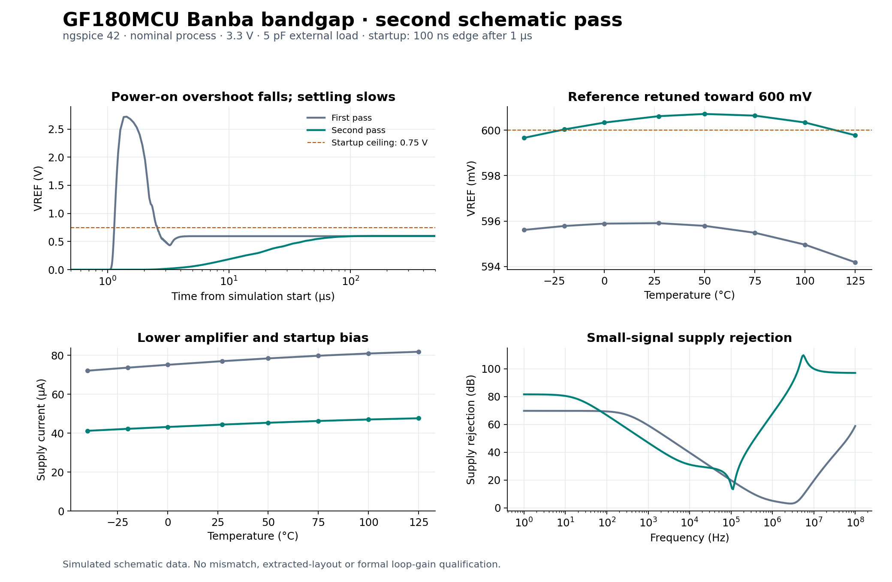
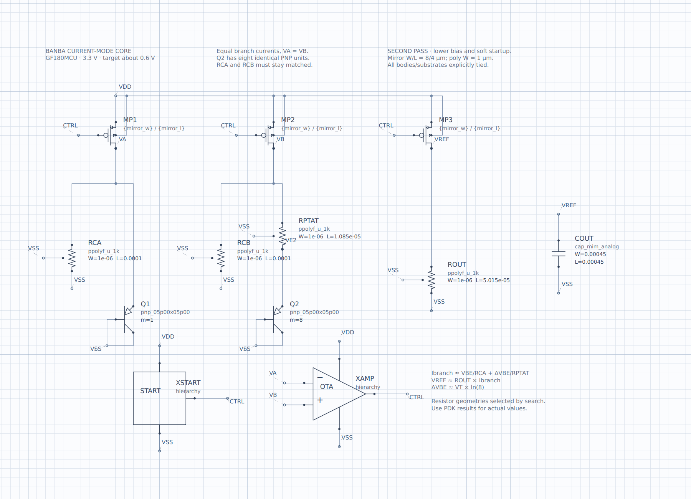
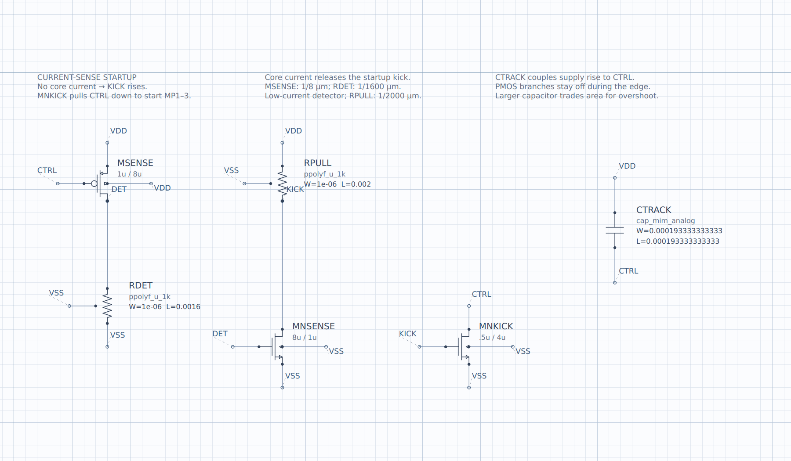
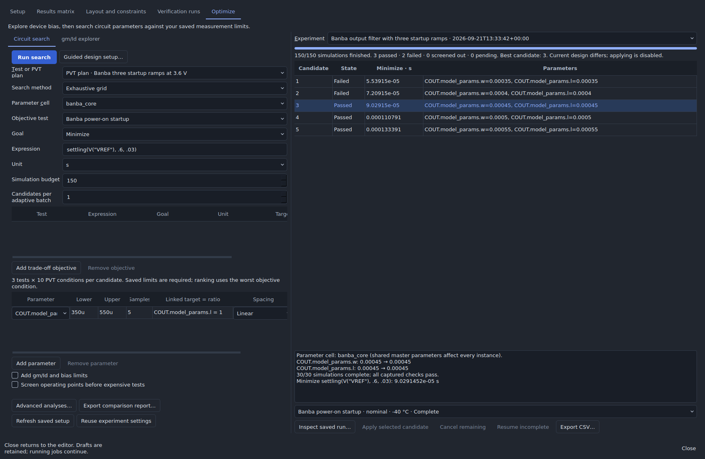

# GF180MCU Banba bandgap — second pass

Open **Start here / example gallery → Improve the Banba bandgap → Open a copy**, or open [`banba.icproj`](banba.icproj). Keep the checkout's folder structure so the bundled GF180MCU models resolve. The [first-pass schematic](../README.md) remains available for comparison.

The [first routed layout](../layout/README.md) now provides an editable native project, GDS, explicit resistor/capacitor segmentation and new model checks. Its native geometry/connectivity checks pass; full foundry verification and extracted performance remain open.

This pass lowers amplifier/startup bias, retunes the PTAT/output resistor ratio, and adds supply-tracking and output-filter capacitors. It remains a **3.3 V, unbuffered schematic design with a 5 pF external load**, using actual GF180MCU devices. It does not demonstrate sub-1-V supply operation or fabrication readiness.



## Measured results

| Metric | First pass | Second pass |
| --- | ---: | ---: |
| Nominal VREF | 595.910 mV | 600.616 mV |
| Nominal supply current | 76.99 µA | **44.40 µA** |
| Nominal startup peak | 2.719 V | **0.601 V** |
| Nominal settling into 0.6 V ± 1% | 4.52 µs | **97.85 µs** |
| Temperature span, −40 to 125 °C | 1.721 mV | **1.053 mV** |
| Box temperature coefficient | 17.52 ppm/°C | **10.63 ppm/°C** |
| VREF span over 2.7–3.6 V, 27 °C | 286.4 µV | **68.6 µV** |
| Supply rejection at 1 Hz, 27 °C | 69.78 dB | **81.65 dB** |
| Supply rejection at 1 kHz, 27 °C | 59.32 dB | **46.85 dB — worse** |

Both designs were simulated with ngspice 42 and the bundled PDK revision `9394d9228663e22b`. Temperature results use eight points from −40 to 125 °C at nominal process and 3.3 V. The box temperature coefficient is `(max(VREF) − min(VREF)) / (mean(VREF) × 165 °C)`, not a fitted slope. Nominal startup uses the original 100 ns edge after a 1 µs delay and a 500 µs observation window; settling means remaining within 0.600 V ± 6 mV through the end of that run.

Supply rejection improves near DC and at high frequencies, but **mid-band rejection is weaker**, including a 12.48 dB loss at 1 kHz. The full AC curve is retained above and in the validation report. Improving that response while reducing capacitor area is a useful target for the next pass.

**All 20 independent corner/supply operating points and all 60 startup runs passed.** Conditions were nominal/ff/ss/fs/sf × −40/125 °C × 2.7/3.6 V. Across these checks, DC VREF ranged from **598.899 to 603.108 mV**, maximum quiescent supply current was **61.27 µA**, and the worst startup peak was **0.7061 V**. The worst settling time into the PVT output window was 94.9 µs for the two faster ramps and 685.5 µs for the 1 ms ramp; maximum final-window ripple was 18.2 µV.

The independent startup checks use Studio's **Startup diagnostic**, PWL supplies from zero, UIC and initial VREF = 0. Each condition includes 100 ns, 10 µs and 1 ms ramps. Acceptance limits are 0.57–0.63 V final output, peak ≤ 0.75 V, settling into that output window by 250 µs for the two faster ramps or 1.25 ms for the 1 ms ramp, and final-window ripple below 0.6 mV. Quiescent supply current must stay below 70 µA. These are explicit engineering screening limits, not user-supplied specifications.

The five process names use the package's combined corner mapping: `ff`/`ss` also select their BJT, resistor and MIM corners; `fs`/`sf` keep those models typical. This is not an independent Cartesian matrix of every device-family corner. Saved samples establish behavior only for the tested conditions and observation windows.

## Circuit changes

| Device | First pass | Second pass |
| --- | --- | --- |
| OTA bias resistor RBIAS, W/L | 1/250 µm | 1/1000 µm |
| Startup PMOS MSENSE, W/L | 8/4 µm | 1/8 µm |
| Startup RDET, W/L | 1/100 µm | 1/1600 µm |
| Startup RPULL, W/L | 1/500 µm | 1/2000 µm |
| Startup MNKICK, W/L | 2/2 µm | 0.5/4 µm |
| CMILLER | ≈2 pF | ≈4 pF |
| CTRACK, VDD to CTRL | None | ≈74.76 pF; 193⅓ µm square |
| COUT, VREF to VSS | None | ≈405 pF; 450 µm square |
| RPTAT, W/L | 1/11 µm | 1/10.85 µm |
| ROUT, W/L | 1/50 µm | 1/50.15 µm |

The 1:8 PNP ratio, three 8/4 µm core mirrors, matched 1/100 µm CTAT resistors, 24/2 µm amplifier input pair, and original amplifier output transistors are retained. Startup sensing now uses a much smaller fraction of the core current. CTRACK holds the PMOS gates closer to the supply during a fast edge. COUT filters the remaining output excursion during intermediate supply ramps. Both added capacitors use the GF180 `cap_mim_2f0_m3m4_noshield` model, not ideal capacitors.

The lower bias cuts nominal current by **42.3%**, while retuning reduces the sampled temperature span by **38.9%**. The price is substantial capacitor area and slower settling: total nominal MIM plate area grows from approximately **0.001 mm² to 0.242 mm²**, excluding spacing, routing and segmentation. This is a schematic sizing estimate at 2 fF/µm², not a layout area measurement. The output filter is on-chip in this schematic; it is additional to the unchanged 5 pF external testbench load.



The native project also contains `error_amplifier`, `startup`, `tb_dc`, `tb_startup`, `tb_medium_startup`, `tb_slow_startup`, and `tb_psrr`. Each analysis has a dedicated fixture where its specifications apply. The medium/slow diagnostics explicitly contain a 3.3 V PWL supply setting; changing the project `vdd` variable alone does not change that diagnostic setting. The saved 3.6 V ramp plan overrides both correctly.



## Analog optimizer exercise

Three searches used Studio's real `analog_optimizer.prepare`, ngspice execution, specification evaluation, and `apply_candidate` APIs. Candidates were not accepted from approximate gm/Id tables. [`optimizer.json`](optimizer.json) contains the settings; [`optimizer-results.json`](optimizer-results.json) contains candidate scores, measurements and failures.

| Search | Parameters | Conditions and constraints | Executed cases |
| --- | --- | --- | --- |
| Startup sizing | CTRACK W = L, 160–210 µm in 4 steps; MNKICK W, 0.35–0.65 µm in 3 steps | Five process corners × −40/125 °C, 3.6 V, fast startup; peak/final/settling limits | 120 |
| Accuracy sizing | RPTAT L, 10.8–11 µm in 5 steps; ROUT L, 50–50.2 µm in 5 steps | Nominal corner × −40/27/125 °C, 3.3 V, OP plus fast startup; IDD ≤ 70 µA; input MPA gm/Id 8–22 V⁻¹ and saturation headroom ≥ 0.1 V | 150 |
| Output filtering | COUT W = L, 350–550 µm in 5 steps | Five corners × −40/125 °C, 3.6 V, all three supply ramps; peak/final/settling limits | 150 |

The first two searches preceded COUT. Their selected candidates passed their saved tests, but independent 10 µs ramp checks still failed. That failure led to the third search; it is not presented as a qualified intermediate design. Reducing the amplifier output transistor was also rejected because transient experiments developed oscillation.

The startup search minimizes worst-case peak voltage; the accuracy search minimizes worst-case absolute error from 0.6 V. The filter search minimizes worst-case fast-start settling while enforcing limits for all three ramp rates. **420 optimizer simulations** were completed, followed by independent checks on the final design. This is a bounded grid result, not a global optimum.



To repeat all searches and independent checks:

```sh
python scripts/verify_gf180_banba_pass2.py --ngspice /path/to/ngspice --out /new/results
python scripts/plot_gf180_banba_pass2.py /new/results /new/results/performance.png
```

Add `--apply` to save selected dimensions. `--skip-search` checks the saved schematic; `--start-search 3` repeats only the final filter search using the preceding saved dimensions. The full replay temporarily removes COUT for the first two searches and restores it before the third. Each search preserves its immutable manifest; every simulation preserves its deck, engine log and raw/result data in the requested results folder. The figure script requires matplotlib.

`scripts/create_gf180_banba_pass2.py` rebuilds the selected schematic and saved plans. It generates new document IDs; regenerate validation after using it. [`validation.json`](validation.json) identifies the checked file and executable by SHA-256 and records all independent results. The project was opened and rendered in Studio, and hierarchical ERC passed.

## Software fix and remaining work

The startup diagnostic now matches SPICE voltage-vector names case-insensitively. Previously, a connected schematic net named `VREF` failed when ngspice returned `vref`. A regression test covers mixed case, unchanged source data, and missing signals. All 39 focused tests passed, including real ngspice diagnostic-worker checks.

The next circuit work is formal loop-gain/return-ratio verification, mismatch and trimming, output-load/noise characterization, and a layout implementation that checks resistor segmentation, capacitor dimensions, matching and extracted parasitics. A settling waveform or PSRR curve is not a stability-margin proof. The long resistors and large MIM capacitors in this pass need physical-design review before being treated as implementable cells.
